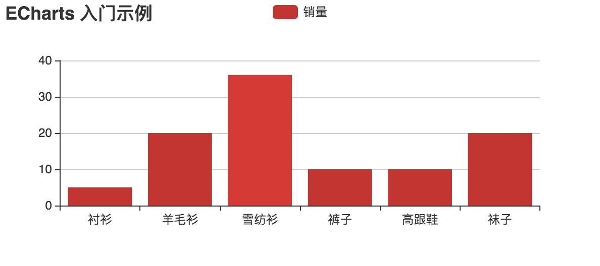
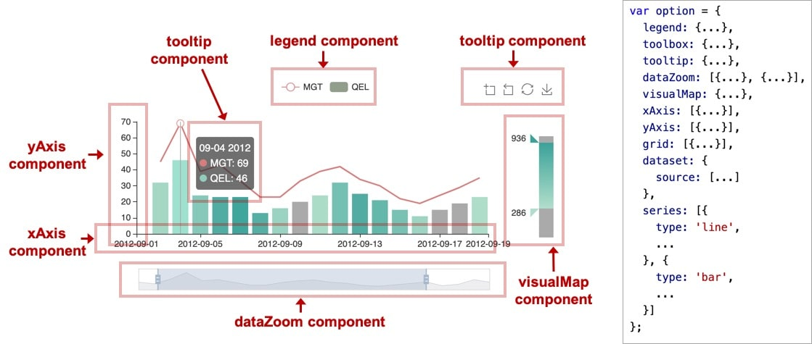
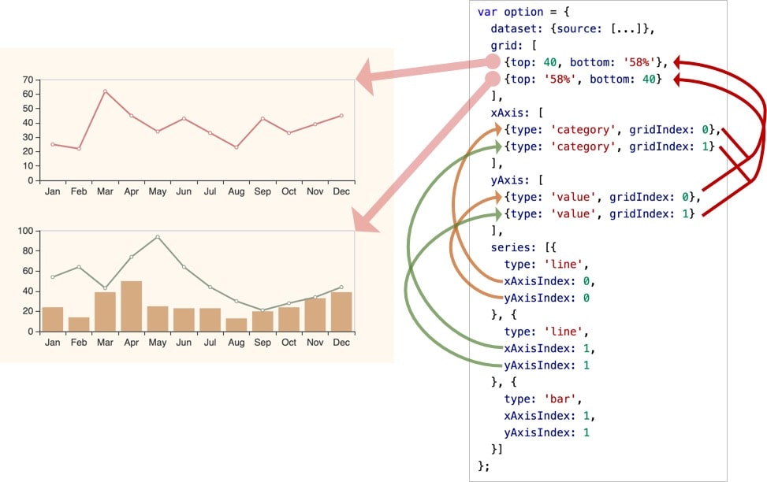
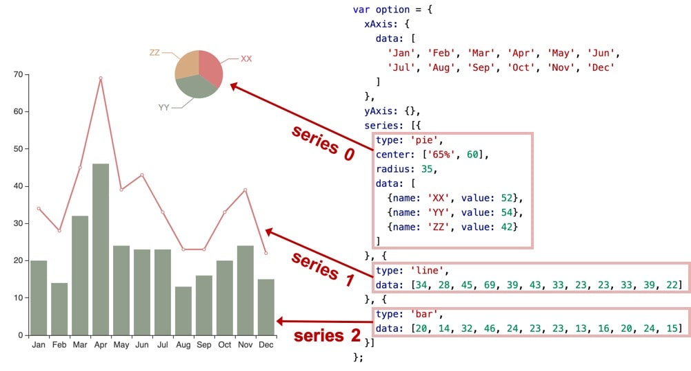
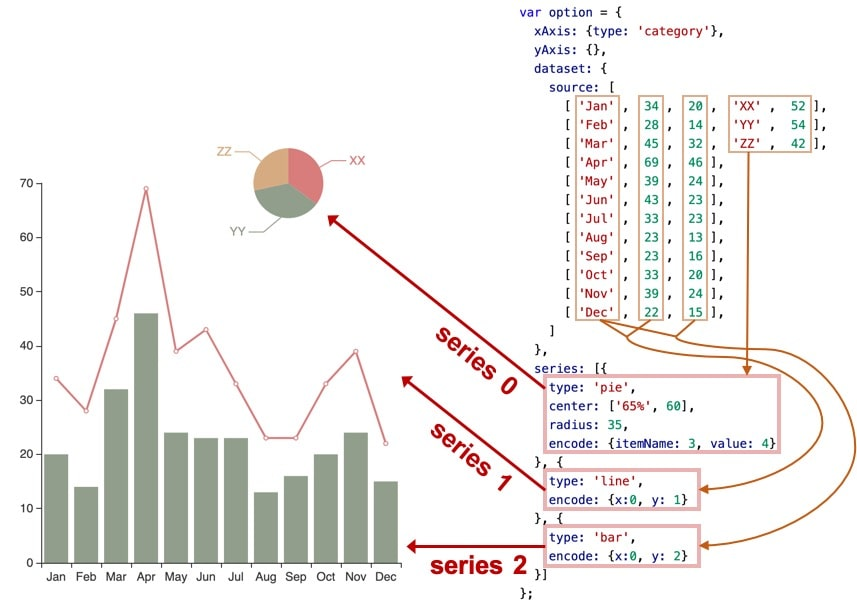

## 安装

echarts 只需引入一个 js 文件即可

```bash
wget https://raw.githubusercontent.com/apache/incubator-echarts/4.8.0/dist/echarts.min.js
```

## 教程

[官方教程](https://echarts.apache.org/zh/tutorial.html)已经说的非常详细了，这里只是摘抄一些简单的部分

echarts 的使用者，使用 option 来描述其对图表的各种需求，包括：有什么数据、要画什么图表、图表长什么样子、含有什么组件、组件能操作什么事情等等。简而言之，option 表述了：数据、数据如何映射成图形、交互行为。详情可见[option 详细配置](https://echarts.apache.org/zh/option.html#title)
echarts.setOption(option)可重复调用，仅覆盖更新，而不是整个替换 option。因此我们可以异步加载数据

```javascript
var myChart = echarts.init(document.getElementById("main"));

$.get("data.json").done(function (data) {
  myChart.setOption({
    title: {
      text: "异步数据加载示例",
    },
    tooltip: {},
    legend: {
      data: ["销量"],
    },
    xAxis: {
      data: ["衬衫", "羊毛衫", "雪纺衫", "裤子", "高跟鞋", "袜子"],
    },
    yAxis: {},
    series: [
      {
        name: "销量",
        type: "bar",
        data: [5, 20, 36, 10, 10, 20],
      },
    ],
  });
});
```

当我们需要动态更新数据时，我们不断的调用 setOption 填充最新的数据即可。

### 入门示例

```html
<!DOCTYPE html>
<html>
  <head>
    <meta charset="utf-8" />
    <title>ECharts</title>
    <!-- 引入 echarts.js -->
    <script src="echarts.min.js"></script>
  </head>
  <body>
    <!-- 为ECharts准备一个具备大小（宽高）的Dom -->
    <div id="main" style="width: 600px;height:400px;"></div>
    <script type="text/javascript">
      // 基于准备好的dom，初始化echarts实例
      var myChart = echarts.init(document.getElementById("main"));

      // 指定图表的配置项和数据
      var option = {
        title: {
          text: "ECharts 入门示例",
        },
        tooltip: {},
        legend: {
          data: ["销量"],
        },
        xAxis: {
          data: ["衬衫", "羊毛衫", "雪纺衫", "裤子", "高跟鞋", "袜子"],
        },
        yAxis: {},
        series: [
          {
            name: "销量",
            type: "bar",
            data: [5, 20, 36, 10, 10, 20],
          },
        ],
      };

      // 使用刚指定的配置项和数据显示图表。
      myChart.setOption(option);
    </script>
  </body>
</html>
```

这样你的第一个图表就诞生了！


### echarts 实例

一个网页中可以创建多个 echarts 实例。每个 echarts 实例 中可以创建多个图表和坐标系等等（用 option 来描述）。准备一个 DOM 节点（作为 echarts 的渲染容器），就可以在上面创建一个 echarts 实例。每个 echarts 实例独占一个 DOM 节点。

### 组件（component）

在系列之上，echarts 中各种内容，被抽象为“组件”。例如，echarts 中至少有这些组件：xAxis（直角坐标系 X 轴）、yAxis（直角坐标系 Y 轴）、grid（直角坐标系底板）、angleAxis（极坐标系角度轴）、radiusAxis（极坐标系半径轴）、polar（极坐标系底板）、geo（地理坐标系）、dataZoom（数据区缩放组件）、visualMap（视觉映射组件）、tooltip（提示框组件）、toolbox（工具栏组件）、series（系列）、...

我们注意到，其实系列（series）也是一种组件，可以理解为：系列是专门绘制“图”的组件。

如下图，右侧的 option 中声明了各个组件（包括系列），各个组件就出现在图中。


### 坐标系

一个坐标系，可能由多个组件协作而成。我们以最常见的直角坐标系来举例。直角坐标系中，包括有 xAxis（直角坐标系 X 轴）、yAxis（直角坐标系 Y 轴）、grid（直角坐标系底板）三种组件

x 轴和 y 轴基本等同，下面介绍一些常用的配置

1. type 坐标轴类型。
   可选：
   - `value` 数值轴，适用于连续数据。
   - `category` 类目轴，适用于离散的类目数据。为该类型时类目数据可自动从 series.data 或 dataset.source 中取，或者可通过 xAxis.data 设置类目数据。
   - `time` 时间轴，适用于连续的时序数据，与数值轴相比时间轴带有时间的格式化，在刻度计算上也有所不同，例如会根据跨度的范围来决定使用月，星期，日还是小时范围的刻度。
   - `log` 对数轴。适用于对数数据。
2. min 坐标轴刻度最小值。
   可以设置成特殊值 'dataMin'，此时取数据在该轴上的最小值作为最小刻度。
   不设置时会自动计算最小值保证坐标轴刻度的均匀分布。
   在类目轴中，也可以设置为类目的序数（如类目轴 data: ['类 A', '类 B', '类 C'] 中，序数 2 表示 从'类 C'开始。也可以设置为负数，如 -3）表示第四个坐标为‘类 A’。
   当设置成 function 形式时，可以根据计算得出的数据最大最小值设定坐标轴的最小值。如：

   ```javascript
   min: function (value) {
       return value.min - 20;

   }
   ```

   其中 value 是一个包含 min 和 max 的对象，分别表示数据的最大最小值，这个函数可返回坐标轴的最小值，也可返回 null/undefined 来表示“自动计算最小值”（返回 null/undefined 从 v4.8.0 开始支持）。

3. max 坐标轴刻度最大值。类似 min
4. splitNumber 坐标轴分割段数，需要注意的是这个分割段数只是个预估值，最后实际显示的段数会在这个基础上根据分割后坐标轴刻度显示的易读程度作调整。

5. minInterval 自动计算的坐标轴最小间隔大小
6. maxInterval 自动计算的坐标轴最大间隔大小

一个 echarts 实例中，有多个 grid，每个 grid 分别有 xAxis、yAxis，他们使用 xAxisIndex、yAxisIndex、gridIndex 来指定引用关系：


### dataset

ECharts 4 开始支持了 dataset 组件用于单独的数据集声明，从而数据可以单独管理，被多个组件复用，并且可以基于数据指定数据到视觉的映射。这在不少场景下能带来使用上的方便

#### 维度（dimension）

常用图表所描述的数据大部分是“二维表”结构，上述的例子中，我们都使用二维数组来容纳二维表。现在，当我们把系列（series）对应到“列”的时候，那么每一列就称为一个“维度（dimension）”，而每一行称为数据项（item）。反之，如果我们把系列（series）对应到表行，那么每一行就是“维度（dimension）”，每一列就是数据项（item）。在 series 中我们可以使用属性 seriesLayoutBy 来决定按行还是按列做映射

维度可以有单独的名字，便于在图表中显示。维度名（dimension name）可以在定义在 dataset 的第一行（或者第一列）。例如上面的例子中，'score'、'amount'、'product' 就是维度名。从第二行开始，才是正式的数据。dataset.source 中第一行（列）到底包含不包含维度名，ECharts 默认会自动探测。当然也可以设置 dataset.sourceHeader: true 显示声明第一行（列）就是维度，或者 dataset.sourceHeader: false 表明第一行（列）开始就直接是数据。

维度的定义，也可以使用单独的 dataset.dimensions 或者 series.dimensions 来定义，这样可以同时指定维度名，和维度的类型（dimension type）：
大多数情况下，我们并不需要去设置维度类型，因为会自动判断。但是如果因为数据为空之类原因导致判断不足够准确时，可以手动设置维度类型。

维度类型（dimension type）可以取这些值：

'number': 默认，表示普通数据。
'ordinal': 对于类目、文本这些 string 类型的数据，如果需要能在数轴上使用，须是 'ordinal' 类型。ECharts 默认会自动判断这个类型。但是自动判断也是不可能很完备的，所以使用者也可以手动强制指定。
'time': 表示时间数据。设置成 'time' 则能支持自动解析数据成时间戳（timestamp），比如该维度的数据是 '2017-05-10'，会自动被解析。如果这个维度被用在时间数轴（axis.type 为 'time'）上，那么会被自动设置为 'time' 类型。时间类型的支持参见 data。
'float': 如果设置成 'float'，在存储时候会使用 TypedArray，对性能优化有好处。

'int': 如果设置成 'int'，在存储时候会使用 TypedArray，对性能优化有好处。

#### 数据到图形的映射（encode）

encode 声明的基本结构如下，其中冒号左边是坐标系、标签等特定名称，如 'x', 'y', 'tooltip' 等，冒号右边是数据中的维度名（string 格式）或者维度的序号（number 格式，从 0 开始计数），可以指定一个或多个维度（使用数组）。通常情况下，下面各种信息不需要所有的都写，按需写即可。

```javascript
// 在任何坐标系和系列中，都支持：
encode: {
    // 使用 “名为 product 的维度” 和 “名为 score 的维度” 的值在 tooltip 中显示
    tooltip: ['product', 'score']
    // 使用 “维度 1” 和 “维度 3” 的维度名连起来作为系列名。（有时候名字比较长，这可以避免在 series.name 重复输入这些名字）
    seriesName: [1, 3],
    // 表示使用 “维度2” 中的值作为 id。这在使用 setOption 动态更新数据时有用处，可以使新老数据用 id 对应起来，从而能够产生合适的数据更新动画。
    itemId: 2,
    // 指定数据项的名称使用 “维度3” 在饼图等图表中有用，可以使这个名字显示在图例（legend）中。
    itemName: 3
}

// 直角坐标系（grid/cartesian）特有的属性：
encode: {
    // 把 “维度1”、“维度5”、“名为 score 的维度” 映射到 X 轴：
    x: [1, 5, 'score'],
    // 把“维度0”映射到 Y 轴。
    y: 0
}

```

### series

为了方便组织数据，我们统一使用 dataset 管理数据
在 echarts 里，系列（series）是指：一组数值以及他们映射成的图，一个 系列 包含的要素至少有：

#### 图表类型（series.type）、

- line（折线图）
- bar（柱状图）
- pie（饼图）
- scatter（散点图）
- graph（关系图）
- tree（树图）
- ...

#### 一组数值

每个图表类型所需要的数据格式是不同的，例如


如果 series.data 没有指定，并且 dataset 存在，那么就会使用 dataset。datasetIndex 指定本系列使用那个 dataset。

#### 其他的关于这些数据如何映射成图的参数

每个图标类型所提供的参数是有区别的，例如当使用 dataset 取数据时


一些其他常用参数

1. xAxisIndex 表示使用那个 x 轴坐标，默认指定第一个
2. yAxisIndex 表示使用那个 y 轴坐标，默认指定第一个
3. data 系列中的数据内容数组。数组项通常为具体的数据项。通常来说，数据用一个二维数组表示。如下，每一列被称为一个『维度』。

   ```javascript
   series: [
     {
       data: [
         // 维度0(X)   维度1(Y)   其他维度 ...
         [3.4, 4.5, 15, 43],
         [4.2, 2.3, 20, 91],
         [10.8, 9.5, 30, 18],
         [7.2, 8.8, 18, 57],
       ],
     },
   ];
   ```

   在 直角坐标系 (grid) 中『维度 X』和『维度 Y』会默认对应于 xAxis 和 yAxis。

4. seriesLayoutBy 默认为'column'，可指定为'row'，则 dataset 中的二维数组每一行称为一个维度，对 data 无效
5. encode 指定相关组件使用哪个维度
   - x 表示维度\*映射到 x 轴。
   - y 表示维度\*映射到 x 轴。
   - tooltip 表示维度\*映射到 tooltip
6. dimensions 给维度命名，方便 encode 中可直接引用名称，而不是角标

### 事件和行为

在 ECharts 中事件分为两种类型，一种是用户鼠标操作点击，或者 hover 图表的图形时触发的事件，还有一种是用户在使用可以交互的组件后触发的行为事件，例如在切换图例开关时触发的 'legendselectchanged' 事件（这里需要注意切换图例开关是不会触发'legendselected'事件的），数据区域缩放时触发的 'datazoom' 事件等等。

ECharts 支持常规的鼠标事件类型，包括 'click'、'dblclick'、'mousedown'、'mousemove'、'mouseup'、'mouseover'、'mouseout'、'globalout'、'contextmenu' 事件

如下是一个绑定点击操作的示例。

```javascript
myChart.on("click", function (params) {
  // 控制台打印数据的名称
  console.log(params.name);
});
```

所有的鼠标事件包含参数 params，这是一个包含点击图形的数据信息的对象，如下格式

```javascript
{
    // 当前点击的图形元素所属的组件名称，
    // 其值如 'series'、'markLine'、'markPoint'、'timeLine' 等。
    componentType: string,
    // 系列类型。值可能为：'line'、'bar'、'pie' 等。当 componentType 为 'series' 时有意义。
    seriesType: string,
    // 系列在传入的 option.series 中的 index。当 componentType 为 'series' 时有意义。
    seriesIndex: number,
    // 系列名称。当 componentType 为 'series' 时有意义。
    seriesName: string,
    // 数据名，类目名
    name: string,
    // 数据在传入的 data 数组中的 index
    dataIndex: number,
    // 传入的原始数据项
    data: Object,
    // sankey、graph 等图表同时含有 nodeData 和 edgeData 两种 data，
    // dataType 的值会是 'node' 或者 'edge'，表示当前点击在 node 还是 edge 上。
    // 其他大部分图表中只有一种 data，dataType 无意义。
    dataType: string,
    // 传入的数据值
    value: number|Array
    // 数据图形的颜色。当 componentType 为 'series' 时有意义。
    color: string
}
```

使用 query 只对指定的组件的图形元素的触发回调：

```javascript
chart.on(eventName, query, handler);
```

query 可为 string 或者 Object。

1. 如果为 string 表示组件类型。格式可以是 'mainType' 或者 'mainType.subType'。例如：

   ```javascript
   chart.on('click', 'series', function () {...});
   chart.on('click', 'series.line', function () {...});
   chart.on('click', 'dataZoom', function () {...});
   chart.on('click', 'xAxis.category', function () {...});
   ```

   这里的 mainType 即表示组件的名称，subType 表示鼠标事件中参数 componentType 的值

2. 如果为 Object，可以包含以下一个或多个属性，每个属性都是可选的：

   ```javascript
   {
   <mainType>Index: number // 组件 index
   <mainType>Name: string // 组件 name
   <mainType>Id: string // 组件 id
   dataIndex: number // 数据项 index
   name: string // 数据项 name
   dataType: string // 数据项 type，如关系图中的 'node', 'edge'
   element: string // 自定义系列中的 el 的 name
   }
   ```

   例如

   ```javascript
   chart.setOption({
     // ...
     series: [
       {
         name: "uuu",
         // ...
       },
     ],
   });
   chart.on("mouseover", { seriesName: "uuu" }, function () {
     // series name 为 'uuu' 的系列中的图形元素被 'mouseover' 时，此方法被回调。
   });
   ```
