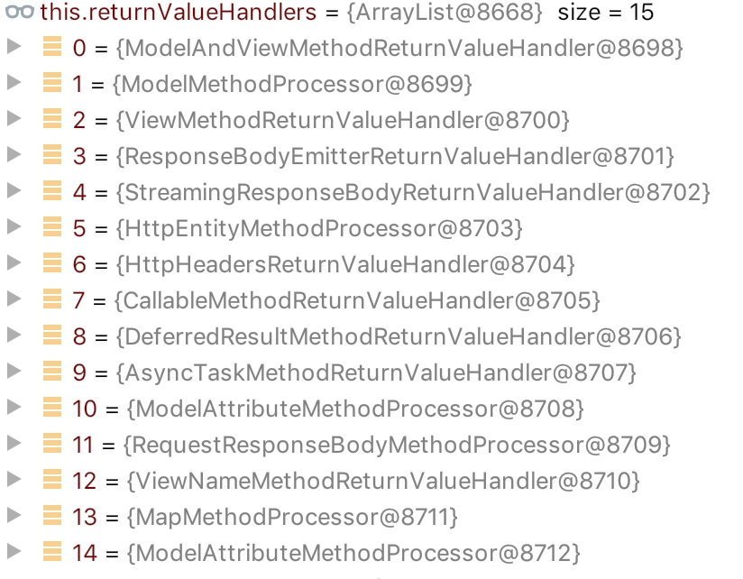
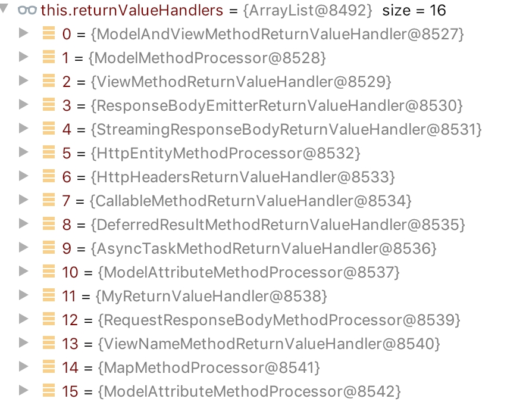

## 版本说明

`jdk`:1.8.0_131  
`springboot`:2.1.6.RELEAS  
`maven`:3.6.1  
`database`:mysql-5.7.14  
`lombok插件`

## 源码分析

省略构建项目，junit 测试等步骤，只分析代码与实现。
根据中的分析,我们可以知道 `DispatcherServlet`会拦截所有请求，寻找合适的`mappedHandler`去处理请求，并根据`mappedHandler`去找对应的适配器`HandlerAdapter`来实际请求`controller`的方法，针对接口来说一般使用的是`RequestMappingHandlerAdapter`

具体调用`controller`方法的细节我们不需要关注，这里我们仅仅关注`RequestMappingHandlerAdapter`是如何处理方法的返回值的。
节选部分`DispatcherServlet`的`doDispatch`方法

```java
// 根据mappedHandler查找合适的适配器
HandlerAdapter ha = getHandlerAdapter(mappedHandler.getHandler());

// Process last-modified header, if supported by the handler.
String method = request.getMethod();
boolean isGet = "GET".equals(method);
if (isGet || "HEAD".equals(method)) {
    long lastModified = ha.getLastModified(request, mappedHandler.getHandler());
    if (new ServletWebRequest(request, response).checkNotModified(lastModified) && isGet) {
        return;
    }
}

if (!mappedHandler.applyPreHandle(processedRequest, response)) {
    return;
}

// 实际调用controller方法的地方
mv = ha.handle(processedRequest, response, mappedHandler.getHandler());
```

`RequestMappingHandlerAdapter`的`handle`方法调用了内部的`handleInternal`方法

```java
@Override
protected ModelAndView handleInternal(HttpServletRequest request,
        HttpServletResponse response, HandlerMethod handlerMethod) throws Exception {

    ModelAndView mav;
    checkRequest(request);

    // Execute invokeHandlerMethod in synchronized block if required.
    if (this.synchronizeOnSession) {
        HttpSession session = request.getSession(false);
        if (session != null) {
            Object mutex = WebUtils.getSessionMutex(session);
            synchronized (mutex) {
                mav = invokeHandlerMethod(request, response, handlerMethod);
            }
        }
        else {
            // No HttpSession available -> no mutex necessary
            mav = invokeHandlerMethod(request, response, handlerMethod);
        }
    }
    else {
        // No synchronization on session demanded at all...
        mav = invokeHandlerMethod(request, response, handlerMethod);
    }

    if (!response.containsHeader(HEADER_CACHE_CONTROL)) {
        if (getSessionAttributesHandler(handlerMethod).hasSessionAttributes()) {
            applyCacheSeconds(response, this.cacheSecondsForSessionAttributeHandlers);
        }
        else {
            prepareResponse(response);
        }
    }

    return mav;
}

```

我们再查看`invokeHandlerMethod`实现细节

```java
protected ModelAndView invokeHandlerMethod(HttpServletRequest request,
        HttpServletResponse response, HandlerMethod handlerMethod) throws Exception {

    ServletWebRequest webRequest = new ServletWebRequest(request, response);
    try {
        WebDataBinderFactory binderFactory = getDataBinderFactory(handlerMethod);
        ModelFactory modelFactory = getModelFactory(handlerMethod, binderFactory);

        ServletInvocableHandlerMethod invocableMethod = createInvocableHandlerMethod(handlerMethod);
        if (this.argumentResolvers != null) {
            invocableMethod.setHandlerMethodArgumentResolvers(this.argumentResolvers);
        }
        //这里我们要注意下，后面实现的自定义MyResponseType注解就和这里有关
        if (this.returnValueHandlers != null) {
            invocableMethod.setHandlerMethodReturnValueHandlers(this.returnValueHandlers);
        }
        invocableMethod.setDataBinderFactory(binderFactory);
        invocableMethod.setParameterNameDiscoverer(this.parameterNameDiscoverer);

        ModelAndViewContainer mavContainer = new ModelAndViewContainer();
        mavContainer.addAllAttributes(RequestContextUtils.getInputFlashMap(request));
        modelFactory.initModel(webRequest, mavContainer, invocableMethod);
        mavContainer.setIgnoreDefaultModelOnRedirect(this.ignoreDefaultModelOnRedirect);

        AsyncWebRequest asyncWebRequest = WebAsyncUtils.createAsyncWebRequest(request, response);
        asyncWebRequest.setTimeout(this.asyncRequestTimeout);

        WebAsyncManager asyncManager = WebAsyncUtils.getAsyncManager(request);
        asyncManager.setTaskExecutor(this.taskExecutor);
        asyncManager.setAsyncWebRequest(asyncWebRequest);
        asyncManager.registerCallableInterceptors(this.callableInterceptors);
        asyncManager.registerDeferredResultInterceptors(this.deferredResultInterceptors);

        if (asyncManager.hasConcurrentResult()) {
            Object result = asyncManager.getConcurrentResult();
            mavContainer = (ModelAndViewContainer) asyncManager.getConcurrentResultContext()[0];
            asyncManager.clearConcurrentResult();
            LogFormatUtils.traceDebug(logger, traceOn -> {
                String formatted = LogFormatUtils.formatValue(result, !traceOn);
                return "Resume with async result [" + formatted + "]";
            });
            invocableMethod = invocableMethod.wrapConcurrentResult(result);
        }
        //实际调用的地方
        invocableMethod.invokeAndHandle(webRequest, mavContainer);
        if (asyncManager.isConcurrentHandlingStarted()) {
            return null;
        }

        return getModelAndView(mavContainer, modelFactory, webRequest);
    }
    finally {
        webRequest.requestCompleted();
    }
}
```

我们查看下`invocableMethod.invokeAndHandle`的细节

```java
public void invokeAndHandle(ServletWebRequest webRequest, ModelAndViewContainer mavContainer,
        Object... providedArgs) throws Exception {

    Object returnValue = invokeForRequest(webRequest, mavContainer, providedArgs);
    setResponseStatus(webRequest);

    if (returnValue == null) {
        if (isRequestNotModified(webRequest) || getResponseStatus() != null || mavContainer.isRequestHandled()) {
            disableContentCachingIfNecessary(webRequest);
            mavContainer.setRequestHandled(true);
            return;
        }
    }
    else if (StringUtils.hasText(getResponseStatusReason())) {
        mavContainer.setRequestHandled(true);
        return;
    }

    mavContainer.setRequestHandled(false);
    Assert.state(this.returnValueHandlers != null, "No return value handlers");
    try {
        //处理返回结果
        this.returnValueHandlers.handleReturnValue(
                returnValue, getReturnValueType(returnValue), mavContainer, webRequest);
    }
    catch (Exception ex) {
        if (logger.isTraceEnabled()) {
            logger.trace(formatErrorForReturnValue(returnValue), ex);
        }
        throw ex;
    }
}
```

`this.returnValueHandlers.handleReturnValue`的实现细节类`HandlerMethodReturnValueHandlerComposite`

```java
@Override
public void handleReturnValue(@Nullable Object returnValue, MethodParameter returnType,
        ModelAndViewContainer mavContainer, NativeWebRequest webRequest) throws Exception {
    //查找合适的处理器
    HandlerMethodReturnValueHandler handler = selectHandler(returnValue, returnType);
    if (handler == null) {
        throw new IllegalArgumentException("Unknown return value type: " + returnType.getParameterType().getName());
    }
    //处理器执行
    handler.handleReturnValue(returnValue, returnType, mavContainer, webRequest);
}

@Nullable
private HandlerMethodReturnValueHandler selectHandler(@Nullable Object value, MethodParameter returnType) {
    boolean isAsyncValue = isAsyncReturnValue(value, returnType);
    //遍历所有处理器，只要找到就直接返回，所以得考虑下优先级关系
    for (HandlerMethodReturnValueHandler handler : this.returnValueHandlers) {
        if (isAsyncValue && !(handler instanceof AsyncHandlerMethodReturnValueHandler)) {
            continue;
        }
        if (handler.supportsReturnType(returnType)) {
            return handler;
        }
    }
    return null;
}
```

默认的返回值处理器有以下



我们查看下典型的`@ResponseBody`的处理器`RequestResponseBodyMethodProcessor`的方法`supportsReturnType`就明白`selectHandler`是如何起作用的

```java
@Override
public boolean supportsReturnType(MethodParameter returnType) {
    return (AnnotatedElementUtils.hasAnnotation(returnType.getContainingClass(), ResponseBody.class) ||
            returnType.hasMethodAnnotation(ResponseBody.class));
}
```

因为我们自定义的处理器是模仿`@ResponseBody`,那么我们只需要在`returnValueHandlers`中`RequestResponseBodyMethodProcessor`位置处插入我们自定义的处理器即可

那么首先我们需要了解下`HandlerMethodReturnValueHandlerComposite`的属性`returnValueHandlers`是如何被加载赋值的，通过查看调用关系，我们发现 returnValueHandlers 赋值的方法为`addHandlers`,此方法被两处调用

第一处,这里是加载 bean 时的初始化方法，即默认`returnValueHandlers`为`getDefaultReturnValueHandlers`的返回值

```java
@Override
public void afterPropertiesSet() {
    // Do this first, it may add ResponseBody advice beans
    initControllerAdviceCache();

    if (this.argumentResolvers == null) {
        List<HandlerMethodArgumentResolver> resolvers = getDefaultArgumentResolvers();
        this.argumentResolvers = new HandlerMethodArgumentResolverComposite().addResolvers(resolvers);
    }
    if (this.initBinderArgumentResolvers == null) {
        List<HandlerMethodArgumentResolver> resolvers = getDefaultInitBinderArgumentResolvers();
        this.initBinderArgumentResolvers = new HandlerMethodArgumentResolverComposite().addResolvers(resolvers);
    }
    if (this.returnValueHandlers == null) {
        List<HandlerMethodReturnValueHandler> handlers = getDefaultReturnValueHandlers();
        this.returnValueHandlers = new HandlerMethodReturnValueHandlerComposite().addHandlers(handlers);
    }
}
```

第二处

```java
public void setReturnValueHandlers(@Nullable List<HandlerMethodReturnValueHandler> returnValueHandlers) {
    if (returnValueHandlers == null) {
        this.returnValueHandlers = null;
    }
    else {
        this.returnValueHandlers = new HandlerMethodReturnValueHandlerComposite();
        this.returnValueHandlers.addHandlers(returnValueHandlers);
    }
}
```

明显我们无法改变`afterPropertiesSet`的实现细节，那么继承`WebMvcConfigurationSupport`,重写`RequestMappingHandlerAdapter`方法，手动调用`setReturnValueHandlers`方法即可注入我们自定义的处理器。
但是我们需要取出默认的返回值处理器，避免其他返回值处理器不起作用，`getDefaultReturnValueHandlers`是私有方法，所以我们需要使用反射取值。然后将自定义处理器插入到`RequestResponseBodyMethodProcessor`之前即可,
这种方式会使`@ControllerAdvice`失效，慎用，更好的方式通过`@ControllerAdvice`实现同样的效果

```java
package com.li.springboot.config;

import org.springframework.context.annotation.Configuration;
import org.springframework.web.method.support.HandlerMethodReturnValueHandler;
import org.springframework.web.servlet.config.annotation.ResourceHandlerRegistry;
import org.springframework.web.servlet.config.annotation.WebMvcConfigurationSupport;
import org.springframework.web.servlet.mvc.method.annotation.RequestMappingHandlerAdapter;
import org.springframework.web.servlet.mvc.method.annotation.RequestResponseBodyMethodProcessor;

import java.lang.reflect.Method;
import java.util.List;

@Configuration
public class WebMvc extends WebMvcConfigurationSupport {

    @Override
    public RequestMappingHandlerAdapter requestMappingHandlerAdapter() {
        RequestMappingHandlerAdapter requestMappingHandlerAdapter = super.requestMappingHandlerAdapter();
        try {
            Method method = RequestMappingHandlerAdapter.class.getDeclaredMethod("getDefaultReturnValueHandlers");
            method.setAccessible(true);
            List<HandlerMethodReturnValueHandler> returnValueHandlers = (List<HandlerMethodReturnValueHandler>) method.invoke(requestMappingHandlerAdapter);
            System.out.println("invoke " + returnValueHandlers);
            int i = 0;
            for (HandlerMethodReturnValueHandler handlerMethodReturnValueHandler : returnValueHandlers) {
                if (handlerMethodReturnValueHandler instanceof RequestResponseBodyMethodProcessor) {
                    returnValueHandlers.add(i, new MyReturnValueHandler(getMessageConverters()));
                    break;
                }
                i++;
            }
            requestMappingHandlerAdapter.setReturnValueHandlers(returnValueHandlers);
        } catch (Exception e) {
            e.printStackTrace();
        }
        return requestMappingHandlerAdapter;
    }
}

package com.li.springboot.config;

import com.li.springboot.annotation.MyResponseBody;
import org.springframework.core.MethodParameter;
import org.springframework.http.converter.HttpMessageConverter;
import org.springframework.stereotype.Component;
import org.springframework.web.bind.support.WebDataBinderFactory;
import org.springframework.web.context.request.NativeWebRequest;
import org.springframework.web.method.support.ModelAndViewContainer;
import org.springframework.web.servlet.mvc.method.annotation.AbstractMessageConverterMethodProcessor;

import java.util.HashMap;
import java.util.List;
import java.util.Map;

@Component
public class MyReturnValueHandler extends AbstractMessageConverterMethodProcessor {
    protected MyReturnValueHandler(List<HttpMessageConverter<?>> converters) {
        super(converters);
    }

    @Override
    public boolean supportsParameter(MethodParameter parameter) {
        //不需要支持请求参数
        return false;
    }

    @Override
    public Object resolveArgument(MethodParameter parameter, ModelAndViewContainer mavContainer, NativeWebRequest webRequest, WebDataBinderFactory binderFactory) throws Exception {
        return null;
    }

    @Override
    public boolean supportsReturnType(MethodParameter returnType) {
        //有注解@MyResponseBody的使用该处理器
        return returnType.getMethodAnnotation(MyResponseBody.class) != null;
    }

    @Override
    public void handleReturnValue(Object returnValue, MethodParameter returnType, ModelAndViewContainer mavContainer, NativeWebRequest webRequest) throws Exception {
        mavContainer.setRequestHandled(true);
        Map map = new HashMap();
        map.put("data",returnValue);
        //替换返回值
        writeWithMessageConverters(map, returnType, webRequest);
    }
}

```

实现后我们可以看到返回值处理器的集合变化

