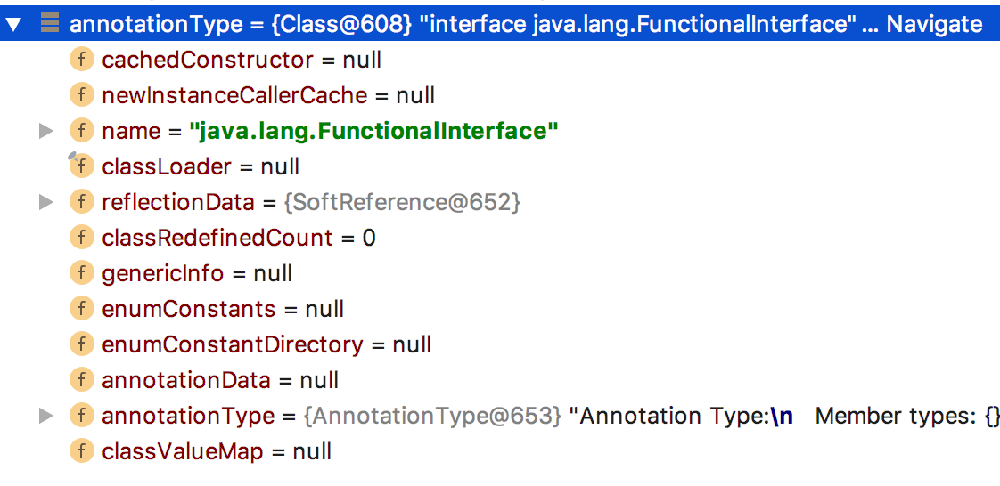

## 元注解

`java.lang.annotation`提供了四种元注解，专门注解其他的注解（在自定义注解的时候，需要使用到元注解）：

### `Retention` 定义该注解的生命周期

1. `RetentionPolicy.SOURCE` : 在编译阶段丢弃。这些注解在编译结束之后就不再有任何意义，所以它们不会写入字节码。`@Override`, `@SuppressWarnings`都属于这类注解。
2. `RetentionPolicy.CLASS` : 在类加载的时候丢弃。在字节码文件的处理中有用。注解默认使用这种方式
3. `RetentionPolicy.RUNTIME` : 始终不会丢弃，运行期也保留该注解，因此可以使用反射机制读取该注解的信息。我们自定义的注解通常使用这种方式。

### `Target` 表示该注解用于什么地方。默认值为任何元素，表示该注解用于什么地方。可用的`ElementType`参数包括

1. `ElementType.CONSTRUCTOR`:用于描述构造器
2. `ElementType.FIELD`:成员变量、对象、属性（包括`enum`实例）​​
3. `ElementType.LOCAL_VARIABLE`:用于描述局部变量
4. `ElementType.METHOD`:用于描述方法
5. `ElementType.PACKAGE`:用于描述包
6. `ElementType.PARAMETER`:用于描述参数
7. `ElementType.TYPE`:用于描述类、接口(包括注解类型) 或`enum`声明

### `Documented` 一个简单的`Annotations`标记注解，表示是否将注解信息添加在`java`文档中

### `Inherited` 元注解是一个标记注解，`@Inherited`阐述了某个被标注的类型是被继承的。如果一个使用了`@Inherited`修饰的`annotation`类型被用于一个`class`，则这个`annotation`将被用于该`class`的子类

### `Repeatable` 用于标记该注解是否可重复使用，它需要制定另一个注解用以存放多个重复注解的值

```java
@Documented
@Retention(RetentionPolicy.RUNTIME)
@Target({ElementType.PARAMETER, ElementType.TYPE})
@Repeatable(NotNull.NotNulls.class)
public @interface NotNull {

  String value();
  @Retention(RetentionPolicy.RUNTIME)
  @Target({ElementType.PARAMETER, ElementType.TYPE}
  @interface NotNulls {
    NotNull[] value();
  }
}
```

## 自定义注解

自定义注解类编写的一些规则:
`Annotation`型定义为`@interface`, 所有的`Annotation`会自动继承`java.lang.Annotation`这一接口,并且不能再去继承别的类或是接口.
参数成员只能用`public`或默认(`default`)这两个访问权修饰
参数成员只能用基本类型`byte`,`short`,`char`,`int`,`long`,`float`,`double`,`boolean`八种基本数据类型和`String`、`Enum`、`Class`、`annotations`等数据类型,以及这一些类型的数组.
要获取类方法和字段的注解信息，必须通过`Java`的反射技术来获取 `Annotation`对象,因为你除此之外没有别的获取注解对象的方法
注解也可以没有定义成员, 不过这样注解就没啥用了 PS:自定义注解需要使用到元注解

```java
@Documented
@Retention(RetentionPolicy.RUNTIME)
@Target({ElementType.PARAMETER, ElementType.TYPE})
public @interface NotNull {
}
```

## 注解的原理

注解本质是一个继承了`Annotation`的特殊接口，其具体实现类是`Java`运行时生成的动态代理类。而我们通过反射获取注解时，返回的是`Java`运行时生成的动态代理对象`$Proxy1`。通过代理对象调用自定义注解（接口）的方法，会最终调用`AnnotationInvocationHandler`的`invoke`方法。该方法会从`memberValues`这个`Map`中索引出对应的值。而`memberValues`的来源是`Java`常量池。

通过示例我们可以看出代理类，我们可以使用`annotationType()`方法来获取实际的注解类

```java
FunctionalInterface functionalInterface = Function.class.getAnnotation(FunctionalInterface.class);
Class<? extends FunctionalInterface> proxy=functionalInterface.getClass();
Class<? extends Annotation> annotationType= functionalInterface.annotationType();
System.out.println("proxy = " + proxy);
System.out.println("annotationType = " + annotationType);
```

> proxy = class com.sun.proxy.\$Proxy1
> annotationType = interface java.lang.FunctionalInterface

所有 class 的 class，即 `Class` 类中，有关于 annotation 的属性`annotationData`,`annotationType`,因所有 class 都是`Class`的实例，所以所有 class 都会包含这些有关 annotaion 的属性。这就是为什么所有的 class 都可以使用`getAnnotations()`等方法



## 反射获取重复注解

```java
@Retention(RetentionPolicy.RUNTIME)
@Target( ElementType.TYPE)
@Repeatable()
public @interface Func{

  String value()

  @Retention(RetentionPolicy.RUNTIME)
  @Target( ElementType.TYPE)
  @interface Funcs{
    Func[] value();
  }
}


@Func("001")
@Func("002")
public class Bean{

}


//获取重复注解的方式

Bean.class.getAnnotation(Func.Funcs.class);
Bean.class.getAnnotationByType(Func.class);


//当不知道重复注解的类时，可使用如下方法

for(Annotation annotation:Bean.class.getAnnotations()){
  Method method = annotation.getClass().getMethod("value");
  Annotation[] finds = (Annotation[])method.invoke(annotation);
}
```
