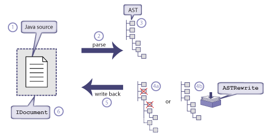
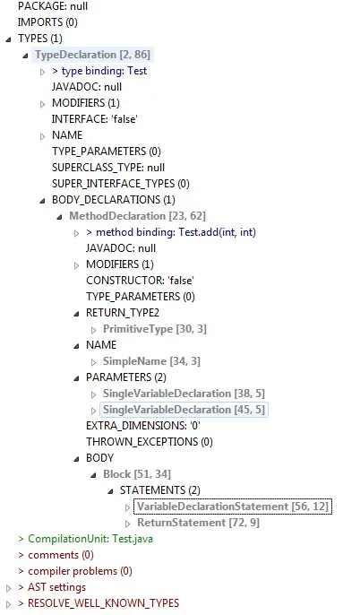
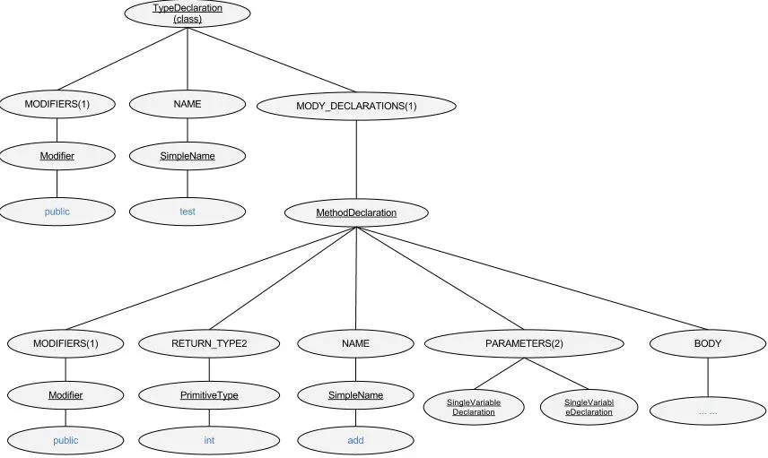
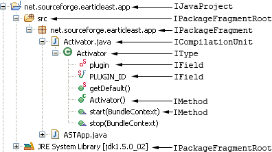

## 概述

抽象语法树（The Abstract Syntax)是 eclipse 中一个用于重命名、快速修复等工具的基础框架。它用树的结构表示 java 的源代码。

## 工作流

AST 的工作流


1. Java source 首先，你提供一些源码以用来解析。源码可以直接通过 java 文件来提供，也可以使用 包含 java 源代码的`char[]`数组。
2. Parse 使用`org.eclipse.jdt.core.dom.ASTParser`类来解析步骤 1 提供的源码。
3. Abstract Syntax Tree，是步骤 2 解析后的一个用树形结构来描述步骤 1 提供的源码模型。
4. Manipulating the AST，修改 AST 树模型，一般使用`org.eclipse.jdt.core.dom.rewrite.ASTRewrite`来处理
5. Writing changes back 将修改写回由步骤 1 提供的源码
6. IDocument 是有步骤 1 提供的源码的包装类。

上述步骤的一个简单示例

```java
//代码只能作为eclipse插件中的一部分才可以运行
import org.eclipse.core.resources.IProject;
import org.eclipse.core.resources.IWorkspaceRoot;
import org.eclipse.core.resources.ResourcesPlugin;
import org.eclipse.core.runtime.NullProgressMonitor;
import org.eclipse.jdt.core.ICompilationUnit;
import org.eclipse.jdt.core.IJavaProject;
import org.eclipse.jdt.core.IType;
import org.eclipse.jdt.core.JavaCore;
import org.eclipse.jdt.core.dom.AST;
import org.eclipse.jdt.core.dom.ASTParser;
import org.eclipse.jdt.core.dom.CompilationUnit;
import org.eclipse.jdt.core.dom.MethodDeclaration;
import org.eclipse.jdt.core.dom.TypeDeclaration;
import org.eclipse.jdt.core.dom.rewrite.ASTRewrite;
import org.eclipse.text.edits.TextEditGroup;


//1 Java source
IWorkspaceRoot root = ResourcesPlugin.getWorkspace().getRoot();
IProject project = root.getProject("test_java");
project.open(null);
IJavaProject javaProject=  JavaCore.create(project);
IType iType = javaProject.findType("demo.Hello");
ICompilationUnit unit = iType.getCompilationUnit();
unit.becomeWorkingCopy(new NullProgressMonitor());

//2 Parse

//AST.JLS8表示使用JDK8
ASTParser parser = ASTParser.newParser(AST.JLS8);
//K_COMPILATION_UNIT表示接收编译的源码文件为完整的源码文件
parser.setKind(ASTParser.K_COMPILATION_UNIT);
parser.setSource(unit);

//3 AST
CompilationUnit astRoot = (CompilationUnit) parser.createAST(null);
AST ast = astRoot.getAST();

//4 manipulating the AST
TypeDeclaration type= (TypeDeclaration) astRoot.types().get(0);
MethodDeclaration method = type.getMethods()[0];
ASTRewrite rewriter = ASTRewrite.create(ast);
rewriter.remove(method, null);

//5 writing changes back
unit.applyTextEdit(rewriter.rewriteAST(), new NullProgressMonitor());

//6 commit to workspacejava source
unit.commitWorkingCopy(false, new NullProgressMonitor());
```

会将下述代码修改为

```java
//修改前
package demo;
import java.util.ArrayList;
public class Hello {
  private String hello="hello" + new ArrayList<>().size();
  private void print(){
    System.out.println(hello);
  }
  public static void main(  String[] args){
    new Hello().print();
  }
}

//修改后
package demo;
import java.util.ArrayList;
public class Hello {
  private String hello="hello" + new ArrayList<>().size();
  public static void main(  String[] args){
    new Hello().print();
  }
}

```

## 抽象语法树（AST）

AST 是 eclipse 用来查看源码的方式，Java 源文件可以完全使用 AST 的节点来表示。每个节点都是`ASTNode`的子类，每种子类都是为表示 Java 特定的元素。例如

- MethodDeclaration 表示方法
- VariableDeclarationFragment 表示变量
- SimpleName 表示任意的非 java 关键字、布尔值、null 的字符串。

例如

```java
public class Test {
 public int add(int a, int b){
  int c = a+b;
  return c;
 }
}
```

其 ast 结构如下



表示成树的形式如下



## Java 模型

在 eclipse 中将 Java 项目表示为一个树形结构。这里只是简单描述一下



## 如何查找指定的 AST 节点

一个简单的“hello world”代码编译后的 AST 也会是一个复杂的树，如何查找指定的节点。我们可以使用`ASTVisitor`，ASTNode 可以可以使用`accept`方法接受一个`ASTVistor`对象，遍历 ASTNode 的所有节点。每个节点依次调用方法

1. preVisit(ASTNode node)
2. visit(MethodInvocation node)，只有当节点为 MethodInvocation 类型时，才会调用该方法。
3. 当 visit 返回`true`时则遍历该节点的子节点，否则跳过
4. endVisit(MethodInvocation node)
5. postVisit(ASTNode node)

示例

```java
import org.eclipse.jdt.core.dom.*;

import java.io.IOException;
import java.nio.file.Files;
import java.nio.file.Paths;

public class JDTUtil {
    public static void main(String[] args) throws IOException {

        String javaSource = new String(Files.readAllBytes(Paths.get("src/Hello.java")));

        ASTParser parser = ASTParser.newParser(AST.JLS8);
        parser.setSource(javaSource.toCharArray());
        parser.setKind(ASTParser.K_COMPILATION_UNIT);
        CompilationUnit cu = (CompilationUnit) parser.createAST(null);

        cu.accept(new ASTVisitor() {


            public boolean visit(VariableDeclarationFragment node) {
                SimpleName name = node.getName();
                System.out.println("visit Declaration of '" + name + "' at line" + cu.getLineNumber(name.getStartPosition()));
                return false; // do not continue to avoid usage info
            }


            @Override
            public boolean visit(MethodDeclaration node) {
                System.out.println("visit method " + node.getName() + " at" + cu.getLineNumber(node.getStartPosition()));
                return true;
            }

            @Override
            public void endVisit(MethodDeclaration node) {
                System.out.println("end visit method " + node.getName());
            }

            @Override
            public void endVisit(VariableDeclarationFragment node) {
                System.out.println("end visit variable " + node.getName());
            }

            @Override
            public void preVisit(ASTNode node) {
                if (node instanceof MethodDeclaration) {
                    System.out.println("prev visit:" + node);
                }
            }

            @Override
            public void postVisit(ASTNode node) {
                if (node instanceof MethodDeclaration) {
                    System.out.println("post visit:" + node);
                }
            }
        });
    }
}
```

```java
public class Hello {
    int i = 9;
    int j;
    public void test(){
        j=1000;
        int k;
    }
}
```

其输出结果为

```txt
visit Declaration of 'i' at line2
end visit variable i
visit Declaration of 'j' at line3
end visit variable j
prev visit:public void test(){
  j=1000;
  int k;
}

visit method test at4
visit Declaration of 'k' at line6
end visit variable k
end visit method test
post visit:public void test(){
  j=1000;
  int k;
}
```

## 代码示例

涉及到的class文件

```java
import java.nio.file.Files;
import java.nio.file.Paths;

import org.eclipse.jdt.core.dom.AST;
import org.eclipse.jdt.core.dom.ASTNode;
import org.eclipse.jdt.core.dom.ASTParser;
import org.eclipse.jdt.core.dom.ASTVisitor;
import org.eclipse.jdt.core.dom.Block;
import org.eclipse.jdt.core.dom.CompilationUnit;
import org.eclipse.jdt.core.dom.FieldDeclaration;
import org.eclipse.jdt.core.dom.ImportDeclaration;
import org.eclipse.jdt.core.dom.MethodDeclaration;
import org.eclipse.jdt.core.dom.Modifier;
import org.eclipse.jdt.core.dom.Name;
import org.eclipse.jdt.core.dom.PrimitiveType;
import org.eclipse.jdt.core.dom.SimpleType;
import org.eclipse.jdt.core.dom.Type;
import org.eclipse.jdt.core.dom.TypeDeclaration;
import org.eclipse.jdt.core.dom.VariableDeclarationFragment;
import org.eclipse.jface.text.Document;
import org.eclipse.text.edits.TextEdit;
```

将java文件转换为CompilationUnit

```java

File file = new File("xxx.java");
URI url = file.toURI();
String java = String.join("\n", Files.readAllLines(Paths.get(url)));

ASTParser astParser = ASTParser.newParser(AST.JLS8);
astParser.setSource(java.toCharArray());
astParser.setKind(ASTParser.K_COMPILATION_UNIT);

CompilationUnit cu= (CompilationUnit) (astParser.createAST(null));

```

将一段代码的字符串转换为`ASTNode`

```java
private ASTNode createAstNodeWithMethodBody() {
  String body = "\n" +
    "  List<Demo> demos = new ArrayList<>();\n" +
    "  demos.add(new Demo());\n" +
    "  demos.add(new Demo());\n" +
    "  return demos;";
  ASTParser parser = ASTParser.newParser(AST.JLS8);
  parser.setKind(ASTParser.K_STATEMENTS);
  parser.setSource(body.toCharArray());
  ASTNode result = parser.createAST(null);
  return result;
 }
```

关于方法的`ASTNode`

```java

 @Override
 public boolean visit(MethodDeclaration node) {
  int modifiers = node.getModifiers();
  System.out.println(Modifier.isPublic(modifiers));
  System.out.println(Modifier.isStatic(modifiers));
  System.out.println(Modifier.isFinal(modifiers));
  //方法名
  System.out.println(node.getName().getFullyQualifiedName());
  //方法的返回类型的ASTNode
  Type type = node.getReturnType2();

  //基本类型 int void 等
  if (type instanceof PrimitiveType) {

  //简单的类型
  } else if (type instanceof SimpleType) {

  //泛型有关的
  } else if (type instanceof ParameterizedType) {

  }

  //修复方法体的内容
  ASTNode body = ASTNode.copySubtree(node.getAST(), createAstNodeWithMethodBody());
  node.setBody((Block) body);
  //打印出修改后的完整代码
  System.out.println(node.getParent());
  return true;
 }

```

修改类名

```java
CompilationUnit unit = (CompilationUnit) (astParser.createAST(null));

  unit.accept(new ASTVisitor() {
   @Override
   public boolean visit(TypeDeclaration node) {
    if (node.getName().getFullyQualifiedName().equals("Demo")) {

     node.setName(node.getAST().newSimpleName("Fuck"));
    }
    return false;
   }
  });
```

打印源码的原理，`NaiveASTFlattener`也是一个`ASTVisitor`，通过遍历语法书，将源码依次写入`NaiveASTFlattener`的`buffer`中

```java
CompilationUnit unit = (CompilationUnit) (astParser.createAST(null));
NaiveASTFlattener print = new NaiveASTFlattener();
unit.accept(print);
System.out.println(print.getResult());
```

修改源代码并提交

```java
IFile file = null;
ICompilationUnit compileUnit = JavaCore.createCompilationUnitFrom(file);
compileUnit.open(null);
compileUnit = compileUnit.getWorkingCopy(null);
ASTParser parser = ASTParser.newParser(AST.JLS8);
parser.setSource(compileUnit);
CompilationUnit cu = (CompilationUnit) parser.createAST(null);
cu.recordModifications();

//一些astNode相关的操作

IDocument document = new Document(compileUnit.getSource());
TextEdit textEdit = cu.rewrite(document, null);
textEdit.apply(document);
compileUnit.getBuffer().setContents(document.get());
compileUnit.reconcile(ICompilationUnit.NO_AST, false, null, null);
compileUnit.commitWorkingCopy(true, null);
compileUnit.discardWorkingCopy();
```
