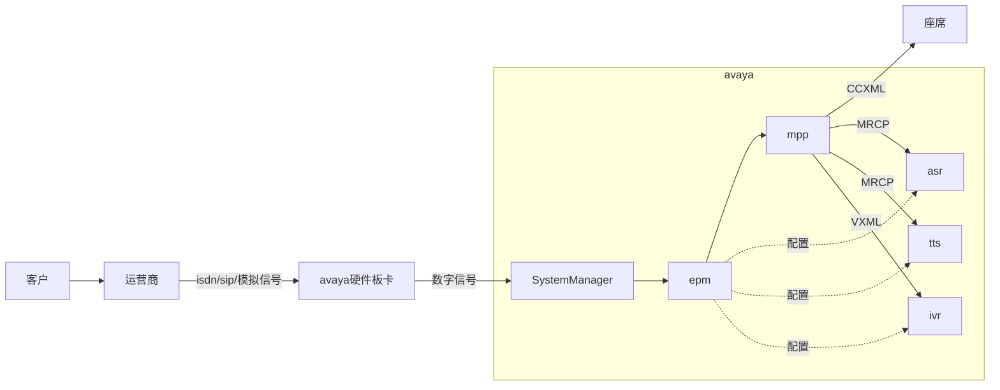

一通会话的进线过程

1. 用户拨打电话
2. 电信运营商接入会话，根据被叫号将会话接入卡中心
3. 卡中心硬件板卡将模拟电路信号转换为数字信号
4. SystemManager
5. epm
6. mpp
7. asr
8. tts
9. ivr
10. 座席

```mermaid
graph LR
    1[客户]-->2[运营商]
    2-->|isdn/sip/模拟信号|3[avaya硬件板卡]
    3-->|数字信号|4[SystemManager]
    6-->|CCXML|10[座席]
    subgraph avaya
        4-->5[epm]
        5-->6[mpp]
        5-.->|配置|7[asr]
        5-.->|配置|8[tts]
        5-.->|配置|9[ivr]
        6-->|MRCP|7[asr]
        6-->|MRCP|8[tts]
        6-->|VXML|9[ivr]
    end
```
