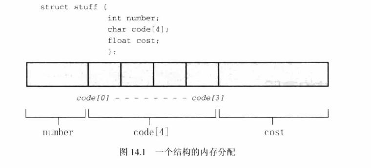

## 基础知识

### 关键字

- const 指向 const 的变量的值为只读。指向 const 的指针通常用于函数形参中，表明该函数不会使用指针改变数据。

  ```cpp
  // const 数据或非 const 数据的地址初始化为指向 const 的指针或为其赋值时合法的
  // 只能把非 const 数据的地址赋给普通指针
  int rates[1]={1};
  const int locked[1]={10};

  const int *pc = rates;  //有效
  pc = locked;            //有效
  pc = &locked[0];        //有效

  int *pnc = rates;       //有效
  pnc = locked;           //无效
  pnc = &locked[0];       //有效

  ```

  ```cpp
  const * pc; //不能修改指针指向地址上的值， 但是可以修改它所指向的地址
  * const  pc; //能修改指针指向地址上的值， 但是不能修改它所指向的地址
  const * const pc; //不能修改指针指向地址上的值， 也不能修改它所指向的地址
  ```

- static 声明变量具有静态存储期
- \_thread_local 声明变量为线程独占
- register 声明变量为寄存器变量
- extern 声明变量的定义在别处
- restrict 它只可以用于限定和约束指针，并表明指针是访问一个数据对象的唯一且初始的方式。关键字 restrict 有两个读者。一个是编译器，它告诉编译器可以自由地做一些有关优化的假定。另一个读者是用户，他告诉用户仅使用满足 restrict 要求的参数。
- unsigned 将数字类型无符号化，  例如 int 型的范围：-2^du31 ~ 2^31 - 1，而 unsigned int 的范围：0 ~ 2^32。
- typedef 为某一类型自定义名称

  1. 与`#define`不同，typedef 创建的符号名只受限于类型，不能用于值
  2. typedef 由编译器解释，不是预处理器
  3. 在其首先范围内，typedef 比`#define`更灵活
     例如

  ```cpp
  typedef unsigned char BYTE;
  typedef char * STRING; //一个指向char的指针的类型
  //也可以用于结构，可以省略标签名
  typedef struct complex {
      float read;
      float imag;
  } COMPLEX
  ```

### 存储类别

| 存储类别     | 存储器 | 作用域 | 链接 | 申明方式                      |
| :----------- | :----- | :----- | :--- | :---------------------------- |
| 自动         | 自动   | 块     | 无   | 块内                          |
| 寄存器       | 自动   | 块     | 无   | 块内，使用关键字 register     |
| 静态外部链接 | 静态   | 文件   | 外部 | 所有函数外                    |
| 静态内部链接 | 静态   | 文件   | 内部 | 所有函数外，使用关键字 static |
| 静态无链接   | 静态   | 块     | 无   | 块内，使用关键字 static       |

- 使用 static 修饰的变量称为静态变量，该变量在内存中的地址不变，它的值可以改变。
- 具有文件作用域的外部变量自动具有静态存储器。
- 外部变量若为初始化，则自动被初始化为 0，外部变量只能使用常量来初始化。

```cpp
while (1) {

    static  int a = 1;
    printf("%d %p \n", a++, &a);
    if (a > 3) {
        return 0;
    }
}

// 1 0x1025c0018
// 2 0x1025c0018
// 3 0x1025c0018
```

```cpp
int tern = 1; //定义式声明
int main(void){
 extern int tern; //引用式声明
}

```

### 复合字面量

创建一个与数组类似的匿名数组，必须在创建的同时使用它，使用指针记录地址就是一种用法。

```cpp
int *p = (int[2]){10, 20};
printf("%d\n", *p);
printf("%d\n", p[0]);
```

也可以作为实际参数传递给带有匹配形式参数的函数

### 函数原型

C 语言代码由上到下依次执行，原则上函数定义要出现在函数调用之前，否则就会报错。但在实际开发中，经常会在函数定义之前使用它们，这个时候就需要提前声明。函数声明的格式非常简单，相当于去掉函数定义中的函数体再加上分号;，如下所示：返回值类型 函数名( 类型 形参, 类型 形参… );也可以不写形参，只写数据类型：返回值类型 函数名( 类型, 类型…);

## 预处理器

### `#define`

使用#define 指令来定义明示常量(manifest constant,也叫做符号常量)，其格式为

```cpp
 #define     PX   printf("x is %d.\n",x);

//预处理指令    宏   替换体
```

`#define` 在编译时替换，从宏编程最终替换文本的过程称为宏展开。

```cpp
#include <stdio.h>
#define PI 3.14
#define PRINT  printf("%f \n"

int main(void)
{
    printf("begin\n");
    PRINT,PI);
}

// begin
// 3.140000
```

`#define`使用参数，称为类函数宏，其格式为

```cpp
//              宏参数
 #define     PX(X,Y)   (((X)+(Y))/2)
//预处理指令   宏        替换体
```

```cpp
#include <stdio.h>
#define  SQ(X) X*X

int main(){
    int x  = 2;
    int a = SQ(x);
    printf("%d\n",a);

    a= SQ(x+5);
    printf("%d\n",a);
//替换后其实为  2+5*2+5
}

```

预处理器不做计算，不求值，只替换字符序列

在类函数宏的替换体重，#号作为一个预处理运算符，可以把几号转换为字符串，例如，如果 x 是一个宏形参，那么#x 就转换为字符串 x 的形参名。这个过程称为字符串化(stringizing)

```cpp
#include <stdio.h>
#define  SQ(X) printf("-->"    #X  "<--is %d\n",X);
int main() {
    int y = 2;
    SQ(y);
    SQ(y + 5);
}
// -->y<--is 2
// -->y + 5<--is 7
```

预处理器粘合剂：`##运算符`，把两个几号组合成一个记号。例如

```cpp
#include <stdio.h>

#define  XNAME(N) x##N
#define  PRINT_XN(N)  printf( "X"#N" - %d\n",x##N);

int main() {
    int XNAME(1) = 14; //变成int x1 = 14;
    int XNAME(2) = 14; //变成int x2 = 20;
    PRINT_XN(1);       //变成 printf("x1 = %d\n",x1);
    PRINT_XN(2);       //变成 printf("x2 = %d\n",x2);

}
```

变参宏：`...`和`_ _VA_ARGS_ _`

```cpp
#include <stdio.h>

#define  PR(...) printf(__VA_ARGS__)

int main() {

    PR("Howdy\n");
    PR("weight=%d,shipping=$%.2f\n",10,10.1f);
}

```

可以使用`undef`取消已定义的`#define`指令，即使原来没有定义，`#define`宏的作用域从它在文件中的声明处开始，直到用`#undef`指令取消宏为止，或文件尾。

### `#include`

当预处理器发现`#include`指令时，会查找后面的文件名把文件的内容包含到当前文件中，即替换源文件中的`#include`指令。这相当于把被包含文件的全部内容输入到源文件`#include`指令所在的文职。

```cpp
#include <stdio.h>           //查找系统目录
#include "hot.h"             //查找当前工作目录，未找到在查找系统目录
#include "/usr/biff/p.h"     //查找指定目录文件
```

我们可以定义头文件

定义`constant.h`文件

```cpp
#define STARS "********************"
#define BAR_WIDTH 40
```

那么我们在主程序里就可以引入

```cpp
#include <stdio.h>
#include "constant.h"

int main()
{
    printf("starts %d\n",BAR_WIDTH)
    return 0;
}
```

### 条件编译

可以使用其他指令穿件条件编译（conditional compilation），也就是说，可以使用这些指令告诉编译器根据编译时的条件执行或忽略信息（或代码）块。

`if`、`#ifdef`、`#else`、`#endif`、`ifndef`（判断是否是未定义的）

```cpp
#include <stdio.h>

//#define  H 0

#ifdef H
#define  M 1
#else
#define  M 2
#endif

int main() {
    printf("%d\n", M); //根据H是否定义，M的值为1或2
}


```

### 预定义宏

| 宏                   | 含义                                                         |
| :------------------- | :----------------------------------------------------------- |
| `_ _DATE_ _`         | 预处理的日期（“Mmm dd yyyy”）形式的字符串字面量              |
| `_ _FILE_ _`         | 当前源码文件名                                               |
| `_ _ LINE_ _`        | 当前源码行号                                                 |
| `_ _STDC_ _`         | 设置为 1 表示实现遵循 C 标准                                 |
| `_ _STDC_HOSTED_ _`  | 本机环境设置为 1，否则设置为 0                               |
| `_ _STDC_VERSION_ _` | 支持 C99 标准，设置为 199901L；支持 C11 标准，设置为 201112L |
| `_ _TIME_ _`         | 代码的时间，格式为“hh:mm:ss”                                 |

### `#line` 和 `#error`

`#line`指令重置`_ _LINE_ _`和`_ _File_ _`宏报告的行号和文件名

```cpp
#line 1000
#line 10 "cool.c"
```

`#error` 指令让预处理器发出一条错误信息，该消息包含指令中的文本。如果可能的化，编译过程应该中断。

```cpp
#if __STDC_VERSION__  !=1L
#error fuck you
#endif
```

在编译过程中

```shell
$ gcc hello.c  -o hello  && ./hello
hello.c:4:2: error: fuck you
#error fuck you
 ^
1 error generated.

```

### 泛型选择表达式

泛型编程指那些没有特定类型，但是一旦指定一种类型，就可以转换成指定类型的代码。C11 新增了一种表达式，叫做泛型选择表达式可根据表达式的类型选择一个值。泛型选择表达式不是预处理指令，但是在一些泛型编程中它常用作#define 宏定义的一部分。

```cpp
_Generic(x,int:0,float:1,double:2,default:3)
```

泛型选择语句与 switch 语句类似，泛型选择语句以类型匹配标签，

```cpp
#include <stdio.h>

#define  M(X) _Generic((X),int:1,double:2,default:3)
#define  F(X) _Generic((X),int:m1,default:m2)
#define  F2(X) _Generic((X),int:m1,default:m2)()
#define  F3(X) _Generic((X),int:m3,default:m4)(X)

void m1(){
    puts("m1");
}
void m2(){
    puts("m2");
}
void m3(int x){
    printf("m3:%d\n",x);
}
void m4(float x){
    printf("m4:%f\n",x);
}
int main() {

    printf("%d\n", M(1));
    F(1)();
    F2(2.0);
    F3(2.0f);

}
// 1
// m1
// m2
// m4:2.000000
```

对一个泛型选择表达式求值时，程序不会先对第一项求值，它只确定类型。只有匹配标签的类型后才会对表达式求值。

```cpp
#include <stdio.h>

#define  M(X) _Generic((X),int:1,double:2,default:3)

void m1(){
    puts("m1");
}
int m2(){
    puts("m2");
    return 0;
}
int main() {
    //只确定m1,m2的类型，而不会进行调用
    printf("%d\n", M(m1()));
    printf("%d\n", M(m2()));
}
// 3
// 1
```

### 内联函数

内联函数应该短小。内联函数具有内部链接

```cpp
#include <stdio.h>

inline  static  void print(char * x){
    puts(x);
}

int main() {
    char * x = "hello";
    puts(x);
    print(x);
}

```

## 断言

```cpp
#include <stdio.h>
#include <assert.h>


int main() {
    int i =1;
    assert(i==2);
}
//Assertion failed: (i==2), function main, file /Users/li/code/c_plus/c/main.c, line 7.

```

可以使用在`#include <assert.h>`前加入`#define NDEBUG` 禁用断言

```cpp
#include <stdio.h>
#define  NDEBUG
#include <assert.h>

int main() {
    int i =1;
    assert(i==2);
}

```

C11 新增一个`_Static_assert`编译时断言

## 优先级

一些复杂的声明

```cpp
int board[8][8]; //声明一个内涵int数组的数组
int ** ptr;      //声明一个指向指针的指针，被指向的指针指向int
int *risks[10];  //声明一个内涵10个元素的数组，每个元素都是一个执行int的指针
int (* rusks)[10]//声明一个执行数组的指针，该数组内含10个int类型的值
int * oof[3][4]  //声明一个3x4的二维数组，每个元素都是执行int的指针
int (* uuf)[3][4]//声明一个指向3x4的二维数组的指针，该数组中内含int类型值
int (* uof[3])[4]//声明一个内涵3个指针元素的额数组，其中每个指针都指向一个内含4个int类型元素的数组
```

要看懂上述声明，关键要理解`*`，`()`，`[]`的优先级。`()`，`[]`具有相同的优先级，它们比`*`（解引用运算符）的优先级高

## 指针

1. `&`运算符访问变量地址
2. `*`运算符获取地址上的值
3. 指针变量的值可以使用`*variable`的方式去取值，赋值
4. 函数定义中的形式参数若为指针需要声明为`*variable`
5. 指针`+1`表示增加一个存储单元，对于数组而言，意味着访问下一个元素的指针地址
6. 数组的申明为指针地址,其值即为数组的首元素指针地址
7. 指针变量也有自己的内存地址和值
8. 指向 void 的指针作为一个通用指针，用于指针指向不同类型，C99 为此描述加入新的关键字 restrict

```cpp
int pooh = 24;
int *ptr = &pooh;
printf("%d %p %d %p\n", pooh, &pooh, *ptr, ptr);
*ptr = 100;
printf("%d %p %d %p\n", pooh, &pooh, *ptr, ptr);
int other =-1;
ptr = &other;
*ptr = 100;
printf("%d %p %d %p\n", other, &other, *ptr, ptr);

// 24 0x7fff5770d46c 24 0x7fff5770d46c
//100 0x7fff5770d46c 100 0x7fff5770d46c
//100 0x7fff5770d45c 100 0x7fff5770d45c

void change(int *u, int *v)
{
    printf("%p %p \n", u, v);
    printf("%d %d \n", *u, *v);
    int temp;
    temp = *u;
    *u = *v;
    *v = temp;
}
```

```cpp
int a = 1;
int *p = &a;
printf("%p,%d\n", p, *p);
p++;
printf("%p,%d\n", p, *p);
// 0x7fff5024344c,1
// 0x7fff50243450,1344550016
```

```cpp
int days[] = {0, 1, [2] = 100};
printf("%p,%p\n", days, &days[0]);
printf("%p,%d\n", (days + 1), *(days + 1));
printf("%p,%d\n", (days + 2), *(days + 2));
//0x7fff5375b44c,0x7fff5375b44c
//0x7fff5375b450,1
//0x7fff5375b454,10
```

```cpp
int a = 1;
int *p = &a;
printf("%p,%p\n", &p, p);
printf("%p,%p\n", *(&p), p)
// 0x7fff5ab00440,0x7fff5ab0044c
// 0x7fff5ab0044c,0x7fff5ab0044c
```

### 函数指针

如果在程序中定义了一个函数，那么在编译时系统就会这个函数代码分配一段存储空间，这段存储空间的首地址称为这个函数的地址。而且函数名表示的就是这个地址。既然是地址我们就可以定义一个指针变量来存放，这个指针变量就叫做函数指针变量，简称函数指针

```cpp
#include <stdio.h>

int test(){
    puts("test");
    return 1;
}
int main(){
    printf("%p %ld\n",test, sizeof(test));
    int(*p)(void)  = test;
    printf("%p %ld\n",p, sizeof(p));

    //使用函数指针的两种方法
    p();
    (*p)();
}

// 0x10263dee0 1
// 0x10263dee0 8

```

函数指针的定义方式为：
函数返回值类型 (\* 指针变量名) (函数参数列表);

函数指针也可以作为函数的形参

```cpp
void show((* fp) (char *),char *str);
```

## 数组

数组默认使用的值是内存上相应位置现有值，若部分初始化数组，剩余的元素都会被初始化为 0。

```cpp
int [] days ={}

// 计算数组的实际大小
sizeof days / sizeof days[0]
```

数组的指针地址为数组中首元素的指针地址，数组的申明即是其指针申明

```cpp
int a[] = {1};
int *p = a;
printf("%p\n", a);
printf("%p\n", p);
printf("%d\n", *a);
printf("%d\n", *p);
// 0x7fff53fe344c
// 0x7fff53fe344c
// 1
// 1
```

## 字符串

字符串是以空字符`\0`结尾的 char 类型数组，可使用字符串常量，char 类型数组，指向 char 的指针来定义字符串，字符串的末尾会自动加入`\0`字符。字符串的指针地址即为其 char 数组的首位元素地址，`*"hello"`的值为`h`。

字符串常量属于静态存储类别（static storage class ），该字符串只会被存储一次

```cpp
char car[10] = "Tata";
//以下表达式都为true
car == &car[0];
*car == 'T';
*(car+1) == car[1] == 'a';

```

初始化数组字符串是吧静态存储区的字符串拷贝到新生成的数组中，而初始化指针只把字符串的地址拷贝给指针。指针字符串不允许修改字符数组的值。

```cpp
#include <stdio.h>
#define SIZE 2
#define MSG "hello"

int main(int argc, char const *argv[])
{
    char m1[] = "hello";
    char *m2 = "hello";
    *m1 = 'f';
    //*m2 = 'f'; 非法
    printf("%p,%p,%p\n", &MSG, &m1, m2);
    puts(MSG);
    puts(m1);
    puts(m2);
}
// 0x10c063fa0,0x7fff53b9c44a,0x10c063fa0
// hello
// fello
// hell

```

遍历字符串

```cpp
char *string = "hello";
int i = 0;
printf("%d %p %c\n", ++i, string, *string);
while (*string)
{
    printf("%d %p %c\n", ++i, string, *string);
    string++;
}

printf("%d %p %c\n", ++i, string, *string);

// 可以看到首字符和数组的指针地址是相同的，尾字符为\0,\0作为作为bool时其值等效于0
// 1 0x10d2ddf9e h
// 2 0x10d2ddf9e h
// 3 0x10d2ddf9f e
// 4 0x10d2ddfa0 l
// 5 0x10d2ddfa1 l
// 6 0x10d2ddfa2 o
// 7 0x10d2ddfa3

```

## 结构

下述结构在内存中的布局


<grey>在有些系统中，一个结构的大小可能大于它各个成员大小之和。这是因为系统对数据进行校准的过程中产生了一些“缝隙”，例如，有些系统必须把每个成员都放在偶数地址上，或 4 的倍数的地址上。在这种系统中，结构内部就存在未使用的“缝隙”</grey>

```cpp
#include <stdio.h>

struct stuff {
    int number;
    char code[4];
    float cost;
};
int main(void)

{

    // 使用结构并初始化结构，各初始化项用逗号分隔
    struct  stuff aname = {
            10,
            "hel",
            3.14f
    };

    // 另外一种用法是符合字面量，可以提供可替换的值。也可以直接作为参数传递,
    aname = (strcut stuff){
            10,
            "hel",
            3.14f
    };
    // 访问结构的成员，.的优先级高于&，我们也可以看到number的指针地址和aname的指针地址是相同的
    printf("%d\n",aname.number);
    printf("%p %p\n",&aname,&aname.number);
    // 10
    // 0x7fff59eb8780 0x7fff59eb8780

    //使用指针,和数组不同，结构的值不为指针地址
    struct stuff *p = &aname;
    //指针访问成员
    printf("%d\n",p->number);
    printf("%d\n",(*p).number);

    //结构可以赋值给另一个结构，相当于可拷贝一份新的结构，使用不同的内存块
    //当结构作为形参时，实际传递的一定是结构的副本
    struct  stuff p2 =  *p;
    p->number = 100;
    p->code[0] = 'f';
    printf("%d %s \n", p->number,p->code);
    printf("%d %s \n", p2.number,p2.code);
    // 100 fel
    // 10 hel
}

```

结构中声明指针变量时，由于其是未经初始化的变量，地址可以是任何值，当对其进行赋值时，可能会导致程序崩溃。若要使用指针变量时，其应该只用于管理那些已经定义好的在别处分配的值。也可以使用 malloc()函数分配内存空间，并把字符串拷贝到新分配的存储空间中，该字符串并未存储在结构中，而存储在 malloc()分配的内存块中，结构中存储着两个字符串的地址，处理字符串的函数通常都要使用字符串的地址。

例如

```cpp
struct  pst{
    int number;
    int * pointer;
};
int main(void)

{
    int a = 100;
    struct pst ps  ;
    printf("%3d,%p,%p,%p,%p,%p\n", *ps.pointer, &ps,&ps.number,&ps.pointer, ps.pointer, &ps.pointer);
    ps.pointer = &a;
    ps.number = 3;
    printf("%3d,%p,%p,%p,%p,%p\n", *ps.pointer, &ps,&ps.number,&ps.pointer, ps.pointer, &ps.pointer);

}

//   0,0x7fff5317b778,0x7fff5317b778,0x7fff5317b780,0x7fff5317b7a0,0x7fff5317b780
// 100,0x7fff5317b778,0x7fff5317b778,0x7fff5317b780,0x7fff5317b78c,0x7fff5317b780
// 可以看出结构ps的指针地址就是其成员变量p的指针地址。p的值是一个指针
```

使用 malloc()赋值字符串指针示例

```cpp
#include <stdio.h>
#include <string.h>
#include <stdlib.h>

struct  pst{
    char *  pointer;
};
int main(void)

{

    char *temp = "hello world";
    struct  pst ps;
    printf("%p,%s\n",ps.pointer, ps.pointer);
    ps.pointer = malloc(strlen(temp)+1);
    strcpy(ps.pointer,temp);
    printf("%p,%s\n",ps.pointer, ps.pointer);

}
// 0x7fff50aa67a0,
// 0x7fb5e1403150,hello world
```

### 伸缩型数组

声明伸缩型数组的规则

- 伸缩型数组成员必须是结构的最后一个成员
- 结构中必须至少有一个其他成员
- 伸缩数组的生命类似于普通数组，只是它的方括号是空的

```cpp
struct  flex{
    int count;
    double scores[];
};
```

声明 struct flex 类型的结构变量时，不能用 scores 做任何事，因为没有给这个数组预留任何存储空间。C99 希望你声明一个指向 struct flex 类型的指针，然后用 malloc()来分配足够的空间，以存储 struct flex 类型结构的常规内存和伸缩型数组成员所需的额外空间。

```cpp
struct flex *pf;
//申请一个结构和数组分配的内存空间
pf  = malloc(sizeof(struct flex)+5* sizeof(double));
pf ->count=5;
pf -> scores[2]=18.5;
printf("%d %g",pf->count,pf->scores[2]);

```

### 匿名结构

匿名结构是一个没有名称的结构成员，为了理解它的工作原理，我们先考虑如何创建嵌套结构：

```cpp
#include <stdio.h>

struct names {
    char first[20];
    char last[20];
};

struct person {
    int id;
    struct names name;
};
int main(void)
{

    struct person ted = {8483,{"Ted","Grass"}};
    puts(ted.name.first);

}
```

在 C11 中，我们用嵌套的匿名成员结构定义 person

```cpp
#include <stdio.h>

struct person {
    int id;
    struct  {
        char first[20];
        char last[20];
    };
};
int main(void)
{
    //初始化的方式相同
    struct person ted = {8483,{"Ted","Grass"}};
    //访问ted简化了步骤，只需把first看做是person的成员那样使用它
    puts(ted.first);

}

```

## 联合

联合体(union)

1. 联合体是一个结构体
2. 它的所有成员相对于基地址的偏移量都为 0
3. 次结构空间要大到足够容纳最“宽”的成员
4. 其内存对齐方式要适合其中的所有成员

对 union 的成员进行赋值，首先会清空所有成员后再进行赋值。当以任意成员访问时，可能会涉及到类型转换

```cpp
union hold {
    int digit;
    double bigf;
    char letter;
    //匿名联合
    union {
        int inner;
    };
}

//初始化
union hold a;
a.letter = 'R';
union  hold b = a;
union  hold c = {88};;
union  hold d = {.bigf = 118.2};

//使用
c.letter='H';
```

可以去定义 union 数组，这样各个元素就可以使用不同的类型

## 枚举

enum 常量是 int 类型，只要能使用 int 类型的地方就可以使用枚举类型，c 枚举的一些特性并不适用于 c++。例如 c 允许枚举变量使用++运算符

```cpp
enum  spectrum {
    red,orange,yello,green,blue,violet
};
int main(){

    enum spectrum color = violet;
    printf("%d",color);
}

```

枚举常量可指定整数值,后面没有进行赋值操作的常量会自动赋予后续的值。

```cpp
enum levels {low=100,medium=500,high}
```

## 输入输出

### 重定向

c 语言的输入输出与 linux 和 unix 的输入输出重定向是一致的，也可以使用 here document 的方式输入

```shell
example < hello.txt
example > hello.txt
example >> hello.txt
example << eof
>hello
>world
>eof
```

### printf

常用的输出控制符主要有以下几个：
|控制符 |说明|
|:--|:--|
|%a| 浮点数、十六进制|
|%c| 用来输出一个字符。|
|%d| 按十进制整型数据的实际长度输出。|
|%e| 浮点数 e 记数法。|
|%f| 用来输出实数，包括单精度和双精度，以小数形式输出。不指定字段宽度，由系统自动指定，整数部分全部输出，小数部分输出 6 位，超过 6 位的四舍五入。|
|%g| 根据值的不同，自动选择%f 或%e|
|%o| 以八进制整数形式输出，这个就用得很少了，了解一下就行了。|
|%p| 指针|
|%s| 用来输出字符串。用 %s 输出字符串同前面直接输出字符串是一样的。但是此时要先定义字符数组或字符指针存储或指向字符串，这个稍后再讲。|
|%u| 输出无符号整型（unsigned）。输出无符号整型时也可以用 %d，这时是将无符号转换成有符号数，然后输出。但编程的时候最好不要这么写，因为这样要进行一次转换，使 CPU 多做一次无用功。|
|%x| （或 %X 或 %#x 或 %#X)以十六进制形式输出整数，这个很重要。|
|%ld| 输出长整型数据。|
|%md| m 为指定的输出字段的宽度。如果数据的位数小于 m，则左端补以空格，若大于 m，则按实际位数输出。|
|%.mf| 输出实数时小数点后保留 m 位，注意 m 前面有个点。|

## 常用函数

### puts

只显示字符串，且自动在实现的字符串末尾加上换行符

### fputs

将字符串输入到指定文件中

### sizeof

sizeof 是一个操作符（operator）。其作用是返回一个对象或类型所占的内存字节数。
sizeof 有三种语法形式：

1. sizeof (object); //sizeof (对象)
2. sizeof object; //sizeof 对象
3. sizeof (type_name); //sizeof (类型)

sizeof 对对象求内存大小，最终都是转换为对对象的数据类型进行求值。

1. 基本数据类型的 sizeof
   这里的基本数据类型是指 short、int、long、float、double 这样的简单内置数据类型。由于它们的内存大小是和系统相关的，所以在不同的系统下取值可能不同。
2. 结构体的 sizeof
   结构体的 sizeof 涉及到字体对齐问题。为什么需要字节对齐，计算机组成原理教导我们有助于加快计算机的取数速度，否则就得多花指令周期了。为此，编译器默认会对结构体进行处理（实际上其他地方的数据变量也是如此）。让宽度为 2 的基本数据类型（short 等）都位于能被 2 整除的地址上，让宽度为 4 的基本数据类型（int 等）都位于能被 4 整除的地址上，依次类推。这样，两个数中间就可能需要加入填充字节，所有整个结构体的 sizeof 值就增长了。

   字节对齐的细节和编译器的实现相关，但一般而言，满足三个准则：

   1. 结构体变量的首地址能够被其最宽基本类型成员的大小锁整除
   2. 结构体的每个成员相对于结构体首地址的偏移量（offset）都是成员大小的整数倍，如有需要，编译器会在成员之间加上填充字节（internal adding）。
   3. 结构体的总大小为结构体最宽基本类型成员大小的整数倍，如有需要，编译器会在最末一个成员后加上填充字节。

   注意：空结构体（不含数据成员）的 sizeof 值为 1，空结构体分配一个字节的空间

3. 联合体的 sizeof
   联合体是重叠式，各成员共享一段内存；所以整个联合体的 sizeof 也就是每个成员
   sizeof 的最大值
4. 数组的 sizeof
   数组的 sizeof 值等于数组所占用的内存字节数
   注意：
   1. 当字符串数组表示字符串时，其 sizeof 值将`\0`计算进去
   2. 当数组为形参时，其 sizeof 值相当于指针的 sizeof 值
5. 指针的 sizeof
   指针是用来记录另一对象的地址，所以指针的内存大小当然就等于计算机内部地址总线的宽度，在 64 位计算机中，一个指针变量的返回值必定是 8，指针变量的 sizeof 与指针所指的对象没有任何关系。
6. 函数的 sizeof
   sizeof 也可对一个函数调用求值，其结果是函数返回值类型的大小，函数并不会被调用。
   对函数求值的形式：sizeof(函数名(实参表))

   注意：

   1. 不可以对返回值类型为空的函数求值。
   2. 不可以对函数名求值。
   3. 对有参数的函数，在用 sizeof 时，须写上实参表。

### memcpy 和 memmove

从 s2 向指向的位置拷贝 n 字节到 s1 指向的位置，返回 s1 的值

```cpp
void *memcpy(void * restrict s1,const void * restrict s2, size_t n);
void *memmove(void * s1,void * s2, size_t n);
```

### 可变参数:stdarg.h

stdarg.h 头文件为函数提供了一个可变参数的功能，但是用法比较复杂，必须按照如下的格式

1. 提供一个使用省略号的函数原型，这种函数的原型应该有一个形参列表，其中至少一个形参，和一个在最后位置上的省略号。最右边的形参（即省略号前一个形参）起着特殊的作用。标准中用 parmN 来描述该形参
2. 在函数定义中创建一个 va_list 类型的变量
3. 用宏把该变量初始化为一个参数列表
4. 用宏访问参数列表
5. 用宏完成清理工作

```cpp
#include <stdio.h>
#include <stdarg.h>

double sum(int, ...);

int main() {

    double s = sum(4,1.0,2.0,3.0,4.0);
    printf("%g\n",s);
}

double sum(int lim, ...) {
    va_list ap;       //声明一个对象存储参数
    double total=0;
    int i;

    va_start(ap, lim); //把ap初始化为参数列表
    for (i = 0; i < lim; i++) {
        total += va_arg(ap, double); //访问参数列表的每一项，类型需要严格满足
        printf("%g\n",total);

    }
    va_end(ap);

    return total;
}


```
