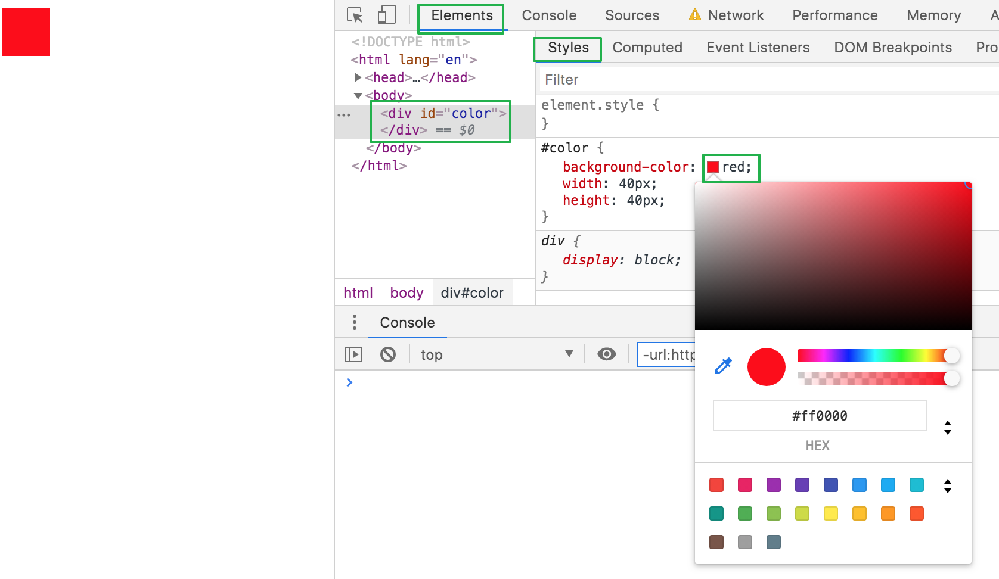
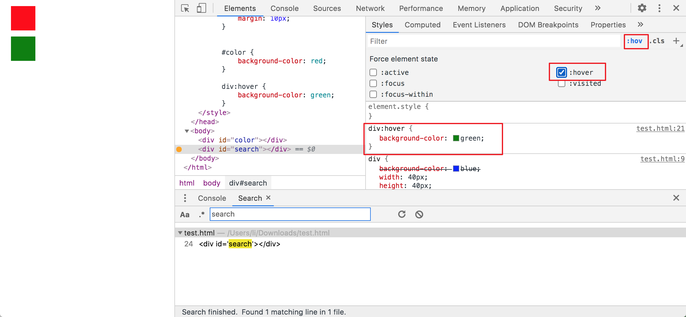
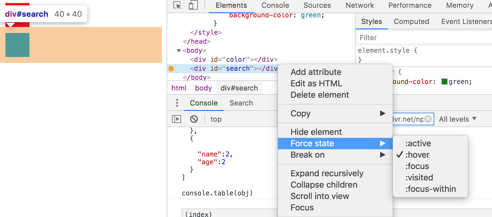
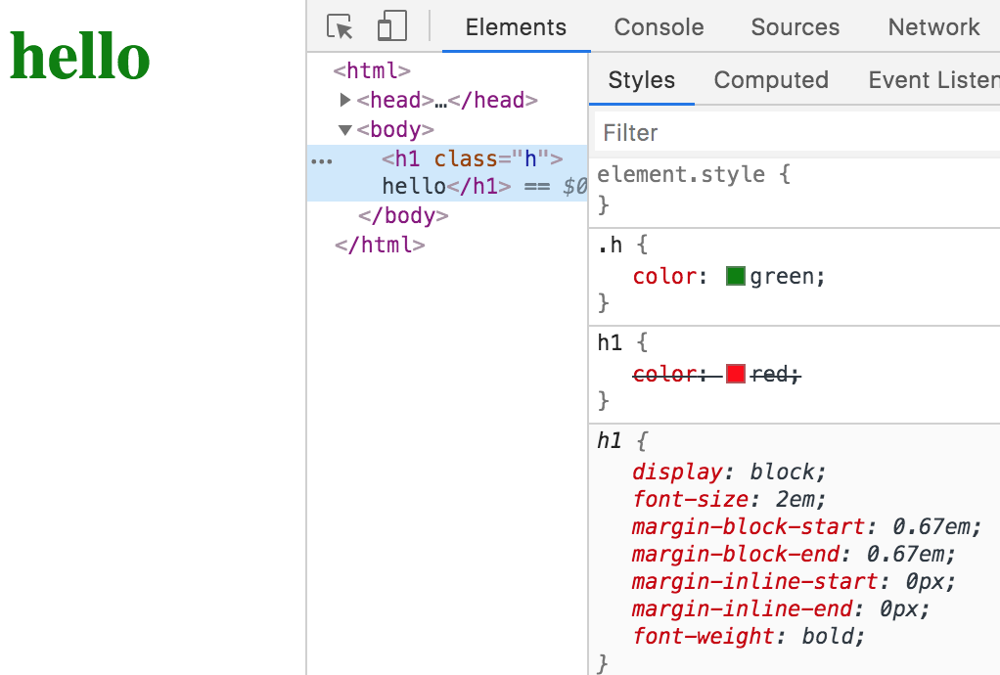
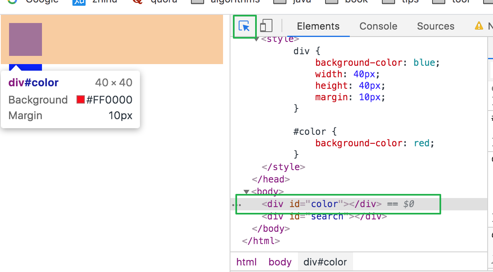
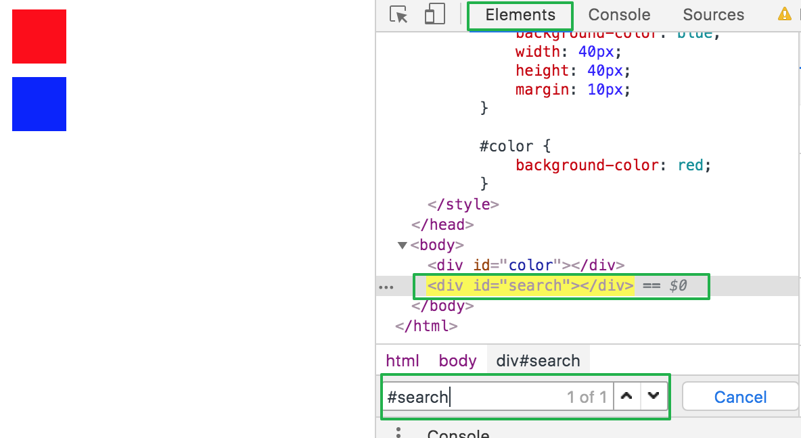
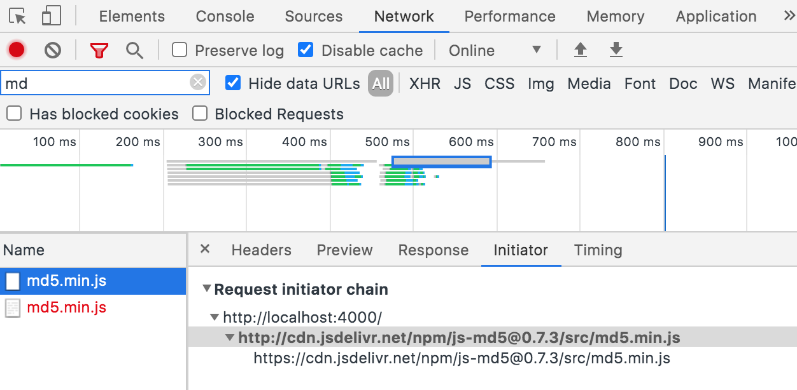
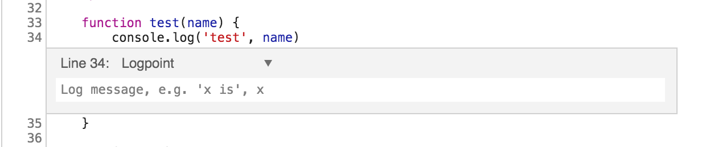

### 调色盘

针对标签的 css 颜色，可以使用调色盘调色


### 调试伪类样式

当我们想调试 dom 伪类样式


也可以直接在 elements 中代码片段上右键使用`force state`



### 查看 css 加载顺序

查看 css 选择器的加载顺序，查看哪些声明被覆盖了


### 选择 dom 节点自动定位源代码

鼠标点击某个 dom 节点时，elements 中自动高亮对应的代码片段,



### 搜索

1. 根据选择器，xpath，字符串在 elements 中搜索源代码，快捷键一般是`command + f`
   
2. 全局搜索，搜索打开的所有文件，仅支持文本搜索但支持正则，快捷键一般是`command + shitf +f`
3. 在 dev 界面，搜索所有文件名,一般快捷键是`command +p`

### 展开全部代码

在 elements 界面 dom 节点的小箭头上按住`alt`在点击，会展开所有子节点

### 查看资源在哪里被加载的

network 面板中某个资源的`initiator`



### console

在 console 控制台使用

```javascript
// 监听方法调用，当方法被调用时会打印出方法的请求参数
monitor(func);

var dom = document.getElementById("id");
//监听dom对象事件，任何有关该对象的事件都会被打印
monitorEvents(dom);
// 可仅监听某些事件
monitorEvents(dom, ["click"]);

//上次变量的值
$_;

//最近在elements中选择过的dom节点
$0;
$1;
$2;
$3;
$4;

//根据xpath选择dom节点
$x;

//获取dom节点的所有事件,例如最近的一个dom节点
getEventListeners($0);
```

### 断点

断点可设置 condition，也可执行方法



在 console 控制台，在执行指定方法时直接进入 debug 模式

```shell
debug(func)
```

### 其他小技巧

1. 刷新按钮可长按，选择重新加载的方式
