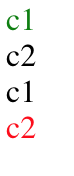

## 多个`class`生效问题

```html
<!DOCTYPE html>
<html lang="en">
  <head>
    <meta charset="UTF-8" />
    <title>Title</title>
    <link rel="stylesheet" type="text/css" href="c1.css" />
    <link rel="stylesheet" type="text/css" href="c2.css" />
    <link rel="stylesheet" type="text/css" href="c3.css" />
  </head>
  <body>
    <div class="c1 c2">c1 c2</div>
    <div class="c2 c1">c2 c1</div>
    <div class="c2 c3">c2 c3</div>
    <div class="c3 c2">c3 c2</div>
  </body>
</html>
```

`c1.css`

```css
.c1 {
  color: blue;
}
```

`c2.css`

```css
.c2 {
  color: green;
}
```

`c3.css`

```css
.c3 {
  color: red;
}
```

显示效果


当一个`div`指定多个`class`时，和指定`css`样式的顺序无关，只和加载`css`的顺序有关

## 带有层级的`class`

描述越具体的选择器优先级越高

```html
<!DOCTYPE html>
<html lang="en">
  <head>
    <meta charset="UTF-8" />
    <title>Title</title>
    <style>
      .c1 {
        color: green;
      }

      .c2 {
        color: black;
      }

      .c1 .c2 {
        color: red;
      }
    </style>
  </head>
  <body>
    <div class="c1">c1</div>
    <div class="c2">c2</div>
    <div class="c1 c2">
      c1
      <div class="c2">c2</div>
    </div>
  </body>
</html>
```

显示效果

