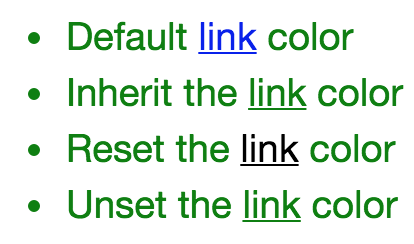

## DOM

一个 DOM 有一个树形结构，标记语言中的每一个元素、属性以及每一段文字都对应着结构树中的一个节点（Node/DOM 或 DOM node）。节点由节点本身和其他 DOM 节点的关系定义，有些节点有父节点，有些节点有兄弟节点（同级节点）。

CSS 究竟是怎么工作的

1. 浏览器载入 HTML 文件（比如从网络上获取）。
2. 将 HTML 文件转化成一个 DOM（Document Object Model），DOM 是文件在计算机内存中的表现形式，下一节将更加详细的解释 DOM。
3. 接下来，浏览器会拉取该 HTML 相关的大部分资源，比如嵌入到页面的图片、视频和 CSS 样式。JavaScript 则会稍后进行处理，简单起见，同时此节主讲 CSS，所以这里对如何加载 JavaScript 不会展开叙述。
4. 浏览器拉取到 CSS 之后会进行解析，根据选择器的不同类型（比如 element、class、id 等等）把他们分到不同的“桶”中。浏览器基于它找到的不同的选择器，将不同的规则（基于选择器的规则，如元素选择器、类选择器、id 选择器等）应用在对应的 DOM 的节点中，并添加节点依赖的样式（这个中间步骤称为渲染树）。
5. 上述的规则应用于渲染树之后，渲染树会依照应该出现的结构进行布局。
6. 网页展示在屏幕上（这一步被称为着色）。

结合下面的图示更形象：


## 如何使用 CSS

1. 外部样式，通过 link 引用

   ```html
   <link rel="stylesheet" href="http://example/styles.css" />
   ```

   <span class="grey">`@import`可在 css 样式中引入其他 css 样式</span>

2. 内部样式，直接书写在 head 的 style 中

   ```html
   <html>
     <head>
       <style>
         p {
           color: red;
         }
       </style>
     </head>
     <body>
       <p>This is my first CSS example</p>
     </body>
   </html>
   ```

3. 内联样式，声明在 html 节点上

   ```html
   <h1 style="color: blue;background-color: yellow;border: 1px solid black;">
     Hello World!
   </h1>
   ```

## 选择器

1. 类型选择器，根据节点的类型，即节点标签名

   ```css
   p {
     color: red;
   }
   ```

2. 多个选择器，可同时指定多个节点的类型

   ```css
   h1,
   h2,
   div {
     color: red;
   }
   ```

3. 后代选择器，仅处理某个类型的节点的所有子节点，包括子节点的子节点

   ```css
   div p {
     color: red;
   }
   ```

4. 子选择器，仅处理某个类型的节点的直接子节点

   ```css
   div > p {
     color: red;
   }
   ```

5. 同级选择器，仅处理某个类型的节点同级的节点

   ```css
   div ~ p {
     color: red;
   }
   ```

6. 毗邻选择器，仅处理某个类型的节点同级的紧连着的下一个且为指定类型的节点

   ```css
   div + p {
     color: red;
   }
   ```

7. 类选择器，节点上的 class 属性

   ```css
   .testClass {
     color: red;
   }
   ```

8. ID 选择器，节点上的 id 属性

   ```css
   ＃testId {
     color: red;
   }
   ```

9. 伪类选择器，节点的特定状态下

   ```css
   a:hover {
     color: red;
   }
   ```

   伪类状态有如下

   - `:active` 向被激活的元素添加样式。
   - `:focus` 向拥有键盘输入焦点的元素添加样式。
   - `:hover` 当鼠标悬浮在元素上方时，向元素添加样式。
   - `:link`向未被访问的链接添加样式。
   - `:visited` 向已被访问的链接添加样式。
   - `:first-child` 向元素的第一个子元素添加样式。
   - `:lang`向带有指定 lang 属性的元素添加样式。

10. 属性选择器，选择具有某属性的节点

    ```css
    ［src] {
      color: red;
    }
    a［src='hello'] {
      color: red;
    }
    ```

    属性值可以使用通配符

    ```css
    /*表示以http开头*/
    [src~='http']
    /*表示以html结尾*/
    [src$='.html']
    /*表示包含test*/
    [src*='test']
    ```

11. 全局选择器，选择所有

    ```css
    * {
      color: red;
    }
    ```

## css 加载顺序

css 根据选择器的优先级呈现一种瀑布流层级重叠关系，优先级越高的属性越先加载，当选择器没有相关属性的定义时，会去向第一层优先级的选择器中去找直到找到。选择器的加载顺序遵循一个选择器描述的越具体，其加载顺序越高。

1. `!important`修饰的属性优先级最高
2. 内联样式表即标签上的`style`的值
3. ID 选择器
4. class 类选择器的权值
5. 属性选择器
6. 节点类型选择器

例如：

```html
<!DOCTYPE html>
<html lang="en">
  <head>
    <meta charset="UTF-8" />
    <title>Title</title>
    <style>
      .c1 {
        color: green;
      }

      .c2 {
        color: black;
      }

      .c1 .c2 {
        color: red;
      }

      .c3 {
        color: violet !important;
      }

      #id {
        color: gold;
        font-size: xx-large;
      }

      [title] {
        color: green;
        font-size: xx-large;
      }
    </style>
  </head>

  <body>
    <div class="c1">c1</div>
    <div class="c2">c2</div>
    <div class="c1 c2">
      c1 and c2
    </div>
    <div class="c1">
      <div class="c2">c2 in c1</div>
    </div>
    <div class="c2" title="">c2 with title</div>
    <div class="c2" id="id">c2 with id</div>
    <div class="c2" style="color: yellowgreen;">inline style in c2</div>
    <div class="c3" style="color: yellowgreen;">inline style in c3</div>
  </body>
</html>
```


### 继承

一些设置在父元素上的 css 属性是可以被子元素继承的，有些则不能。  
CSS 能自动继承的属性

- border-collapse
- border-spacing
- color
- cursor
- direction
- empty-cells
- font(-style | - variant | -weight | -size | -family |-stretch | -size | -adjust)
- letter-spacing
- line-height
- list-style(-image | -position | -type)
- overflow-wrap
- pointer-events
- quotes
- text-indent 缩进
- text-size-adjust
- text-underline-position
- text-shadow
- text-align
- text-align-last
- text-justify
- test-transform
- tab-size
- table-layout
- white-space
- word-break
- word-wrap
- word-spacing
- writing-mode
- visibility
- zoom

CSS 为控制继承提供了四个特殊的通用属性值。每个 css 属性都接收这些值。

1. `inherit` 设置该属性会使子元素属性和父元素相同。实际上，就是 "开启继承".
2. `initial` 设置属性值和浏览器默认样式相同。如果浏览器默认样式中未设置且该属性是自然继承的，那么会设置为 inherit 。
3. `unset` 将属性重置为自然值，也就是如果属性是自然继承那么就是 inherit，否则和 initial 一样

```css
body {
  color: green;
}

.my-class-1 a {
  color: inherit;
}

.my-class-2 a {
  color: initial;
}

.my-class-3 a {
  color: unset;
}
```



## 属性和值

一对属性和值组成一个 css 的声明，属性的值可以使用方法

1. `calc()`

   ```css
   .box {
     margin: 30px;
     width: 100px;
     height: 100px;
     background-color: rebeccapurple;
     transform: rotate(0.8turn);
   }
   ```

   ```html
   <div class="box"></div>
   ```

   

2. `rotate()`

   ```css
   .box {
     margin: 30px;
     width: 100px;
     height: 100px;
     background-color: rebeccapurple;
     transform: rotate(0.8turn);
   }
   ```

   ```html
   <div class="box"></div>
   ```

   

## 定位

position 属性用于指定一个元素在文档中的定位方式。top，right，bottom 和 left 属性则决定了该元素的最终位置。

1. `static`
   默认值,static 定位所导致的元素位置，是浏览器自主决定的，所以这时 top、bottom、left、right 这四个属性无效。
2. `relative`
   relative 表示，相对于默认位置（即 static 时的位置）进行偏移，即定位基点是元素的默认位置
3. `absolute`
   相对于上级元素（一般是父元素）进行偏移，即定位基点是父元素。它有一个重要的限制条件：定位基点（一般是父元素）不能是 static 定位，否则定位基点就会变成整个网页的根元素 html。
4. `fixed` 表示，相对于视口（viewport，浏览器窗口）进行偏移，即定位基点是浏览器窗口。这会导致元素的位置不随页面滚动而变化，好像固定在网页上一样。
5. `sticky`
   sticky 跟前面四个属性值都不一样，它会产生动态效果，很像 relative 和 fixed 的结合：一些时候是 relative 定位（定位基点是自身默认位置），另一些时候自动变成 fixed 定位（定位基点是视口）。

   ```css
   nav {
     background: yellow;
     top: 50px;
     position: sticky;
   }
   ```

### 叠放

`z-index`元素的叠放顺序，值越大越在上面

## 盒子模型

所谓盒子模型（Box Model）就是把 HTML 页面中的元素看作是一个矩形的盒子，也就是一个盛装内容的容器。所有的文档元素（标签）都会生成一个矩形框，我们成为元素框（element box），它描述了一个文档元素再网页布局汇总所占的位置大小。因此，每个盒子除了有自己大小和位置外，还影响着其他盒子的大小和位置。

CSS 中组成一个块级盒子需要:

- Content box: 这个区域是用来显示内容，大小可以通过设置 width 和 height.
- Padding box: 包围在内容区域外部的空白区域； 大小通过 padding 相关属性设置。
- Border box: 边框盒包裹内容和内边距。大小通过 border 相关属性设置。
- Margin box: 这是最外面的区域，是盒子和其他元素之间的空白区域。大小通过 margin 相关属性设置。


在 chrome 中当选中某个节点时，chrome dev 控制台会显示其盒子模型，且其盒子模型的中各个组件的颜色会体现在你选中的节点上


### 布局

`display:[type]`

1. block

   - 盒子会在内联的方向上扩展并占据父容器在该方向上的所有可用空间，在绝大数情况下意味着盒子会和父容器一样宽
   - 每个盒子都会换行
   - width 和 height 属性可以发挥作用
   - 内边距（padding）, 外边距（margin） 和 边框（border） 会将其他元素从当前盒子周围“推开”

   除非特殊指定，诸如标题(`<h1>`等)和段落(`<p>`)默认情况下都是块级的盒子。

2. inline

   - width 和 height 属性将不起作用。
   - 垂直方向的内边距、外边距以及边框会被应用但是不会把其他处于 inline 状态的盒子推开。
   - 水平方向的内边距、外边距以及边框会被应用而且也会把其他处于 inline 状态的盒子推开。

   用做链接的 `<a>` 元素、 `<span>`、 `<em>` 以及 `<strong>` 都是默认处于 inline 状态的。

3. flex
   我们可以通过使用类似 flex 的 display 属性值来更改内部显示类型。 如果设置 display: flex，在一个元素上，外部显示类型是 block，但是内部显示类型修改为 flex。 该盒子的所有直接子元素都会成为 flex 元素

   ```html
   <style>
     p,
     ul {
       border: 2px solid rebeccapurple;
       padding: 0.5em;
     }

     .block,
     li {
       border: 2px solid blue;
       padding: 0.5em;
     }

     ul {
       display: flex;
       list-style: none;
     }

     .block {
       display: block;
     }
   </style>
   <p>I am a paragraph. A short one.</p>
   <ul>
     <li>Item One</li>
     <li>Item Two</li>
     <li>Item Three</li>
   </ul>
   <p>
     I am another paragraph. Some of the <span class="block">words</span> have
     been wrapped in a <span>span element</span>.
   </p>
   ```

4. inline-block
   它在内联和块之间提供了一个中间状态，实现我们需要的块级的部分效果：
   - 不会跳转到新行，如果显式添加 width 和 height 属性，它只会变得比其内容更大。
   - 设置 width 和 height 属性会生效。
   - padding, margin, 以及 border 会推开其他元素。

### flex 盒子

1. flex 模型当元素表现为 flex 框时，它们沿着两个轴来布局：
   

   - 主轴（main axis）是沿着 flex 元素放置的方向延伸的轴（比如页面上的横向的行、纵向的列）。该轴的开始和结束被称为 main start 和 main end。
   - 交叉轴（cross axis）是垂直于 flex 元素放置方向的轴。该轴的开始和结束被称为 cross start 和 cross end。
   - 设置了 display: flex 的父元素被称之为 flex 容器（flex container）。
   - 在 flex 容器中表现为柔性的盒子的元素被称之为 flex 项（flex item）

2. 设定主轴方向，默认值是`row`

   ```css
   flex-direction: column;
   ```

   > 你还可以使用 row-reverse 和 column-reverse 值反向排列 flex 项目。用这些值试试看吧！

3. 当你在布局中使用定宽或者定高的时候，可能会出现问题即处于容器中的 弹性盒子子元素会溢出，破坏了布局。
   可在 flex 容器中设定

   ```css
   flex-wrap: wrap;
   ```

   在 flex 项中设定宽度

   ```css
   flex: 200px;
   ```

   > `flex-direction`和`flex-wrap`可以缩写为`flex-flow`，例如`flex-flow:row wrap`

4. 控制 flex 项占用空间的比例
   例如：这表示“每个 flex 项将首先给出 200px 的可用空间，然后，剩余的可用空间将根据分配的比例共享

   ```css
   article {
     flex: 1 200px;
   }

   article:nth-of-type(3) {
     flex: 2 200px;
   }
   ```

5. flex 项排序

   - 所有 flex 项默认的 order 值是 0。
   - order 值大的 flex 项比 order 值小的在显示顺序中更靠后。
   - 相同 order 值的 flex 项按源顺序显示。所以假如你有四个元素，其 order 值分别是 2，1，1 和 0，那么它们的显示顺序就分别是第四，第二，第三，和第一

   ```css
   button:first-child {
     order: 1;
   }
   ```

6. flex 嵌套
   弹性盒子也能创建一些颇为复杂的布局。设置一个元素为 flex 项目，那么他同样成为一个 flex 容器，它的孩子(直接子节点)也表现为 flexible box

### 外边距折叠

块的上外边距(margin-top)和下外边距(margin-bottom)有时合并(折叠)为单个边距，其大小为单个边距的最大值(或如果它们相等，则仅为其中一个)，这种行为称为边距折叠。

1. 同一层相邻元素之间
   相邻的两个元素之间的外边距重叠，除非后一个元素加上 clear-fix 清除浮动。
2. 空的块级元素
   当一个块元素上边界 margin-top 直接贴到元素下边界 margin-bottom 时也会发生边界折叠。这种情况会发生在一个块元素完全没有设定边框 border、内边距 paddng、高度 height、最小高度 min-height 、最大高度 max-height 、内容设定为 inline 或是加上 clear-fix 的时候。

   ```css
   <style>
   ​​​​​​p {
     margin: 0;
   }
   div {
     margin-top: 13px;
     margin-bottom: 87px;
   }
   </style>

   <p>上边界范围是 87 ...</p>
   <div></div>
   <p>... 上边界范围是 87</p>
   ```

3. 没有内容将父元素和后代元素分开
   如果没有边框 border，内边距 padding，行内内容，也没有创建块级格式上下文或清除浮动来分开一个块级元素的上边界 margin-top 与其内一个或多个后代块级元素的上边界 margin-top；或没有边框，内边距，行内内容，高度 height，最小高度 min-height 或 最大高度 max-height 来分开一个块级元素的下边界 margin-bottom 与其内的一个或多个后代后代块元素的下边界 margin-bottom，则就会出现父块元素和其内后代块元素外边界重叠，重叠部分最终会溢出到父级块元素外面。

## 浮动

```css
img {
  float: left;
  margin-right: 30px;
}
```


浮动元素会脱离正常的文档布局流，并吸附到其父容器的左边 。在正常布局中位于该浮动元素之下的内容，此时会围绕着浮动元素，填满其右侧的空间。

现在你已经知道了关于 float 属性的一些有趣事实，不过你很快就能够碰到一个问题——所有在浮动下面的自身不浮动的内容都将围绕浮动元素进行包装。

有一种简单的方法可以解决这个问题—— clear 属性。当你把这个应用到一个元素上时，它主要意味着"此处停止浮动"——这个元素和源码中后面的元素将不浮动

```css
footer {
  clear: both;
}
```

－ left：停止任何活动的左浮动
－ right：停止任何活动的右浮动
－ both：停止任何活动的左右浮动

## CSS 多行文本溢出省略显示

```css
overflow: hidden;
text-overflow: ellipsis;
white-space: nowrap; #省略显示
# white-space: wrap; #换行显示

```

```html
<style>
  div {
    overflow: hidden;
    text-overflow: ellipsis;
    border: solid 1px orange;
    width: 100px;
  }
</style>
<div>
  <span class="h">hello hello hello1234567889</span>
</div>
```


## 多个`class`生效问题

```html
<!DOCTYPE html>
<html lang="en">
  <head>
    <meta charset="UTF-8" />
    <title>Title</title>
    <link rel="stylesheet" type="text/css" href="c1.css" />
    <link rel="stylesheet" type="text/css" href="c2.css" />
    <link rel="stylesheet" type="text/css" href="c3.css" />
  </head>
  <body>
    <div class="c1 c2">c1 c2</div>
    <div class="c2 c1">c2 c1</div>
    <div class="c2 c3">c2 c3</div>
    <div class="c3 c2">c3 c2</div>
  </body>
</html>
```

`c1.css`

```css
.c1 {
  color: blue;
}
```

`c2.css`

```css
.c2 {
  color: green;
}
```

`c3.css`

```css
.c3 {
  color: red;
}
```

显示效果


当一个`div`指定多个`class`时，和指定`css`样式的顺序无关，只和加载`css`的顺序有关
