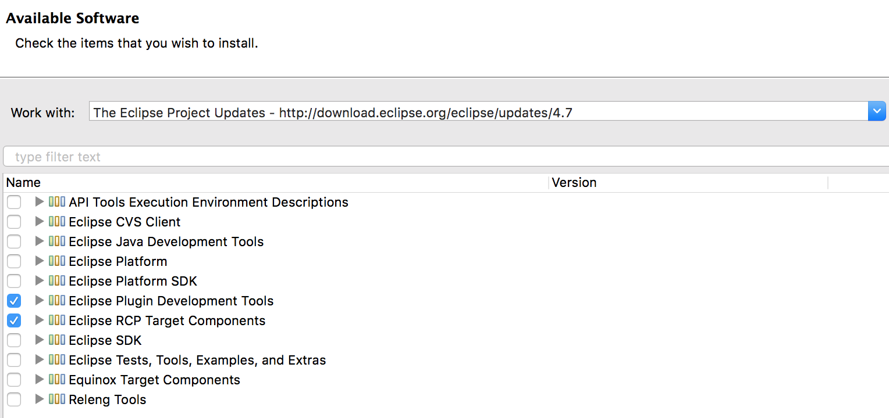
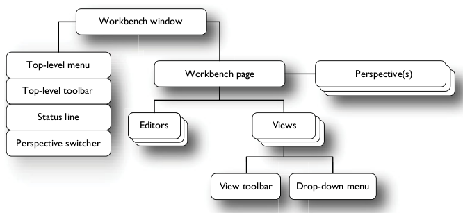
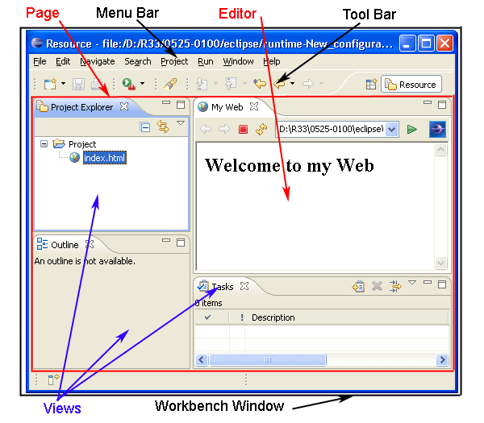
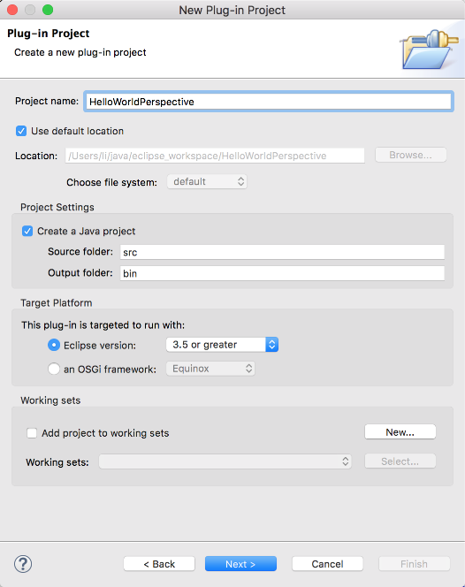
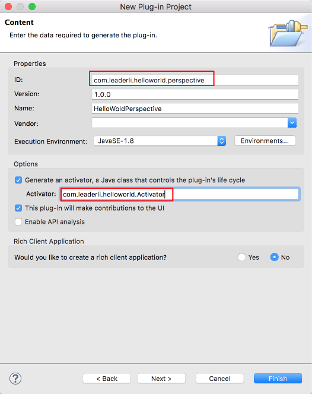
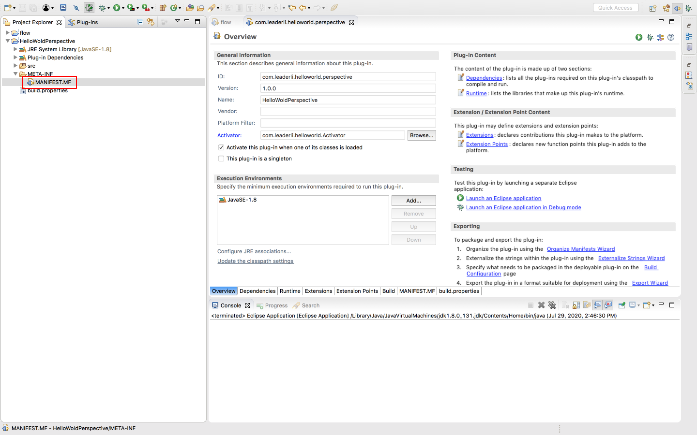
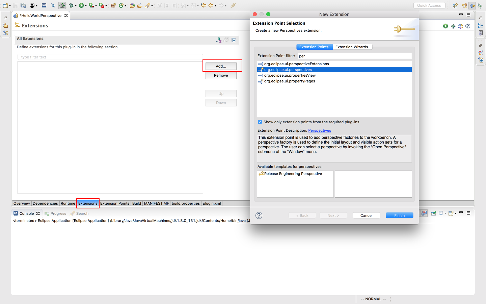
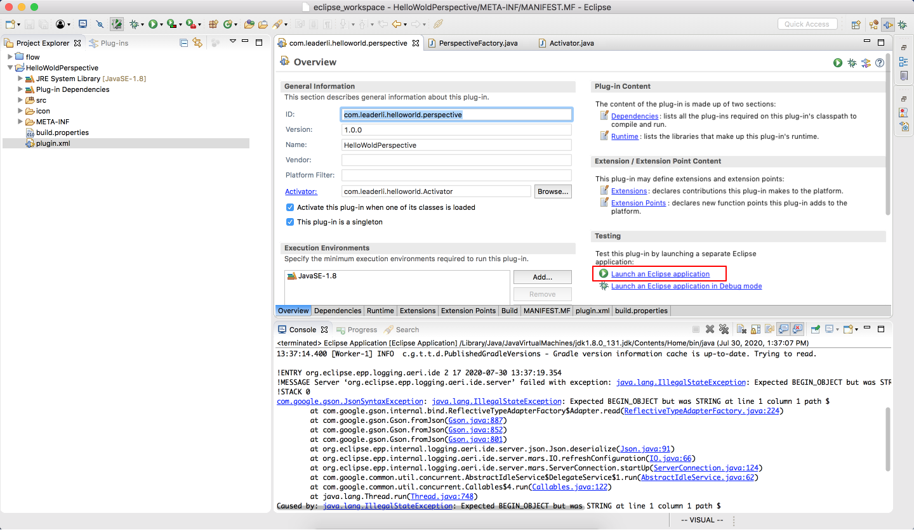
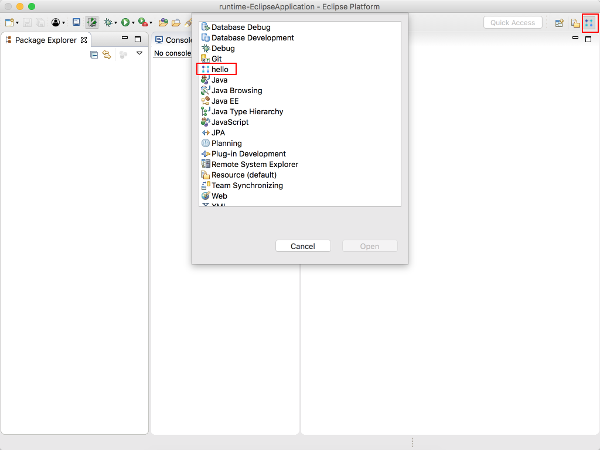

## 安装软件

1. 下载 eclipse
   在[官方链接](https://www.eclipse.org/downloads/packages/)下载合适的版本，我选择的版本为
   [oxygen 3a](https://www.eclipse.org/downloads/packages/release/oxygen/3a)
2. 安装插件
   [wiki](http://wiki.eclipse.org/Eclipse_Project_Update_Sites)上维护了最新的官方插件地址，选择你的 eclipse 对应版本的插件地址，例如[4.7](http://download.eclipse.org/eclipse/updates/4.7)
   在 eclipse 中点击`Help` -> `Install New Software`
   

## 概念

eclipse 工具区由多个部件组成，包括 menu bar，tool bar 等
他们的组成结构如下所示

eclipse 中工具区示例


[扩展点](https://www.vogella.com/tutorials/EclipseExtensionPoint/article.html)
常用
－ `org.eclipse.u.views`- add a view
－ `org.eclipse.ui.viewActions` - add an action under a view
－ `org.eclipse.ui.editors` - allows a user to edit an object(e.g. file), it is like a view, but can be opened multiple times.
－ `org.eclipse.ui.editorActions` - add action under an editor
－ `org.eclipse.ui.popupMenus` - add a popup menu. A popup menu is a memu shown by right-clicking. There are two types, one is popup for an object, the other is for popup in editor.
－ `org.eclipse.ui.actionSets` - use for adding menus, menu items, and tool bar items to the workbench menus and toolbar.
－ `org.eclipse.ui.commands` - declaration of a behaviour by id, then other plugins can use the command. It allows "define once, use everywhere".
－ `org.eclipse.ui.menus` - can associate with a command and place the command in the main menu, view dropdown menus, context menus, main toolbar, view toolbars, and various trim locations.
－ `org.eclipse.ui.handlers` - define handler for a command
－ `org.eclipse.ui.bindings` - bind shortcut key for a command

## 入门实例

1. 新建一个插件工程
   

   
   使用一个唯一 ID

2. 新增一个扩展点
   `MANIFEST.MF`为插件工程的配置文件
   

   
   保存后会生成`build.xml`文件，编辑该文件，在扩展点`org.eclipse.ui.perspectives`下，增加`perspective`布局

3. 编辑扩展点

   ```xml
   <?xml version="1.0" encoding="UTF-8"?>
   <?eclipse version="3.4"?>
   <plugin>
      <extension
            point="org.eclipse.ui.perspectives">
         <perspective
               class="com.leaderli.helloworld.PerspectiveFactory"
               id="com.leaderli.HelloWoldPerspective"
               icon="icon/workflow.png"
               name="hello">
         </perspective>
      </extension>

   </plugin>
   ```

   - name 为透视图的名称
   - icon 为透视图的图标，其值为项目路径下的文件

4. 透视图增加窗口
   增加扩展点`org.eclipse.ui.perspectiveExtensions`，并编辑扩展点

   ```xml
   <extension
      point="org.eclipse.ui.perspectiveExtensions">
      <perspectiveExtension targetID="com.leaderli.HelloWoldPerspective">
      <view
         id="org.eclipse.jdt.ui.PackageExplorer"
         minimized="false"
         moveable="false"
         ratio="0.5"
         relationship="left"
         relative="org.eclipse.ui.console.ConsoleView"
         visible="true">
      </view>
      <view
         id="org.eclipse.ui.console.ConsoleView"
         minimized="false"
         moveable="false"
         ratio="0.5"
         relationship="right"
         relative="org.eclipse.jdt.ui.PackageExplorer"
         visible="true">
      </view>
      </perspectiveExtension>
   </extension>
   ```

5. 启动
   
   
   我们可以看到生成了 hello 透视图，且透视图下有 console 窗口和资源窗口

## perspective

透视图是一个包含一系列视图和内容编辑器的可视容器。默认的透视图叫 java。透视图的布局可[自定义](https://www.runoob.com/eclipse/eclipse-perspectives.html)修改

[在插件中定义一个透视图，并定义一些布局](https://www.programcreek.com/2013/02/eclipse-plug-in-development-creat-a-perspective/)
