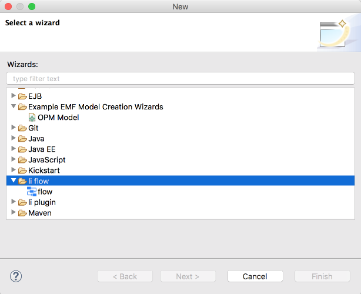
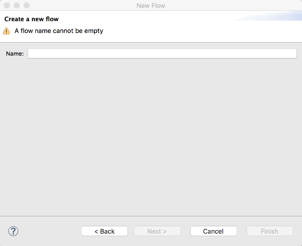
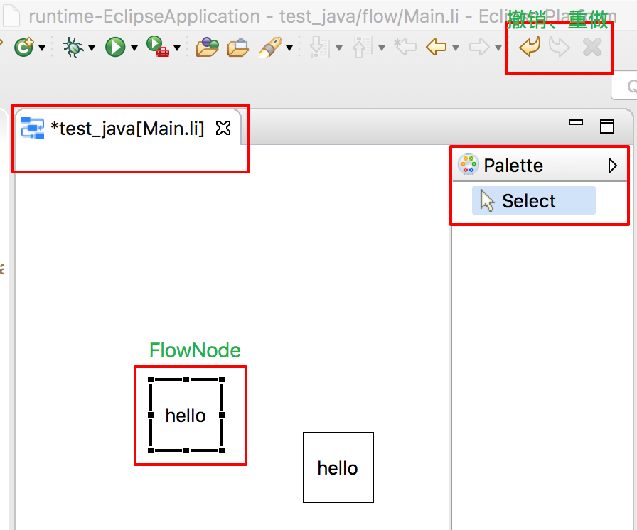
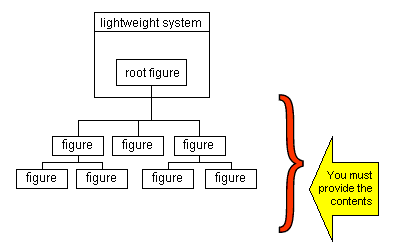

## 安装软件

1. 下载 eclipse
   在[官方链接](https://www.eclipse.org/downloads/packages/)下载合适的版本，我选择的版本为
   [oxygen 3a](https://www.eclipse.org/downloads/packages/release/oxygen/3a)
2. 安装插件
   [wiki](http://wiki.eclipse.org/Eclipse_Project_Update_Sites)上维护了最新的官方插件地址，选择你的 eclipse 对应版本的插件地址，例如[4.7](http://download.eclipse.org/eclipse/updates/4.7)
   在 eclipse 中点击`Help` -> `Install New Software`
   

## 概念

eclipse 工具区由多个部件组成，包括 menu bar，tool bar 等
他们的组成结构如下所示

eclipse 中工具区示例


[扩展点](https://www.vogella.com/tutorials/EclipseExtensionPoint/article.html)
常用

- `org.eclipse.u.views`- add a view
- `org.eclipse.ui.viewActions` - add an action under a view
- `org.eclipse.ui.editors` - allows a user to edit an object(e.g. file), it is like a view, but can be opened multiple times.
- `org.eclipse.ui.editorActions` - add action under an editor
- `org.eclipse.ui.popupMenus` - add a popup menu. A popup menu is a memu shown by right-clicking. There are two types, one is popup for an object, the other is for popup in editor.
- `org.eclipse.ui.actionSets` - use for adding menus, menu items, and tool bar items to the workbench menus and toolbar.
- `org.eclipse.ui.commands` - declaration of a behaviour by id, then other plugins can use the command. It allows "define once, use everywhere".
- `org.eclipse.ui.menus` - can associate with a command and place the command in the main menu, view dropdown menus, context menus, main toolbar, view toolbars, and various trim locations.
- `org.eclipse.ui.handlers` - define handler for a command
- `org.eclipse.ui.bindings` - bind shortcut key for a command

## 入门实例

1. 新建一个插件工程
   

   
   使用一个唯一 ID

2. 新增一个扩展点
   `MANIFEST.MF`为插件工程的配置文件
   

   
   保存后会生成`build.xml`文件，编辑该文件，在扩展点`org.eclipse.ui.perspectives`下，增加`perspective`布局

3. 编辑扩展点

   ```xml
   <?xml version="1.0" encoding="UTF-8"?>
   <?eclipse version="3.4"?>
   <plugin>
      <extension
            point="org.eclipse.ui.perspectives">
         <perspective
               class="com.leaderli.helloworld.PerspectiveFactory"
               id="com.leaderli.HelloWoldPerspective"
               icon="icon/workflow.png"
               name="hello">
         </perspective>
      </extension>

   </plugin>
   ```

   - name 为透视图的名称
   - icon 为透视图的图标，其值为项目路径下的文件

4. 透视图增加窗口
   增加扩展点`org.eclipse.ui.perspectiveExtensions`，并编辑扩展点

   ```xml
   <extension
      point="org.eclipse.ui.perspectiveExtensions">
      <perspectiveExtension targetID="com.leaderli.HelloWoldPerspective">
      <view
         id="org.eclipse.jdt.ui.PackageExplorer"
         minimized="false"
         moveable="false"
         ratio="0.5"
         relationship="left"
         relative="org.eclipse.ui.console.ConsoleView"
         visible="true">
      </view>
      <view
         id="org.eclipse.ui.console.ConsoleView"
         minimized="false"
         moveable="false"
         ratio="0.5"
         relationship="right"
         relative="org.eclipse.jdt.ui.PackageExplorer"
         visible="true">
      </view>
      </perspectiveExtension>
   </extension>
   ```

5. 启动
   
   
   我们可以看到生成了 hello 透视图，且透视图下有 console 窗口和资源窗口

## perspective

透视图是一个包含一系列视图和内容编辑器的可视容器。默认的透视图叫 java。透视图的布局可[自定义](https://www.runoob.com/eclipse/eclipse-perspectives.html)修改

[在插件中定义一个透视图，并定义一些布局](https://www.programcreek.com/2013/02/eclipse-plug-in-development-creat-a-perspective/)

## wizard

可能需要的依赖

```txt
org.eclipse.ui,
org.eclipse.core.runtime,
org.eclipse.ui.workbench,
org.eclipse.ui.ide;bundle-version="3.13.1",
org.eclipse.core.resources,
org.eclipse.jdt;bundle-version="3.13.4",
org.eclipse.jdt.core;bundle-version="3.13.102"
```

在 eclipse 中，wizard 一般用作新建文件、导入、导出的向导程序。

增加扩展点`org.eclipse.ui.newWizards`,并编辑扩展点

```xml
<extension
         point="org.eclipse.ui.newWizards">
      <category
            id="com.leaderli.li.flow.category"
            name="li flow">
      </category>
      <wizard
            category="com.leaderli.li.flow.category"
            class="com.leaderli.li.flow.wizard.CreateFlowWizard"
            icon="icon/flow.png"
            id="com.leaderli.li.flow.createFlowWizard"
            name="flow">
      </wizard>
</extension>
```

则在我们新建文件时，就可以看到如下选项



```java
package com.leaderli.li.flow.wizard;

import java.io.ByteArrayInputStream;

import org.eclipse.core.resources.IFile;
import org.eclipse.core.resources.IFolder;
import org.eclipse.core.resources.IProject;
import org.eclipse.core.resources.IResource;
import org.eclipse.core.runtime.CoreException;
import org.eclipse.core.runtime.IStatus;
import org.eclipse.jdt.core.IJavaProject;
import org.eclipse.jdt.core.JavaConventions;
import org.eclipse.jface.dialogs.IMessageProvider;
import org.eclipse.jface.viewers.IStructuredSelection;
import org.eclipse.jface.wizard.Wizard;
import org.eclipse.jface.wizard.WizardPage;
import org.eclipse.swt.SWT;
import org.eclipse.swt.layout.GridData;
import org.eclipse.swt.layout.GridLayout;
import org.eclipse.swt.widgets.Composite;
import org.eclipse.swt.widgets.Label;
import org.eclipse.swt.widgets.Text;
import org.eclipse.ui.INewWizard;
import org.eclipse.ui.IWorkbench;
import org.eclipse.ui.IWorkbenchPage;
import org.eclipse.ui.PartInitException;
import org.eclipse.ui.PlatformUI;
import org.eclipse.ui.ide.IDE;

public class CreateFlowWizard extends Wizard implements INewWizard {
 IWorkbench workbench;
 IStructuredSelection selection;
 IProject project;
 IFolder flowFolder;
 private static final String FLOW_EXTENSION = "li";
 private static final String FLOW_FLODER = "flow";

 public CreateFlowWizard() {
  setWindowTitle("New Flow");
 }

 /**
  * wizard可能有多个操作页面，当点击next时会调用getNextPage方法来返回下一个操作页面。
  *
  */
 @Override
 public void addPages() {
  project = getProjectFromSelection(selection);
  //未选中项目时，禁止一切操作，并提示相关信息
  if (project == null) {
   addPage(new ErrorMessageWizardPage());
  } else {
   flowFolder = getFlowFolder();
   addPage(new NewFlowWizardPage());
  }
 }
 /**
  * 是否禁用next和previous按钮
  */
 @Override
 public boolean needsPreviousAndNextButtons() {
  return false;
 }

 private IProject getProjectFromSelection(IStructuredSelection selection) {
  IProject result = null;
  if (selection.size() == 1) {
   final Object firstSelectionElement = selection.getFirstElement();
   if (firstSelectionElement instanceof IJavaProject) {
    final IJavaProject javaProject = (IJavaProject) firstSelectionElement;
    result = javaProject.getProject();
   } else if (firstSelectionElement instanceof IResource) {
    IResource resource = (IResource) firstSelectionElement;
    return resource.getProject();
   }
  }
  return result;
 }

 private IFolder getFlowFolder() {
  IFolder flowFolder = project.getFolder(FLOW_FLODER);
  if (!flowFolder.exists()) {
   try {
    flowFolder.create(false, true, null);
   } catch (CoreException e) {
    e.printStackTrace();
   }
  }
  return flowFolder;
 }

 private IFile getFlowFile(String fileName) {
  return flowFolder.getFile(fileName+"."+FLOW_EXTENSION);
 }

 private String getFileContent(String fileName) {
  String content = "<li></li>";
  return content;
 }

 /**
  * 当点击finish按钮时，生成新建的文件
  */
 @Override
 public boolean performFinish() {
   String fileName = getNamePage().flowName.getText();
  IFile file = getFlowFile(fileName);
  try {
   String content = getFileContent(fileName);
   file.create(new ByteArrayInputStream(content.getBytes()), false, null);
  } catch (CoreException e) {
   e.printStackTrace();
  }
  IWorkbenchPage page = PlatformUI.getWorkbench().getActiveWorkbenchWindow().getActivePage();

  try {
   IDE.openEditor(page, file);
  } catch (PartInitException e) {
   e.printStackTrace();
  }
  return true;
 }

 private NewFlowWizardPage getNamePage() {
  return (NewFlowWizardPage) getPage(NewFlowWizardPage.PAGE_NAME);

 }

 @Override
 public void init(IWorkbench workbench, IStructuredSelection selection) {
  this.workbench = workbench;
  this.selection = selection;
 }

 private class ErrorMessageWizardPage extends WizardPage {
  public static final String PAGE_NAME = "ErrorMessageWizardPage";

  protected ErrorMessageWizardPage() {
   super(PAGE_NAME, "Create a new flow", null);
  }

  @Override
  public void createControl(Composite parent) {
   setControl(parent);
   this.setMessage("must select a project", IMessageProvider.ERROR);
   setPageComplete(false);
  }

 }

 private class NewFlowWizardPage extends WizardPage {
  public static final String PAGE_NAME = "NewFlowWizardPage";

  private Text flowName;

  /**
   * 校验当前页面是否操作完毕，进行下一步操作
   */
  private void checkComplete() {
   setPageComplete(false);
   String fileName = flowName.getText();
   if(fileName.length() ==0) {
    this.setMessage("A flow name cannot be empty", IMessageProvider.WARNING);
    return;
   }
   //判断命名是否符合java类名规范
   IStatus iStatus = JavaConventions.validateJavaTypeName(fileName,"1.8","1.8");
   if(iStatus .getSeverity()!=0) {
    this.setMessage(iStatus.getMessage(),IMessageProvider.ERROR);
    return;

   }
   if(getFlowFile(fileName).exists()) {
    this.setMessage("A flow named "+fileName+" already exists", IMessageProvider.ERROR);
    return;
   }else {
    this.setMessage("Create a new flow named "+fileName);
    setPageComplete(true);
   }

  }


  protected NewFlowWizardPage() {
   super(PAGE_NAME, "Create a new flow", null);
  }

  /**
   * 绘制操作页面
   */

  @Override
  public void createControl(Composite parent) {

   Composite composite = new Composite(parent, SWT.NORMAL);
   setControl(composite);
   composite.setLayout(new GridLayout(2, false));

   new Label(composite, SWT.NORMAL).setText("Name:");
   flowName = new Text(composite, SWT.SINGLE | SWT.BORDER);
   flowName.setLayoutData(new GridData(SWT.FILL, SWT.CENTER, true, false));
   flowName.addModifyListener(e -> {
    checkComplete();
   });
   checkComplete();
  }
 }
}

```

实现的 wizard 页面如下



## 一个图形化编辑器

新增扩展点`org.eclipse.ui.editors`，并编辑

```xml
<extension
      point="org.eclipse.ui.editors">
   <editor
         class="com.leaderli.li.flow.editor.FlowEditor"
         contributorClass="com.leaderli.li.flow.editor.FlowEditorContributor"
         default="false"
         extensions="li"
         icon="icon/flow.png"
         id="com.leaderli.li.flow.flowEditor"
         name="flow editor">
   </editor>
</extension>
```

定义编辑器的基本行为

```java
package com.leaderli.li.flow.editor;

import java.util.EventObject;

import org.eclipse.core.resources.IFile;
import org.eclipse.core.runtime.Assert;
import org.eclipse.core.runtime.IProgressMonitor;
import org.eclipse.gef.DefaultEditDomain;
import org.eclipse.gef.EditPart;
import org.eclipse.gef.EditPartFactory;
import org.eclipse.gef.dnd.TemplateTransferDragSourceListener;
import org.eclipse.gef.dnd.TemplateTransferDropTargetListener;
import org.eclipse.gef.palette.PaletteRoot;
import org.eclipse.gef.ui.parts.GraphicalEditorWithFlyoutPalette;
import org.eclipse.ui.IEditorInput;
import org.eclipse.ui.IEditorSite;
import org.eclipse.ui.IFileEditorInput;
import org.eclipse.ui.PartInitException;

import com.leaderli.li.flow.model.BaseModel;
import com.leaderli.li.flow.model.FlowDiagram;
import com.leaderli.li.flow.palette.FlowEditorPaletteRoot;

/**
 *
 * 编辑器的入口
 *
 */
public class FlowEditor extends GraphicalEditorWithFlyoutPalette {

 public FlowEditor() {
  setEditDomain(new DefaultEditDomain(this));
 }

 /**
  * 定义Palette工具栏组件
  */
 @Override
 protected PaletteRoot getPaletteRoot() {
  return new FlowEditorPaletteRoot();
 }
 /**
  * 保存文件时的回调函数
  */
 @Override
 public void doSave(IProgressMonitor monitor) {
  /**
   * 可以将未保存状态的*号移除
   */
  getCommandStack().markSaveLocation();

 }

 /**
  * 当使用编辑器编辑文件时执行相关命令，跟根据isDity判断是否需要将文件的标题上加*，表示该文件变动未保存
  */
 @Override
 public void commandStackChanged(EventObject event) {
  firePropertyChange(PROP_DIRTY);
  super.commandStackChanged(event);
 }


 @Override
 public void init(IEditorSite site, IEditorInput editorInput) throws PartInitException {

  Assert.isTrue(editorInput instanceof IFileEditorInput,"Invalid Input: Must be IFileEditorInput");

  super.init(site, editorInput);
  //编辑器的标题
  this.setPartName(editorInput);
 }

 private void setPartName(IEditorInput editorInput) {
  //获取打开的文件
  IFile inputFile = ((IFileEditorInput) editorInput).getFile();
  //拼接 项目名和文件名
  String title = inputFile.getProject().getName() + "[" + inputFile.getName() + "]";
  this.setPartName(title);
 }

 @Override
 protected void initializeGraphicalViewer() {
  super.initializeGraphicalViewer();
  /**
   * 设定编辑器编辑的文件内容,FlowDiagram为一个model，setContents接收一个model时，
   * 会根据EditPartFactory找到对应的EditPart来处理
   */
  getGraphicalViewer().setContents(new FlowDiagram());
 }

 @Override
 protected void configureGraphicalViewer() {

  super.configureGraphicalViewer();

  getGraphicalViewer().setEditPartFactory(new EditPartFactory() {
   @Override
   public EditPart createEditPart(EditPart context, Object model) {
    /**
     * 一般情况下，根据model的类型来使用不同的EditPart处理器
     * 这里，我们抽象一个统一接口BaseModel，让各个model自己决定使用哪个处理器
     */
    Assert.isTrue(model instanceof BaseModel,"Only support type extends BaseModel");
    EditPart editPart = ((BaseModel)model).getEditPart();
    editPart.setModel(model);
    return editPart;
   }
  });
  getGraphicalViewer().addDropTargetListener(new TemplateTransferDropTargetListener(getGraphicalViewer()));
  getEditDomain().getPaletteViewer()
    .addDragSourceListener(new TemplateTransferDragSourceListener(getEditDomain().getPaletteViewer()));
 }
}

```

定义一些编辑器的默认操作,若撤销，重做，全选，删除等

```java
package com.leaderli.li.flow.editor;

import org.eclipse.gef.ui.actions.ActionBarContributor;
import org.eclipse.gef.ui.actions.DeleteRetargetAction;
import org.eclipse.gef.ui.actions.RedoRetargetAction;
import org.eclipse.gef.ui.actions.UndoRetargetAction;
import org.eclipse.jface.action.IToolBarManager;
import org.eclipse.ui.actions.ActionFactory;

public class FlowEditorContributor extends ActionBarContributor {

  @Override
  protected void buildActions() {
    addRetargetAction(new UndoRetargetAction());
    addRetargetAction(new RedoRetargetAction());
    addRetargetAction(new DeleteRetargetAction());

  }

  @Override
  public void contributeToToolBar(IToolBarManager toolBarManager) {
    super.contributeToToolBar(toolBarManager);
    toolBarManager.add(getAction(ActionFactory.UNDO.getId()));
    toolBarManager.add(getAction(ActionFactory.REDO.getId()));
    toolBarManager.add(getAction(ActionFactory.DELETE.getId()));

  }

  @Override
  protected void declareGlobalActionKeys() {
    addGlobalActionKey(ActionFactory.SELECT_ALL.getId());
  }

}
```

编辑器的内容`FlowDiagram`，以及其对应的`EditPart`处理器

```java
/**
 * 接口
 */
public abstract class BaseModel {
 public abstract EditPart getEditPart();

}


package com.leaderli.li.flow.model;

import java.util.ArrayList;
import java.util.List;

import org.eclipse.draw2d.FreeformLayer;
import org.eclipse.draw2d.FreeformLayout;
import org.eclipse.draw2d.GroupBoxBorder;
import org.eclipse.draw2d.IFigure;
import org.eclipse.draw2d.MarginBorder;
import org.eclipse.draw2d.geometry.Rectangle;
import org.eclipse.gef.EditPart;
import org.eclipse.gef.EditPolicy;
import org.eclipse.gef.editparts.AbstractGraphicalEditPart;

import com.leaderli.li.flow.policy.FlowDiagramXYLayoutPolicy;

public class FlowDiagram extends BaseModel {

 @Override
 public EditPart getEditPart() {
  return new FlowDiagramEditPart();
 }


}

class FlowDiagramEditPart extends AbstractGraphicalEditPart {

 @Override
 protected IFigure createFigure() {
  //定义一个基本的画布
  FreeformLayer layer = new FreeformLayer();
  layer.setBorder(new GroupBoxBorder("Diagram"));
  layer.setLayoutManager(new FreeformLayout());
  layer.setBorder(new MarginBorder(5));
  layer.setOpaque(false);
  return layer;
 }


 @Override
 protected void createEditPolicies() {
  //关于布局的处理策略
     installEditPolicy(EditPolicy.LAYOUT_ROLE, new FlowDiagramXYLayoutPolicy());
 }


 @Override
 public List<BaseModel> getModelChildren() {
  //画布的子元素，这里模拟两个节点
  System.out.println("getChildren:");
  List<BaseModel> child = new ArrayList<>();
  FlowNode flowNode = new FlowNode();
  flowNode.setConstraints(new Rectangle(100,100,50,50));
  child.add(flowNode);

  flowNode = new FlowNode();
  flowNode.setConstraints(new Rectangle(200,200,50,50));
  child.add(flowNode);
  return child;
 }

}
```

`FlowDiagram`的编辑策略类

```java
package com.leaderli.li.flow.policy;

import org.eclipse.draw2d.geometry.Rectangle;
import org.eclipse.gef.EditPart;
import org.eclipse.gef.commands.Command;
import org.eclipse.gef.editpolicies.XYLayoutEditPolicy;
import org.eclipse.gef.requests.CreateRequest;

import com.leaderli.li.flow.command.NodeChangeConstraintCommand;
import com.leaderli.li.flow.model.BaseNode;

public class FlowDiagramXYLayoutPolicy extends XYLayoutEditPolicy {

 @Override
 protected Command createChangeConstraintCommand(EditPart child, Object constraint) {
  /**
   * 当拖拽移动时会创建一个关于改变位置和大小的命令，拖拽结束时执行command的execute方法，在execute中更新model的坐标和大小
   */
  NodeChangeConstraintCommand command = new NodeChangeConstraintCommand();
  command.setNode((BaseNode) child.getModel());
  command.setNewConstraint((Rectangle) constraint);
  return command;
 }
}

/**
 *  移动命令
 */
package com.leaderli.li.flow.command;

import org.eclipse.draw2d.geometry.Rectangle;
import org.eclipse.gef.commands.Command;

import com.leaderli.li.flow.model.BaseNode;

public class NodeChangeConstraintCommand extends Command {

  private Rectangle oldConstraint;
  private Rectangle newConstraint;
  private BaseNode model;

  @Override public void execute() {
    if(oldConstraint == null) {
      oldConstraint = model.getConstraints();
    }
    model.setConstraints(newConstraint);

  }

  @Override public void undo() {
    model.setConstraints(oldConstraint);
  }

  public void setNode(BaseNode model) {
    this.model = model;
  }

  public void setNewConstraint(Rectangle newConstraint) {
    this.newConstraint = newConstraint;
  }
}
```

画布操作的是子元素，我们看下我们给的示例节点`FlowNode`

```java

/**
 * 抽象类
 */
package com.leaderli.li.flow.model;

import org.eclipse.draw2d.geometry.Rectangle;
import org.eclipse.emf.common.notify.Adapter;

public abstract class BaseNode extends BaseModel {

 private Rectangle rectangle;
 private Adapter Adapter;

 public Rectangle getConstraints() {
  return this.rectangle;
 }

 public void setConstraints(Rectangle rectangle) {
  this.rectangle = rectangle;
  if (this.Adapter != null) {
   //当修改坐标时，需要通知画布，重新绘制
   this.Adapter.notifyChanged(null);
  }
 }

 public void addAdapter(Adapter adapter) {
  this.Adapter = adapter;

 }

}

/**
 * 节点图形
 */
package com.leaderli.li.flow.figure;

import org.eclipse.draw2d.Figure;
import org.eclipse.draw2d.Graphics;
import org.eclipse.draw2d.Label;
import org.eclipse.draw2d.RectangleFigure;
import org.eclipse.draw2d.XYLayout;
import org.eclipse.draw2d.geometry.Dimension;
import org.eclipse.draw2d.geometry.Rectangle;

public class FlowNodeFigure extends Figure {

 private Label label;
 private RectangleFigure rectangle;

 public FlowNodeFigure() {
  setLayoutManager(new XYLayout());
  rectangle = new RectangleFigure();
  add(rectangle);
  label = new Label();
  label.setText("hello");
  add(label);
 }

 @Override
 protected void paintFigure(Graphics graphics) {
  Rectangle r = getBounds().getCopy();
  setConstraint(rectangle, new Rectangle(0, 0, r.width, r.height));
  setConstraint(label, new Rectangle(0, 0, r.width, r.height));
 }

 /**
  * 根据文字计算图形的大小
  */
 @Override
 public Dimension getPreferredSize(int wHint, int hHint) {
  Dimension d = new Dimension();
  Rectangle textRectangle = label.getTextBounds().getCopy();
  d.width = textRectangle.width;
  d.height = textRectangle.height;
  return d;
 }
}


package com.leaderli.li.flow.model;

import org.eclipse.draw2d.Figure;
import org.eclipse.draw2d.IFigure;
import org.eclipse.emf.common.notify.Adapter;
import org.eclipse.emf.common.notify.Notification;
import org.eclipse.emf.common.notify.Notifier;
import org.eclipse.gef.EditPart;
import org.eclipse.gef.EditPolicy;
import org.eclipse.gef.editparts.AbstractGraphicalEditPart;

import com.leaderli.li.flow.figure.FlowNodeFigure;
import com.leaderli.li.flow.policy.BaseNodeComponentEditPolicy;

public class FlowNode extends BaseNode {

 @Override
 public EditPart getEditPart() {
  return new FlowNodeEditPart();
 }

}

class FlowNodeEditPart extends AbstractGraphicalEditPart {

 FlowNodeAdapter adapter;

 FlowNodeEditPart() {
  adapter = new FlowNodeAdapter();
 }

 @Override
 protected IFigure createFigure() {
  return new FlowNodeFigure();
 }

 @Override
 protected void createEditPolicies() {
  installEditPolicy(EditPolicy.COMPONENT_ROLE, new BaseNodeComponentEditPolicy());

 }

 @Override
 protected void refreshVisuals() {
  // 获取当前的图形以及model,并根据model中的坐标和大小，在画布上绘制
  Figure figure = (Figure) getFigure();
  BaseNode model = (BaseNode) getModel();
  AbstractGraphicalEditPart parent = (AbstractGraphicalEditPart) getParent();
  parent.setLayoutConstraint(this, figure, model.getConstraints());
  super.refreshVisuals();
 }

 /**
  * 元素绘制时触发
  */
 @Override
 public void activate() {
  if (!isActive()) {
   ((BaseNode) getModel()).addAdapter(adapter);
  }
  super.activate();
 }

 /**
  * 元素销毁时触发
  */
 @Override
 public void deactivate() {
  super.deactivate();
 }

 public class FlowNodeAdapter implements Adapter {
  /**
   * model更新坐标时调用该方法，因为其属于内部类，可直接调用外部类的refreshVisuals方法，从而达到重新绘制该元素的效果
   */
  @Override
  public void notifyChanged(Notification notification) {
   refreshVisuals();
  }

  @Override
  public Notifier getTarget() {
   return null;
  }

  @Override
  public void setTarget(Notifier newTarget) {
  }

  @Override
  public boolean isAdapterForType(Object type) {
   return false;
  }
 }

}

```

palette 工具栏

```java
package com.leaderli.li.flow.palette;

import org.eclipse.gef.palette.PaletteGroup;
import org.eclipse.gef.palette.PaletteRoot;
import org.eclipse.gef.palette.SelectionToolEntry;

public class FlowEditorPaletteRoot extends PaletteRoot{

    PaletteGroup group;
    public FlowEditorPaletteRoot(){
        addGroup();
        addSelectionTool();
    }
    private void addSelectionTool() {
        SelectionToolEntry entry = new SelectionToolEntry();
        group.add(entry);
        setDefaultEntry(entry);
    }
    private void addGroup() {
        group = new PaletteGroup("OPM Controls");
        add(group);
    }
}
```

其最终效果如下



## 读取与保存

我们使用 json 来作为图形化界面的模型的数据保存格式，首先设计相关的 model 类，省略 set get 方法

```java
package com.leaderli.li.flow.editor.model;
import org.eclipse.emf.common.notify.Adapter;

public class Node {
   /**
   * transient防止序列化
   */
 private transient List<Adapter> adapters =new ArrayList<>();
   private int id;

   public void addAdapter(Adapter adapter) {
   this.adapters.add (adapter);
   }
   public void removeAdapter(Adapter adapter) {
   this.adapters.remove(adapter);
   }

   public void notifyChanged() {
   this.adapters.forEach(adapter->adapter.notifyChanged(null));
   }
}


package com.leaderli.li.flow.editor.model;
import java.util.List;

public class FlowNode extends Node{

   private String type;
   private String name;
   private String flowName;
   private String icon;
   private List<GotoNode> gotoNodes;
   private Point point;

   public void setPoint(Point point) {
   this.point = point;
   //更新坐标时，通知editpart刷新视图
   this.notifyChanged();
   }


}


package com.leaderli.li.flow.editor.model;

public class ConnectionNode extends Node {

   private int sourceID;
   private int targetID;
}

package com.leaderli.li.flow.editor.model;
import java.util.List;

public class FlowDiagram {

   private int nextNodeID;
   private List<FlowNode> flowNodes;
   private List<ConnectionNode> connectionNodes;

   public int generateNextNodeID() {
   return this.nextNodeID++;
   }
}

```

在`FlowEditor`中，读取与保存的部分代码如下

```java
/**
  * 保存文件时的回调函数
  */
 @Override
 public void doSave(IProgressMonitor monitor) {
  /**
   * 可以将未保存状态的*号移除
   */
  getCommandStack().markSaveLocation();

  IFile iFile = ((IFileEditorInput)getEditorInput()).getFile();
  Object model  = this.getGraphicalViewer().getContents().getModel();
  InputStream stream = new ByteArrayInputStream(GsonUtil.toJson(model).getBytes());
  try {
   iFile.setContents(stream, true,true, monitor);
  } catch (CoreException e) {
   e.printStackTrace();
  }

 }

  @Override
 protected void initializeGraphicalViewer() {
  super.initializeGraphicalViewer();
  /**
   * 设定编辑器编辑的文件内容,FlowDiagram为一个model，setContents接收一个model时，
   * 会根据EditPartFactory找到对应的EditPart来处理
   */

  IFile iFile = ((IFileEditorInput)getEditorInput()).getFile();
  getGraphicalViewer().setContents(loadInputFile(iFile));
 }

 private FlowDiagram loadInputFile(IFile file) {

  FlowDiagram flowDiagram=null;
  try {
   flowDiagram = GsonUtil.fromJson(file.getContents(),FlowDiagram.class);
  } catch (CoreException e) {
   e.printStackTrace();
  }
  return flowDiagram;
 }
```

示例的一个`my.li`文件内容如下

```json
{
	"nextNodeID": 6,
	"flowNodes": [
		{
			"type": "servlet",
			"name": "fuck",
			"gotoNodes": [
				{
					"linkedConnectionNode": 2,
					"name": "default",
					"id": 4
				}
			],
			"point": {
				"x": 100,
				"y": 100
			},
			"id": 0
		},
		{
			"type": "servlet",
			"name": "fuck2",
			"gotoNodes": [
				{
					"linkedConnectionNode": 3,
					"name": "default",
					"id": 5
				}
			],
			"point": {
				"x": 371,
				"y": 345
			},
			"id": 1
		}
	],
	"connectionNodes": [
		{
			"sourceID": 4,
			"targetID": 1,
			"id": 2
		},
		{
			"sourceID": 5,
			"targetID": 0,
			"id": 3
		}
	]
}
```

## 一个复杂的图元

Draw2d 框架的一些简单介绍

图形的组成


`FLowDiagram`这个模型对应的`EditPart`中通过调用`createFigure`来绘画出图形编辑器的画布

```java
package com.leaderli.li.flow.editor.part;

import java.util.List;
import org.eclipse.draw2d.FreeformLayer;
import org.eclipse.draw2d.FreeformLayout;
import org.eclipse.draw2d.GroupBoxBorder;
import org.eclipse.draw2d.IFigure;
import org.eclipse.draw2d.MarginBorder;
import org.eclipse.gef.EditPolicy;
import com.leaderli.li.flow.editor.model.FlowDiagram;
import com.leaderli.li.flow.editor.model.Node;
import com.leaderli.li.flow.policy.FlowDiagramXYLayoutPolicy;

public class FlowDiagramEditPart extends GenericsEditPart<FlowDiagram> {

   @Override
   protected IFigure createFigure() {
      //定义一个基本的画布
      FreeformLayer layer = new FreeformLayer();
      layer.setBorder(new GroupBoxBorder("Diagram"));
      layer.setLayoutManager(new FreeformLayout());
      layer.setBorder(new MarginBorder(5));
      layer.setOpaque(false);
      return layer;
   }


   @Override
   protected void createEditPolicies() {
   //关于布局的处理策略
      installEditPolicy(EditPolicy.LAYOUT_ROLE, new FlowDiagramXYLayoutPolicy());
   }


  /**
   * 子Figure的model对象
   */
   @Override
   public List<? extends Node> getModelChildren() {
      return getModel().getFlowNodes();
   }


   /**
   * 返回子Figure的父Figure，默认返回createFigure创建的Figure
   */
   @Override
   public IFigure getContentPane() {
      return super.getContentPane();
   }
}

```

当我们向创建如下的图元


我们需要定义好图元的结构，对于线条来说，首先线条的连接是基于 figure 的，线条有两个端，`source`和`target`，`editpart`中的方法`getModelSourceConnections`和`getModelTargetConnections`方法分别是代表连线中有 source 端点在 figure 上的线条，和连线中有 target 端点在 figure 上的线条，而线条的端点必定落在某个 figure 上`getSourceConnectionAnchor`和`getTargetConnectionAnchor`方法就指定了具体使用的锚点细节。

```java

package com.leaderli.li.flow.editor.part;

import org.eclipse.gef.editparts.AbstractGraphicalEditPart;

//泛型类，方便使用
public abstract class GenericsEditPart<T> extends AbstractGraphicalEditPart {

   @SuppressWarnings("unchecked")
   @Override
   public T getModel() {
       return (T) super.getModel();
   }

}

package com.leaderli.li.flow.util;

import org.eclipse.draw2d.ChopboxAnchor;
import org.eclipse.draw2d.IFigure;
import org.eclipse.draw2d.geometry.Dimension;
import org.eclipse.draw2d.geometry.Rectangle;

//线条端点的位置
public class ExtendedChopboxAnchor extends ChopboxAnchor {
    private static final Dimension EMPTY_DIMENSION = new Dimension(0, 0);
    private int position = 0;

    public ExtendedChopboxAnchor(IFigure owner, int position) {
        super(owner);
        this.position = position;
    }

    protected Rectangle getBox() {
        Rectangle box = super.getBox();
        switch (getPosition()) {
            case 1:
                return new Rectangle(box.getTop(), EMPTY_DIMENSION);
            case 4:
                return new Rectangle(box.getBottom(), EMPTY_DIMENSION);
            case 8:
                return new Rectangle(box.getLeft(), EMPTY_DIMENSION);
            case 9:
                return new Rectangle(box.getTopLeft(), EMPTY_DIMENSION);
            case 12:
                return new Rectangle(box.getBottomLeft(), EMPTY_DIMENSION);
            case 16:
                return new Rectangle(box.getRight(), EMPTY_DIMENSION);
            case 17:
                return new Rectangle(box.getTopRight(), EMPTY_DIMENSION);
            case 20:
                return new Rectangle(box.getBottomRight(), EMPTY_DIMENSION);
            default:
                return box;
        }
    }

    public int getPosition() {
        return this.position;
    }
}


package com.leaderli.li.flow.editor.part;

import java.util.List;
import java.util.Random;
import java.util.stream.Collectors;

import org.eclipse.core.runtime.Assert;
import org.eclipse.draw2d.ConnectionAnchor;
import org.eclipse.draw2d.Figure;
import org.eclipse.draw2d.FlowLayout;
import org.eclipse.draw2d.IFigure;
import org.eclipse.draw2d.Label;
import org.eclipse.draw2d.OrderedLayout;
import org.eclipse.draw2d.geometry.Rectangle;
import org.eclipse.emf.common.notify.Adapter;
import org.eclipse.emf.common.notify.Notification;
import org.eclipse.emf.common.notify.Notifier;
import org.eclipse.gef.ConnectionEditPart;
import org.eclipse.gef.EditPolicy;
import org.eclipse.gef.NodeEditPart;
import org.eclipse.gef.Request;
import org.eclipse.gef.editparts.AbstractGraphicalEditPart;

import com.leaderli.li.flow.editor.model.ConnectionNode;
import com.leaderli.li.flow.editor.model.FlowNode;
import com.leaderli.li.flow.editor.model.GotoNode;
import com.leaderli.li.flow.editor.model.Point;
import com.leaderli.li.flow.policy.BaseNodeComponentEditPolicy;
import com.leaderli.li.flow.util.ExtendedChopboxAnchor;
import com.leaderli.li.flow.util.ImageUtil;

class FlowNodeEditPart extends GenericsEditPart<FlowNode> implements NodeEditPart {

   FlowNodeAdapter adapter;

   private IFigure flowNodeFigure;
   /**
   *  左边箭头
   */
   private IFigure inputTerminal;
   /**
   * 图元名称
   */
   private IFigure nodeLabel;
   /**
   * 图元图标
   */
   private IFigure nodeIcon;
   /**
   * 右边图元出口作为一个复合组件，使其可以动态的删减出口
   */
   private IFigure contentPane;
   /**
   * 图元名称和图元图标组合一起的父figure
   */
   private Figure imglabel;

   FlowNodeEditPart() {
   adapter = new FlowNodeAdapter();
   }

   private IFigure getInputFigure() {

   if (this.inputTerminal == null) {
      this.inputTerminal = createInputFigure();
   }
   return inputTerminal;
   }

   private IFigure createInputFigure() {

   Assert.isTrue(this.inputTerminal == null);
   this.inputTerminal = new Label(ImageUtil.getImage("inputleft.gif"));
   return this.inputTerminal;
   }

   public IFigure getContentFigure() {

   if (this.contentPane == null) {
      this.contentPane = new Figure();
      FlowLayout layout = new FlowLayout(false);
      layout.setMinorAlignment(OrderedLayout.ALIGN_TOPLEFT);
      this.contentPane.setLayoutManager(layout);
   }
   return this.contentPane;
   }

   public IFigure getFlowNodeFigure() {
   if (flowNodeFigure != null) {
      return flowNodeFigure;
   }
   flowNodeFigure = new Figure();
   FlowLayout layout;

   IFigure input = this.getInputFigure();

   this.nodeIcon = new Label(ImageUtil.getImage("servlet.gif"));

   this.nodeLabel = new Label("hello" + new Random().nextInt(100));

   Figure images = new Figure();
   layout = new FlowLayout(true);
   layout.setMinorAlignment(0);
   layout.setMinorSpacing(1);

   images.setLayoutManager(layout);
   if (input != null) {
      images.add(input);
   }
   images.add(this.nodeIcon);
   images.add(new Label(ImageUtil.getImage("breakpointempty.gif")));

   imglabel = new Figure();
   layout = new FlowLayout(false);
   layout.setMajorAlignment(0);
   layout.setMinorSpacing(0);
   imglabel.setLayoutManager(layout);

   imglabel.add(images);
   imglabel.add(this.nodeLabel);

   this.contentPane = getContentFigure();

   flowNodeFigure.setLayoutManager(new FlowLayout(true));
   flowNodeFigure.add(imglabel);
   flowNodeFigure.add(this.contentPane);
   //鼠标悬停的提示
   flowNodeFigure.setToolTip(new Label("toolTip"));
   return flowNodeFigure;
   }

   @Override
   protected IFigure createFigure() {
   return getFlowNodeFigure();
   }

   @Override
   protected List<GotoNode> getModelChildren() {
   return getModel().getGotoNodes();

   }
   /**
   * 子模块对应的figure的父figure，这里指定使用gotoNode的位置
   */
   @Override
   public IFigure getContentPane() {
   return getContentFigure();
   }

   @Override
   protected void createEditPolicies() {
   installEditPolicy(EditPolicy.COMPONENT_ROLE, new BaseNodeComponentEditPolicy());

   }

   /**
   * 线条的source端点落在gotoNode上，这里不需要指定
   */
   @Override
   protected List<ConnectionNode> getModelSourceConnections() {
   return null;
   }
   /**
   * 线条的target端落在inputTerminal图形上，该图形没有model，没有editpart，因此直接在当前editpart去处理
   */
   @Override
   protected List<ConnectionNode> getModelTargetConnections() {
   List<ConnectionNode> connectionNodes = ((FlowDiagramEditPart) getParent()).getModel().getConnectionNodes();
   return connectionNodes.stream().filter(connectionNode -> getModel().getId() == connectionNode.getTargetID())
      .collect(Collectors.toList());
   }

   @Override
   protected void refreshVisuals() {
   // 获取当前的图形以及model,并根据model中的坐标和大小，在画布上绘制
   Figure figure = (Figure) getFigure();
   FlowNode model = getModel();
   AbstractGraphicalEditPart parent = (AbstractGraphicalEditPart) getParent();
   Point point = model.getPoint();
   parent.setLayoutConstraint(this, figure, new Rectangle(point.getX(), point.getY(),-1,-1));
   super.refreshVisuals();
   }


   /**
   * 元素绘制时触发
   */
   @Override
   public void activate() {
   if (!isActive()) {
      getModel().addAdapter(adapter);
   }
   super.activate();
   }

   /**
   * 元素销毁时触发
   */
   @Override
   public void deactivate() {
      if(isActive()) {
      getModel().removeAdapter(adapter);
      }

      super.deactivate();
   }

   public class FlowNodeAdapter implements Adapter {
   /**
      * model更新坐标时调用该方法，因为其属于内部类，可直接调用外部类的refreshVisuals方法，从而达到重新绘制该元素的效果
      */
   @Override
   public void notifyChanged(Notification notification) {
      refreshVisuals();
   }

   @Override
   public Notifier getTarget() {
      return null;
   }

   @Override
   public void setTarget(Notifier newTarget) {
   }

   @Override
   public boolean isAdapterForType(Object type) {
      return false;
   }
   }
   /**
   * 线条source端点不由该editpart来确定
   */
   @Override
   public ConnectionAnchor getSourceConnectionAnchor(Request request) {
   return null;
   }

   @Override
   public ConnectionAnchor getSourceConnectionAnchor(ConnectionEditPart connection) {
   return null;
   }
   /**
   * 线条target端点的样式，需指定figure
   */
   @Override
   public ConnectionAnchor getTargetConnectionAnchor(ConnectionEditPart connection) {
   return new ExtendedChopboxAnchor(getInputFigure(), 8);
   }

   @Override
   public ConnectionAnchor getTargetConnectionAnchor(Request request) {
   return new ExtendedChopboxAnchor(getInputFigure(), 8);
   }

}

```

GotoNodeEditPart 的关于连线的部分代码如下

```java
 @Override
 protected List<ConnectionNode> getModelSourceConnections() {
  List<ConnectionNode> connectionNodes = ((FlowDiagramEditPart) getParent().getParent()).getModel().getConnectionNodes();
  return connectionNodes.stream().filter(connectionNode -> getModel().getId() == connectionNode.getSourceID())
    .collect(Collectors.toList());
   }

 @Override
 public ConnectionAnchor getSourceConnectionAnchor(ConnectionEditPart connection) {
  return new ExtendedChopboxAnchor(getOutputTerminal(),16);

 }
```

线条的 editpart

```java
package com.leaderli.li.flow.editor.part;

import org.eclipse.draw2d.IFigure;
import org.eclipse.draw2d.ManhattanConnectionRouter;
import org.eclipse.draw2d.PolylineConnection;
import org.eclipse.draw2d.PolylineDecoration;
import org.eclipse.emf.common.notify.Adapter;
import org.eclipse.emf.common.notify.Notification;
import org.eclipse.emf.common.notify.Notifier;
import org.eclipse.gef.EditPart;
import org.eclipse.gef.EditPolicy;
import org.eclipse.gef.editparts.AbstractConnectionEditPart;
import org.eclipse.gef.editpolicies.ConnectionEndpointEditPolicy;

import com.leaderli.li.flow.editor.model.Node;

/**
 * {@link EditPart} for the {@link OPMLink} model element.
 *
 * @author vainolo
 */
public class ConnectionNodeEditPart extends AbstractConnectionEditPart {

 private ConnectionNodeAdapter adapter;

 /**
  * Create and initialize a new {@link OPMLinkEditPart}.
  */
 public ConnectionNodeEditPart() {
  super();
  adapter = new ConnectionNodeAdapter();
 }

 @Override
 protected void createEditPolicies() {
  installEditPolicy(EditPolicy.CONNECTION_ENDPOINTS_ROLE, new ConnectionEndpointEditPolicy());
 }

 @Override
 protected IFigure createFigure() {
  PolylineConnection conn = (PolylineConnection) super.createFigure();
  conn.setConnectionRouter(new ManhattanConnectionRouter());
  conn.setTargetDecoration(new PolylineDecoration());
  return conn;
 }

 @Override
 protected void refreshVisuals() {

 }

 @Override
 public void activate() {
  if (!isActive()) {
   ((Node) getModel()).addAdapter(adapter);
  }
  super.activate();
 }

 @Override
 public void deactivate() {

  if (isActive()) {
   ((Node) getModel()).removeAdapter(adapter);
   super.deactivate();
  }
 }

 public class ConnectionNodeAdapter implements Adapter {

  @Override
  public void notifyChanged(Notification notification) {
   refreshVisuals();
  }

  @Override
  public Notifier getTarget() {
   return (Notifier) getModel();
  }

  @Override
  public void setTarget(Notifier newTarget) {
   // Do nothing.
  }

  @Override
  public boolean isAdapterForType(Object type) {
   return false;
  }
 }
}
```

## 移动图元

移动图元分两个部分，一个是更新其模型，一个是重新绘制其在父元素的位置。对于 FlowNode 来说，其父元素为 FlowDiagram，其 EditPolicy 代码如下

```java
package com.leaderli.li.flow.policy;

import org.eclipse.draw2d.geometry.Rectangle;
import org.eclipse.gef.EditPart;
import org.eclipse.gef.commands.Command;
import org.eclipse.gef.editpolicies.XYLayoutEditPolicy;
import org.eclipse.gef.requests.CreateRequest;

import com.leaderli.li.flow.command.FlowNodeChangeConstraintCommand;
import com.leaderli.li.flow.editor.model.FlowNode;
import com.leaderli.li.flow.editor.model.Point;

public class FlowDiagramXYLayoutPolicy extends XYLayoutEditPolicy {

 @Override
 protected Command createChangeConstraintCommand(EditPart child, Object constraint) {
  /**
   * 当拖拽移动时会创建一个关于改变位置和大小的命令，拖拽结束时执行command的execute方法
   */
  FlowNodeChangeConstraintCommand command = new FlowNodeChangeConstraintCommand();
  command.setModel((FlowNode)child.getModel());
  Rectangle rect = (Rectangle) constraint;
  Point point = new Point();
  point.setX(rect.x());
  point.setY(rect.y());
  command.setNewPoint(point);
  return command;
 }

 @Override
 protected Command getCreateCommand(CreateRequest request) {
  Command retVal = null;
  return retVal;
 }

}
```

其对应的命令如下

```java
package com.leaderli.li.flow.command;

import org.eclipse.gef.commands.Command;

public class ModelCommand<T> extends Command{

 T model;

 public T getModel() {
  return model;
 }

 public void setModel(T model) {
  this.model = model;
 }

}


package com.leaderli.li.flow.command;

import com.leaderli.li.flow.editor.model.FlowNode;
import com.leaderli.li.flow.editor.model.Point;

public class FlowNodeChangeConstraintCommand extends ModelCommand<FlowNode>{

 private Point oldPoint;
 private Point newPoint;
   //在拖动图元完成时，会调用该方法。
  @Override public void execute() {
    if(oldPoint== null ) {
     this.oldPoint = model.getPoint();
    }
    //setPoint内部除了更新model的属性外，还将会调用model的adpater类的nofifyChanged方法，以用来调用
    //editpart的refreshVisuals方法，来达到重新绘制该图元的目的
    model.setPoint( this.newPoint);
  }

  @Override public void undo() {
   model.setPoint(this.oldPoint);
  }
   //在拖动图元时，该方法会不断调用
  public void setNewPoint(Point point) {
   this.newPoint = point;
  }
}
```

## 创建新的图元

在 pallete 中新增关于新建图元的组件

```java
private void addFlowNode() {
  String icon = "servlet.gif";
  CreationToolEntry entry = new CombinedTemplateCreationEntry("servlet", "Create a new servlet",

    TheFactoryOfCreationFactory.getGenericsCreationFactoryWithConsumer(FlowNode.class, flowNode -> {
     flowNode.setName("<...>");
     flowNode.setIcon(icon);
     flowNode.setType("servlet");
    }), ImageUtil.getImageDescriptor(icon), ImageUtil.getImageDescriptor(icon));
  group.add(entry);
 }


 package com.leaderli.li.flow.editor.factory;

import java.util.function.Consumer;

public class TheFactoryOfCreationFactory {

 public static <T> GenericsCreationFactory<T> getGenericsCreationFactoryWithConsumer(Class<T> klass,
   Consumer<T> consumer) {

  return new GenericsCreationFactory<T>(klass) {

   @Override
   public T getNewObject() {
    T t = super.getNewObject();
    consumer.accept(t);
    return t;
   }
  };
 }
}


package com.leaderli.li.flow.editor.factory;

import org.eclipse.gef.requests.CreationFactory;

public class GenericsCreationFactory<T> implements CreationFactory{
 private Class<T> klass ;
 public GenericsCreationFactory(Class<T> klass){
  this.klass = klass;
 }

 @Override
 public T getNewObject() {
  try {
   T  t = klass.newInstance();;
   return t;
  } catch (Exception e) {
   throw new RuntimeException(e);
  }
 }

 @Override
 public Class<T> getObjectType() {
  return klass;
 }

}
```

在 FlowDiagramXYLayoutPolicy 中编写关于新增 FlowNode 的代码

```java

 @Override
 protected Command getCreateCommand(CreateRequest request) {
  Command retVal = null;
  if(request.getNewObjectType().equals(FlowNode.class)) {
   FlowNodeCreateCommand command = new FlowNodeCreateCommand();
   command.setLocation(request.getLocation());
   command.setModel((FlowNode) request.getNewObject());
   command.setParent((FlowDiagram) getHost().getModel());
   retVal = command;
  }

  return retVal;
 }


 package com.leaderli.li.flow.editor.command;

import java.util.ArrayList;
import java.util.List;

import org.eclipse.draw2d.geometry.Dimension;
import org.eclipse.draw2d.geometry.Point;

import com.leaderli.li.flow.editor.model.FlowDiagram;
import com.leaderli.li.flow.editor.model.FlowNode;
import com.leaderli.li.flow.editor.model.GotoNode;

public class FlowNodeCreateCommand extends ModelCommand<FlowNode> {
 private static final Dimension defaultDimension = new Dimension(-1, -1);
 private Point location;

 private FlowDiagram parent;

 public void setParent(FlowDiagram parent) {
  this.parent = parent;
 }

 public void setLocation(Point location) {
  this.location = location;
 }

 @Override
 public void execute() {
  if (location != null) {
   model.setPoint(com.leaderli.li.flow.editor.model.Point.transfer(location));
  }
  model.setId(parent.generateNextNodeID());
  //为新的flowNode指定一个默认的default出口
  List<GotoNode> gotoNodes = new ArrayList<GotoNode>();
  GotoNode gotoNode = new GotoNode();
  gotoNode.setId(parent.getNextNodeID());
  gotoNode.setName("default");
  gotoNodes.add(gotoNode);
  model.setGotoNodes(gotoNodes);
  //内部通过FlowDiagramEditPart对应的adapter调用refreshChildren();方法，将新增的flowNode作为画布的子元素绘制出来
  parent.addFlowNode(model);
 }

}

```

## 文档

[一些文档](http://wiki.eclipse.org/Rich_Client_Platform#Tutorials_for_Eclipse_RCP_with_Eclipse_4_API)

[最详细的开发文档](https://www.vogella.com/tutorials/eclipse.html)

[GEF 开发博客](https://vainolo.com/tutorials/gef-tutorials/)

[GEF 入门的 wiki 导读](https://wiki.eclipse.org/GEF_Description)
[GEF wiki 导读](https://wiki.eclipse.org/Category:GEF)

## 代码示例

```java
//编辑文件时，文件左上角添加星号提示
 txtInput.addModifyListener(new ModifyListener() {
   @Override
   public void modifyText(ModifyEvent e) {
    dirty.setDirty(true);
   }
  });
```

## 待定

model 被`@generated`注解的代码，在模型重新生成代码时会被重新生成，可以在注解 `@generated`后添加`NOT`来防止它被重新生成

```java
//获取选中元素
  StructuredSelection selections = (StructuredSelection) getViewer().getSelection();

```

```java
//打开文件
import java.io.File;
import org.eclipse.core.filesystem.EFS;
import org.eclipse.core.filesystem.IFileStore;
import org.eclipse.ui.PartInitException;
import org.eclipse.ui.IWorkbenchPage;
import org.eclipse.ui.PlatformUI;
import org.eclipse.ui.ide.IDE;

File fileToOpen = new File("externalfile.xml");

if (fileToOpen.exists() && fileToOpen.isFile()) {
    IFileStore fileStore = EFS.getLocalFileSystem().getStore(fileToOpen.toURI());
    IWorkbenchPage page = PlatformUI.getWorkbench().getActiveWorkbenchWindow().getActivePage();

    try {
        IDE.openEditorOnFileStore( page, fileStore );
    } catch ( PartInitException e ) {
        //Put your exception handler here if you wish to
    }
} else {
    //Do something if the file does not exist
}
```

将命令放入到对应的 editPart 的 commandStack 中，即可以支持 undo 相关操作

```java
 CommandStack stack = getEditPart().getViewer().getEditDomain()
      .getCommandStack();
    stack.execute(getEditPart().getCommand(getDirectEditRequest()));
```

获取当前编辑文件的路径

```java
import org.eclipse.core.resources.IProject;
import org.eclipse.core.resources.IResource;
import org.eclipse.core.resources.IWorkspaceRoot;
import org.eclipse.ui.IEditorInput;
import org.eclipse.ui.PlatformUI;

IWorkbenchWindow window = PlatformUI.getWorkbench().getActiveWorkbenchWindow().

IWorkbenchPage activePage = window.getActivePage();

IEditorPart activeEditor = activePage.getActiveEditor();

if (activeEditor != null) {
   IEditorInput input = activeEditor.getEditorInput();

   IProject project = input.getAdapter(IProject.class);
   if (project == null) {
      IResource resource = input.getAdapter(IResource.class);
      if (resource != null) {
         project = resource.getProject();
      }
   }
}
```

打开文件

```java
import org.eclipse.core.resources.IFile;
import org.eclipse.core.resources.IFolder;
import org.eclipse.core.resources.IProject;
import org.eclipse.core.resources.IResource;
import org.eclipse.core.resources.IWorkspaceRoot;
import org.eclipse.core.resources.ResourcesPlugin;
import org.eclipse.ui.IEditorInput;
import org.eclipse.ui.IWorkbenchPage;
import org.eclipse.ui.PartInitException;
import org.eclipse.ui.PlatformUI;
import org.eclipse.ui.ide.IDE;


IWorkspaceRoot root = ResourcesPlugin.getWorkspace().getRoot();
   IWorkbenchPage page = PlatformUI.getWorkbench().getActiveWorkbenchWindow().getActivePage();
   IEditorInput input = page.getActiveEditor()
     .getEditorInput();
   IResource activeResource = input.getAdapter(IResource.class);
   IProject iproject = activeResource.getProject();
   IFolder iFolder = iproject.getFolder("src/demo");
   IFile iFile = iFolder.getFile("test.java");

   try {
    IDE.openEditor(page, iFile);
   } catch (PartInitException e) {
    e.printStackTrace();
   }

```

获取图标的工具类

```java
package com.leaderli.li.flow.util;

import java.net.MalformedURLException;
import java.net.URL;

import org.eclipse.jface.resource.ImageDescriptor;
import org.eclipse.jface.resource.ImageRegistry;
import org.eclipse.swt.graphics.Image;

//插件的启动类，一般自动生成
import com.leaderli.li.flow.Activator;

public class ImageUtil {
 public static final ImageRegistry IMAGE_REGISTRY = Activator.getDefault().getImageRegistry();

 public static Image getImage(String name) {

  getImageDescriptor(name);
  return IMAGE_REGISTRY.get(name);
 }

 public static ImageDescriptor getImageDescriptor(String name) {

  ImageDescriptor imageDescriptor = IMAGE_REGISTRY.getDescriptor(name);
  Image image = IMAGE_REGISTRY.get(name);
  if (imageDescriptor == null) {
   try {
    imageDescriptor = ImageDescriptor
      .createFromURL(new URL(Activator.getDefault().getBundle().getEntry("/"), "icon/" + name));
    IMAGE_REGISTRY.put(name, imageDescriptor);
   } catch (MalformedURLException e) {
    e.printStackTrace();
   }
  }
  return imageDescriptor;
 }
}

```

## 其他

在 eclipse.ini 中添加下述两行，忽略启动过程中的一些保持信息

```ini
-Dorg.eclipse.epp.logging.aeri.skipReports=true
-Dorg.eclipse.epp.logging.aeri.ui.skipReports=true
```

## 新增新的第三方依赖 jar

在`plugin.xml`中的`runtime`-`Classpath`-`Add`,添加新的 jar 包依赖，添加完后，需要在`Overview`中点击`Update the classpath settings`

## eclipse 无法启动

安装新版本的 java 时所造成的，指定使用的 jdk 版本即可。

```ini
-vm
/Library/Java/JavaVirtualMachines/jdk1.8.0_131.jdk/Contents/Home/bin
```
