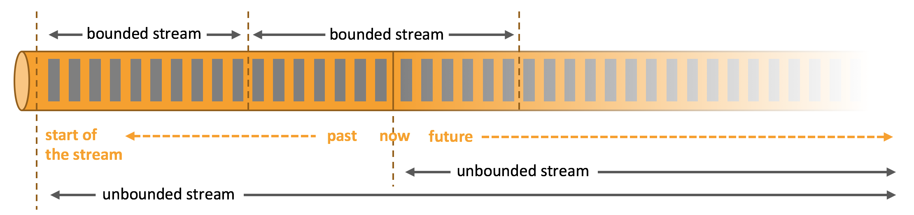
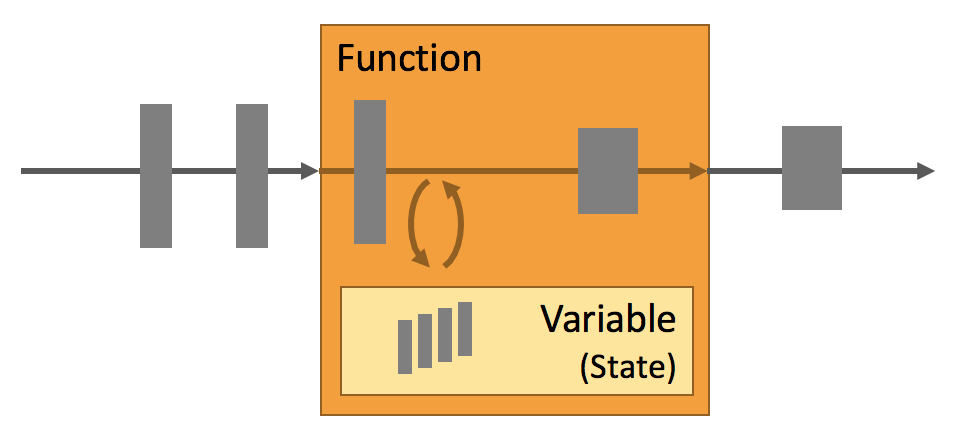
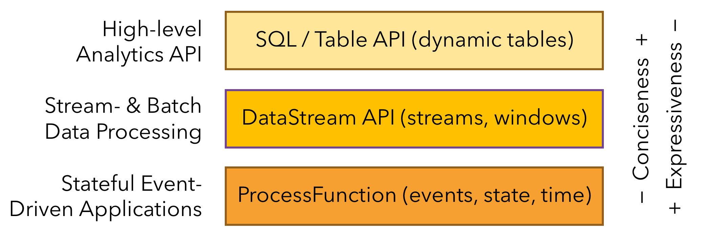
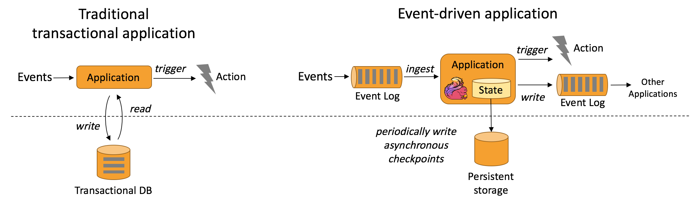
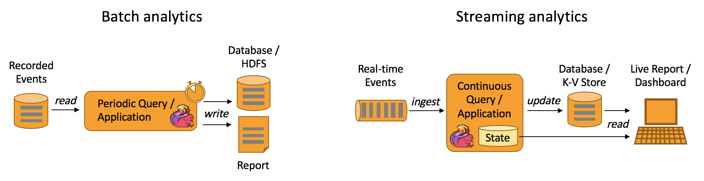
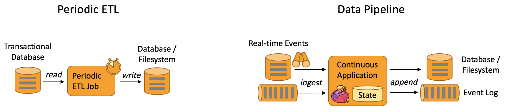

## 简介

flink 是一个分布式处理引擎，用于在无边界和有边界数据流上进行有状态的计算。任何类型的数据都可以形成一种事件流。

[官网](https://flink.apache.org/)。

数据可被作为有界或无界流来处理

- 无界流 有定义流的开始，但是没有定义流的结束。它们会无休止的产生数据，无界流的数据在摄取后需要立即进行处理，因为输入是无限的，在任何时候输入都不会完成。处理无界数据通常以特定顺序摄取事件，例如事件发生的顺序，以便能够推断结果的完整性。
- 有界流 有定义流的开始，也有定义流的结束。，有界流可以在摄取所有数据后再进行计算。有界流所有数据可以被排序，所以并不需要有序摄取。有界流处理通常被称为批处理。



## 基本组件

可以由流处理框架构建和执行的应用程序类型是由框架对流，状态，时间的支持程度来决定的。

### 流

数据流是流处理的基本要素。流拥有多种特征，这些特征决定了流如何以及何时被处理。

- 有界和无界的数据流：流可以是无界的；也可以是有界的，例如固定大小的数据集。
- 实时和历史记录的数据流：所有的数据都是以流的方式产生，但用户通常会使用两种截然不同的方式处理数据。或是在数据生成时进行实时的处理；亦或是先将数据流持久化到存储系统中（例如文件系统或对象存储），然后再进行批处理。

### 状态

具有一定复杂度的流处理应用都是有状态的，任何运行基本业务逻辑的流处理应用都需要在一定时间内存储所接收到的事件或中间结果，以供后续的某个时间点（例如收到下一个事件或经过一段特定时间）进行访问并进行后续处理。

应用状态是 Flink 中的一等公民，FLink 提供了许多状态管理相关的特性，其中包括：

- 多种状态基础类型：flink 为多种不同的数据结构提供了相对应的状态基础类型，例如 value，list，map。
- 插件化的 State Backend：负责管理程序应用状态，并在需要的时候进行 checkpoint。可以将状态存储在内存中或者 RocksDB。
- 精确一次语义：Flink 的 checkpoint 和故障恢复算法保证了故障发生后应用状态的一致性。
- 超大数据量状态：利用其异步以及增量式的 checkpoint 算法，存储数 TB 级别的应用状态。
- 可弹性伸缩的应用：能够通过在更多或更少的工作节点上对状态进行重新分布，支持有状态应用的分布式的横向伸缩。

### 时间

时间是流处理应用的另一个重要的组成部分。因为事件总是在特定时间点发生，所以大多数的事件流都拥有事件本身所固定的时间语义。许多常见的流计算都基于时间。流处理的一个重要方面是应用程序如何衡量时间，即区分事件时间，和处理时间。

- 事件时间模式：使用事件时间的流处理应用根据事件本身自带的时间戳进行结果的计算。因此，无论处理的是历史记录的事件还是实时的事件，事件时间模式的处理总能保证结果的准确性和一致性。
- watermark 支持：用以衡量时间进展。watermark 也是一种平衡处理延时和完整性的灵活机制。
- 迟到数据处理：当带有 watermark 的事件时间模式处理数据流时，在计算完成后之后扔会有相关数据到达。这样的时间被称为迟到事件。Flink 提供了多种处理迟到数据的选项，例如将这些数据重定向到旁路输出（side output）或者更新之前完成计算的结果。
- 处理时间模式：处理时间默认根据处理引擎的机器时钟触发计算，一般适用于有着严格低延迟需求，并且能够容忍近似结果的流处理应用。

### 分层 API

FLink 根据抽象程度分层，提供了三种不同的 API。每一种 API 在简洁性上和表达力上有着不同的侧重，并且针对不同的应用场景。


- ProcessFunction 是 FLink 所提供的最具有表达能力的接口。ProcessFunction 可以处理一或两个输入数据流中的单个事件或者归入一个特定窗口内的多个事件。它提供了对于时间和状态的细粒度控制。开发者可以在其中任意的修改状态，也能够注册定时器用以在未来的某一时刻触发回调函数。因此，你可以利用 ProcessFunction 实现所有有状态的事件驱动应用锁需要的基于单个事件的复杂业务逻辑。
  下面的代码示例展示了如何在 KeyedStream 上利用 KeyedProcessFunction 对标记为 START 和 END 的事件进行处理。

  ```java
  /**

  * 将相邻的 keyed START 和 END 事件相匹配并计算两者的时间间隔
  * 输入数据为 Tuple2<String, String> 类型，第一个字段为 key 值，
  * 第二个字段标记 START 和 END 事件。
      */
  public static class StartEndDuration
      extends KeyedProcessFunction<String, Tuple2<String, String>, Tuple2<String, Long>> {

  private ValueState<Long> startTime;

  @Override
  public void open(Configuration conf) {
      // obtain state handle
      startTime = getRuntimeContext()
      .getState(new ValueStateDescriptor<Long>("startTime", Long.class));
  }

  /** Called for each processed event. */
  @Override
  public void processElement(
      Tuple2<String, String> in,
      Context ctx,
      Collector<Tuple2<String, Long>> out) throws Exception {

      switch (in.f1) {
      case "START":
          // set the start time if we receive a start event.
          startTime.update(ctx.timestamp());
          // register a timer in four hours from the start event.
          ctx.timerService()
          .registerEventTimeTimer(ctx.timestamp() + 4 * 60 * 60 * 1000);
          break;
      case "END":
          // emit the duration between start and end event
          Long sTime = startTime.value();
          if (sTime != null) {
          out.collect(Tuple2.of(in.f0, ctx.timestamp() - sTime));
          // clear the state
          startTime.clear();
          }
      default:
          // do nothing
      }
  }

  /** Called when a timer fires. */
  @Override
  public void onTimer(
      long timestamp,
      OnTimerContext ctx,
      Collector<Tuple2<String, Long>> out) {

      // Timeout interval exceeded. Cleaning up the state.
      startTime.clear();
  }
  }

  ```

- DataStream API 为许多通用的流处理操作提供了处理原语。这些操作包括窗口，逐条记录的转换操作，在处理事件时进行外部数据库查询等。DataStream API 支持 Java 和 Scala 语言，预先定义了例如 map()、reduce()、aggregate()等函数。你可以通过扩展实现预定义接口或使用 Java，Scala 的 lambda 表达式实现自定义的函数。
  下面的代码示例展示了如何捕捉会话事件范围内所有的点击事件，并对每一次会话的点击量进行计数。

  ```java
  // 网站点击 Click 的数据流
  DataStream<Click> clicks = ...

  DataStream<Tuple2<String, Long>> result = clicks
  // 将网站点击映射为 (userId, 1) 以便计数
  .map(
  // 实现 MapFunction 接口定义函数
  new MapFunction<Click, Tuple2<String, Long>>() {
  @Override
  public Tuple2<String, Long> map(Click click) {
  return Tuple2.of(click.userId, 1L);
  }
  })
  // 以 userId (field 0) 作为 key
  .keyBy(0)
  // 定义 30 分钟超时的会话窗口
  .window(EventTimeSessionWindows.withGap(Time.minutes(30L)))
  // 对每个会话窗口的点击进行计数，使用 lambda 表达式定义 reduce 函数
  .reduce((a, b) -> Tuple2.of(a.f0, a.f1 + b.f1));
  ```

- SQL & Table API FLink 支持两种关系型的 API，TableAPI 和 SQL。这两个 API 都是批处理和流处理统一的 API，这意味着在无边界的实时数据流和有边界的历史记录数据流上，关系型 API 会以相同的语义执行查询，并产生相同的结果。Table API 和 SQL 借助了 Apache Calcite 来进行查询的解析，校验以及优化。它们可以与 DataStream 和 DataSet API 无缝集成，并支持用于自定义的标量函数，聚会函数以及表值函数。
  FLink 的关系型 API 旨在简化数据分析，数据流水线和 ETL 应用的定义。
  下面的代码示例展示了如何使用 SQL 语句捕获会话时间范围内所有的点击流事件，并对每一次会话的点击量进行计数。

  ```sql
  SELECT userId, COUNT(*) FROM clicks
  GROUP BY SESSION(clicktime, INTERVAL '30' MINUTE), userId
  ```

## 安装

[下载地址](https://flink.apache.org/downloads.html)，我们使用版本[flink-1.10.2](https://mirror-hk.koddos.net/apache/flink/flink-1.10.2/flink-1.10.2-bin-scala_2.11.tgz)

java 版本仅支持 8 或 11

```shell
$ tar -xzf  flink-1.10.2-bin-scala_2.11.tgz
$ cd flink-1.10.2

#启动 若默认端口8081被占用，则无法正常启动，需修改默认端口
$ ./bin/start-cluster.sh
Starting cluster.
Starting standalonesession daemon on host CentOS7.
[INFO] 1 instance(s) of taskexecutor are already running on CentOS7.
Starting taskexecutor daemon on host CentOS7.

#停止
./bin/stop-cluster.sh

#测试 提交一个任务
$ ./bin/flink run examples/streaming/WordCount.jar
# 可通过日志查看
$ tail log/flink-*-taskexecutor-*.out
(to,1)
(be,1)
(or,1)
(not,1)
(to,2)
(be,2)
# 也可以使用Web UI界面查看，默认端口为8081，可在conf/flink-conf.yaml中修改rest.port配置
```

## 应用场景

### 事件驱动型应用

#### 什么是事件驱动型应用

事件驱动型应用是一类具有状态的应用，它从一个或多个事件流提取数据，并根据到来的事件触发计算、状态更新或其他外部动作。

事件驱动型应用是在计算存储分离的传统应用基础上演化而来。在传统架构中，应用需要读写远程事务型数据库。而事件驱动型应用是基于状态化流处理来完成的，通过这样的设计，数据和计算不会分离，应用只需访问本地（内存或磁盘）即可获取数据。系统容错性的实现依赖于定期向远程持久化存储写入 checkpoint。下图描述了传统应用和事件驱动型应用架构的区别。


#### 事件驱动型应用的优势

事件驱动型应用无须查询远程数据库，本地数据访问使得它具有更高的吞吐量和更低的延迟。而由于定期向远程持久化存储的 checkpoint 工作可以异步、增量式完成，因此对于正常事件的处理的影响甚微。事件驱动型应用的优势不仅限于本地数据访问，在传统分层架构下，通常多个应用会共享同一个数据库，因而任何对数据库自身的更改都需谨慎协调。反观事件驱动型应用，由于只需考虑自身数据，因此在更改数据表示或服务扩容时所需要的协调工作将大大减少。

#### FLink 如何支持事件驱动型应用

事件驱动型应用会受制于底层流处理系统对时间和状态的把控能力，FLink 诸多特质都是围绕这些方面来设计的。它提供了一系列丰富的状态操作原语，允许以精确一次的一致性语义合并海量规模的状态数据。此外，Flink 还支持事件时间和自由度极高的定制化窗口逻辑，而且它内置的 ProcessFunction 支持细粒度时间控制，方便实现一些高级业务逻辑。同时，Flink 还拥有一个复杂事件处理类库（CEP），可以用来检测数据流中的模式。
savepoint 是一个一致性的状态镜像，它可以用来 初始化任意状态兼容的应用。在完成一次 savepoint 后，即可放心对应用升级或扩容，还可以启动多个版本的应用来完成 A/B 测试。

### 数据分析应用

#### 什么是数据分析应用

数据分析任务需要从原始数据中提取有价值的信息和指标。传统的分析方式通常是利用批查询，或将事件记录下来并基于此有限数据集构建应用来完成。为了得到最新数据的分析结果，必须先将它们加入分析数据集并重新执行查询或运行应用，随后将结果写入存储系统或生成报告。

借助一些先进的流处理引擎，还可以实时地进行数据分析。流式查询或应用可以进入实时事件流，并随着事件消费持续产生和更新结果。这些结果数据可能会写入外部数据库或以内部状态的形式维护。仪表展示应用可以相应地从外部数据库读取数据或直接查询应用的内部状态。

如下图所示，Flink 同时支持流式及批处理应用



#### 流式分析应用的优势

和批量分析相比，由于流式分析省掉了周期性的数据导入和查询过程，因此从事件中获取指标的延迟更低。不仅如此，批量查询必须处理那些由定期导入和输入有界性导致的人工数据边界，而流式查询则无需考虑该问题。
另一方面，流式分析会简化应用抽象。批量查询的流水线通常由多个独立部件组成，需要周期性调度提取数据和执行查询。如此复杂的流水线操作起来并不容易，一旦某个组件出错将会影响流水线的后续步骤。而流式分析应用整体运行在 Flink 之类的高端处理系统之上，涵盖了从数据接入到连续结果计算的所有步骤，因此可以依赖底层引擎提供的故障恢复机制。

#### Flink 如何支持数据分析类应用

Flink 为持续流式分析和批量分析都提供了良好的支持。具体而言，它内置了一个符合 ANSI 标准的 SQL 接口，将批，流查询的语义统一起来。无论是在记录时间的静态数据集上还是实时事件流上。相同的 SQL 查询都会得到一致的结果。同时 Flink 还支持丰富的用户自定义函数，运行在 SQL 执行定制化代码。如何还需进一步定制逻辑，可以利用 Flink DataStream API 和 DataSet API 进行更低层次的控制。此外，Flink 的 Gelly 库为基于批量数据集的大规模高性能图分析提供了算法和构建模块支持。

### 数据管道应用

#### 什么是数据管道

Extract-transform-load（ETL）是一种在存储系统之间进行数据转换和迁移的常用方法。ETL 作业通常会周期性地触发，将数据从事务型数据库拷贝到分析型数据库或数据仓库。
数据管道和 ETL 作业的用途相似，都可以转换、丰富数据，并将其从某个存储系统移动到另一个。但数据管道是以持续流模式运行，而非周期性触发。因此它支持一个不断生成数据的源头读取记录，并将它们以低延迟移动到终点。例如：数据管道可以用来监控文件系统目录的新文件，并将其数据写入事件日志；另一个应用可能会将数据流物化到数据库或增量构建和优化查询索引。

下图 描述了周期性 ETL 作业和持续数据管道的差异。


#### 数据管道的优势

和 ETL 作业相比，持续数据管道可以明显降低将数据移动到目的短的延迟。此外，由于它能够持续消费和发送数据，因此用途更广，支持用例更多。

#### Flink 如何支持数据管道应用

很多常见的数据转换和增强操作可以利用 Flink 的 SQL 接口（或者 Table API）以及用户自定义函数解决。如果数据管道有更高级的需求，可以选择更通用的 DataStream API 来实现。Flink 为多种数据存储系统（如：Kafka、Kinesis、Elasticsearch、JDBC 数据库系统等）内置了连接器。同时它还提供了文件系统的连续型数据源即数据汇，可用来监控目录变化和以时间分区的方式写入文件。
