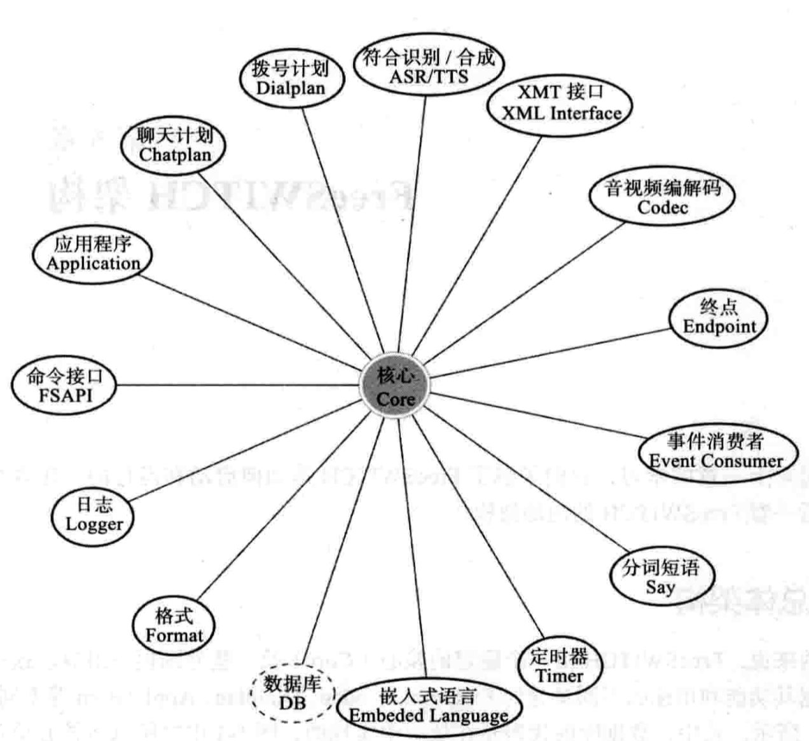

[官方文档](https://freeswitch.org/confluence/display/FREESWITCH/FreeSWITCH+First+Steps)

## 安装 freeswtich

在 centos7 上安装，参考[官方安装文档](https://freeswitch.org/confluence/display/FREESWITCH/CentOS+7+and+RHEL+7#CentOS7andRHEL7-CentOS7andRHEL7-Stable)

```shell

# 可能需要安装的前置依赖
yum install -y subversion autoconf automake libtool gcc-c++
yum install -y ncurses-devel make libtiff-devel libjpeg-devel

yum install -y https://files.freeswitch.org/repo/yum/centos-release/freeswitch-release-repo-0-1.noarch.rpm epel-release
yum install -y freeswitch-config-vanilla
# 语言和语音可按需安装
yum search freeswitch-lang-
yum search freeswitch-sounds-
# 根据需要安装
# yum  install - y freeswitch-lang-*
# yum  install - y freeswitch-sounds-*
```

### 源码编译

默认安装有很多模块不会安装，我们通过源码安装，加载自己所需要的模块，源码可从[官方链接](https://files.freeswitch.org/releases/freeswitch/)下载

```shell
# 添加freeswtich镜像
yum install -y https://files.freeswitch.org/repo/yum/centos-release/freeswitch-release-repo-0-1.noarch.rpm epel-release
# 安装freeswitch的依赖库
yum-builddep -y freeswitch
yum install -y yum-plugin-ovl centos-release-scl rpmdevtools yum-utils git
yum install -y devtoolset-4-gcc*
scl enable devtoolset-4 'bash'

./configure --enable-portable-binary \
            --prefix=/usr --localstatedir=/var --sysconfdir=/etc \
            --with-gnu-ld --with-python --with-erlang --with-openssl \
            --enable-core-odbc-support --enable-zrtp

```

### 源码编译一些问题

```shell
# 禁用libvpx
./configure --disable-libvpx
#或者在libs/libvpx下手动编译
./configure --enable-pic --enable-static --enable-shared --as=yasm --target=generic-gnu && make clean && make

make
make -j install
make -j cd-sounds-install
make -j cd-moh-install

```

## 启动

```shell

# 以系统服务启动freeswitch
systemctl enable freeswitch
systemctl start freeswitch

# 直接启动
# -nc 后台启动
# -nonat 关闭uPnP
freeswitch -nc -nonat

# 查看freeswitch进程
ps -ef|grep freeswitch
# 查看相关端口是否被占用，默认使用的是5060端口
# -p 能直接得到freeswitch的进程号（需root权限)
netstat -anp|grep 5060


# 进入freeswtich
# 如果报错，说明没有启动成功，尝试使用 root 启动
fs_cli -rRS
```

## 安装一个 sip 软电话

[telephone mac](https://apps.apple.com/us/app/telephone/id406825478?mt=12)

安装完成后配置账号，FreeSWITCH 默认配置了 1000 ~ 1019 共 20 个用户，你可以随便选择一个用户进行配置：

```txt
Display Name: 1000
User name: 1000
Password: 1234
Authorization user name: 1000
Domain: freeswitch的IP地址（默认使用5060端口）
```

<em class="grey">密码默认为 1234，可在 var.xml 中更改</em>

## 入门测试

freeswitch 默认测试号码

```shell
------------------
号码        |   说明
----------------------
9664      |   保持音乐
9196      |   echo，回音测试
9195      |   echo，回音测试，延迟5秒
9197      |   milliwatte extension，铃音生成
9198      |   TGML 铃音生成示例
5000      |   示例IVR
4000      |   听取语音信箱
33xx      |   电话会议，48K(其中xx可为00-99，下同)
32xx      |   电话会议，32K
31xx      |   电话会议，16K
30xx      |   电话会议，8K
2000-2002 |   呼叫组
1000-1019 |   默认分机号

表一： 默认号码及说明
```

## freeswitch cli 简介

### 参数

1. `-x` 执行一条命令后退出
   `fs_cli -x "version"`
   > FreeSWITCH Version 1.10.3-release.5~64bit (-release.5 64bit)

### 连接其他服务器

在用户根目录下编辑配置文件`.fs_cli_conf`

```conf
[server1]
host      => 192.168.0.1
port      => 8081
password  => password
debug     => 7
```

配置好后即可使用`fs_cli sever1`连接

### 客户端特殊命令

fs_cli 中，有几个特殊命令，以`/`开头,这些命令并不直接发送到服务端，而由`fs_cli`直接处理

例如 fs_cli 中，我们将日志级别设置到合适的级别

```shell
freeswitch@CentOS7> /help
Command                     Description
-----------------------------------------------
/help                       Help
/exit, /quit, /bye, ...     Exit the program.
/event, /noevents, /nixevent  Event commands.
/log, /nolog                Log commands.
/uuid                       Filter logs for a single call uuid
/filter                     Filter commands.
/logfilter                  Filter Log for a single string.
/debug [0-7]                Set debug level.

```

### 快捷键

在`fs_cli`中，我们可以使用`F1-F12`的快捷键，快捷键的功能定义在配置文件`autoload_configs/switch.conf.xml`中

```xml
<cli-keybindings>
    <key name="1" value="help"/>
    <key name="2" value="status"/>
    <key name="3" value="show channels"/>
    <key name="4" value="show calls"/>
    <key name="5" value="sofia status"/>
    <key name="6" value="reloadxml"/>
    <key name="7" value="console loglevel 0"/>
    <key name="8" value="console loglevel 7"/>
    <key name="9" value="sofia status profile internal"/>
    <key name="10" value="sofia profile internal siptrace on"/>
    <key name="11" value="sofia profile internal siptrace off"/>
    <key name="12" value="version"/>
  </cli-keybindings>
```

## 配置简介

我安装的 freeswitch 的配置文件在`/etc/freeswitch`目录下

### 配置文件概述

```shell
文件                               |    说明
---------------------------------------------------
freeswitch.xml                    | 核心配置文件，整合所有配置文件
vars.xml                          | 全局变量
dialplan/default.xml              | 缺省的拨号计划
directory/default/*.xml           | SIP用户，每用户一个文件
sip_profiles/internal.xml         | 一个SIP profile，或称作一个SIP-UA，监听在本地IP及端口5060，一般供内网用户使用
sip_profiles/externa.xml          | 另一个SIP-UA，用作外部连接，端口5080
autoload_configs/modules.conf.xml | 配置当FreeSWITCH启动时自动装载哪些模块
```

- 配置文件中`X-PRE_PROCESS`标签，是 FreeSwitch 特有的，它称为预处理指令，用于设置一些变量和引入其他配置文件，在 XML 加载阶段，FreeSwitch 的 XML 解析器会将所有预处理命令展开.
- 在 FreeSwitch 内部生成一个大的 XML 文档。`log/freeswitch.xml.fsxml`是 FreeSwitch 内部 XML 的一个内存镜像，它对调试非常有用，可以了解运行中的 FreeSwitch 的配置。
- `X-PRE_PROCESS`是一个预处理指令，是 FreeSwitch 在加载阶段只针对其文本内容进行简单替换，而不是在解析 xml 阶段进行替换，因此注释`X-PRE_PROCESS`指令时，遇到嵌套的注释时会产生错误的 XML
- 通过`X-PRE_PROCESS`设置的变量都称为全局变量，在加载 vars.xml 之前，FreeSwitch 已经设置了一些全局变量。在 xml 中使用`$${var}`引用全局变量，`${var}`引用局部变量。可使用`global_getvar`查看全局变量。

  ```shell
  fs_cli> global_getvar
  hostname=CentOS7
  local_ip_v4=10.211.55.6
  local_mask_v4=255.255.255.0
  local_ip_v6=fdb2:2c26:f4e4:0:4436:96d:47c1:1aa9
  base_dir=/usr
  recordings_dir=/var/lib/freeswitch/recordings
  sounds_dir=/usr/share/freeswitch/sounds
  conf_dir=/etc/freeswitch
  log_dir=/var/log/freeswitch
  run_dir=/var/run/freeswitch
  db_dir=/var/lib/freeswitch/db
  mod_dir=/usr/lib64/freeswitch/mod
  htdocs_dir=/usr/share/freeswitch/htdocs
  ...
  ```

全局变量在预处理阶段（系统启动时或 reloadxml 时）被求值。局部变量在每次执行时都求值。

### 媒体编码相关配置

在 vars.xml 中配置支持的媒体编码类型

```xml
<X-PRE-PROCESS cmd="set" data="global_codec_prefs=OPUS,G722,PCMU,PCMA,H264,VP8"/>
<X-PRE-PROCESS cmd="set" data="outbound_codec_prefs=OPUS,G722,PCMU,PCMA,H264,VP8"/>
```

```shell
freeswitch@CentOS7> sofia status profile internal
=============================================================
# 节选部分
CODECS IN        OPUS,G722,PCMU,PCMA,H264,VP8
CODECS OUT       OPUS,G722,PCMU,PCMA,H264,VP8
```

### 用户目录

用户目录默认配置文件在`conf/directory`下

### IVR 相关配置

默认的语言文件存放在`sounds`目录下，配置文件中用于定义语言文件的具体路径

```xml
  <X-PRE-PROCESS cmd="set" data="sound_prefix=$${sounds_dir}/en/us/callie"/>
```

也可以在 Dialplan 中针对每一个 Channel 进行改变

```xml
  <variable name="sound_prefix" value="$${sounds_dir}/en/us/callie"/>
```

另外该变量也可以设置到用户目录中，当特定的用户拨打电话时就能使用该变量。

### 重新加载配置文件

fs_cli> `reloadxml`

## 基础知识

### 呼叫字符串

呼叫字符串的格式`类型/参数/参数`，其中第一部分是字符串的类型。一般来说，每种 Endpoint 都会提供相应的呼叫字符串，每种呼叫字符串的类型都属于一个 Endpoint Interface，其中一些类型又类似一种‘高级’的呼叫字符串，如 user 和 group，属于底层的 sofia Endpoint Interface

```shell
# 从本地的注册用户中查找该用户的联系地址
user/1000
group/1000
```

我们可以使用逗号（`,`)或者竖线符合（`|`）将多个呼叫字符串隔开。

- 同振 哪个先接听则接通哪个，另一路自动挂断

  ```shell
  freeswitch> originate user/1000,user/10001 &echo
  ```

- 顺振 第一个号码呼叫失败则呼叫第二个

  ```shell
  freeswitch> originate user/1000|user/10001 &echo
  ```

### Channel

对于每一次呼叫，FreeSwitch 都会启动一个 Session，用于控制整个呼叫，他会一直持续到通话结束。其中，每个 Session 都控制这一个 Channel（通道，又称信道），是一对 UA 间通信的实体，相当于 FreeSwitch 的一条腿。每个 channel 都用一个唯一的 UUID 来标示，称为 channel UUID。。Channel 上可以绑定一些呼叫参数，称为 Channel Variable（通道变量）。Channel 也可用来传输媒体流。通话时 FreeSwitch 的作用是将两个 Channel 桥接（bridge）到一起，使双方可以通话。这两路桥接的通话（两条腿）在逻辑上组成一个通话，称为一个 Call
一个通道有两端，常用的端

- park 挂起
- hold 挂起并播放提示音
- record 录音
- playback 播放提示音
- bridge 桥接其他用户

### 桥接

bridge 相当于一座桥，它的作用是将两条腿 1000 和 1001 给桥接起来，在这里，为了能连接到 1001，FreeSwitch 作为一个 SIP UAC，向 1001 这个 SIP UA（UAS）发起一个 INVITE 请求，并建立一个新 Channel，就是我们的 b-leg。1001 开始振铃，bridge 把回铃音传回给 1000，因此 1000 就能够提到回铃音。当然实际的情况可能更复杂，因为在呼叫之前，FreeSwitch 首先要查找 1001 这个用户是否已经注册，否则，会直接返回 USER_NOT_REGISTERED，而不会建立 b-leg。
当 1001 振铃后，可能出现以下情况

- 被叫应答
- 被叫忙
- 被叫无应答
- 被叫拒绝
- 其他情况

我们考虑以下被叫应答的情况，1001 接电话，这个时候 bridge 一直是阻塞的，也就是说，bridge 这个 APP 一直等待 b-leg（10001）挂机（或者其他错误）后才返回，这时才有可能继续执行下面的 Action。最后，无论哪一方挂机，bridge 就算结束了。
如果 1000（主叫）先挂机，则 FreeSwitch 将挂机原因（Hangup Cause，一般是 NORMAL_RELEASE）发送给 1001，同时释放 b-leg。由于 a-leg 已经没了，Dialplan 就再也没有往下执行的必要。
如果 1001（被叫）先挂机，b-leg 就消失了。但 a-leg 还存在，b-leg 会将挂机原因传到 a-leg，在 a-leg 决定是否继续往下执行。

如果由于种种原因 1001 可能没有接电话，如 1001 可能拒绝(返回 CALL_REJECTED),忙(USER_BUSY),无应答(NO_ANSWER 或 NO_USER_RESPONSE)等，出现这些情况，FreeSwitch 认为这是不成功的 bridge，因此就不管 hangup_after_bridge 变量，这时它会检查 continue_on_fail 的值决定是否执行下面的 Action。continue_on_fail 可能的值有：

- NORMAL_TEMPORARY_FAILURE 临时故障
- USER_BUSY 超时
- NO_ANSWER 无应答
- NO_ROUTE_DESTINATION 呼叫不可达
- USER_BUSY 用户忙

更多的值参考[SIP 挂机原因](https://freeswitch.org/confluence/display/FREESWITCH/Hangup+Cause+Code+Table)
也可以给 continue_on_fail 设置为 true，表示无论什么原因导致 bridge 失败，都执行接下来的 Action

### 其他

- RTP [实时传输协议](https://en.wikipedia.org/wiki/Real-time_Transport_Protocol)
- ringback 回铃音，电话在 answer 之前播放的提示音
- transfer_ringback 转接电话时的回铃音
- sip capture FreeSwitch 内置了 Homer Capture Agent 用于 SIP 抓包
- NAT 网络地址转换协议，NAT 转换是将私有地址转换成公有地址的一种方式，是将 内网 ip：内网端口与外网 ip：外网端口映射起来。
- STUN（Session Traversal Utilities for NAT，NAT 会话穿越应用程序）是一种网络协议，它允许位于 NAT（或多重 NAT）后的客户端找出自己的公网地址，查出自己位于哪种类型的 NAT 之后以及 NAT 为某一个本地端口所绑定的 Internet 端端口。这些信息被用来在两个同时处于 NAT 路由器之后的主机之间建立 UDP 通信
- PSTN ( Public Switched Telephone Network )定义：公共交换电话网络，一种常用旧式电话系统。即我们日常生活中常用的电话网。工作原理 公共交换电话网络是一种全球语音通信电路交换网络，包括商业的和政府拥有的。
- Early Media 呼叫话机或软电话时，对方回复 180 或 183 SIP 指令时，通常会返回 Early Media，也就是前期的振铃音或彩铃，在呼叫失败时也可能会返回 Early Media

## 常用命令

### sofia

1. `sofia status profile internal` 查看某个 Profile 的状态

   ```shell
   freeswitch@CentOS7> sofia status profile internal
   =================================================================================================
   Name             internal
   Domain Name      N/A
   Auto-NAT         false
   DBName           sofia_reg_internal
   Pres Hosts       10.211.55.6,10.211.55.6
   Dialplan         XML
   Context          public
   Challenge Realm  auto_from
   RTP-IP           10.211.55.6
   SIP-IP           10.211.55.6
   Ext-SIP-IP       114.87.232.243
   URL              sip:mod_sofia@114.87.232.243:5060
   BIND-URL         sip:mod_sofia@114.87.232.243:5060;maddr=10.211.55.6;transport=udp,tcp
   WS-BIND-URL      sip:mod_sofia@10.211.55.6:5066;transport=ws
   WSS-BIND-URL     sips:mod_sofia@10.211.55.6:7443;transport=wss
   HOLD-MUSIC       local_stream://moh
   OUTBOUND-PROXY   N/A
   CODECS IN        OPUS,G722,PCMU,PCMA,H264,VP8
   CODECS OUT       OPUS,G722,PCMU,PCMA,H264,VP8
   TEL-EVENT        101
   DTMF-MODE        rfc2833
   CNG              13
   SESSION-TO       0
   MAX-DIALOG       0
   NOMEDIA          false
   LATE-NEG         true
   PROXY-MEDIA      false
   ZRTP-PASSTHRU    true
   AGGRESSIVENAT    false
   CALLS-IN         0
   FAILED-CALLS-IN  0
   CALLS-OUT        0
   FAILED-CALLS-OUT 0
   REGISTRATIONS    2

   ```

2. `sofia status profile internal reg`查看注册用户

   ```properties
   Call-ID:    03frJ9rXlraWYhLWGiu-PzxSW.9VWb6S
   User:       1000@10.211.55.6
   Contact:    "1000" <sip:1000@10.211.55.2:57146;ob>
   Agent:      Telephone 1.4.6
   Status:     Registered(UDP)(unknown) EXP(2020-07-17 08:04:09) EXPSECS(337)
   Ping-Status:Reachable
   Ping-Time:  0.00
   Host:       CentOS7
   IP:         10.211.55.2
   Port:       57146
   Auth-User:  1000
   Auth-Realm: 10.211.55.6
   MWI-Account:1000@10.211.55.6
   ```

   `Contact`地址可得知用户 1000 的 sip 地址：`sip:1000@10.211.55.2`,当我们使用 originate 命令呼叫`user/1000`这个呼叫字符串时，FreeSWITCH 便会在用户目录中查找 1000 这个用户，找到他的 dial-string 参数，dial-string 通常包含 alice 实际 Contact 地址的查找方法

3. `sofia status gateway gw1` 列出网关状态
4. profile 操作
   下面这些指令隐含 reloadxml
   - `sofia profile internal start`
   - `sofia profile internal stop`
   - `sofia profile internal restart`
   - `sofia profile internal rescan` 重新扫描参数，不影响通话
   - `sofia profile external killgw gw1` 删除一个网关，rescan 后重新加载网关
   - `sofia profile external register gw1` 立即注册
   - `sofia profile external unregister gw1` 立即注销
5. `sofial profile internal siptrace on` 开启该 profile 的 SIP 跟踪功能抓取 SIP 报文
6. `sofial global siptrace on` 开启全局 的 SIP 跟踪功能抓取 SIP 报文

### debug 相关

sofia 日志类型是 console，会打印到控制台

- <code> sofia loglevel all 9 </code> 开启最低级别的日志
- <code> sofia loglevel nua 9 </code> 开启指定模块最低级别的日志

可以指定一个日志类型，

- <code> sofia tracelevel debug</code> 开启日志输出到 trace 上

### originate

用于 FreeSwitch 向外发起一个呼叫，originate 在收到媒体指令就返回。

```shell
freeswitch> originate
-USAGE: <call_url> <exten>|&<application_name>(<app_args>) [<dialplan>] [<context>] [<cid_name>] [<cid_num>] [<timeout_sec>]
```

- call_url [呼叫字符串](#呼叫字符串)(Dial String)
- exten 可以认为是一个分机号，在向外发起一个呼叫并等待对方接听后，建立一个 Channel，对方接听后，FreeSwitch 会转入 Dialplan 去路由，路由要查找的目的地就是 exten。
- &application app_args 直接使用内部 APP
- dialplan 它是 Dialplan 的类型，如果不设置，默认就是 XML
- cid_name 显示的主机名称
- cid_num 显示的主机号码
- timeout_sec 接收 INVITE 后不回复 100 Tring 消息的超时的秒数，一般来说这种情况是 IP 地址不可达

示例

1. originate 发起呼叫

   ```shell
   freeswitch> originate user/1000 &echo
   #和上一条命令等价，省略了Dialplan类型和Context
   #完整语句为freeswitch> originate user/1000  9196 XML public
   freeswitch> originate user/1000  9196
   #内联命令 和上一条命令等价
   freeswitch> originate user/1000  echo inline

   ```

2. originate 修改主叫名称，主叫号码

   ```shell
      freeswitch> originate user/1000 &echo XML default 'leaderli' '888888'
   ```

   上述命令产生的 INVITE 命令报文如下

   ```shell
   INVITE sip:46598071@10.211.55.2:51032 SIP/2.0
   Via: SIP/2.0/UDP 10.211.55.6;rport;branch=z9hG4bKZHy7Uavj84veD
   Max-Forwards: 70
   From: "leaderli" <sip:888888@10.211.55.6>;tag=6NUtt7DvQF96N
   To: <sip:46598071@10.211.55.2:51032>
   Call-ID: 3bc3ac68-6cb4-1239-6db5-001c426cb7b3
   CSeq: 25244563 INVITE
   Contact: <sip:mod_sofia@10.211.55.6:5060>
   User-Agent: FreeSWITCH-mod_sofia/1.10.3-release.5~64bit
   Allow: INVITE, ACK, BYE, CANCEL, OPTIONS, MESSAGE, INFO, UPDATE, REGISTER, REFER, NOTIFY, PUBLISH, SUBSCRIBE
   ```

3. originate INVITE 超时

   我们呼叫一个不存在的 IP 地址

   ```shell
   freeswitch> originate  sofia/internal/1000@192.168.0.1 &echo XML default 'hello' 111111111 10
   ```

   开启 siptrace 的部分日志，在 FreeSwitch 发出 INVITE 请求后，由于没有收到 100 Trying 回复，于是在 1 秒，2 秒，4 秒后重发，由于我们指定了 10 秒超时，因此该呼叫于 10 秒后失败，返回 NO_ANSWER

   ```txt
   send 1328 bytes to udp/[192.168.0.1]:5060 at 10:44:13.598228:
   send 1328 bytes to udp/[192.168.0.1]:5060 at 10:44:14.598478:
   send 1328 bytes to udp/[192.168.0.1]:5060 at 10:44:16.599835:
   send 1328 bytes to udp/[192.168.0.1]:5060 at 10:44:20.599839:
   -ERR NO_ANSWER
   ```

4. bridge 桥接(先桥接，后呼叫)

   ```shell
   freeswitch> originate user/1000 &bridge(user/10001)
   我们也可以使用另一种方式来建立他们之间的连接（先呼叫，后桥接）

   freeswitch> originate user/1000 &park
   freeswitch> originate user/1001 &park
   freeswitch> show channels
   freeswitch> uuid_bridge <1000_uuid> <1001_uuid>

   # 忽略早期媒体，在用户真正接听后才对他进行放音
   originate {ignore_early_media=true}sofia/gateway/gw/13800000000 &playback(/tmp/test.wav)
   # 桥接b-leg时，对于183指令a-leg可以听到b的回玲音，而b-leg的180消息，FreeSwitch无法向 a-leg发送180，只能在收到b-leg的180指令时，播放一个假的回铃音。有时候等待b-leg返回180 Ringing也需要很长时间，可使用instant_ringback立即播放回铃音
   originate {transfer_ringback=/tmp/ring.wav,instant_ringback=true}user/1000 &bridge(user/1001)

   #修改b-leg的主叫号码
   originate user/1000 &bridge({origination_caller_id_number=88888}user/1001)
   # b-leg的参数来源于a-leg，b-leg的主叫号码来源于a-leg的effective_caller_id_number
   originate {effective_caller_id_number=888888}user/1000 &bridge(user/1001)
   ```

originate 可以使用通道变量

多个变量使用`,`分隔，当有的通道变量值会有逗号，可以使用`\,`来转义，或者使用`^^:`将`,`替换为`:`
也可以使用多个大括号来

```shell
originate {origination_caller_id_name='leaderli',origination_caller_id_number=888888}user/1001 &echo
originate {absolute_codec_string=G729\,PCMU}user/1001 &echo
originate {absolute_codec_string=^^:G729:PCMU}user/1001 &echo
```

### IVR 相关

#### 录音

- record 单腿录音，对一个 channel 进行路由，录音为单声道，是阻塞的 API 命令
- uuid_record 两腿录音，一通正常的通话通常由两个 Channel 组成，在一个 Channel 中，语音有两个方向。对于 SIP 客户端或话机而言，两个方向分别为说和听，对于 FreeSwitch 而言，则分别为读和写。

  ```shell
  # 开始录音
  uuid_record <channel_uuid> start /tmp/record.wav
  # 结束录音，该录音会包含两个声道，playback无法直接播放双声道，会将该录音混音，变成一个声道后播放。
  # 录音过程中电话挂断了，所有录音也就自动停止了
  uuid_record <channel_uuid> stop /tmp/record.wav
  ```

- record_session 在 Dialplan 中使用 record_session 开始对当前的 Channel 进行录音。它和 uuid_record 一样是非阻塞的，都是通过为当前的 Channel 添加一个 Media Bug，因而可以实时录音。

录音过程可以设置各种[参数](https://freeswitch.org/confluence/display/FREESWITCH/mod_dptools%3A+record)

- RECORD_STEREO 是否录成立体音，默认 false
- RECORD_WRITE_ONLY 只录写方向，即 FreeSwitch 发出，对端能够听到的声音
- RECORD_READ_ONLY 只录读方向，即 FreeSwitch 能听到的声音

录音时不指定录音的文件格式，则会使用原生的格式进行录音，即 Channel 默认支持的 codec 格式。

#### 放音

```xml
<action application="playback" data="/tmp/test.wav"/>
```

playback 的参数是一些音频源，这些音频源大部分是由 Format 定义的，即文件接口。这些文件接口一般会有打开（Open）和关闭（Close）、读（Read）和写（Write）等属性，playback 会从文件中读，而录音实际上也使用这些文件接口，它会往文件中写。
这些文件接口有以下几类

- 声音文件，对大部分声音文件的支持都是在 mod_sndfile 模块中实现的。该模块直接调用了 libsndfile 库，因此 libsndfile 库所支持的文件 FreeSwitch 都能支持。典型的如 WAV，AU，AIFF，VOX 等，libsndfile 不支持的声音文件则由其他模块实现的。如 mod_shout 模块实现了对 MP3 文件的支持。也可以直接播放由 mod_native_file 模块支持的原生文件--只要在播放时不带扩展名，FreeSwitch 会自己查找与本 Channel 语音编码一致的文件。

  ```xml
  <!-- 如果Channel使用的是PCMU编码，则播放test.PCMU-->
  <action application="playback" data="/tmp/test"/>
  ```

- local_stream 是在 mod_local_stream 中实现的。该模块实现了一些 Stream，即’流‘。他与文件类似，不同的是，每个流在整个系统中只有一个实例，但可以同时被多个 Channel 读取。这样，当系统中有成千上万个 Channel 时，便能节省很多系统资源。

  ```xml
  <action application="playback" data="local_stream://moh"/>
  ```

  上述代码中的流的名字是在`conf/autoload_configs/local_stream.conf.xml`中定义的

  ```xml
  <!--path 流文件路径 -->
   <directory name="moh/8000" path="$${sounds_dir}/music/8000">
    <param name="rate" value="8000"/>
    <param name="shuffle" value="true"/>
    <param name="channels" value="1"/>
    <param name="interval" value="20"/>
    <param name="timer-name" value="soft"/>
   </directory>
  ```

  FreeSwitch 支持多种采样频率，如果当前 Channel 为 8000Hz，名字`local_stream://moh`便自动对应到`moh/8000`这个流

- silence_stream 静音流，与 sleep 不同的时，静音流不中断 RTP 流程的传输。

  ```xml
  <!-- 1000 静音时长毫秒数 1400 舒适噪声的参数，参数越小噪音越大-->
  <action application="playback" data="silence_stream://1000,1400"/>
  ```

- tone_stream 铃流，它是在 mod_tone_stream  模块中实现的。他可以使用 [TGML](https://freeswitch.org/confluence/display/FREESWITCH/TGML)语言生成各种信号音。
- file_string 由 mod_dptools 模块中实现。它相当于一种更高级的文件格式，可以将多个文件串联起来

  ```xml
  <action application="playback" data="file_string:///tmp/file1.wav!/tmp/file2.wav!/tmp/file3.wav"/>
  ```

  `!`作为多个文件的分隔符

  ```xml
  <!-- 修改多个文件的分隔符-->
  <action application="set" data="playback_delimiter=|"/>
  <!-- 修改多个文件的播放间隔毫秒数-->
  <action application="set" data="playback_sleep_val=500"/>
  <action application="playback" data="file_string:///tmp/file1.wav|/tmp/file2.wav|/tmp/file3.wav"/>
  ```

- vlc 由模块 mod_vlc 实现的一个文件接口，vlc 是一个跨平台的多媒体播放器。

  ```xml
  <action application="playback" data="vlc:///tmp/test.mp3"/>
  <!-- 播放视频中的音频部分 -->
  <action application="playback" data="vlc:///tmp/test.mp4"/>
  <!-- 播放http服务器上的文件 -->
  <action application="playback" data="vlc://http://localhost:/test.mp4"/>
  ```

- http 由 mod_httapi 模块直接实现的一个 HTTP 接口，与 vlc 不同的是，它可以将远程文件缓存到本地

  ```shell
  <action application="playback" data="http://localhost:/test.mp3"/>
  ```

- say TTS 功能

  ```shell
  <action application="playback" data="say:tts_commandline:Ting-Ting:欢迎使用FreeSwitch"/>
  ```

  或

  ```shell
  <action application="set" data="tts_engine=tts_commandline"/>
  <action application="set" data="tts_voice=Ting-Ting"/>
  <action application="playback" data="say:欢迎使用FreeSwitch"/>
  ```

  也可以使用 speak 实现同样的功能

  ```shell
  <action application="speak" data="tts_commandline|Ting-Ting|欢迎使用FreeSwitch"/>
  ```

#### 循环播放

```xml

<action application="endless_playback" data="/tmp/test.wav">
<action application="loop_playback" data="+3 /tmp/test.wav">
```

#### TTS

[TTS](https://freeswitch.org/confluence/display/FREESWITCH/TTS)

#### 使用录音替换 tts 播报

使用[Say](https://freeswitch.org/confluence/display/FREESWITCH/mod_dptools%3A+say)```xml

<!-- en表示语种 number 表示我们要播放的数据的类型 iterated表示播放的方式，这里指代数字要逐个读出 1234表示要读的内容 -->
<action application="say" data="en number iterated 1234">
```

### 其它常用命令

1. show channels 显示通道信息
2. `<uuid> <read|write|both|vread|vwrite|vboth|all> <on|off>` 调试媒体传输是否正常
3. bgapi 使用后台进程启动命令，配合其他阻塞的命令使用

## 架构

freeSWTICH 由一个稳定的核心（Core）及一些外围模块组成。FreeSwitch 内部使用线程模型来处理并发请求，每个连接都在单独的线程中进行处理，不同的线程间通过 Mutex 互斥访问共享资源，并通过消息和异步事件等方式进行通信。FreeSwitch 的核心非常短小精悍，绝大部分应用层的功能都在外围的模块中实现。外围模块可以动态加载（以及卸载）。外围模块与核心模块通过核心提供的 Public API 与核心进行通信，而核心通过回调（或称钩子）机制执行外围模块中的代码。



### 数据库

FreeSwitch 使用一个核心的数据库（默认的存放位置是/usr/local/freeswitch/db/core.db）来记录系统的接口（interfaces），任务（tasks）以及当前的通道（channels），通话（calls）等实时数据。某些模块，如 mod_sofia，有自己的数据库（表），一般情况下，这些模块提供相关的 API 用于从这些表里查询数据。

### 公共应用程序接口

FreeSwitch 在核心层实现了一些 Public API，这些 Public API 可以被外围的模块调用。包含一些通用的工具函数，如生成 JSON 格式的函数，RTP 等与呼叫相关。

### 接口

FreeSwitch 提供了很多抽象接口，这些接口对同类型的逻辑或功能实体进行了抽象，但没有具体实现。核心层通过回调（钩子）方式调用具体的实现代码或函数。

例如 FreeSwitch 核心层定义了以下接口

```c
typedef enum {
   SWITCH_ENDPOINT_INTERFACE,
   SWITCH_TIMER_INTERFACE,
   SWITCH_DIALPLAN_INTERFACE,
   SWITCH_CODEC_INTERFACE,
   SWITCH_APPLICATION_INTERFACE,
   SWITCH_API_INTERFACE,
   SWITCH_FILE_INTERFACE,
   SWITCH_SPEECH_INTERFACE,
   SWITCH_DIRECTORY_INTERFACE,
   SWITCH_CHAT_INTERFACE,
   SWITCH_SAY_INTERFACE,
   SWITCH_ASR_INTERFACE,
   SWITCH_MANAGEMENT_INTERFACE,
   SWITCH_LIMIT_INTERFACE,
   SWITCH_CHAT_APPLICATION_INTERFACE,
   SWITCH_JSON_API_INTERFACE,
   SWITCH_DATABASE_INTERFACE,
} switch_module_interface_name_t;
```

外围模块可以选择并实现其中一个或多个接口，并向核心层`注册`这些接口，核心层在需要这些接口时，会回调这些接口中约定的回调函数。

### 事件

FreeSwitch 内部使用消息和事件机制进行进程间和模块间的通信。事件进制既可以在内部使用，也可在外部使用。事件机制是一种`生产者－消费者`模型，事件的产生和处理是异步的。这些事件可以在 FreeSwitch 内部通过绑定（Bind）一定的回调函数进行捕获，即 FreeSwitch 的核心事件系统会依次回调这些回调函数，完成相应的功能。另外，在嵌入式脚本中也可以订阅相关的事件进行处理。
在 FreeSwitch 外部，也可以通过 Event Socket 等接口订阅相关的事件，通过这种方式了解 FreeSwitch 内部发生了什么，如当前呼叫的状态等。fs_cli 就是一个典型的外呼程序，通过 Event Socket 与 FreeSwitch 通信，可以对 FreeSwitch 进行控制和管理，也可以订阅相关的事件对 FreeSwitch 的运行情况进行监控。订阅事件最简单的方法是：

```shell
# 订阅所有事件
fs_cli> /event plain ALL

# 单独订阅某类事件
fs_cli> /event plain  CHANNERL_ANSWER
fs_cli> /event plain  CUSTOM sofia:register
```

当我们使用登录软电话时，我们可以看到`sofia:register`信息

```shell
fs_cli> /event plain CUSTOM sofia::register
+OK event listener enabled plain

#登录后
fs_cli@CentOS7>
RECV EVENT
Event-Subclass: sofia::register
Event-Name: CUSTOM
Core-UUID: 11995eb7-bd00-492b-96c2-73a3256a383c
FreeSWITCH-Hostname: CentOS7
FreeSWITCH-Switchname: CentOS7
FreeSWITCH-IPv4: 10.211.55.6
FreeSWITCH-IPv6: fdb2:2c26:f4e4:0:4436:96d:47c1:1aa9
Event-Date-Local: 2020-07-17 15:03:21
Event-Date-GMT: Fri, 17 Jul 2020 07:03:21 GMT
Event-Date-Timestamp: 1594969401524081
Event-Calling-File: sofia_reg.c
Event-Calling-Function: sofia_reg_handle_register_token
Event-Calling-Line-Number: 2007
Event-Sequence: 1161
profile-name: internal
from-user: 1000
from-host: 10.211.55.6
presence-hosts: 10.211.55.6,10.211.55.6
contact: "1000" <sip:26759801@10.211.55.2:63078>
call-id: nEgIVmMHRtKSzdh6yv04x2SB.YkEJB84
rpid: unknown
status: Registered(UDP)
expires: 600
to-user: 1000
to-host: 10.211.55.6
network-ip: 10.211.55.2
network-port: 63078
username: 1000
realm: 10.211.55.6
user-agent: sipsimple 3.0.0
sip_number_alias: 1000
sip_auth_username: 1000
sip_auth_realm: 10.211.55.6
number_alias: 1000
user_name: 1000
domain_name: 10.211.55.6
record_stereo: true
default_gateway: example.com
default_areacode: 918
transfer_fallback_extension: operator
toll_allow: domestic,international,local
accountcode: 1000
user_context: default
effective_caller_id_name: Extension 1000
effective_caller_id_number: 1000
outbound_caller_id_name: FreeSWITCH
outbound_caller_id_number: 0000000000
callgroup: techsupport
```

### 目录结构

| 目录       | 说明                                         |
| :--------- | :------------------------------------------- |
| bin        | 可执行程序                                   |
| db         | 系统数据库(sqlite)                           |
| htdocs     | HTTP Server 根目录                           |
| lib        | 库文件                                       |
| mod        | 可加载模块                                   |
| run        | 运行目录，存放 FreeSwitch 运行时的 PID       |
| sounds     | 声音文件，使用 playback()默认的寻找路径      |
| grammar    | 语法，用于 ASR                               |
| include    | 头文件                                       |
| log        | 日志，CDR 等                                 |
| recordings | 录音，使用 record()时默认的存放路径          |
| scripts    | 嵌入式语言写的脚本，如 lua()等默认寻找的路径 |
| storage    | 语音留言（Voicemail）的录音                  |
| conf       | 配置文件                                     |

## 变量

可通过如下命令查看变量值

```shell
freeswitch@lofa> eval ${variable_name}
$ fs_cli -x '${variable_name}'
```

[变量详情](https://freeswitch.org/confluence/display/FREESWITCH/Variables)

在 Dialplan 中可以取消某些 Variable 的定义

```xml
<action application="set" data="var1＝_undef_"/>
<action application="unset" data="var1"/>
```

可以截取字符串

```shell
${var}            #1234567890  原始变量的值
${var:0:1}        #1 从第一个位置截取，取一个字符
${var:1}          #234567890 从第二位置截取到尾
${var:-4}         #7890 从倒数第四个位置截到尾
${var:-4:2}       #78  从倒数第四个位置截两位
${var:4:2}        #56  从第四个位置截两位
```

## APP

Action 通常有两个属性，一个是 Application,代表要执行的 App，一个是 data，代表 App 的参数。

1. set 将变量设置到当前的 Channel，即 a-leg
   `hello=1`
   可以使用`export_vars`将变量同步到 b-leg

   ```xml
   <action application="set" data="export_vars=var1,var2,var3"/>
   ```

   可以取消某些 Variable 的定义

   ```xml
   <action application="set" data="var1＝_undef_"/>
   <action application="unset" data="var1"/>
   ```

2. export 除了具备 set 的功能外，还会将变量设置到 b-leg，可以使用`nolocal:`修饰，表示仅设置到 b-leg
   `hello=1`
   `nolocal:hello=1`
3. hash 一个内存中的哈希表数据结构

   其 api 如下

   > hash insert/realm/key/value
   > hash insert_ifempty/realm/key/value
   > hash delete/realm/key
   > hash delete_ifmatch/realm/key/value
   > hash select/realm/key

   realm 和 key 是随意命名的，可以将 realm 看作是一个 hash 结构的组合容器

   在 xml 配置中示例

   ```xml
   <action application="hash" data="delete_ifmatch/realm/key/value"/>
   <action application="set" data="var=${hash(select/realm/key)}"/>
   ```

4. bind_meta_app 在 channel 上绑定 DTMF 按键，
   语法

   ```xml
   <action application="bind_meta_app" data="KEY LISTEN_TO FLAGS APPLICATION[::PARAMETERS]"/>
   ```

   参数解释：

   - KEY 监听的 DTMF 按键，仅允许为 0-9 中的一位`*`,`#`会被转换为 0
   - LISTEN_TO 监听的 leg，仅接受`a`,`b`,`ab`
   - FLAGS 标记行为

     - a - A leg
     - b - B leg
     - o - 相反的 leg
     - s - 同样的 leg
     - i - 立即执行，而不是在执行阶段去执行
     - 1 - 仅使用一次

   - APPLICATION 指定运行的 app
   - PARAMETERS app 需要的参数

   示例：

   ```xml
   <action application="bind_meta_app" data="1 b s execute_extension::dx XML features"/>
   <action application="bind_meta_app" data="2 b s record_session::$${recordings_dir}/${caller_id_number}.${strftime(%Y-%m-%d-%H-%M-%S)}.wav"/>
   <action application="bind_meta_app" data="3 b s execute_extension::cf XML features"/>
   <action application="bind_meta_app" data="4 b s execute_extension::att_xfer XML features"/>
   ```

5. bridge 桥接，其参数为呼叫字符串

   ```xml
   <action application="bridge" data="user/${dialed_extension}@${domain_name}"/>
   ```

6. conference 会议，

   ```xml
   <action application="conference" data="$1-${domain_name}@default"/>
   ```

   其中@前面的`$1-${domain_name}`是会议的名称，@后面的 default 表示是一个会议的 profile，它定义了这个会议的[相关参数](https://freeswitch.org/confluence/display/FREESWITCH/mod_conference)。其具体配置在`conf/autoload_configs/conference.conf.xml`中，

7. execute_extension 临时执行指定的 extension

   如下示例，即是去 Dialplan 下的 features.xml 中执行名为`dx`的 extension

   ```xml
      <action application="bind_meta_app" data="1 b s execute_extension::dx XML features"/>
   ```

   `dx`

   ```xml
     <context name="features">
      <extension name="dx">
         <condition field="destination_number" expression="^dx$">
      <action application="answer"/>
      <action application="read" data="11 11 'tone_stream://%(10000,0,350,440)' digits 5000 #"/>
      <action application="execute_extension" data="is_transfer XML features"/>
         </condition>
      </extension>
    ...
   ```

8. transfer,将当前通话重新转移到 ROUTING 阶段，重新去 Dialplan 中进行路由
   语法为

   ```shell
   transfer <destination_number> [<dialplan> [<context>]]
   ```

   - destination_number 转接的号码
   - dialplan 拨号计划，默认为`XML`，代表`conf/dailplan/default.xml`
   - context 拨号计划的 Context，默认为`default`

   示例

   ```xml
   <action application="transfer" data="1001"/>
   ```

   还可以在 destination_number 前使用参数，表示那个 leg 会重新路由，默认是 a-leg，可接受的参数`-aleg`， `-bleg`，`-both`

9. info info 级别日志

   ```xml
   <extension name="show channel variable">
      <condition field="destination_number" expression="^9916$">
         <action application="info" data=""/>
      </condition>
   </extension>
   ```

   ```log
   57da11b8 EXECUTE [depth=0] sofia/internal/1000@10.211.55.6 info()
   57da11b8 2020-07-18 07:23:43.214675 [INFO] mod_dptools.c:1885 CHANNEL_DATA:
   Channel-State: [CS_EXECUTE]
   Channel-Call-State: [RINGING]
   Channel-State-Number: [4]
   Channel-Name: [sofia/internal/1000@10.211.55.6]
   Unique-ID: [57da11b8-3197-45c4-bc31-bbe90935819e]
   Call-Direction: [inbound]
   Presence-Call-Direction: [inbound]
   Channel-HIT-Dialplan: [true]
   Channel-Presence-ID: [1000@10.211.55.6]
   Channel-Call-UUID: [57da11b8-3197-45c4-bc31-bbe90935819e]
   Answer-State: [ringing]
   Caller-Direction: [inbound]
   Caller-Logical-Direction: [inbound]
   Caller-Username: [1000]
   Caller-Dialplan: [XML]
   Caller-Caller-ID-Name: [1000]
   Caller-Caller-ID-Number: [1000]
   Caller-Orig-Caller-ID-Name: [1000]
   Caller-Orig-Caller-ID-Number: [1000]
   Caller-Network-Addr: [10.211.55.2]
   Caller-ANI: [1000]
   Caller-Destination-Number: [9916]
   Caller-Unique-ID: [57da11b8-3197-45c4-bc31-bbe90935819e]
   Caller-Source: [mod_sofia]
   Caller-Context: [default]
   ...
   ```

   info 也可以打印指定变量

   ```xml
   <action application="info" data="INFO the destination is  ${destination_number}"/>
   ```

   info 打印的所有通道变量在 xml 中引用时，使用的名称和 info 打印出来的是不一致的，详见[通道变量 wiki 参照表](https://freeswitch.org/confluence/display/FREESWITCH/Channel+Variables)

10. answer 应答一路呼叫。在 FreeSwitch 做被叫时，如果想主动给主叫放音，则必须应答后才可以。在 SIP 中是 200 消息，有些 APP 会隐含应答

11. playback 用于给 channel 放音，其参数为录音地址，如果需要播放多个文件，可以串联操作

    ```xml
    <action application="playback" data="/tmp/test1.wav"/>
    <action application="playback" data="/tmp/test2.wav"/>
    <action application="playback" data="/tmp/test3.wav"/>
    ```

    也可以使用`file_string`协议串联

    ```xml
     <action application="playback" data="file_string:///tmp/test1.wav!/tmp/test2.wav!/tmp/test3.wav"/>
    ```

    `!`是文件名的分隔符，可使用 Chan Var 来重新指定，也可指定多个文件的播放间隔

    ```xml
     <action application="set" data="playback_delimiter=|"/>
     <action application="set" data="playback_sleep_val=500"/>
    ```

    通过 mod_shout 模块，也可以支持本地或远程 HTTP 服务

    ```xml
     <action application="playback" data="http://localhost/test3.wav"/>
    ```

    在播放过程中我们可以通过设定 Chan Var 使用按键停止播放，也可以使用`none`设定为不可停止，其语法为

    ```shell
    playback_terminators=123456789*0# | any | none
    ```

    默认的打断按键是`*`

12. sleep 用于设置可以等待或暂停的一段时间，单位默认是毫秒

    ```xml
    <action application="sleep" data="1000"/>
    ```

13. ring_ready 用于在 SIP 中回复 180 消息，即通知对方可以振铃了

    ```xml
    <action application="ring_ready" data="1000"/>
    ```

14. pre_anser 用于在 SIP 中回复 183 消息，后续的 playback 之类的动作将作为早期媒体（Early Media）给对方发过去，如彩铃音

    ```xml
    <action application="pre_anser" />
    <action application="playback" data="music.wav"/>
    ```

    虽然 FreeSwitch 可以将媒体发给对方，但如果在一定时间内（通常 60 秒）没有应答，对端通常也会挂断该通话。

15. read 用于实现播放声音并且等待接收 DTMF 按键，它的格式是：

    ```shell
      <min> <max> <sound_file> <variable_name> <timeout> <terminators>
    ```

    - min：最少收号位数
    - max：最大收号位数
    - sound_file：要播放的录音文件
    - variable_name：收到用户按键后保存在哪个变量中
    - timeout：等待每一位输入的超时毫秒数
    - terminators：收号小于 min 位时，按该按键可以提前结束，通常是`#`

    例如

    ```xml
    <action application="read" data="3 4 '/tmp/input-id-card.wav' digits 30000 #"/>
    ```

16. play_and_get_digits 类似 read，但支持更多特性

    ```shell
      <min> <max> <tries>  <timeout> <terminators> <sound_file> <invalid_file> <variable_name> <regex>
    ```

    - min：最少收号位数
    - max：最大收号位数
    - tries: 重试次数
    - timeout：收集全部位数的超时
    - terminators：收号小于 min 位时，按该按键可以提前结束，通常是`#`
    - sound_file：要播放的录音文件
    - invalid_file：错误提示音
    - variable_name：收到用户按键后保存在哪个变量中
    - regex 输入的正则表达式
    - digit_timeout（可选）：位间间隔
    - failure_ext（可选）：最后错误转到该 Extension
    - failure_db（可选）：输入错误转到的 Dialplan
    - failure_context（可选）：输入错误时转到的 Dialplan Context

    例如

    ```xml
    <action application="play_and_get_digits" data="3 4 3 10000 #  '/tmp/input-id-card.wav' '/tmp/invalid.wav' id_card_num  (^\d{15}$)"/>
    ```

## API

在 Dialplan 中一般执行的是 APP，在某些特殊情况下，Dialplan 也需要调用某些 API 提供的能力，这可以通过类似变了引用的方式来实现，如：`${status()}`

```xml
<action application="set" data="api_status=${status()}"/>
<action application="set" data="api_status=${version()}"/>
<action application="set" data="api_status=${strtime()}"/>
<action application="set" data="api_status=${expr(1+1)}"/>
```

最后的 expr 类似 unix 中的 expr 命令

## 拨号计划

拨号计划（Dialplan）是 FreeSwitch 中至关重要的一部分，它的主要作用就是对电话进行路由（从这一点上来说，相当于一个路由表），决定和影响通话的流程。路由查找和执行分别属于一路通话的不同阶段，当 channel 状态进入执行阶段后，才开始依次执行所有的 Action。

拨号计划的配置文件在`conf/dailplan`目录下，拨号计划由多个 Context 组成，每个 Context 中有多个 Extension。一个 Context 中的 Extension 与其他 Context 中的 Extension 在逻辑上是隔离的。在 Extension 中可以对一些 condition 进行判断，如果满足条件所指定的表达式，则执行对应的 Action。Action 通常有两个属性，一个是 Application,代表要执行的 App，一个是 data，代表 App 的参数。

Dialplan 的按顺序执行，为了避免与提供的例子冲突，建议将自己写的 Extension 放在最前面。
默认情况下一旦有 Extension 满足匹配规则，就不会再去查找其他的 Extension。我们可以使用参数`continue="true"`来继续执行其他 Extension

```xml
<extension name="tod_example" continue="true">
   <condition wday="2-6" hour="9-18">
      <action application="set" data="open=true"/>
   </condition>
</extension>
```

系统默认提供的配置文件包括三个 Context，分别是 default，features，public。default 是默认的 Dialplan，一般来说注册用户都可以通过它来打电话，如拨打其他分机和外部电话等。而 public 一般用户接受外来呼叫。

### 根据日志查看拨号详情

将日志级别调整为 DEBUG，拨打 9196 测试号码，截取整理部分日志

```log
1 mod_dialplan_xml.c:637 Processing 1000 <1000>->9196 in context default
2 parsing [default->unloop] continue=false
3 Regex (PASS) [unloop] ${unroll_loops}(true) =~ /^true$/ break=on-false
4 Regex (FAIL) [unloop] ${sip_looped_call}() =~ /^true$/ break=on-false
5 parsing [default->tod_example] continue=true
...
44 Regex (FAIL) [global] ${default_password}(10086) =~ /^1234$/ break=never
45 Regex (PASS) [echo] destination_number(9196) =~ /^9196$/ break=on-false
46 Action answer()
47 Action echo()
48 State Change CS_ROUTING -> CS_EXECUTE
```

1. 第一行：Processing 说明是在处理 Dialplan，其中 1000，是 sip 客户端软件注册的用户名
2. 第二行，呼叫进入 parsing（解析 XML）阶段，它首先根据呼叫的来源找到 XML 中的一个 Context，此处是 default。它找到的第一个 Extension 的 name 是 unloop。
   其实际 xml 配置如下

   ```xml
   <extension name="unloop">
      <condition field="${unroll_loops}" expression="^true$"/>
      <condition field="${sip_looped_call}" expression="^true$">
         <action application="deflect" data="${destination_number}"/>
      </condition>
   </extension>
   <extension name="echo">
      <condition field="destination_number" expression="^9196$">
         <action application="answer"/>
         <action application="echo"/>
      </condition>
   </extension>
   ```

3. 第三行，由于此处 Extension 有一个 Condition，判断变量 unroll_loops 是否为 true，条件满足
4. 第四行，由于此处 Extension 有一个 Condition，判断变量 sip_looped_call 是否为 true，条件不满足，不执行 Action
5. 第五行，执行下一个 name 为 tod_example 的 Extension
6. 第 45 行，判断被叫号(destination_number)是否满足 9196,条件满足，执行 answer 和 echo。answer 是一个 FreeSwitch 的 App，用于回复 200 OK 的 sip 信令。
7. 第 48 行，说明 FreeSwitch 进入执行阶段。

### condition

condition 使用正则表达式匹配测试一个变量是否满足预设的正则表达式。可测试的变量如
| 变量| 说明|
| :---- | :---- |
|context|Dialplan 当前的 Context|
|rdnis|被转移的号码|
|destination_number|被叫号码|
|dialplan|Dialplan 模块的名称|
|caller_id_name|主叫名称|
|caller_id_number|主叫号码|
|ani|主叫的自动号码识别|
|aniii|主叫类型，如投币电话|
|uuid|本 Channel 的唯一标示|
|source|呼叫源，来自 FreeSwitch 的哪一个模块|
|chan_name|channel 的名称|
|network_addr|主叫的 IP 地址|
|year|当前的年|
|yday|一年中的第几天 1~366|
|mon|月 1 ～ 12|
|mday|日 1 ～ 31|
|week|一年中的第几周 1 ～ 53|
|mweek|本月的第几周 1 ～ 6|
|wday|一周的第一天 1 ～ 7 周日代表 1|
|hour|小时 0 ～ 23|
|minute|分钟 0 ～ 59|
|minute-of-day|一天中的第几分钟 1 ～ 1440|

除此之外，还可以使用用户目录设置的变量。但需要使用`${}`引用

condition 只要满足即执行其中的 action，否则执行其中的 anti-action。

condition 不可以嵌套，但可以迭加，通过属性 break 的值，我们可以确定是否继续执行接下来的 condition

break 的值的含义（假设我们有两个 condition，分别为 A 和 B）:

- `on-false`（默认值） 在第一次匹配失败时停止，即当 A 为 false 时，直接完成当前 Extension
- `on-true` 在第一次匹配成功时停止，即当 A 为 false 时，才会去测试 B
- `always` 不管是否匹配都停止
- `never` 不管是否匹配都继续

### Dialplan 工作机制

channel 的状态机


当新建（NEW）一个 Channel 时，它首先会进行初始化（INIT），然后进入路由（ROUTING）阶段，也就是我们查找解析 Dialplan 的阶段。我们称为 Parsing 或 Hunting（传统交换机称为选线，这里我们称为选路），解析完毕后会得到一些 Action，然后进入执行（EXECUTE）阶段，依次执行所有的动作（Action），最后无论哪一方挂机，都会进入（HANGUP）阶段。后面的报告（REPORTING）阶段一般用于进行统计，计费等。最后将 Channel 销毁（DESTORY），释放系统资源。
在 EXECUTE 状态，可能会发生转移（Transfer，非呼叫转移），它可以转移到其他的 extension，此时会重新进入 ROUTING 阶段，重新 Hunting Dialplan。

Extension 中的赋值的临时变量一般情况下在执行（EXECUTE）才会真正去执行，所以在路由（ROUTING）阶段进行解析判断是无法取到赋值后的临时变量的值，我们可以在使用`inline="true"`来使 action 直接执行

```xml
<action inline="true" application="set" data="greeting=hello.wav"/>
```

并不是所有 action 都支持 inline，支持的有

- check_acl
- eval
- event
- export
- enum
- log
- presence
- set
- set_global
- lcr
- set_profile_var
- set_user
- sleep
- unset
- nibblebill
- verbose_events
- cidlookup
- curl
- easyroute
- odbc_quer

inline 会打乱执行顺序，inline 的 action 会先于所有非 inline 的 action 先执行

### inline Dailplan

短小，简介的方便在脚本中动态生成的 Dialplan，与 XML Dialplan 不同，它没有 Extension，也没有复杂的 Condition，只是简单叠加 Action，它的语法格式：

```shell
app:arg1,app2:arg2,app3:arg3
```

当我们拨打 9916 时，9916 这个测试号，他的 XML Dialplan 的 Action 依次为 answer,playback,record

```shell
originate user/1000 9916
```

我们可以使用`inline Dialplan`语法直接进行

```shell
originate user/1000 answer,playback:/tmp/hello.wav,record:/tmp/record.wav inline
```

App 的参数有可能有都好，可以使用`m`语法将分隔符临时指定为其他

```shell
'm:^:app1:arg1^app2:arg2^bridge:{origination_uuid=asdf,ignore_early_media_true}/sofia/gateway/mygw/1234' inline
```

### 其他 Dialplan

```shell
freeswitch@CentOS7> show dialplan
type,name,ikey
dialplan,XML,mod_dialplan_xml
dialplan,enum,mod_enum
dialplan,inline,mod_dptools
dialplan,signalwire,mod_signalwire

```

## 相关数据索引

1. [挂机原因表](https://freeswitch.org/confluence/display/FREESWITCH/Hangup+Cause+Code+Table)
2. [通道变量](https://freeswitch.org/confluence/display/FREESWITCH/Channel+Variables)

## 问题

### 拨打电话无声音

观察日志输出发现，可在 freeswitch 控制台或`/var/log/freeswitch/freeswitch.log`中查看

```shell
Error Opening File [/usr/share/freeswitch/sounds/en/us/callie/ivr/ivr-to_call_the_freeswitch_conference.wav] [System error : No such file or directory.]
```

缺少相关语音包，我们可以安装对应的语音即可。

```shell
yum install -y freeswitch-sounds-en-us-callie-8000.noarch
```

### freeswitch 反应迟钝

测试中发现呼叫请求服务器处理的特别慢，后来跟踪发现在`/etc/freeswitch/dialplan/default.xml` 中有个 sleep 10s 的处理，

```xml
<condition field="${default_password}" expression="^1234$" break="never">
        <action application="log" data="CRIT WARNING WARNING WARNING WARNING WARNING WARNING WARNING WARNING WARNING "/>
        <action application="log" data="CRIT Open $${conf_dir}/vars.xml and change the default_password."/>
        <action application="log" data="CRIT Once changed type 'reloadxml' at the console."/>
        <action application="log" data="CRIT WARNING WARNING WARNING WARNING WARNING WARNING WARNING WARNING WARNING "/>
        <action application="sleep" data="10000"/>
</condition>
```

我们可以注释掉这个`sleep`，或者修改默认密码，`/etc/freeswitch/`，编译 vars.xml，把默认的密码 1234 改成其他。

```xml
<X-PRE-PROCESS cmd="set" data="default_password=10086"/>
```

### 客户端拨打电话后 30s 挂断

因为 NAT 的关系，我们将 internal.xml 中的配置修改为如下，使其可以穿透 NAT

```xml
<!-- external_sip_ip
   Used as the public IP address for SDP.
   Can be an one of:
   ip address            - "12.34.56.78"
   a stun server lookup  - "stun:stun.server.com"
   a DNS name            - "host:host.server.com"
   auto                  - Use guessed ip.
   auto-nat              - Use ip learned from NAT-PMP or UPNP
-->
<!-- <param name="ext-rtp-ip" value="$${external_rtp_ip}"/> -->
<!-- <param name="ext-sip-ip" value="$${external_sip_ip}"/> -->
<param name="ext-rtp-ip" value="auto-nat"/>
<param name="ext-sip-ip" value="auto-nat"/>
```

也可以使用 stun server 进行 NAT 穿透
