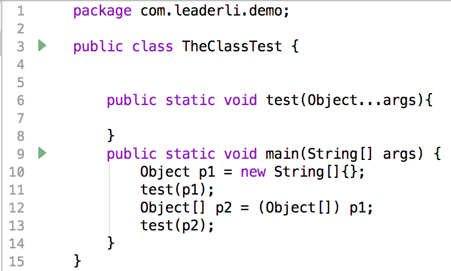

## `void`类型的范型方法

```java
private <T> void set(T t) {
  System.out.println(t);
}
```

## 获取类声明的泛型

```java
ParameterizedType  paramterizedType =(ParameterizedType) this.getClass().getGenericSuperclass();
paramterizedType.getActualTypeArguments()
// 对于 public class EditRelateJavaAction extends SelectionContextMenuAction<FlowNode> 来说，其值就为FlowNode


```

## `java`运行时无法捕获`ClassCastException`的解决办法

```java
 private static <T> T get(Object o, T def) {
   try {
     return (T) def.getClass().cast(o);
   } catch (Throwable e) {
     return (T) def;
   }
 }
```

通过查看字节码就可以了解,直接 `return (T) value` 是在方法外检测`cast`

## 数组的 class

```java
Object[].class
```

## 可变参数方法的反射

```java
public static void me(Object ... objects){
    for (Object object : objects) {
        System.out.println(object);
    }
}
@Test
public void  test() throws Exception {
    Class clazz = this.getClass();
    //Method method = clazz.getMethod("me",(new Object[0]).getClass());
    //Method method = clazz.getMethod("me",Array.newInstance(Object.class,0).getClass());
    Method method = clazz.getMethod("me",Class.forName("[Ljava.lang.Object;"));
    //1
    Object objs = Array.newInstance(object.class,2);
    Array.set(objs,0,1);
    Array.set(objs,1,"test");
    method.invoke(clazz,objs);
    //2
    Object[] obj = {1,"test"}
    method.invoke(clazz,new Object[]{obj});
}
```

可变参数不可直接显式使用 null 作为参数

```java
public class TestStatic {
    public static void main(String[] args) {
        String s = null;
        m1(s);
        Util.log("begin null");
        m1(null);
    }

    private static void m1(String... strs) {
        System.out.println(strs.length);
    }

}
```

```java
0: aconst_null          //将null压入操作栈
1: astore_1             //弹出栈顶(null)存储到本地变量1
2: iconst_1             //压栈1此时已经到方法m1了，在初始化参数，此值作为数组长度
3: anewarray     #2     //新建数组            // class java/lang/String
6: dup                  //复制数组指针引用
7: iconst_0             //压栈0，作为数组0角标
8: aload_1              //取本地变量1值压栈，作为数组0的值
9: aastore              //根据栈顶的引用型数值（value）、数组下标（index）、数组引用（arrayref）出栈，将数值存入对应的数组元素中
10: invokestatic  #3    //此时实际传递的是一个数组，只是0位置为null的元素 Method m1:([Ljava/lang/String;)V
13: iconst_1
14: anewarray     #4    //class java/lang/Object
17: dup
18: iconst_0
19: ldc           #5    //String begin null
1: aastore
22: invokestatic  #6    //Method li/Util.log:([Ljava/lang/Object;)V
25: aconst_null         //此处并没有新建数组操作，直接压栈null
26: invokestatic  #3    //此处一定会抛出空指针  Method m1:([Ljava/lang/String;)V
29: return
```

## 泛型 `extends super`

```java
//不管是extends或是super，只能使用在变量声明上，实际赋值的时候，一定是指定具体实现类的。

//那么对于<? extends T>来说，具体的实现类的泛型A只是变量声明的泛型T的子类，如果以T进行插入时，是无法保证插入的class类型，一定是A，所以extends禁用插入动作
//这个时候，从fruits取出的，其实是Apple泛型的元素，因此一定是Fruit类，但如果像fruits插入一个Banana泛型的元素，则与实际的泛型类Apple冲突，所以禁止使用fruits这个变量去进行插入动作
List<Apple> apples = new ArrayList<Apple>();
List<? extends Fruit> fruits = apples;

// 对于<? super T>来说，具体的实现类的泛型A一定是变量声明的泛型T的父类，如果以T类型进入取值操作，无法保证取出的值一定是T类型，因为A一定是T的父类，所以插入的所有实例一定也是A的多态
//这个时候，若apples中插入一个Apple泛型的元素，因为Apple是继承自Fruit泛型的子类，所以是可以插入到fruits中的，但是如果从apples取一个元素，因为fruits中可能有Banana泛型的元素，其余apples的实际泛型是冲突的，所以禁止使用取值操作。
List<Fruit> fruits = new ArrayList<Fruit>();
List<? super Apple> apples = fruits;
```

作为方法参数时，对于一个典型的示例来说，一般 mapper 函数是这样声明的

```java
 <R> Stream<R> map(Function<? super T, ? extends R> mapper);

 //上述形参的泛型表示实际mapper方法调用时是使用如下泛型的
R apply(T t);
```

其含义是，当我们调用这个 mapper 的 apply 时，我们的请求参数为 T 类型，其返回值为 R 类型。
所以在当我们在 apply 方法内部，当我调用 T 类型的父类方法是可以接受的，我实际传递 mapper 时，可以直接使用泛型为 T 的父类的形参。而 apply 方法的返回值，我返回 R 类型的子类也是可以接受的，所以传递 mapper 时也可以直接使用泛型为 R 的子类的返回类型

## 泛型的应用

```java
class Node<T extends Node<? extends Node<?>>> {

 T parent;
}
class RootNode extends Node<Node<?>>{

}

class Node1 extends Node<RootNode>{

}
class Node2 extends Node<RootNode>{

}

//在指定T类型时，其实R类型已经固定了
class B<T extends Node<R>, R extends Node<?>> {

 T node;
 R parent;

}

//C1 会直接提示错误
class C1 extends B<Node1,Node2>{

}
class C2 extends B<Node1,RootNode>{

}

```

## 如何修改 final 修饰符的值

```java
String str = "fuck";

Field value = String.class.getDeclaredField("value");
//Field中包含当前属性的修饰符，通过改变修饰符的final属性，达到重新赋值的功能
Field modifier = Field.class.getDeclaredField("modifiers");
modifier.setAccessible(true);
modifier.set(value, value.getModifiers() & ~Modifier.FINAL);

value.setAccessible(true);
value.set(str, "notfuck".toCharArray());
//修改成功后重新加上final修饰符
modifier.set(value, value.getModifiers() | Modifier.FINAL);}
```

## 子类继承时不使用泛型

```java
public interface Father<T> {
  void func(T t);
}

public Son implements Father<String> {

  public void func(String t){
    ...
  }
}
```

## 数组对象与数组的区别



其字节码如下

```java
public class com/leaderli/demo/TheClassTest {

  public <init>()V
   L0
    LINENUMBER 3 L0
    ALOAD 0
    INVOKESPECIAL java/lang/Object.<init> ()V
    RETURN
   L1
    LOCALVARIABLE this Lcom/leaderli/demo/TheClassTest; L0 L1 0
    MAXSTACK = 1
    MAXLOCALS = 1

  public static varargs test([Ljava/lang/Object;)V
   L0
    LINENUMBER 8 L0
    RETURN
   L1
    LOCALVARIABLE args [Ljava/lang/Object; L0 L1 0
    MAXSTACK = 0
    MAXLOCALS = 1

  public static main([Ljava/lang/String;)V
   L0
    LINENUMBER 10 L0
    ICONST_0                     //压入0
    ANEWARRAY java/lang/String   //弹出栈顶，生成一个栈顶数值长度的String数组
    ASTORE 1                     //弹出栈顶到本地变量1，即p1
   L1
    LINENUMBER 11 L1
    ICONST_1                     //压入1
    ANEWARRAY java/lang/Object   //生成一个长度为1的Object数组
    DUP                          //复制一份引用至栈顶
    ICONST_0                     //压入0
    ALOAD 1                      //压入本地变量1，即p1
    AASTORE                      //弹出栈顶的引用型数值（value）、数组下标（index）、数组引用（arrayref）出栈，将数值存入对应的数组元素中。这里的意思是将p1存入到方法test的形参数组角标0的位置
    INVOKESTATIC com/leaderli/demo/TheClassTest.test ([Ljava/lang/Object;)V // 弹出栈顶所有元素作为参数调用方法，方法返回值会被压入栈顶，因方法返回类型为V，操作栈则清空
   L2
    LINENUMBER 12 L2
    ALOAD 1                       //压入本地变量1
    CHECKCAST [Ljava/lang/Object; //类型检查
    CHECKCAST [Ljava/lang/Object; //类型检查
    ASTORE 2                      //弹出栈顶到本地变量2，即p2
   L3
    LINENUMBER 13 L3
    ALOAD 2                       //压入本地变量1，即p1
    INVOKESTATIC com/leaderli/demo/TheClassTest.test ([Ljava/lang/Object;)V // 弹出栈顶所有元素作为参数调用方法，方法返回值会被压入栈顶，因方法返回类型为V，操作栈则清空
   L4
    LINENUMBER 14 L4
    RETURN
   L5
    LOCALVARIABLE args [Ljava/lang/String; L0 L5 0
    LOCALVARIABLE p1 Ljava/lang/Object; L1 L5 1  //描述符L表示它是对象类型
    LOCALVARIABLE p2 [Ljava/lang/Object; L3 L5 2 //描述符[L表示它是对象数组类型
    MAXSTACK = 4
    MAXLOCALS = 3
}

```
