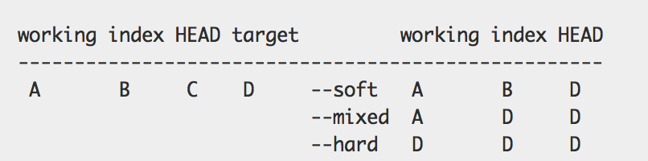
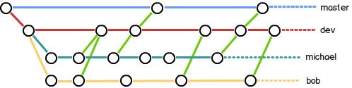
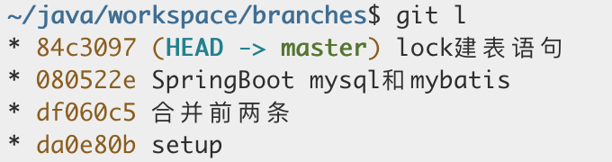
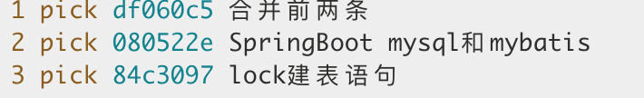
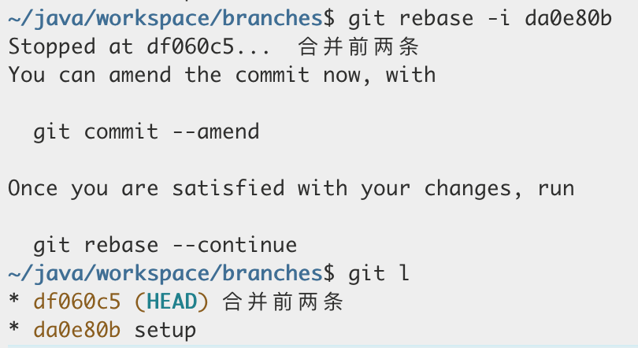
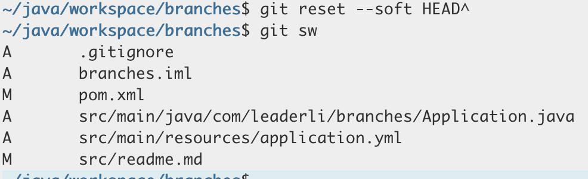
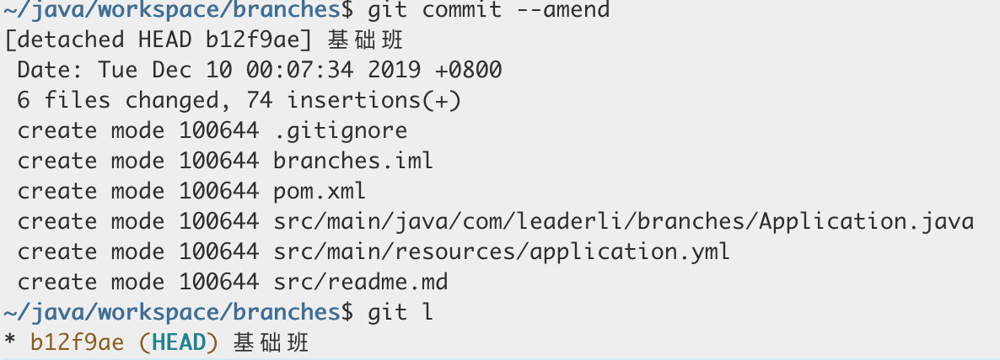
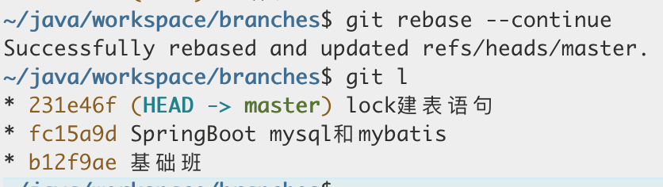

## 安装 git

系统使用 centos7

```shell
$ cd /usr/local/src wget https://github.com/git/git/archive/master.zip
$ unzip master.zip
# 由于系统中已存在 git，所以先备份现有 git。
$ mv /usr/bin/git{,.bak}
# 编译安装
cd /usr/local/src/git-master
$ make configure
$ ./configure --prefix=/usr/bin
$ make && make install
# 拷贝到原有 Git 所在位置
$ cp /usr/local/src/git-master/git /usr/bin
```

## 配置

### `gitignore`

1. `/mtk`过滤整个文件夹,但不过滤子文件夹
2. `mtk/`过滤文件夹所有文件
3. `\*.zip` 过滤所有`.zip` 文件
4. `/mtk/do.c` 过滤某个具体文件
5. `!/mtk/one.txt` 追踪（不过滤）某个具体文件

注意：如果你创建`.gitignore` 文件之前就`push`了某一文件，那么即使你在`.gitignore`文件中写入过滤该文件的规则，该规则也不会起作用，`git` 仍然会对该文件进行版本管理。

#### `gitignore`不生效

`.gitignore` 中已经标明忽略的文件目录下的文件，`git push` 的时候还会出现在 `push` 的目录中，原因是因为在 `git` 忽略目录中，新建的文件在 `git` 中会有缓存，如果某些文件已经被纳入了版本管理中，就算是在`.gitignore` 中已经声明了忽略路径也是不起作用的，这时候我们就应该先把本地缓存删除，然后再进行 `git` 的 `push`，这样就不会出现忽略的文件了。`git` 清除本地缓存命令如下：

```shell
git rm -r --cached .
git add .
git commit -m 'update .gitignore'
```

### 别名

我们可通过配置 alias 来简化 git 命令
`git config –-global --edit`来编辑`[alias]`下面的配置别名

```config
[alias]
al = config --get-regexp alias
b = branch
cm = commit -m
co = checkout --
cp = cherry-pick
dt = difftool
mt = mergetool
mg = merge --no-ff -m
l = log --graph --pretty=oneline --abbrev-commit
pl = pull
ps = push
st = status -s
sw = checkout
```

## 查看

### 查看状态

`git show`默认查看当前`<commit>`提交的内容，可使用`git show <commit>`查看具体某个提交的信息
`git status`查看当前工作区与暂存区状态，可使用`git status -s`简化输出信息。类似如下的信息`M`表示有改动,`D`表示删除,`??`表示未`add`,`A`表示新增但未提交

> M 1.txt
> D 2.txt
> ?? 4.txt
> A 5.txt

### 查看缓存区文件

`git ls-fles` 显示`index`和工作区的文件的信息。
选项

含义

> -c, --cached
> 显示缓存了的文件（默认）
> -d, --deleted
> 显示删除了的文件
> -m, --modified
> 显示修改了的文件
> -o, --others
> 显示其他类型的文件（比如未追踪的）
> -i, --ignored
> 显示忽略了的文件（满足忽略模式的）
> -s, --stage
> 显示暂存的条目的相关信息（模式位，文件哈希后的值，暂存号和文件名），

### 日志

`git log` 命令显示从最近到最远的提交日志,如果嫌输出信息太多，看得眼花缭乱的，可以试试加上`--pretty=oneline`参数

```shell
git log --pretty=oneline
```

显示所有分支关系

```shell
git log --graph --decorate --oneline --all
```

使用自带图形化工具查看

```shell
gitk --all
```

查看文件修改历史记录，显示差异

```shell
git log -p <file>
```

### 比较差异

`git diff`比较工作区和缓存区，当修改工作区内容时且未`add`,缓存区的内容则与工作区有差异，此时缓存区与仓库同样是没有变动，所以使用`git diff --cached`,发现没有差异，当使用`add`后，缓存区则和工作区相同了。单因为没有`commit`,所以使用`git diff --cached`，可以看到差异的内容。当使用`commit`后，则变成一致的状态  
用 `git diff HEAD -- readme.txt` 命令可以查看工作区和版本库里面最新版本的区别，`HEAD`可以使用`git log`或者`git reflog`查看的版本号替换

```shell
git diff
git diff --cached
git diff HEAD

git diff -- file
git diff --cached --file
git diff HEAD -- file
```

可使用第三方软件来比较
目前`mac`上安装的是`Kaleidoscope`
`git difftool`使用方式类似`git diff`

比较两个`commit`的差异

```shell
git diff <commit1> <commit2>
```

要查看有哪些文件发生了变化，可以加上--stat 参数

```shell
git diff <commit1> <commit2> --stat
```

若想查看目录的变化，可以使用--dirstat

```shell
git diff <commit1> <commit2> --dirstat=files
```

仅查看某文件夹下的版本差异

```shell
git diff --stat <commit1> <commit2> dir
```

显示冲突`conflict` 文件,`--diff-filter`也可用来过滤新增文件等

```shell
git diff --name-only --diff-filter=U
```

### 命令历史记录

`git reflog`用来记录你的每一次命令

### 查找丢失记录

`git fsck --full`检查数据库的完整性。 如果使用一个 --full 选项运行它，它会向你显示出所有没有被其他对象指向的对象：

## 提交

### 追加提交

重写更改提交信息,执行后会把最近`add`的内容一并放入到此次`commit`

```shell
git commit --amend
```

## 回退,撤销

`HEAD^`或`HEAD~`表示上一个版本，用`git log`可以查看提交历史，以便确定要回退到哪个版本。`git reflog`查看命令历史，以便确定要回到未来的哪个版本。

### `checkout`

1. 未`add`到`stage`时可用`git checkout -- file`,丢弃工作区的修改。
2. 以`add`到`stage`先用`git reset HEAD <file>`可以把暂存区的修改撤销掉（`unstage`），重新放回工作区，然后再丢弃工作区修改
3. `git checkout <branch>`切换分支
4. `git checkout -b <branch> <commit>` 在`commit`创建一个分支

### `reset`



### `revert`

> `git revert <commit>`，撤销提交。不同于`reset`，`revert`不是回退版本，而是通过一个新的反向的提交来实现。会进入交互模式，需要填写新的`commit`信息
> `git revert -n <commit>`,撤销提交，需要手动`commit`

### `apply`

补丁

## 分支

### 创建分支

我们创建`dev`分支，然后切换到`dev`分支：

```shell
git checkout -b dev`
```

### 查看当前分支

查看当前分支，当前分支前面会标一个`*`号。

```shell
git branch`
```

### 重命名分支

在当前分支下重命名分支

```shell
git branch -m new-name
```

### 分支策略

首先，`master`分支应该是非常稳定的，也就是仅用来发布新版本，平时不能在上面干活；那在哪干活呢？干活都在`dev`分支上，也就是说，`dev`分支是不稳定的，到某个时候，比如`1.0`版本发布时，再把`dev`分支合并到`master`上，在`master`分支发布`1.0`版本；你和你的小伙伴们每个人都在`dev`分支上干活，每个人都有自己的分支，时不时地往`dev`分支上合并就可以了。

所以，团队合作的分支看起来就像这样：


### 合并分支

合并分支,把`dev`分支的工作成果合并到`master`分支上：

```shell
git merge dev
```

通常，合并分支时，如果可能，`Git`会用`Fast forward`模式，但这种模式下，删除分支后，会丢掉分支信息。如果要强制禁用`Fast forward`模式，`Git`就会在`merge`时生成一个新的`commit`，这样，从分支历史上就可以看出分支信息。

```shell
git merge --no-ff -m "merge with no-ff" dev

```

### 删除分支

如果要丢弃一个没有被合并过的分支，可以通过 `git branch -D <name>`强行删除。

### 移动分支

我有两个`git`分支，`A`和`B`，并提交编号 1 到 8。我的历史记录如下

> 1 -> 2 -> 3 -> 4[A] -> 5 -> 6 -> 7 -> 8[B]

我想更改它，以便我的历史记录如下：

> 1 -> 2 -> 3 -> 4 -> 5 -> 6[A] -> 7 -> 8[B]

也就是说，我想将分支`A`的头从提交 4 移动到提交 6。

```shell
git branch -f A 6
```

### 挑选提交

同上示例，加入`A`分支仅希望用 7 这个提交
那么我们可以使用`cherry-pick`,在`A`分支下使用

```shell
git  cherry-pick 7
```

### 挑选文件

当我们需要用别的分支的文件覆盖本分支的文件时可以使用如下命令，该命令会同时覆盖工作区和缓存区的文件

```shell
git checkout <branch> <file>
```

## 标签

### 新建标签

分支打标签，默认标签是打在最新提交的`commit`上的。还可以创建带有说明的标签，用`-a`指定标签名，`-m`指定说明文字

```shell
git tag v1.0
git tag -a v0.1 -m "version 0.1 released"

```

默认标签是打在最新提交的`commit`上的。有时候，如果忘了打标签，比如，现在已经是周五了，但应该在周一打的标签没有打，怎么办？  
方法是找到历史提交的`commit id`，然后打上就可以了：

```shell
git tag v0.9 f52c633
```

### 删除标签

```shell
git tag -d v0.1
```

### 查看标签

查看所有标签

```shell
git tag
```

查看标签信息，可以看到标签说明文字

```shell
git show tag
```

### 操作标签

类似`<commit>`的作用，可以使用`checkout`,`reset`等

### 更新远程标签

当使用`git fetch`命令时，本地已经有的标签不会被更新为远程的值
我们需要先将本地的标签删除后再更新

```bash
git tag -l |xargs git tag -d
```

## `rebase`

提交信息过多过杂，或者分支合并操作过多,可以使用`git rebase`整理提交记录

```shell
git rebase -i ID #-i交互模式，来觉得哪些分支的记录会被保留
```

交互模式的`command`选项

> pick：正常选中
> reword：选中，并且修改提交信息；
> edit：选中，rebase 时会暂停，允许你修改这个 commit（参考这里）
> squash：选中，会将当前 commit 与上一个 commit 合并
> fixup：与 squash 相同，但不会保存当前 commit 的提交信息
> exec：执行其他 shell 命令
> merge:将几个 commit 合并为一个 commit

### 合并第一条和第二条记录

1. 首先我们查看当前提交记录
   
2. 我们使用`git rebase -i da0e80b`
   
3. 将`df060c5`前更改为`edit`状态后保存退出
   
4. 使用`git reset --soft HEAD^`,保留第二版的改动回退到第一个版本
   
5. 将改动追加提交到第一个版本即可`git commmit --amend`
   
6. 继续`rebase`,使用`git rebase --continue`
   

当然我们可以使用更简单的命令`git rebase -i --root`

### 合并策略

基本使用命令如下，仅介绍两个策略

```shell
git merge <branch> --strategy=<strategy>
```

#### `ours`

在合并的时候，无论有多少个合并分支，当前分支就直接是最终的合并结果。无论其他人有多少修改，在此次合并之后，都将不存在（当然历史里面还有）。你可能觉得这种丢失改动的合并策略没有什么用。但如果你准备重新在你的仓库中进行开发（程序员最喜欢的重构），那么当你的修改与旧分支合并时，采用此合并策略就非常有用，你新的重构代码将完全不会被旧分支的改动所影响。

#### `recursive`

默认的合并策略是`recursive`,此策略可以指定额外参数

1. `ours`如果不冲突，那么与默认的合并方式相同。但如果发生冲突，将自动应用自己这一方的修改。注意策略里面也有一个`ours`，与这个不同的。

2. `theirs`这与 `ours`相反。如果不冲突，那么与默认的合并方式相同。但如果发生冲突，将自动应用来自其他人的修改（也就是 `merge`参数中指定的那个分支的修改）。

```shell
git merge --no-ff -m 'msg' <branch> --strategy=recursive --strategy-option=theirs
#可以简化成
git merge --no-ff -m 'msg' <branch> --strategy-option=theirs

```

## 远程仓库

### 将新项目导入远程仓库

```shell
git init
git remote add origin <uri>
git remote rename origin old-origin #重命名
git add .
git commit -m 'init '
git push -u origin master
git push -u origin  --all #推送所有分支

```

### 查看远程仓库

```shell
git remote
```

### 删除远程分支

```shell
git push origin --delete test

# 远程已经删除的分支，在本地执行 git branch -a 显示还存在，可通过如下方式删除
git remote prune origin
```

### 拉取远程仓库的更新

```shell
git fetch
git fetch --all
git fetch -p #会自动删除本地已经失效的远程分支
```

### 强制更新覆盖为远程分支

```shell
git reset --hard <remote>/<branch>
```

### 推送到远程

```shell
git push #推送前会校验是否在最新状态
git push -f #强制推送
```

## `Git`原理

参考
