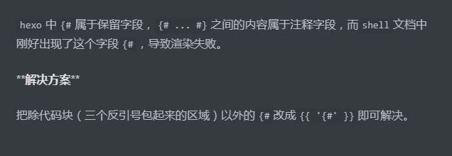

## 快捷方式

站内引用，引用自己的博客


使用`F8`快速定位`markdown`语法错误的地方。

插入的图片上面需要有一行文字，否则生成的网页图片显示会有瑕疵

## 调试

运行命令时带上参数`--debug`,则会输出`console.log()`所打印的日志

## 本地搜索

安装插件

```shell
npm install hexo-generator-searchdb --save

```

根目录`_config.yml`中开启本地搜索,`xml`对于特殊字符的处理可能存在问题，建议使用`json`

```yml
#本地搜索
search:
  # path: search.xml
  path: search.json
  field: post
  content: true
  format: html
```

同时`theme`下的配置需要开启

```yml
local_search:
  enable: true
  # If auto, trigger search by changing input.
  # If manual, trigger search by pressing enter key or search button.
  trigger: auto
  # Show top n results per article, show all results by setting to -1
  top_n_per_article: 1
  # Unescape html strings to the readable one.
  unescape: false
```

`hexo`开始搜索使用插件`hexo-generator-searchdb`，插件在扫描项目文件后生成`search.json`文件。
该文件按照特定格式存储了博客的所有内容。但该插件记录的中文为`ascii`码，因此在搜索时使用中文搜索不到
博客正文内容，因此我们需要修改生成`search.json`文件的过程。将`ascii`转码。

修改项目根目录下的文件`node_modules/hexo-generator-searchdb/lib/json_generator.js`

```js
"use strict";

module.exports = function (locals) {
  var config = this.config;
  var database = require("./database")(locals, config);

  // ---------------------------------------------新增修改
  function reconvert(str) {
    str = str.replace(/(\\u)(\w{1,4})/gi, function ($0) {
      return String.fromCharCode(
        parseInt(escape($0).replace(/(%5Cu)(\w{1,4})/g, "$2"), 16)
      );
    });
    str = str.replace(/(&#x)(\w{1,4});/gi, function ($0) {
      return String.fromCharCode(
        parseInt(escape($0).replace(/(%26%23x)(\w{1,4})(%3B)/g, "$2"), 16)
      );
    });
    str = str.replace(/(&#)(\d{1,6});/gi, function ($0) {
      return String.fromCharCode(
        parseInt(escape($0).replace(/(%26%23)(\d{1,6})(%3B)/g, "$2"))
      );
    });

    return str;
  }
  database.forEach(function (item) {
    item.content = reconvert(item.content);
  });
  // -----------------------------------------------
  return {
    path: config.search.path,
    data: JSON.stringify(database),
  };
};
```

## vscode 中图片无法预览

vscode 中的 markdown 图片仅能预览当前 md 文件下或其子文件中的图片，但是若是图片在这儿，渲染后的 html 文件中将无法查看图片。我们自定义两个插件来解决这个问题。

根据[hexo api](https://hexo.io/zh-cn/api/)我们编写两个插件

1. 首先我们在`source/_posts`目录下建一个专门用于存放图片的文件夹`images`，在 markdown 中我们使用``来插入图片,这样我们在 vscode 中就可以预览图片了。
2. 编写一个插件`hexo-li-assert-image`，用于将``渲染后的``中的 src 替换为`/images/picture.png`
3. 编写一个插件，用于在渲染完成后，将`source/_posts/images/`的所有图片拷贝到`public/images`下

代码如下

```js
"use strict";
var cheerio = require("cheerio");

hexo.extend.filter.register("after_post_render", function (data) {
  var path = hexo.config.li.path; //_config.yml中新增配置
  if (path.length < 1) {
    return;
  }

  var toprocess = ["excerpt", "more", "content"];
  for (var i = 0; i < toprocess.length; i++) {
    var key = toprocess[i];
    var $ = cheerio.load(data[key], {
      ignoreWhitespace: false,
      xmlMode: false,
      lowerCaseTags: false,
      decodeEntities: false,
    });
    $("img").each(function () {
      if ($(this).attr("src")) {
        var src = $(this).attr("src").replace("\\", "/");
        if (src.startsWith("./images/")) {
          src = src.substring(1);
          $(this).attr("src", src);
        }
      }
    });
    data[key] = $.html();
  }
});
```

```js
"use strict";
var fs = require("fs");

hexo.on("generateAfter", function (post) {
  var path = hexo.config.li.path;
  if (path.length < 1) {
    return;
  }
  var source_img_path = path + "source/_posts/images/";
  var target_img_path = path + "public/images/";

  if (!fs.existsSync(target_img_path)) {
    console.log("mkdir " + target_img_path);
    fs.mkdirSync(target_img_path, { recursive: true });
  }

  let paths = fs.readdirSync(source_img_path);
  paths.forEach(function (path) {
    if (path.startsWith(".")) {
      return;
    }
    var _src = source_img_path + path;
    var _tar = target_img_path + path;
    if (fs.existsSync(_tar)) {
      return;
    }
    fs.copyFileSync(_src, _tar, fs.constants.COPYFILE_EXCL);
  });
});
```

## 本地搜索增加正则模式

当我们开始搜索时，若以`/`开始，当输入的是有效的 js 正则表达式(`/reg/`)时，才会开始搜索所有文章，开始搜索时会将正则表达式的的最后一个`/`截掉

使用 next 主题，修改其本地搜索的逻辑。拷贝｀ themes/next/layout/\_third-party/search/localsearch.swig`为`li_localsearch.swig`。
将其修改为

```html

<script>
  // Popup Window;
  var isfetched = false;
  var isXml = true;
  // Search DB path;
  var search_path = "{{ config.search.path }}";
  if (search_path.length === 0) {
    search_path = "search.xml";
  } else if (/json$/i.test(search_path)) {
    isXml = false;
  }
  var path = "{{ config.root }}" + search_path;
  // monitor main search box;

  var onPopupClose = function (e) {
    $(".popup").hide();
    $("#local-search-input").val("");
    $(".search-result-list").remove();
    $("#no-result").remove();
    $(".local-search-pop-overlay").remove();
    $("body").css("overflow", "");
  };

  function proceedsearch() {
    $("body")
      .append(
        '<div class="search-popup-overlay local-search-pop-overlay"></div>'
      )
      .css("overflow", "hidden");
    $(".search-popup-overlay").click(onPopupClose);
    $(".popup").toggle();
    var $localSearchInput = $("#local-search-input");
    $localSearchInput.attr("autocapitalize", "none");
    $localSearchInput.attr("autocorrect", "off");
    $localSearchInput.focus();
  }

  // search function;
  var searchFunc = function (path, search_id, content_id) {
    "use strict";

    // start loading animation
    $("body")
      .append(
        '<div class="search-popup-overlay local-search-pop-overlay">' +
          '<div id="search-loading-icon">' +
          '<i class="fa fa-spinner fa-pulse fa-5x fa-fw"></i>' +
          "</div>" +
          "</div>"
      )
      .css("overflow", "hidden");
    $("#search-loading-icon")
      .css("margin", "20% auto 0 auto")
      .css("text-align", "center");

    $.ajax({
      url: path,
      dataType: isXml ? "xml" : "json",
      async: true,
      success: function (res) {
        // get the contents from search data
        isfetched = true;
        $(".popup").detach().appendTo(".header-inner");
        var datas = isXml
          ? $("entry", res)
              .map(function () {
                return {
                  title: $("title", this).text(),
                  content: $("content", this).text(),
                  url: $("url", this).text(),
                };
              })
              .get()
          : res;
        var input = document.getElementById(search_id);
        var resultContent = document.getElementById(content_id);
        var inputEventFunction = function () {
          var searchText = input.value.toLowerCase();
          if (searchText.length < 1) {
            return;
          }
          var keywords = [];
          var first_keyword;
          if (searchText.charAt(0) === "/") {
            if (searchText.indexOf("/", 1) == 1) {
              keywords.push(searchText.substring(1));
            } else if (
              searchText.length > 2 &&
              searchText.charAt(searchText.length - 1) === "/"
            ) {
              keywords.push("$$");
              try {
                eval("first_keyword = " + searchText + "g");
              } catch (err) {
                console.error(err);
                return;
              }
              input.value = searchText.substring(0, searchText.length - 1);
            } else {
              return;
            }
          } else {
            keywords.push(searchText);
          }
          var resultItems = [];
          // perform local searching
          datas.forEach(function (data) {
            var isMatch = false;
            var hitCount = 0;
            var searchTextCount = 0;
            var title = data.title.trim();
            var titleInLowerCase = title.toLowerCase();
            var content = data.content.trim();
            var contentInLowerCase = content.toLowerCase();
            var articleUrl = decodeURIComponent(data.url).replace(
              /\/{2,}/g,
              "/"
            );
            var indexOfTitle = [];
            var indexOfContent = [];
            // only match articles with not empty titles
            if (title != "") {
              if (first_keyword) {
                keywords = contentInLowerCase.match(first_keyword);
              }
              if (!keywords) {
                keywords = [];
              }
              keywords.forEach(function (keyword) {
                if (
                  keyword === "test" &&
                  titleInLowerCase.indexOf("bash") > -1
                ) {
                  console.log(contentInLowerCase);
                }
                function getIndexByWord(word, text, caseSensitive) {
                  var wordLen = word.length;
                  if (wordLen === 0) {
                    return [];
                  }
                  var startPosition = 0,
                    position = [],
                    index = [];
                  if (!caseSensitive) {
                    text = text.toLowerCase();
                    word = word.toLowerCase();
                  }
                  while ((position = text.indexOf(word, startPosition)) > -1) {
                    index.push({ position: position, word: word });
                    startPosition = position + wordLen;
                  }
                  return index;
                }

                indexOfTitle = indexOfTitle.concat(
                  getIndexByWord(keyword, titleInLowerCase, false)
                );
                indexOfContent = indexOfContent.concat(
                  getIndexByWord(keyword, contentInLowerCase, false)
                );
              });
              if (indexOfTitle.length > 0 || indexOfContent.length > 0) {
                isMatch = true;
                hitCount = indexOfTitle.length + indexOfContent.length;
              }
            }

            // show search results

            if (isMatch) {
              // sort index by position of keyword

              [indexOfTitle, indexOfContent].forEach(function (index) {
                index.sort(function (itemLeft, itemRight) {
                  if (itemRight.position !== itemLeft.position) {
                    return itemRight.position - itemLeft.position;
                  } else {
                    return itemLeft.word.length - itemRight.word.length;
                  }
                });
              });

              // merge hits into slices

              function mergeIntoSlice(text, start, end, index) {
                var item = index[index.length - 1];
                var position = item.position;
                var word = item.word;
                var hits = [];
                var searchTextCountInSlice = 0;
                while (position + word.length <= end && index.length != 0) {
                  if (word === searchText) {
                    searchTextCountInSlice++;
                  }
                  hits.push({ position: position, length: word.length });
                  var wordEnd = position + word.length;

                  // move to next position of hit

                  index.pop();
                  while (index.length != 0) {
                    item = index[index.length - 1];
                    position = item.position;
                    word = item.word;
                    if (wordEnd > position) {
                      index.pop();
                    } else {
                      break;
                    }
                  }
                }
                searchTextCount += searchTextCountInSlice;
                return {
                  hits: hits,
                  start: start,
                  end: end,
                  searchTextCount: searchTextCountInSlice,
                };
              }

              var slicesOfTitle = [];
              if (indexOfTitle.length != 0) {
                slicesOfTitle.push(
                  mergeIntoSlice(title, 0, title.length, indexOfTitle)
                );
              }

              var slicesOfContent = [];
              while (indexOfContent.length != 0) {
                var item = indexOfContent[indexOfContent.length - 1];
                var position = item.position;
                var word = item.word;
                // cut out 100 characters
                var start = position - 20;
                var end = position + 80;
                if (start < 0) {
                  start = 0;
                }
                if (end < position + word.length) {
                  end = position + word.length;
                }
                if (end > content.length) {
                  end = content.length;
                }
                slicesOfContent.push(
                  mergeIntoSlice(content, start, end, indexOfContent)
                );
              }

              // sort slices in content by search text's count and hits' count

              slicesOfContent.sort(function (sliceLeft, sliceRight) {
                if (sliceLeft.searchTextCount !== sliceRight.searchTextCount) {
                  return sliceRight.searchTextCount - sliceLeft.searchTextCount;
                } else if (sliceLeft.hits.length !== sliceRight.hits.length) {
                  return sliceRight.hits.length - sliceLeft.hits.length;
                } else {
                  return sliceLeft.start - sliceRight.start;
                }
              });

              // select top N slices in content

              var upperBound = parseInt(
                "{{ theme.local_search.top_n_per_article }}"
              );
              if (upperBound >= 0) {
                slicesOfContent = slicesOfContent.slice(0, upperBound);
              }

              // highlight title and content

              function highlightKeyword(text, slice) {
                var result = "";
                var prevEnd = slice.start;
                slice.hits.forEach(function (hit) {
                  result += text.substring(prevEnd, hit.position);
                  var end = hit.position + hit.length;
                  result +=
                    '<b class="search-keyword">' +
                    text.substring(hit.position, end) +
                    "</b>";
                  prevEnd = end;
                });
                result += text.substring(prevEnd, slice.end);
                return result;
              }

              var resultItem = "";

              if (slicesOfTitle.length != 0) {
                resultItem +=
                  "<li><a href='" +
                  articleUrl +
                  "' class='search-result-title'>" +
                  highlightKeyword(title, slicesOfTitle[0]) +
                  "</a>";
              } else {
                resultItem +=
                  "<li><a href='" +
                  articleUrl +
                  "' class='search-result-title'>" +
                  title +
                  "</a>";
              }

              slicesOfContent.forEach(function (slice) {
                resultItem +=
                  "<a href='" +
                  articleUrl +
                  "'>" +
                  '<p class="search-result">' +
                  highlightKeyword(content, slice) +
                  "...</p>" +
                  "</a>";
              });

              resultItem += "</li>";
              resultItems.push({
                item: resultItem,
                searchTextCount: searchTextCount,
                hitCount: hitCount,
                id: resultItems.length,
              });
            }
          });
          if (keywords.length === 1 && keywords[0] === "") {
            resultContent.innerHTML =
              '<div id="no-result"><i class="fa fa-search fa-5x"></i></div>';
          } else if (resultItems.length === 0) {
            resultContent.innerHTML =
              '<div id="no-result"><i class="fa fa-frown-o fa-5x"></i></div>';
          } else {
            resultItems.sort(function (resultLeft, resultRight) {
              if (resultLeft.searchTextCount !== resultRight.searchTextCount) {
                return resultRight.searchTextCount - resultLeft.searchTextCount;
              } else if (resultLeft.hitCount !== resultRight.hitCount) {
                return resultRight.hitCount - resultLeft.hitCount;
              } else {
                return resultRight.id - resultLeft.id;
              }
            });
            var searchResultList = '<ul class="search-result-list">';
            resultItems.forEach(function (result) {
              searchResultList += result.item;
            });
            searchResultList += "</ul>";
            resultContent.innerHTML = searchResultList;
          }
        };

        if ("auto" === "{{ theme.local_search.trigger }}") {
          input.addEventListener("input", inputEventFunction);
        } else {
          $(".search-icon").click(inputEventFunction);
          input.addEventListener("keypress", function (event) {
            if (event.keyCode === 13) {
              inputEventFunction();
            }
          });
        }

        // remove loading animation
        $(".local-search-pop-overlay").remove();
        $("body").css("overflow", "");

        proceedsearch();
      },
    });
  };

  // handle and trigger popup window;
  $(".popup-trigger").click(function (e) {
    e.stopPropagation();
    if (isfetched === false) {
      searchFunc(path, "local-search-input", "local-search-result");
    } else {
      proceedsearch();
    }
  });

  $(".popup-btn-close").click(onPopupClose);
  $(".popup").click(function (e) {
    e.stopPropagation();
  });
  $(document).on("keyup", function (event) {
    var shouldDismissSearchPopup =
      event.which === 27 && $(".search-popup").is(":visible");
    if (shouldDismissSearchPopup) {
      onPopupClose();
    }
  });
</script>

```

修改同目录下的`index.swig`

```html
     
```

在主题配置文件中,增加

```yml
local_search:
  enable: true
  # If auto, trigger search by changing input.
  # If manual, trigger search by pressing enter key or search button.
  trigger: auto
  # Show top n results per article, show all results by setting to -1
  top_n_per_article: 1
  # Unescape html strings to the readable one.
  unescape: false
  li: true
```

## 后台进程启动 hexo server

在博客根目录下面创建一个 hexo_run.js

```javascript
const { exec } = require("child_process");
exec("hexo server", (error, stdout, stderr) => {
  if (error) {
    console.log("exec error: ${error}");
    return;
  }
  console.log("stdout: ${stdout}");
  console.log("stderr: ${stderr}");
});
```

```shell
#全局安装
$ npm  install -g pm2
#在根目录下运行
$ pm2 start hexo_run.js
```

## 增加 echarts 树图

例如

```markdown
hexo 中 在 ``中包含的内容，会被 hexo 视为一个 tag

例如



- 前言
  - 使用方法
    - 使用方法
    - 1
  - 二
  - 一
  - 二
- 太长不看
- 参考资料


```

hexo 插件`node_modules/hexo/lib/plugins/tag/index.js`中会注册相关 tag 的处理器
例如

```javascript
tag.register("pullquote", require("./pullquote")(ctx), true);
```

`node_modules/hexo/lib/plugins/tag/pullquote.js`的内容如下

```javascript
"use strict";

/**
 * Pullquote tag
 *
 * Syntax:
 *   
 *   Quote string
 *   
 */
module.exports = (ctx) =>
  function pullquoteTag(args, content) {
    args.unshift("pullquote");

    const result = ctx.render.renderSync({ text: content, engine: "markdown" });

    return `<blockquote class="${args.join(" ")}">${result}</blockquote>`;
  };
```

`pullquote`最终生成一个`<blockquote>`标签，并且其 `class`为`pullquote`以及其后定义的值，我们在`theme`下的`footer.swig`中，新增关于对`li-echarts-tree`的元素进行 echarts 渲染。我们定义无序列表的来实现 echarts 中的树图。无序列表会被渲染成`ul`，`li`元素。那么我们可以这样实现

```javascript
<script src="/js/echarts.min.js"></script>

<script>
    function recursion_tree(dom, tree) {
        tree = tree || {}
        if (dom.tagName === 'UL') {
            tree.children = []
            Array.prototype.forEach.call(dom.children, child => {
                tree.children.push(recursion_tree(child))
            })
            return tree;
        } else if (dom.tagName === 'LI') {
            html = dom.innerHTML
            tree.name = html;
            var ulIndex = html.indexOf('<')
            if (ulIndex > 0) {
                tree.name = html.substring(0, ulIndex).trim()
                Array.prototype.forEach.call(dom.children, child => {
                    console.log(child)
                    console.log(recursion_tree(child, tree))

                })
            }
            return tree
        } else {

        }
    }
    var title = document.querySelector('.post-title').innerText.trim()

    Array.prototype.forEach.call(document.getElementsByClassName("li-echarts-tree"), function (dom) {
        dom = dom.children[0]
        data = recursion_tree(dom, { "name": title })
        var div = document.createElement('div')
        div.setAttribute('style', 'width: 600px;height:400px;')
        dom.innerHTML=''
        dom.appendChild(div);
        var myChart = echarts.init(div);
        myChart.setOption(option = {
            tooltip: {
                trigger: 'item',
                triggerOn: 'mousemove'
            },
            series: [
                {
                    type: 'tree',

                    data: [data],

                    top: '1%',
                    left: '7%',
                    bottom: '1%',
                    right: '20%',

                    symbolSize: 7,

                    label: {
                        position: 'left',
                        verticalAlign: 'middle',
                        align: 'right',
                        fontSize: 9
                    },

                    leaves: {
                        label: {
                            position: 'right',
                            verticalAlign: 'middle',
                            align: 'left'
                        }
                    },

                    expandAndCollapse: false,
                    animationDuration: 350,
                    animationDurationUpdate: 450
                }
            ]
        });
    })
</script>
```

## hexo 错误解决

> Error: expected end of comment, got end of file



不支持写双大括号，使用下述方式来替代

```html
<span>{</span><span>{</span><span>}</span><span>}</span>
```
