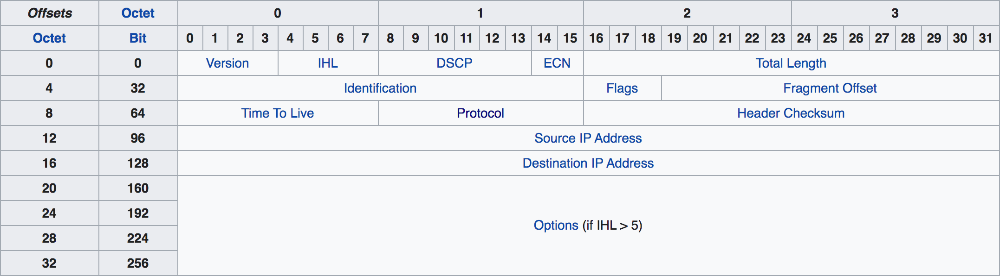

IP4 报文的报文头由 14 个属性构成，其中 13 个是必须的，第 14 个属性是可选的。


我们抓取一段 ip 报文来分析上图

这里是使用`tcpdump -i any 'ip[40:4] = 0x47455420' -A -nn -f`抓取的一段报文

```txt
0x0000:  4500 0078 78c3 4000 4006 c9cb 0ad3 3706  E..xx.@.@.....7.
0x0010:  ac14 0a04 9354 0fa0 ea3e 8d2c 98a7 3036  .....T...>.,..06
0x0020:  5018 00e5 f85b 0000 4745 5420 2f20 4854  P....[..GET./.HT
0x0030:  5450 2f31 2e31 0d0a 5573 6572 2d41 6765  TP/1.1..User-Age
0x0040:  6e74 3a20 6375 726c 2f37 2e32 392e 300d  nt:.curl/7.29.0.
0x0050:  0a48 6f73 743a 2031 3732 2e32 302e 3130  .Host:.172.20.10
0x0060:  2e34 3a34 3030 300d 0a41 6363 6570 743a  .4:4000..Accept:
0x0070:  202a 2f2a 0d0a 0d0a 0000 0000 0000 0000  .*/*............
0x0080:  0000 0000 0000 0000                      ........
```

我们根据 ip 报文头的格式截取整理一下，报文以 hex 显示，一位表示 4 个 byte

```txt
4500 0078
78c3 4000
4006 c9cb
0ad3 3706
ac14 0a04
```

1. `Version` 版本号 `4`，表示 ip4 协议
2. `IHL` ip 报文头长度，计算规则为`n * 32bits`，最小为 5，当大于 5 时，说明报文头有扩展字段，此处为`5`，表明没有扩展字段
3. `DSCP` 差分服务代码点，用以路由器进行转发时来区分优先级
4. `ECN` 拥赛指示标记，用以通知报文传输速度的调整
5. `Total Length` 报文总长度，包括报文头和报文体，最小为 20 字节，即报文头的最小长度`78`表明长度为 120 个字节
6. `Identification` 用于确认是否归属同一组报文的标记`78c3`
7. `Flags` 分组标记，占据 3 个 bits，每个 bits 的含义为：

   - bit 0: 备用位
   - bit 1: 不要分组 Don't Fragment (DF)
   - bit 2: More Fragments (MF)

   4000 转换为二进制为 0`1`00000000000000，第二个 bits 为 1，表示不需要分组

8. `Fragement Offset`指定分组的报文体相对于总报文的偏移字节量，占据 13 个 bits，最大可以表示(213 – 1) × 8 = 65,528 bytes。4000 转换为二进制为 0100000000000000，后 13 个 bits 表示的便宜量为 0
9. `Time To Live (TTL)`报文的最大保存时间，现在一般用来表示转发次数，即访问路由器的次数，每次访问一次路由器就减 1，变 0 后路由器便丢弃该报文，并发送 ICMP Time Exceeded 给发送方。`40`表示最多转发 64 次
10. `Protocol` 报文体的协议类型，详细见[rfc790](https://tools.ietf.org/html/rfc790),此处`06`表示
11. `Header Checksum` 报文校验值，通过算法计算报文得出一个值，路由器通过比对校验值，确定报文完整性
12. `Source address` 源地址，ip4 的地址一般采用点十表示法，例如`127.0.0.1`在 ip 报文传输过程中，每段 ip 地址使用 8bits 表示，所以 ip 地址每段的取值范围为`0~255`。`0ad3 3706`每两位转换为十进制则是`10.211.55.6`。转换过程大致如下所示
    
13. `Destination address` 目标地址
14. `Options` 扩展字段
