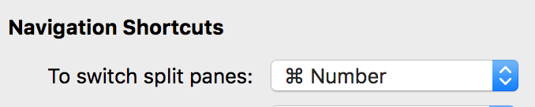

### 切换编辑模式

```shell
# Emacs mode
bindkey -e

# Vi mode
bindkey -v
```

## 自动完成

iTerm2 可以自动补齐命令，输入若干字符，按 ⌘+;弹出自动补齐窗口，列出曾经使用过的命令

## 分屏

垂直分屏：command + d

水平分屏：command + shift + d

切换屏幕：command + option + 方向键 command + [ 或 command + ]

根据编号切换屏幕

