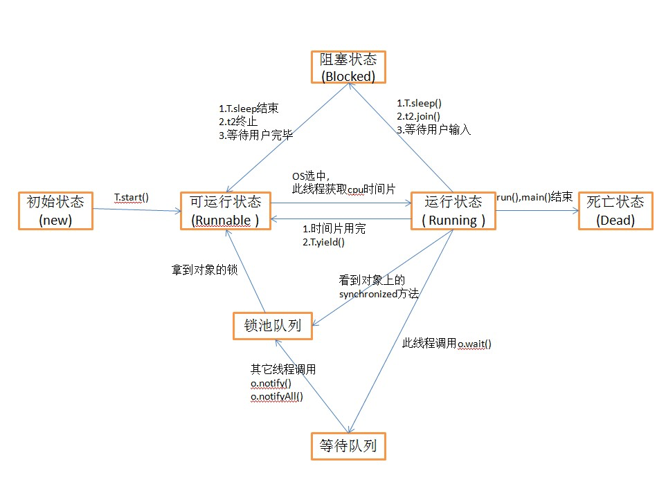
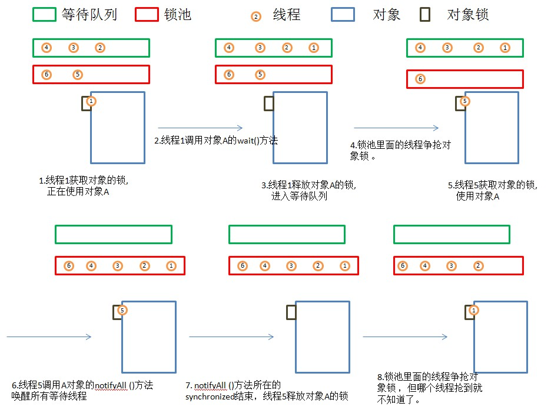
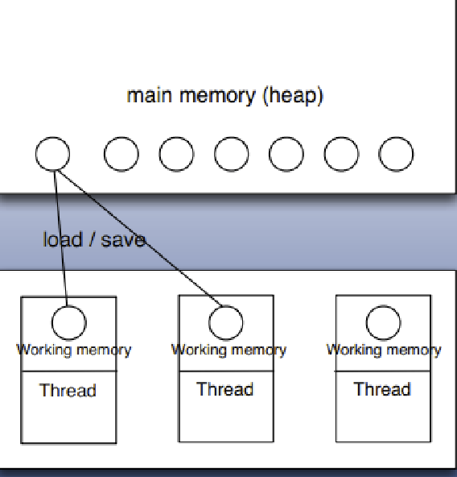
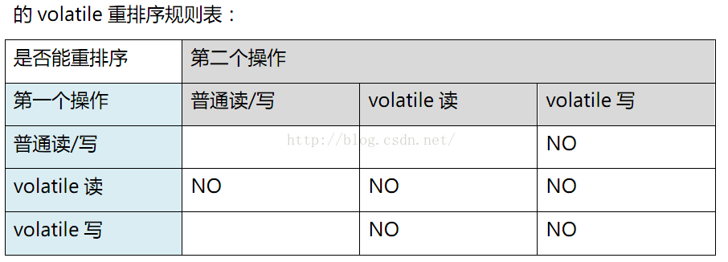

## 线程状态

### 新建(NEW)

新创建了一个线程对象。实现 Runnable 接口和继承 Thread 可以得到一个线程类，new 一个实例出来，线程就进入初始状态。

### 可运行(RUNNABLE)

线程对象创建后，由其他线程(比如 main 线程)调用了 start 方法，该状态的线程位于可运行线程池中，等待被线程调度选中，获取 CPU 的使用权。

    1. 可运行状态只说你有资格运行，CPU 调度程序没有挑选到，永远处于可运行状态。
    2. 调用线程的 start 方法，此线程进入可运行状态。
    3. 当前线程的 sleep()方法，其他线程 join 方法结束，此线程进入可运行状态。
    4. 锁池的线程获取到对象锁，此线程进入可运行状态。
    5. 当前线程时间片用完了，或者调用线程的 yield 方法，当前线程进入可运行状态。

### 运行(RUNNING)

可运行状态的线程获取了 CPU 时间片(timeslice)，执行程序代码。线程调度程序从可运行线程池中挑选一个线程作为作为当前线程所处的状态，这也是线程进入运行状态的唯一方法。

### 阻塞(BLOCKED)

阻塞状态是指线程由于某种原因放弃了 CPU 使用权，也即让出了 CPU 时间片，暂时停止运行。直到线程再次进入可运行(RUNNABLE)状态，才有机会再次获得 CPU 时间片转到运行(RUNNING)状态。阻塞的情况分三种：

    1. 等待阻塞:运行(RUNNING)状态的线程执行 wait()方法，JVM 会把该线程放入等待队列(waitting queue)中，同时释放对象的同步锁。
    2. 同步阻塞:运行(RUNNING)状态的线程在获取对象的同步锁时，若该线程的同步锁被别的线程占用，则 JVM 会把该线程放入锁池(LOCK POOL)中。
    3. 其他阻塞:运行(RUNNING)状态的线程执行 sleep 或 join 方法，JVM 会把该线程设置为阻塞(BLOCKED)状态，当 sleep 超时，join 等待线程终止或超时，该线程重新转入可运行(RUNNABLE)状态。

### 死亡(DEAD)

线程 run 方法结束，main 方法结束，或者异常原因退出了 run 方法，则该线程结束生命周期，死亡的线程不可再次复生。在一个死去的线程上调用 start 方法，会抛出 java.lang.IllegalThreadStateException 异常。

线程状态图


## 线程锁竞争过程

### 概述

线程锁竞争过程如图


1. 当前线程想调用 A 的同步方法时，发现对象 A 被别的线程占有，此时当前线程会进入锁池状态。锁池里面存放的都是想争夺对象 A 的线程。
2. 当线程 1 被另外一个线程唤醒时，会进入锁池争夺对象 A 的锁。
3. 锁池是在同步的环境下才有的概念，一个对象对应一个锁池。

### 多线程的几个方法的比较

1. Thread.sleep(long millis),一定是当前线程调用次方法，当前线程进入阻塞状态，但不释放对象锁，millis 时间到后，自动进入可运行状态。作用：给其它线程执行机会的最佳方式。
2. Thread.yield(),一定是当前线程调用次方法，当前线程放弃 CPU 时间片，由运行状态变成可运行状态。yield 不会导致阻塞，也无法保证下一次 CPU 不去挑选该线程执行。
3. t.join(long millis),当前线程==(正在 CPU 时间片执行的线程==)里调用其它线程的 join 方法，当前线程进入阻塞状态，但不会释放对象锁，当其它线程执行结束，或 millis 时间到，当前线程进入可运行状态。
4. obj.wait(),当前线程调用对象的 wait 方法，当前对象释放对象锁，进入等待队列(阻塞状态)。等待其它线程调用 notify 或 notifyAll，或者 wait(long timeout)timeout 时间到自动释放唤醒，进入锁池争夺对象锁。
5. obj.notify()唤醒在此对象监视器上等待的单个线程，选择是任意性的。notifyAll 会唤醒在此对象监视器上等待的所有线程。

### 关于中断

1. 它不会像 stop 方法一样中断一个正在运行的线程。线程会不时的监测中断标识，以判断程序是否应该被中断(中断标识值是否为 true)。中断只会影响 wait sleep join 状态的线程，被中断后会抛出 java.lang.IllegalThreadStateException 异常。
2. synchronized 在获取锁的过程中是不能被中断的。
3. 中断是一种状态，interrupt()方法只是讲讲这个状态设置为 true，所以说正常执行的代码如果不去检测中断标识，是不会被终止运行的。而 wait 等阻塞方法，会去检测并抛出异常。如果正常运行的代码添加 while(!interrupted()),则同样可以在中断后离开代码体。

### Java wait() notify()方法使用实例讲解

    1. wait()、notify()和 notifyAll()方法是本地方法，并且为 final 方法，无法被重写。
    2. 调用某个对象的 wait()方法能让当前线程阻塞，并且当前线程必须拥有此对象的 monitor（即锁，或者叫管程）
    3. 调用某个对象的 notify()方法能够唤醒一个正在等待这个对象的 monitor 的线程，如果有多个线程都在等待这个对象的 monitor，则只能唤醒其中一个线程；
    4. 调用 notifyAll()方法能够唤醒所有正在等待这个对象的 monitor 的线程；

​ 在 java 中，是没有类似于 PV 操作、进程互斥等相关的方法的。JAVA 的进程同步是通过 synchronized()来实现的，需要说明的是，Java 的 synchronized()方法类似于操作系统概念中的互斥内存块，在 Java 中的 Object 类对象中，都是带有一个内存锁的，在有线程获取该内存锁后，其它线程无法访问该内存，从而实现 Java 中简单的同步、互斥操作。明白这个原理，就能理解为什么 synchronized(this)与 synchronized(static XXX)的区别了，synchronized 就是针对内存区块申请内存锁，this 关键字代表类的一个对象，所以其内存锁是针对相同对象的互斥操作，而 static 成员属于类专有，其内存空间为该类所有成员共有，这就导致 synchronized()对 static 成员加锁，相当于对类加锁，也就是在该类的所有成员间实现互斥，在同一时间只有一个线程可访问该类的实例。如果需要在线程间相互唤醒就需要借助 Object 类的 wait()方法及 nofity()方法。

说了这么一堆，可能似懂非懂，那么接下来用一个例子来说明问题，用多线程实现连续的 1,2,1,2,1,2,1,2,1,2 输出。

    ```java

    class NumberPrint implements Runnable{
        private int number;
        public byte res[];
        public static int count = 5;
        public NumberPrint(int number, byte a[]){
            this.number = number;
            res = a;
        }
        public void run(){
            synchronized (res){
                while(count-- > 0){
                    try {
                        res.notify();//唤醒等待res资源的线程，把锁交给线程（该同步锁执行完毕自动释放锁）
                        System.out.println(" "+number);

                        res.wait();//释放CPU控制权，释放res的锁，本线程阻塞，等待被唤醒。
                        System.out.println("------线程"+Thread.currentThread().getName()+"获得锁，wait()后的代码继续运行："+number);
                    } catch (InterruptedException e) {
                        // TODO Auto-generated catch block
                        e.printStackTrace();
                    }
                }//end of while
                return;
            }//synchronized

        }
    }
    public class WaitNotify {
        public static void main(String args[]){
            final byte a[] = {0};//以该对象为共享资源
            new Thread(new NumberPrint((1),a),"1").start();
            new Thread(new NumberPrint((2),a),"2").start();
        }
    }

    ```

输出结果：

> 1
> 2
> ------线程 1 获得锁，wait()后的代码继续运行：1
> 1
> ------线程 2 获得锁，wait()后的代码继续运行：2
> 2
> ------线程 1 获得锁，wait()后的代码继续运行：1
> 1
> ------线程 2 获得锁，wait()后的代码继续运行：2

下面解释为什么会出现这样的结果：

首先 1、2 号线程启动，这里假设 1 号线程先运行 run 方法获得资源（实际上是不确定的），获得对象 a 的锁，进入 while 循环（用于控制输出几轮）：

1、此时对象调用它的唤醒方法 notify()，意思是这个同步块执行完后它要释放锁，把锁交给等待 a 资源的线程；

2、输出 1；

3、该对象执行等待方法，意思是此时此刻起拥有这个对象锁的线程（也就是这里的 1 号线程）释放 CPU 控制权，释放锁，并且线程进入阻塞状态，后面的代码暂时不执行，因未执行完同步块，所以 1 也没起作用；

4、在这之前的某时刻线程 2 运行 run 方法，但苦于没有获得 a 对象的锁，所以无法继续运行，但 3 步骤之后，它获得了 a 的锁，此时执行 a 的唤醒方法 notify(),同理，意思是这个同步块执行完后它要释放锁，把锁交给等待 a 资源的线程；

5、输出 2；

6、执行 a 的等待方法，意思是此时此刻起拥有这个对象锁的线程（也就是这里的 2 号线程）释放 CPU 控制权，释放锁，并且线程进入阻塞状态，后面的代码暂时不执行，因未执行完同步块，所以 2 号线程的 4 步骤的唤醒方法也没起作用；

7、此时 1 号线程执行到 3 步骤，发现对象锁没有被使用，所以继续执行 3 步骤中 wait 方法后面的代码，于是输出：------线程 1 获得锁，wait()后的代码继续运行：1；

8、此时 while 循环满足条件，继续执行，所以，再执行 1 号线程的唤醒方法，意思是这个同步块执行完后它要释放锁；

9、输出 1；

10、执行等待方法，线程 1 阻塞，释放资源锁；

11、此时线程 2 又获得了锁，执行到步骤 6，继续执行 wait 方法后面的代码，所以输出：------线程 2 获得锁，wait()后的代码继续运行：2；

12、继续执行 while 循环，输出 2；

··· ···

通过上述步骤，相信大家已经明白这两个方法的使用了，但该程序还存在一个问题，当 while 循环不满足条件时，肯定会有线程还在等待资源，所以主线程一直不会终止。当然这个程序的目的仅仅为了给大家演示这两个方法怎么用。

总结：

​ wait()方法与 notify()必须要与 synchronized(resource)一起使用。也就是 wait 与 notify 针对已经获取了 resource 锁的线程进行操作，从语法角度来说就是 Obj.wait(),Obj.notify 必须在 synchronized(Obj){...}语句块内。从功能上来说 wait()线程在获取对象锁后，主动释放 CPU 控制权，主动释放对象锁，同时本线程休眠。直到有其它线程调用对象的 notify()唤醒该线程，才能继续获取对象锁，并继续执行。相应的 notify()就是对对象锁的释放操作。【因此，我们可以发现，wait 和 notify 方法均可释放对象的锁，但 wait 同时释放 CPU 控制权，即它后面的代码停止执行，线程进入阻塞状态，而 notify 方法不立刻释放 CPU 控制权，而是在相应的 synchronized(){}语句块执行结束，再自动释放锁。】释放锁后，JVM 会在等待 resoure 的线程中选取一线程，赋予其对象锁，唤醒线程，继续执行。这样就提供了在线程间同步、唤醒的操作。Thread.sleep()与 Object.wait()二者都可以暂停当前线程，释放 CPU 控制权，主要的区别在于 Object.wait()在释放 CPU 同时，释放了对象锁的控制，而在同步块中的 Thread.sleep()方法并不释放锁，仅释放 CPU 控制权。

## volatile

多线程的内存模型，main memory(主存)，working memory(线程栈)，在处理数据时，线程会把值从主存 load 到本地栈，完成操作后，再 save 回去。(volatile 关键字的作用就是在一个 CPU 时间片内，针对变量的操作都触发一次完整的 load 和 save)。针对多线程使用的变量如果不是 volatile 或 final 修饰的，可能发生不可预料的后果(某个线程修改了变量，但之后的线程 load 到的是变量修改前的数据)。其实本质上来说，同一实例的同一属性只会有一个副本，但多线程会缓存值，volatile 的作用就是不去缓存值。在线程安全的情况下，用 volatile 会牺牲性能。


volatile 底层实现最终是加了内存屏障


    1. 保证写 volatile 变量强制把 CPU 写缓存区的数据刷新到内存
    2. 读 volatile 变量时，使缓存失效，强制从内存中读取数据。
    3. 由于内存屏障的作用，volatile 变量还能阻止重排序。

## 指令重排

现代处理器都会采用指令乱序执行(Out of Order Execution ，简称 OOE)的方法，直接运行当前有能力立即执行的后续指令，避开获取下一条指令所需数据的等待，通过乱序执行的技术，处理器可以大大提高执行效率

### AS-IF-SERIAL

所有的动作(aciton)都可以为了优化而被重新排序，但是必须保证它们重新排序后的执行结果和程序代码本身应有的结果一致。Java 编译器，运行时和处理器都会保证单线程运行下的 as-if-serial 语义。为了保证这一语义，重排序不会发生在有数据依赖的操作中。

    ```java
    int a = 1;
    int b = 1;
    int c = a + b;
    ```

将上面的代码编译成 java 字节码或生成机器指令，可视为以下几步动作(实际可能会忽略或添加某些步骤)

> 对 a 赋值 1
> 对 b 赋值 1
> 取 a 值
> 取 b 值
> 取到的两值相加后赋值给 c

在上面 5 个操作，操作 1 可能和操作 2、操作 4 重排序，操作 2 可能和操作 1、操作 3 重排序，操作 3 可能和操作 2、操作 4 重排序，操作 4 可能和操作 1、操作 3 重排序。但操作 1 不能和操作 3、操作 5 重排序，操作 2 不能和操作 4、操作 5 重排序。因为它们存在数据依赖性，一旦重排序， as-if-serial 语义无法得到保证。

### 内存屏障

由于现代的处理器系统都是多处理器，而每一个处理器都有自己的缓存，并且这些缓存并不是实时和内存发生信息交换，这样就可能出现一个 CPU 的缓存数据和另一个 CPU 缓存数据不一致的问题。而这样在多线程开发中，就有可能造成一些异常问题。

而操作系统底层为了解决这样的问题，提供了一些内存屏障解决这些问题，目前有四种内存屏障

1. LoadLoad 内存屏障:对于这样的语句 Load1 LoadLoad Load2 ，在 Load2 及后续操作要读取的数据被访问前，保证 Load1 要读取的数据加载完成。
2. StoreStore 内存屏障:对于这样的语句 Store1 StoreStore Store2，在 Store2 及后续写入操作执行前，保证 Store1 的写入操作对其它处理器可见。
3. LoadStore 内存屏障:对于这样的语句 Load1 LoadStore Store2，在 Store2 及后续写入操作执行前，保证 Load1 要读取的数据加载完成。
4. StoreLoad 内存屏障:对于这样的语句 Store1 StoreLoad Load2，在 Load2 及后续操作要读取的数据被访问前，保证 Store1 的写入操作对其它处理器可见。

### 使用

1. 通过 synchronized 关键词包含的代码区域，当线程进入该区域读取变量信息时，保证读取到的是最新的值。这是因为在同步区内的写入操作，在离开同步区时就将当前线程的数据刷新到内存中，而对数据的读取也不能从缓存中读取，只能从内存中读取，这样就保证了数据读取的有效性，这就插入了 StoreStore 内存屏障。
2. 使用了 volatile 关键字修饰的变量，在进行写入操作时，会插入 StoreLoad 内存屏障。
3. Unsafe.putOrderedObject 类似这样的方法,会插入 StoreStore 内存屏障
4. Unsafe.putVolatiObject 则是插入了 StoreLoad 屏障
