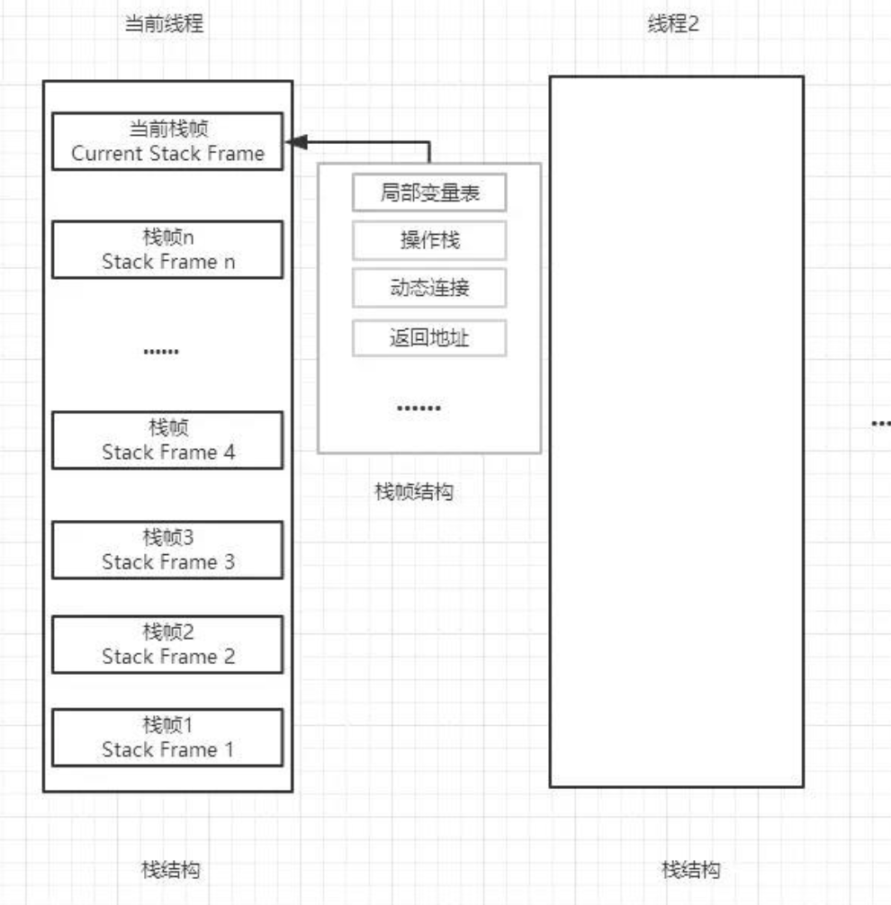
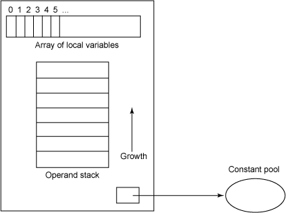
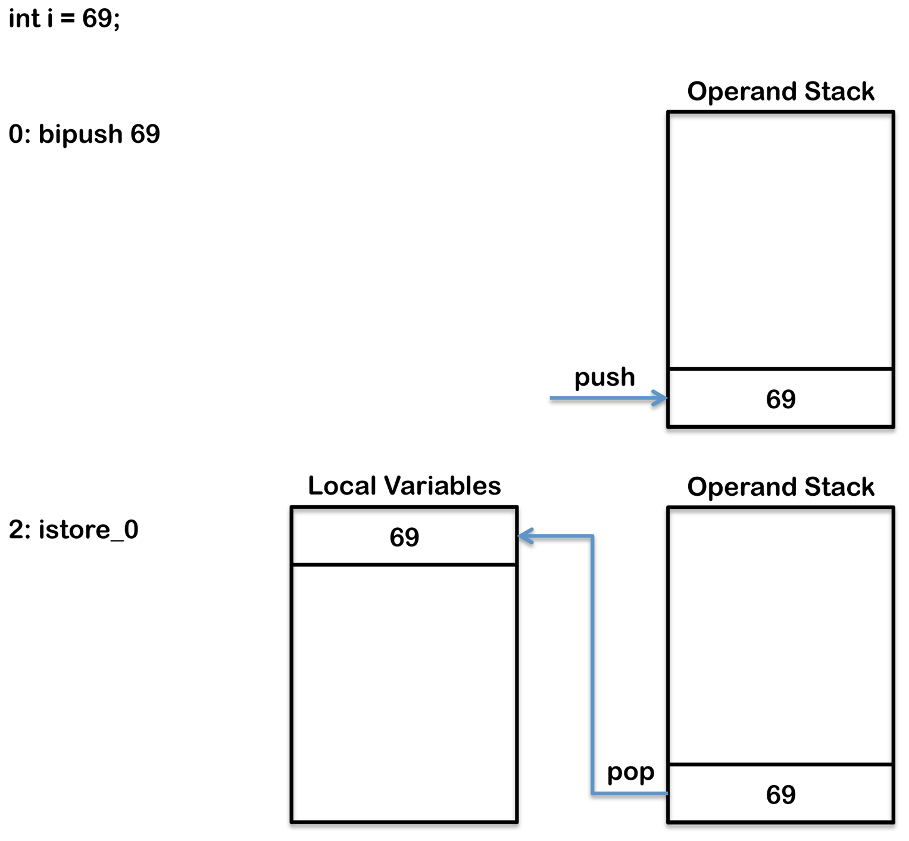
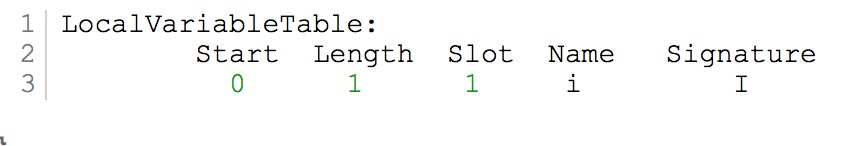
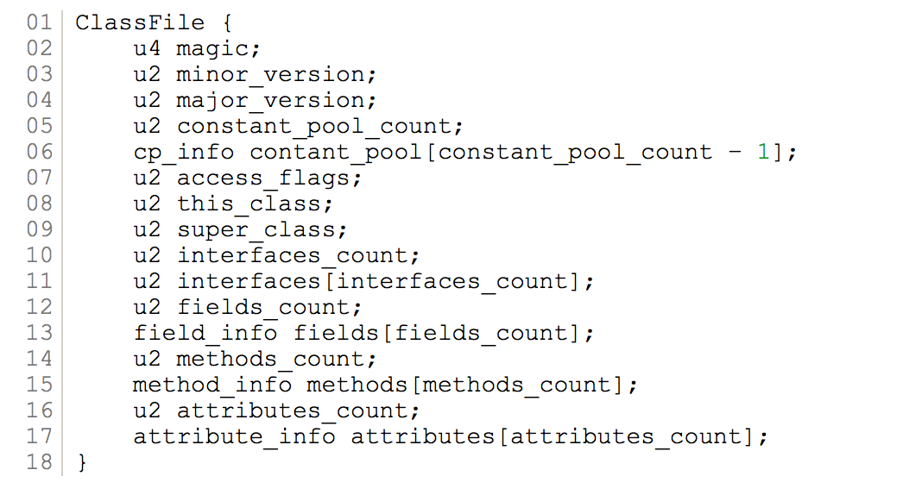
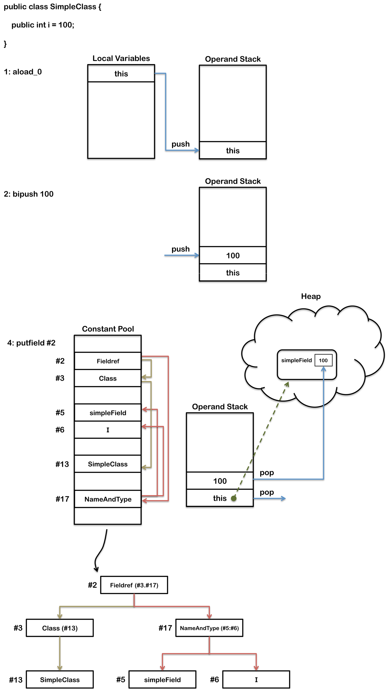
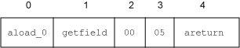
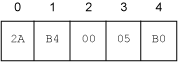

## 基础概念

`JVM`是一个基于栈的架构，每一个线程都有一个用来存储帧集`(frames)`的`JVM` 栈，每次方法被调用的时候(包含`main`方法)，在栈上会分配一个新的帧。这个帧包含局部变量数组，操作数栈，常量池指针,程序计数器，动态链接，返回地址。
从概念来说，帧的情况如下图所示



## 变量

### 局部变量

局部变量的数组也称为局部变量表，包括方法的参数，它也可以用来存储局部变量的值。首先存放的参数，从地址 0 开始编码。如果帧是一个构造器或者实例方法，`this`引用讲存储在地址 0 中，地址 1 存放第一个参数，地址 2 存放第二个参数，依次类推。如果帧是一个静态方法，第一个方法参数会存在地址 0 中，地址 1 存放第二个参数，依次类推。

局部变量数组的大小是在编译期决定的，它取决于局部变量和正常方法参数的数量和大小。操作栈是一个用于`push` 和`pop` 值的后进先出的栈，它的大小也是在编译器决定的。一些操作码指令将值`push` 到操作栈，其它的操作码从栈上获取操作数，操作它们，并将值`push` 回去。操作栈常用来接收方法的返回值。

局部变量可以是以下几种类型：

> char
> long
> short
> int
> double
> float
> 引用
> 返回地址

除了`long`和`double`类型，每个变量都只占用局部变量区中的一个变量槽(`slot`)，而`long`和 `double`只所以会占用两个变量槽(`slot`)，因为`long`和`double`是 64 位的。

当一个新的变量创建时，操作数栈(`Operand stack`)会存储这个新变量的值。然后这个变量会被存储到局部变量表中对应的位置上。如果这个变量不是基础类型的话，局部变量槽存的就是一个引用，这个引用指向堆中的一个对象。

比如

```java
int i = 5;
```

编译后就变成了

```java
0: bipush      5 //用来将一个字节作为整型数字压入操作数栈中，在这里5就会被压入操作数栈上。
2: istore_0 //这是istore_这组指令集（译注：严格来说，这个应该叫做操作码，opcode ,指令是指操作码加上对应的操作数，oprand。不过操作码一般作为指令的助记符，这里统称为指令）中的一条，这组指令是将一个整型数字存储到局部变量中。n代表的是局部变量区中的位置，并且只能是0,1,2,3。再多的话只能用另一条指令istore了，这条指令会接受一个操作数，对应的是局部变量区中的位置信息。
```

这条指令执行的时候，内存布局是这样的：


每个方法都包含一个局部变量表，如果这段代码在一个方法里面的话，你会在方法的局部变量表中发现如下信息


### 类字段

java 类里面的字段作为类对象实例的一部分，存储在堆里(类变量存储在对应类对象里)。关于字段的信息会添加到类的`field_info` 数组里，像下面这样



另外如果变量被初始化了，那么初始化的字节码会添加到构造方法里。
下面这段代码编译之后：

```java
public class SimpleClass {
    public int simpleField = 100;
}
```

如果你用 javap 进行反编译，这个被添加到了 field_info 数组里的字段就会多了一段描述：

```java
public int simpleField;
    Signature: I
    flags: ACC_PUBLIC
```

初始化变量的字节码会被加到构造方法里，像下面这样：

```java
public SimpleClass();
  Signature: ()V
  flags: ACC_PUBLIC
  Code:
    stack=2, locals=1, args_size=1
       0: aload_0
       1: invokespecial #1                  // Method java/lang/Object."<init>":()V
       4: aload_0
       5: bipush        100
       7: putfield      #2                  // Field simpleField:I
      10: return
```

上述代码执行的时候内存里面是这样的：


这里的 putfield 指令的操作数引用的常量池里的第二个位置，JVM 会为每个类型维护一个常量池，运行时的数据结构有点类似一个符号表，尽管它包含的信息更多。java 的字节码操作需要对应的数据，但是这些数据太大了，存储在字节码里不合适，它们都被存储在常量池里，而字节码包含一个常量池的引用，当类文件生成的时候，其中一块就是常量池

```java
Constant pool:
   #1 = Methodref          #4.#16         //  java/lang/Object."<init>":()V
   #2 = Fieldref           #3.#17         //  SimpleClass.simpleField:I
   #3 = Class              #13            //  SimpleClass
   #4 = Class              #19            //  java/lang/Object
   #5 = Utf8               simpleField
   #6 = Utf8               I
   #7 = Utf8               <init>
   #8 = Utf8               ()V
   #9 = Utf8               Code
  #10 = Utf8               LineNumberTable
  #11 = Utf8               LocalVariableTable
  #12 = Utf8               this
  #13 = Utf8               SimpleClass
  #14 = Utf8               SourceFile
  #15 = Utf8               SimpleClass.java
  #16 = NameAndType        #7:#8          //  "<init>":()V
  #17 = NameAndType        #5:#6          //  simpleField:I
  #18 = Utf8               LSimpleClass;
  #19 = Utf8               java/lang/Object
```

### 常量字段（类常量）

带有`final`标记的常量字段在`class`文件里会被标记成`ACC_FINAL`.

```java
public class SimpleClass {
    public int simpleField = 100;
}
```

字段的描述信息会标记成`ACC_FINAL`:

```java
public static final int simpleField = 100;
    Signature: I
    flags: ACC_PUBLIC, ACC_FINAL
    ConstantValue: int 100
```

对应的初始化代码并不变：

```java
4: aload_0
5: bipush        100
7: putfield      #2                  // Field simpleField:I
```

### 静态变量

带有`static`修饰符的静态变量则会被标记成`ACC_STATIC`：

```java
public static int simpleField;
    Signature: I
    flags: ACC_PUBLIC, ACC_STATIC
```

不过在实例的构造方法中却再也找不到对应的初始化代码了。因为`static`变量会在类的构造方法中进行初始化，并且它用的是`putstatic`指令而不是`putfiled`。

```java
static {};
  Signature: ()V
  flags: ACC_STATIC
  Code:
    stack=1, locals=0, args_size=0
       0: bipush         100
       2: putstatic      #2                  // Field simpleField:I
       5: return
```

### 动态链接

每个栈帧都包含一个指向运行时常量池中该栈帧所属方法的引用，持有该引用是为了支持方法调用过程中的动态连接。

动态分派在 Java 中被大量使用，使用频率及其高，如果在每次动态分派的过程中都要重新在类的方法元数据中搜索合适的目标的话就可能影响到执行效率，因此 JVM 在类的方法区中建立虚方法表（virtual method table）来提高性能。每个类中都有一个虚方法表，表中存放着各个方法的实际入口。如果某个方法在子类中没有被重写，那子类的虚方法表中该方法的地址入口和父类该方法的地址入口一样，即子类的方法入口指向父类的方法入口。如果子类重写父类的方法，那么子类的虚方法表中该方法的实际入口将会被替换为指向子类实现版本的入口地址。  
那么虚方法表什么时候被创建？虚方法表会在类加载的连接阶段被创建并开始初始化，类的变量初始值准备完成之后，JVM 会把该类的方法表也初始化完毕。

### 程序计数器

决定当前执行的指令

### 示例

#### 对于一个简单的类我们分析一下其字节码

```java
public class Test {
    private String employeeName;

    public String employeeName(){
        return this.employeeName;
    }
}
```

查看其字节码

```java
Classfile /Users/li/Downloads/Test.class
  Last modified Mar 15, 2018; size 309 bytes
  MD5 checksum 4553b41dee731dd099687198deb75de7
  Compiled from "Test.java"
public class Test
  minor version: 0
  major version: 52
  flags: ACC_PUBLIC, ACC_SUPER
Constant pool:
   #1 = Methodref          #4.#15         // java/lang/Object."<init>":()V
   #2 = Fieldref           #3.#16         // Test.name:Ljava/lang/String;
   #3 = Class              #17            // Test
   #4 = Class              #18            // java/lang/Object
   #5 = Utf8               name
   #6 = Utf8               Ljava/lang/String;
   #7 = Utf8               <init>
   #8 = Utf8               ()V
   #9 = Utf8               Code
  #10 = Utf8               LineNumberTable
  #11 = Utf8               employeeName
  #12 = Utf8               ()Ljava/lang/String;
  #13 = Utf8               SourceFile
  #14 = Utf8               Test.java
  #15 = NameAndType        #7:#8          // "<init>":()V
  #16 = NameAndType        #5:#6          // name:Ljava/lang/String;
  #17 = Utf8               Test
  #18 = Utf8               java/lang/Object
{
  java.lang.String name;
    descriptor: Ljava/lang/String;
    flags:

  public Test();
    descriptor: ()V
    flags: ACC_PUBLIC
    Code:
      stack=1, locals=1, args_size=1
         0: aload_0
         1: invokespecial #1                  // Method java/lang/Object."<init>":()V
         4: return
      LineNumberTable:
        line 1: 0

  public java.lang.String employeeName();
    descriptor: ()Ljava/lang/String;
    flags: ACC_PUBLIC
    Code:
      stack=1, locals=1, args_size=1
         0: aload_0
         1: getfield      #2                  // Field name:Ljava/lang/String;
         4: areturn
      LineNumberTable:
        line 4: 0
}
SourceFile: "Test.java"
```

这个方法(line 44)的字节码有三个操作码组成。

1. 第一个操作码 aload_0，用于将局部变量表中索引为 0 的变量的值推送到操作栈上。前面提到过，局部变量表可以用来为方法传递参数的，构造器和实例方法的 this 引用总是存放在局部变量表的地址 0 处，this 引用必须入栈，因为方法需要访问实例的数据，名称和类。
2. 第二个操作码 getfield，用于从对象中提取字段。当该操作码执行的时候，操作栈顶的值就会弹出(pop)，然后＃2 就用来在类运行时常量池中构建一个用于存放字段 name 引用地址的索引，当这个引用被提取时，它会被推送到操作栈上。
3. 第三个操作码 areturn，返回一个来自方法的引用。比较特殊的是，areturn 的执行会导致操作栈顶的值，name 字段的 引用都会被弹出，然后推送到调用方法的操作栈。

employeeName 的方法相当简单，在考虑一个更复杂的例子之前，我们需要检查每一个操作码左边的值。在 employeeName 的方法的字节码中，这些值是 0，1，4。每个方法都有一个对应的字节码数组。这些值对应每个操作码和它们在参数数组的索引，一些操作码含有参数，这些参数会占据字节数组的空间。aload_0 没有参数，自然而然就占据一个字节，因此，下一个操作码 getfield，就在位置 1 上，然而 areturn 在位置 4 上，因为 getfield 操作码和他的参数占据了位置 1，2，3。位置 1 被操作码 getfield 使用，位置 2，3 被用于存放参数，这些参数用于构成在类运行时常量池中存放值的地方的一个索引。下面的图，展示了 employeeName 的方法的字节码数数组看起来的样子

实际上，字节码数组包含代表指令的字节。使用一个 16 进制的编辑器查看 class 文件，可能看到字节码数组中有下面的值


#### 通过字节码分析`synchronized`方法和`synchronized`代码块的区别

```java
public synchronized int top1()
{
  return intArr[0];
}
public int top2()
{
 synchronized (this) {
  return intArr[0];
 }
}
```

```java
Method int top1()
   0 aload_0           //将局部变量表中索引为0的对象引用this入栈。

   1 getfield #6 <Field int intArr[]>
                       //弹出对象引用this，将访问常量池的intArr对象引用入栈。

   4 iconst_0          //将0入栈。
   5 iaload            //弹出栈顶的两个值，将intArr中索引为0的值入栈。

   6 ireturn           //弹出栈顶的值，将其压入调用方法的操作栈，并退出。


Method int top2()
   0 aload_0           //将局部变量表中索引为0的对象引用this入栈。
   1 astore_2          //弹出this引用，存放到局部变量表中索引为2的地方。
   2 aload_2           //将this引用入栈。
   3 monitorenter      //弹出this引用，获取对象的监视器。

   4 aload_0           //开始进入同步块。将this引用压入局部变量表索引为0的地方。

   5 getfield #6 <Field int intArr[]>
                       //弹出this引用，压入访问常量池的intArr引用。

   8 iconst_0          //压入0。
   9 iaload            //弹出顶部的两个值，压入intArr索引为0的值。

  10 istore_1          //弹出值，将它存放到局部变量表索引为1的地方。

  11 jsr 19            //压入下一个操作码(14)的地址，并跳转到位置19。
  14 iload_1           //压入局部变量表中索引为1的值。

  15 ireturn           //弹出顶部的值，并将其压入到调用方法的操作栈中，退出。

  16 aload_2           //同步块结束。将this引用压入到局部变量表索引为2的地方。

  17 monitorexit       //弹出this引用，退出监视器。

  18 athrow            //弹出this引用，抛出异常。

  19 astore_3          //弹出返回地址(14)，并将其存放到局部变量表索引为3的地方。

  20 aload_2           //将this引用压入到局部变量索引为2的地方。

  21 monitorexit       //弹出this引用，并退出监视器。

  22 ret 3             //从局部变量表索引为3的值(14)指示的地方返回。
Exception table:       //如果在位置4(包括4)和位置16(排除16)中出现异常，则跳转到位置16.
from to target type
 4   16   16   any
```

top2 比 top1 大，执行还慢，是因为 top2 采取的同步和异常处理方式。注意到 top1 采用 synchronized 方法修饰符，这不会产生额外的字节码。相反 top2 在方法体内使用 synchronized 同步代码块，会产生 monitorenter 和 monitorexit 操作码的字节码，还有额外的用于处理异常的字节码。如果执行到一个同步锁的块(一个监视器)内部时，抛出了一个异常，这个锁要保证在退出同步代码块前被释放。top1 的实现要比 top2 的效率高一些，这能获取一丁点的性能提升。

当 synchronized 方法修饰符出现的时候，锁的获取和释放不是通过 monitorenter 和 monitorexit 操作码来实现的，而是在 JVM 调用一个方法时，它检查 ACC_SYNCHRONIZED 属性的标识。如果有这个标识，正在执行的线程将会先获取一个锁，调用方法然后在方法返回时释放锁。如果同步方法抛出异常，在异常离开方法前会自动释放锁。

## 常用字节码指令集

_Note that any referenced "value" refers to a 32-bit int as per the Java instruction set._

|    Mnemonic     | Opcode _(in hex)_ | Opcode (in binary) |                                                                         Other bytes [count]: [operand labels]                                                                         |                                  Stack [before]→[after]                                   | Description                                                                                                                                                                                                                                                            |
| :-------------: | :---------------: | :----------------: | :-----------------------------------------------------------------------------------------------------------------------------------------------------------------------------------: | :---------------------------------------------------------------------------------------: | :--------------------------------------------------------------------------------------------------------------------------------------------------------------------------------------------------------------------------------------------------------------------- |
|   _(no name)_   |       cb-fd       |                    |                                                                                                                                                                                       |                                                                                           | these values are currently unassigned for opcodes and are reserved for future use                                                                                                                                                                                      |
|     aaload      |        32         |     0011 0010      |                                                                                                                                                                                       |                                  arrayref, index → value                                  | load onto the stack a reference from an array                                                                                                                                                                                                                          |
|     aastore     |        53         |     0101 0011      |                                                                                                                                                                                       |                                 arrayref, index, value →                                  | store into a reference in an array                                                                                                                                                                                                                                     |
|   aconst_null   |        01         |     0000 0001      |                                                                                                                                                                                       |                                          → null                                           | push a _null_ reference onto the stack                                                                                                                                                                                                                                 |
|      aload      |        19         |     0001 1001      |                                                                                       1: index                                                                                        |                                        → objectref                                        | load a reference onto the stack from a local variable _#index_                                                                                                                                                                                                         |
|     aload_0     |        2a         |     0010 1010      |                                                                                                                                                                                       |                                        → objectref                                        | load a reference onto the stack from local variable 0                                                                                                                                                                                                                  |
|     aload_1     |        2b         |     0010 1011      |                                                                                                                                                                                       |                                        → objectref                                        | load a reference onto the stack from local variable 1                                                                                                                                                                                                                  |
|     aload_2     |        2c         |     0010 1100      |                                                                                                                                                                                       |                                        → objectref                                        | load a reference onto the stack from local variable 2                                                                                                                                                                                                                  |
|     aload_3     |        2d         |     0010 1101      |                                                                                                                                                                                       |                                        → objectref                                        | load a reference onto the stack from local variable 3                                                                                                                                                                                                                  |
|    anewarray    |        bd         |     1011 1101      |                                                                               2: indexbyte1, indexbyte2                                                                               |                                     count → arrayref                                      | create a new array of references of length _count_ and component type identified by the class reference _index_ (indexbyte1 << 8 + indexbyte2) in the constant pool                                                                                                    |
|     areturn     |        b0         |     1011 0000      |                                                                                                                                                                                       |                                    objectref → [empty]                                    | return a reference from a method                                                                                                                                                                                                                                       |
|   arraylength   |        be         |     1011 1110      |                                                                                                                                                                                       |                                     arrayref → length                                     | get the length of an array                                                                                                                                                                                                                                             |
|     astore      |        3a         |     0011 1010      |                                                                                       1: index                                                                                        |                                        objectref →                                        | store a reference into a local variable _#index_                                                                                                                                                                                                                       |
|    astore_0     |        4b         |     0100 1011      |                                                                                                                                                                                       |                                        objectref →                                        | store a reference into local variable 0                                                                                                                                                                                                                                |
|    astore_1     |        4c         |     0100 1100      |                                                                                                                                                                                       |                                        objectref →                                        | store a reference into local variable 1                                                                                                                                                                                                                                |
|    astore_2     |        4d         |     0100 1101      |                                                                                                                                                                                       |                                        objectref →                                        | store a reference into local variable 2                                                                                                                                                                                                                                |
|    astore_3     |        4e         |     0100 1110      |                                                                                                                                                                                       |                                        objectref →                                        | store a reference into local variable 3                                                                                                                                                                                                                                |
|     athrow      |        bf         |     1011 1111      |                                                                                                                                                                                       |                              objectref → [empty], objectref                               | throws an error or exception (notice that the rest of the stack is cleared, leaving only a reference to the Throwable)                                                                                                                                                 |
|     baload      |        33         |     0011 0011      |                                                                                                                                                                                       |                                  arrayref, index → value                                  | load a byte or Boolean value from an array                                                                                                                                                                                                                             |
|     bastore     |        54         |     0101 0100      |                                                                                                                                                                                       |                                 arrayref, index, value →                                  | store a byte or Boolean value into an array                                                                                                                                                                                                                            |
|     bipush      |        10         |     0001 0000      |                                                                                        1: byte                                                                                        |                                          → value                                          | push a _byte_ onto the stack as an integer _value_                                                                                                                                                                                                                     |
|   breakpoint    |        ca         |     1100 1010      |                                                                                                                                                                                       |                                                                                           | reserved for breakpoints in Java debuggers; should not appear in any class file                                                                                                                                                                                        |
|     caload      |        34         |     0011 0100      |                                                                                                                                                                                       |                                  arrayref, index → value                                  | load a char from an array                                                                                                                                                                                                                                              |
|     castore     |        55         |     0101 0101      |                                                                                                                                                                                       |                                 arrayref, index, value →                                  | store a char into an array                                                                                                                                                                                                                                             |
|    checkcast    |        c0         |     1100 0000      |                                                                               2: indexbyte1, indexbyte2                                                                               |                                   objectref → objectref                                   | checks whether an _objectref_ is of a certain type, the class reference of which is in the constant pool at _index_ (indexbyte1 << 8 + indexbyte2)                                                                                                                     |
|       d2f       |        90         |     1001 0000      |                                                                                                                                                                                       |                                      value → result                                       | convert a double to a float                                                                                                                                                                                                                                            |
|       d2i       |        8e         |     1000 1110      |                                                                                                                                                                                       |                                      value → result                                       | convert a double to an int                                                                                                                                                                                                                                             |
|       d2l       |        8f         |     1000 1111      |                                                                                                                                                                                       |                                      value → result                                       | convert a double to a long                                                                                                                                                                                                                                             |
|      dadd       |        63         |     0110 0011      |                                                                                                                                                                                       |                                  value1, value2 → result                                  | add two doubles                                                                                                                                                                                                                                                        |
|     daload      |        31         |     0011 0001      |                                                                                                                                                                                       |                                  arrayref, index → value                                  | load a double from an array                                                                                                                                                                                                                                            |
|     dastore     |        52         |     0101 0010      |                                                                                                                                                                                       |                                 arrayref, index, value →                                  | store a double into an array                                                                                                                                                                                                                                           |
|      dcmpg      |        98         |     1001 1000      |                                                                                                                                                                                       |                                  value1, value2 → result                                  | compare two doubles                                                                                                                                                                                                                                                    |
|      dcmpl      |        97         |     1001 0111      |                                                                                                                                                                                       |                                  value1, value2 → result                                  | compare two doubles                                                                                                                                                                                                                                                    |
|    dconst_0     |        0e         |     0000 1110      |                                                                                                                                                                                       |                                           → 0.0                                           | push the constant _0.0_ (a _double_) onto the stack                                                                                                                                                                                                                    |
|    dconst_1     |        0f         |     0000 1111      |                                                                                                                                                                                       |                                           → 1.0                                           | push the constant _1.0_ (a _double_) onto the stack                                                                                                                                                                                                                    |
|      ddiv       |        6f         |     0110 1111      |                                                                                                                                                                                       |                                  value1, value2 → result                                  | divide two doubles                                                                                                                                                                                                                                                     |
|      dload      |        18         |     0001 1000      |                                                                                       1: index                                                                                        |                                          → value                                          | load a double _value_ from a local variable _#index_                                                                                                                                                                                                                   |
|     dload_0     |        26         |     0010 0110      |                                                                                                                                                                                       |                                          → value                                          | load a double from local variable 0                                                                                                                                                                                                                                    |
|     dload_1     |        27         |     0010 0111      |                                                                                                                                                                                       |                                          → value                                          | load a double from local variable 1                                                                                                                                                                                                                                    |
|     dload_2     |        28         |     0010 1000      |                                                                                                                                                                                       |                                          → value                                          | load a double from local variable 2                                                                                                                                                                                                                                    |
|     dload_3     |        29         |     0010 1001      |                                                                                                                                                                                       |                                          → value                                          | load a double from local variable 3                                                                                                                                                                                                                                    |
|      dmul       |        6b         |     0110 1011      |                                                                                                                                                                                       |                                  value1, value2 → result                                  | multiply two doubles                                                                                                                                                                                                                                                   |
|      dneg       |        77         |     0111 0111      |                                                                                                                                                                                       |                                      value → result                                       | negate a double                                                                                                                                                                                                                                                        |
|      drem       |        73         |     0111 0011      |                                                                                                                                                                                       |                                  value1, value2 → result                                  | get the remainder from a division between two doubles                                                                                                                                                                                                                  |
|     dreturn     |        af         |     1010 1111      |                                                                                                                                                                                       |                                      value → [empty]                                      | return a double from a method                                                                                                                                                                                                                                          |
|     dstore      |        39         |     0011 1001      |                                                                                       1: index                                                                                        |                                          value →                                          | store a double _value_ into a local variable _#index_                                                                                                                                                                                                                  |
|    dstore_0     |        47         |     0100 0111      |                                                                                                                                                                                       |                                          value →                                          | store a double into local variable 0                                                                                                                                                                                                                                   |
|    dstore_1     |        48         |     0100 1000      |                                                                                                                                                                                       |                                          value →                                          | store a double into local variable 1                                                                                                                                                                                                                                   |
|    dstore_2     |        49         |     0100 1001      |                                                                                                                                                                                       |                                          value →                                          | store a double into local variable 2                                                                                                                                                                                                                                   |
|    dstore_3     |        4a         |     0100 1010      |                                                                                                                                                                                       |                                          value →                                          | store a double into local variable 3                                                                                                                                                                                                                                   |
|      dsub       |        67         |     0110 0111      |                                                                                                                                                                                       |                                  value1, value2 → result                                  | subtract a double from another                                                                                                                                                                                                                                         |
|       dup       |        59         |     0101 1001      |                                                                                                                                                                                       |                                   value → value, value                                    | duplicate the value on top of the stack                                                                                                                                                                                                                                |
|      dup2       |        5c         |     0101 1100      |                                                                                                                                                                                       |                   {value2, value1} → {value2, value1}, {value2, value1}                   | duplicate top two stack words (two values, if value1 is not double nor long; a single value, if value1 is double or long)                                                                                                                                              |
|     dup2_x1     |        5d         |     0101 1101      |                                                                                                                                                                                       |           value3, {value2, value1} → {value2, value1}, value3, {value2, value1}           | duplicate two words and insert beneath third word (see explanation above)                                                                                                                                                                                              |
|     dup2_x2     |        5e         |     0101 1110      |                                                                                                                                                                                       | {value4, value3}, {value2, value1} → {value2, value1}, {value4, value3}, {value2, value1} | duplicate two words and insert beneath fourth word                                                                                                                                                                                                                     |
|     dup_x1      |        5a         |     0101 1010      |                                                                                                                                                                                       |                          value2, value1 → value1, value2, value1                          | insert a copy of the top value into the stack two values from the top. value1 and value2 must not be of the type double or long.                                                                                                                                       |
|     dup_x2      |        5b         |     0101 1011      |                                                                                                                                                                                       |                  value3, value2, value1 → value1, value3, value2, value1                  | insert a copy of the top value into the stack two (if value2 is double or long it takes up the entry of value3, too) or three values (if value2 is neither double nor long) from the top                                                                               |
|       f2d       |        8d         |     1000 1101      |                                                                                                                                                                                       |                                      value → result                                       | convert a float to a double                                                                                                                                                                                                                                            |
|       f2i       |        8b         |     1000 1011      |                                                                                                                                                                                       |                                      value → result                                       | convert a float to an int                                                                                                                                                                                                                                              |
|       f2l       |        8c         |     1000 1100      |                                                                                                                                                                                       |                                      value → result                                       | convert a float to a long                                                                                                                                                                                                                                              |
|      fadd       |        62         |     0110 0010      |                                                                                                                                                                                       |                                  value1, value2 → result                                  | add two floats                                                                                                                                                                                                                                                         |
|     faload      |        30         |     0011 0000      |                                                                                                                                                                                       |                                  arrayref, index → value                                  | load a float from an array                                                                                                                                                                                                                                             |
|     fastore     |        51         |     0101 0001      |                                                                                                                                                                                       |                                 arrayref, index, value →                                  | store a float in an array                                                                                                                                                                                                                                              |
|      fcmpg      |        96         |     1001 0110      |                                                                                                                                                                                       |                                  value1, value2 → result                                  | compare two floats                                                                                                                                                                                                                                                     |
|      fcmpl      |        95         |     1001 0101      |                                                                                                                                                                                       |                                  value1, value2 → result                                  | compare two floats                                                                                                                                                                                                                                                     |
|    fconst_0     |        0b         |     0000 1011      |                                                                                                                                                                                       |                                          → 0.0f                                           | push _0.0f_ on the stack                                                                                                                                                                                                                                               |
|    fconst_1     |        0c         |     0000 1100      |                                                                                                                                                                                       |                                          → 1.0f                                           | push _1.0f_ on the stack                                                                                                                                                                                                                                               |
|    fconst_2     |        0d         |     0000 1101      |                                                                                                                                                                                       |                                          → 2.0f                                           | push _2.0f_ on the stack                                                                                                                                                                                                                                               |
|      fdiv       |        6e         |     0110 1110      |                                                                                                                                                                                       |                                  value1, value2 → result                                  | divide two floats                                                                                                                                                                                                                                                      |
|      fload      |        17         |     0001 0111      |                                                                                       1: index                                                                                        |                                          → value                                          | load a float _value_ from a local variable _#index_                                                                                                                                                                                                                    |
|     fload_0     |        22         |     0010 0010      |                                                                                                                                                                                       |                                          → value                                          | load a float _value_ from local variable 0                                                                                                                                                                                                                             |
|     fload_1     |        23         |     0010 0011      |                                                                                                                                                                                       |                                          → value                                          | load a float _value_ from local variable 1                                                                                                                                                                                                                             |
|     fload_2     |        24         |     0010 0100      |                                                                                                                                                                                       |                                          → value                                          | load a float _value_ from local variable 2                                                                                                                                                                                                                             |
|     fload_3     |        25         |     0010 0101      |                                                                                                                                                                                       |                                          → value                                          | load a float _value_ from local variable 3                                                                                                                                                                                                                             |
|      fmul       |        6a         |     0110 1010      |                                                                                                                                                                                       |                                  value1, value2 → result                                  | multiply two floats                                                                                                                                                                                                                                                    |
|      fneg       |        76         |     0111 0110      |                                                                                                                                                                                       |                                      value → result                                       | negate a float                                                                                                                                                                                                                                                         |
|      frem       |        72         |     0111 0010      |                                                                                                                                                                                       |                                  value1, value2 → result                                  | get the remainder from a division between two floats                                                                                                                                                                                                                   |
|     freturn     |        ae         |     1010 1110      |                                                                                                                                                                                       |                                      value → [empty]                                      | return a float                                                                                                                                                                                                                                                         |
|     fstore      |        38         |     0011 1000      |                                                                                       1: index                                                                                        |                                          value →                                          | store a float _value_ into a local variable _#index_                                                                                                                                                                                                                   |
|    fstore_0     |        43         |     0100 0011      |                                                                                                                                                                                       |                                          value →                                          | store a float _value_ into local variable 0                                                                                                                                                                                                                            |
|    fstore_1     |        44         |     0100 0100      |                                                                                                                                                                                       |                                          value →                                          | store a float _value_ into local variable 1                                                                                                                                                                                                                            |
|    fstore_2     |        45         |     0100 0101      |                                                                                                                                                                                       |                                          value →                                          | store a float _value_ into local variable 2                                                                                                                                                                                                                            |
|    fstore_3     |        46         |     0100 0110      |                                                                                                                                                                                       |                                          value →                                          | store a float _value_ into local variable 3                                                                                                                                                                                                                            |
|      fsub       |        66         |     0110 0110      |                                                                                                                                                                                       |                                  value1, value2 → result                                  | subtract two floats                                                                                                                                                                                                                                                    |
|    getfield     |        b4         |     1011 0100      |                                                                               2: indexbyte1, indexbyte2                                                                               |                                     objectref → value                                     | get a field _value_ of an object _objectref_, where the field is identified by field reference in the constant pool _index_ (indexbyte1 << 8 + indexbyte2)                                                                                                             |
|    getstatic    |        b2         |     1011 0010      |                                                                               2: indexbyte1, indexbyte2                                                                               |                                          → value                                          | get a static field _value_ of a class, where the field is identified by field reference in the constant pool _index_ (indexbyte1 << 8 + indexbyte2)                                                                                                                    |
|      goto       |        a7         |     1010 0111      |                                                                              2: branchbyte1, branchbyte2                                                                              |                                        [no change]                                        | goes to another instruction at _branchoffset_ (signed short constructed from unsigned bytes branchbyte1 << 8 + branchbyte2)                                                                                                                                            |
|     goto_w      |        c8         |     1100 1000      |                                                                 4: branchbyte1, branchbyte2, branchbyte3, branchbyte4                                                                 |                                        [no change]                                        | goes to another instruction at _branchoffset_ (signed int constructed from unsigned bytes branchbyte1 << 24 + branchbyte2 << 16 + branchbyte3 << 8 + branchbyte4)                                                                                                      |
|       i2b       |        91         |     1001 0001      |                                                                                                                                                                                       |                                      value → result                                       | convert an int into a byte                                                                                                                                                                                                                                             |
|       i2c       |        92         |     1001 0010      |                                                                                                                                                                                       |                                      value → result                                       | convert an int into a character                                                                                                                                                                                                                                        |
|       i2d       |        87         |     1000 0111      |                                                                                                                                                                                       |                                      value → result                                       | convert an int into a double                                                                                                                                                                                                                                           |
|       i2f       |        86         |     1000 0110      |                                                                                                                                                                                       |                                      value → result                                       | convert an int into a float                                                                                                                                                                                                                                            |
|       i2l       |        85         |     1000 0101      |                                                                                                                                                                                       |                                      value → result                                       | convert an int into a long                                                                                                                                                                                                                                             |
|       i2s       |        93         |     1001 0011      |                                                                                                                                                                                       |                                      value → result                                       | convert an int into a short                                                                                                                                                                                                                                            |
|      iadd       |        60         |     0110 0000      |                                                                                                                                                                                       |                                  value1, value2 → result                                  | add two ints                                                                                                                                                                                                                                                           |
|     iaload      |        2e         |     0010 1110      |                                                                                                                                                                                       |                                  arrayref, index → value                                  | load an int from an array                                                                                                                                                                                                                                              |
|      iand       |        7e         |     0111 1110      |                                                                                                                                                                                       |                                  value1, value2 → result                                  | perform a bitwise AND on two integers                                                                                                                                                                                                                                  |
|     iastore     |        4f         |     0100 1111      |                                                                                                                                                                                       |                                 arrayref, index, value →                                  | store an int into an array                                                                                                                                                                                                                                             |
|    iconst_0     |        03         |     0000 0011      |                                                                                                                                                                                       |                                            → 0                                            | load the int value 0 onto the stack                                                                                                                                                                                                                                    |
|    iconst_1     |        04         |     0000 0100      |                                                                                                                                                                                       |                                            → 1                                            | load the int value 1 onto the stack                                                                                                                                                                                                                                    |
|    iconst_2     |        05         |     0000 0101      |                                                                                                                                                                                       |                                            → 2                                            | load the int value 2 onto the stack                                                                                                                                                                                                                                    |
|    iconst_3     |        06         |     0000 0110      |                                                                                                                                                                                       |                                            → 3                                            | load the int value 3 onto the stack                                                                                                                                                                                                                                    |
|    iconst_4     |        07         |     0000 0111      |                                                                                                                                                                                       |                                            → 4                                            | load the int value 4 onto the stack                                                                                                                                                                                                                                    |
|    iconst_5     |        08         |     0000 1000      |                                                                                                                                                                                       |                                            → 5                                            | load the int value 5 onto the stack                                                                                                                                                                                                                                    |
|    iconst_m1    |        02         |     0000 0010      |                                                                                                                                                                                       |                                           → -1                                            | load the int value −1 onto the stack                                                                                                                                                                                                                                   |
|      idiv       |        6c         |     0110 1100      |                                                                                                                                                                                       |                                  value1, value2 → result                                  | divide two integers                                                                                                                                                                                                                                                    |
|    if_acmpeq    |        a5         |     1010 0101      |                                                                              2: branchbyte1, branchbyte2                                                                              |                                     value1, value2 →                                      | if references are equal, branch to instruction at _branchoffset_ (signed short constructed from unsigned bytes branchbyte1 << 8 + branchbyte2)                                                                                                                         |
|    if_acmpne    |        a6         |     1010 0110      |                                                                              2: branchbyte1, branchbyte2                                                                              |                                     value1, value2 →                                      | if references are not equal, branch to instruction at _branchoffset_(signed short constructed from unsigned bytes branchbyte1 << 8 + branchbyte2)                                                                                                                      |
|    if_icmpeq    |        9f         |     1001 1111      |                                                                              2: branchbyte1, branchbyte2                                                                              |                                     value1, value2 →                                      | if ints are equal, branch to instruction at _branchoffset_ (signed short constructed from unsigned bytes branchbyte1 << 8 + branchbyte2)                                                                                                                               |
|    if_icmpge    |        a2         |     1010 0010      |                                                                              2: branchbyte1, branchbyte2                                                                              |                                     value1, value2 →                                      | if _value1_ is greater than or equal to _value2_, branch to instruction at _branchoffset_ (signed short constructed from unsigned bytes branchbyte1 << 8 + branchbyte2)                                                                                                |
|    if_icmpgt    |        a3         |     1010 0011      |                                                                              2: branchbyte1, branchbyte2                                                                              |                                     value1, value2 →                                      | if _value1_ is greater than _value2_, branch to instruction at _branchoffset_(signed short constructed from unsigned bytes branchbyte1 << 8 + branchbyte2)                                                                                                             |
|    if_icmple    |        a4         |     1010 0100      |                                                                              2: branchbyte1, branchbyte2                                                                              |                                     value1, value2 →                                      | if _value1_ is less than or equal to _value2_, branch to instruction at _branchoffset_ (signed short constructed from unsigned bytes branchbyte1 << 8 + branchbyte2)                                                                                                   |
|    if_icmplt    |        a1         |     1010 0001      |                                                                              2: branchbyte1, branchbyte2                                                                              |                                     value1, value2 →                                      | if _value1_ is less than _value2_, branch to instruction at _branchoffset_(signed short constructed from unsigned bytes branchbyte1 << 8 + branchbyte2)                                                                                                                |
|    if_icmpne    |        a0         |     1010 0000      |                                                                              2: branchbyte1, branchbyte2                                                                              |                                     value1, value2 →                                      | if ints are not equal, branch to instruction at _branchoffset_ (signed short constructed from unsigned bytes branchbyte1 << 8 + branchbyte2)                                                                                                                           |
|      ifeq       |        99         |     1001 1001      |                                                                              2: branchbyte1, branchbyte2                                                                              |                                          value →                                          | if _value_ is 0, branch to instruction at _branchoffset_ (signed short constructed from unsigned bytes branchbyte1 << 8 + branchbyte2)                                                                                                                                 |
|      ifge       |        9c         |     1001 1100      |                                                                              2: branchbyte1, branchbyte2                                                                              |                                          value →                                          | if _value_ is greater than or equal to 0, branch to instruction at _branchoffset_ (signed short constructed from unsigned bytes branchbyte1 << 8 + branchbyte2)                                                                                                        |
|      ifgt       |        9d         |     1001 1101      |                                                                              2: branchbyte1, branchbyte2                                                                              |                                          value →                                          | if _value_ is greater than 0, branch to instruction at _branchoffset_ (signed short constructed from unsigned bytes branchbyte1 << 8 + branchbyte2)                                                                                                                    |
|      ifle       |        9e         |     1001 1110      |                                                                              2: branchbyte1, branchbyte2                                                                              |                                          value →                                          | if _value_ is less than or equal to 0, branch to instruction at _branchoffset_(signed short constructed from unsigned bytes branchbyte1 << 8 + branchbyte2)                                                                                                            |
|      iflt       |        9b         |     1001 1011      |                                                                              2: branchbyte1, branchbyte2                                                                              |                                          value →                                          | if _value_ is less than 0, branch to instruction at _branchoffset_ (signed short constructed from unsigned bytes branchbyte1 << 8 + branchbyte2)                                                                                                                       |
|      ifne       |        9a         |     1001 1010      |                                                                              2: branchbyte1, branchbyte2                                                                              |                                          value →                                          | if _value_ is not 0, branch to instruction at _branchoffset_ (signed short constructed from unsigned bytes branchbyte1 << 8 + branchbyte2)                                                                                                                             |
|    ifnonnull    |        c7         |     1100 0111      |                                                                              2: branchbyte1, branchbyte2                                                                              |                                          value →                                          | if _value_ is not null, branch to instruction at _branchoffset_ (signed short constructed from unsigned bytes branchbyte1 << 8 + branchbyte2)                                                                                                                          |
|     ifnull      |        c6         |     1100 0110      |                                                                              2: branchbyte1, branchbyte2                                                                              |                                          value →                                          | if _value_ is null, branch to instruction at _branchoffset_ (signed short constructed from unsigned bytes branchbyte1 << 8 + branchbyte2)                                                                                                                              |
|      iinc       |        84         |     1000 0100      |                                                                                    2: index, const                                                                                    |                                        [No change]                                        | increment local variable _#index_ by signed byte _const_                                                                                                                                                                                                               |
|      iload      |        15         |     0001 0101      |                                                                                       1: index                                                                                        |                                          → value                                          | load an int _value_ from a local variable _#index_                                                                                                                                                                                                                     |
|     iload_0     |        1a         |     0001 1010      |                                                                                                                                                                                       |                                          → value                                          | load an int _value_ from local variable 0                                                                                                                                                                                                                              |
|     iload_1     |        1b         |     0001 1011      |                                                                                                                                                                                       |                                          → value                                          | load an int _value_ from local variable 1                                                                                                                                                                                                                              |
|     iload_2     |        1c         |     0001 1100      |                                                                                                                                                                                       |                                          → value                                          | load an int _value_ from local variable 2                                                                                                                                                                                                                              |
|     iload_3     |        1d         |     0001 1101      |                                                                                                                                                                                       |                                          → value                                          | load an int _value_ from local variable 3                                                                                                                                                                                                                              |
|     impdep1     |        fe         |     1111 1110      |                                                                                                                                                                                       |                                                                                           | reserved for implementation-dependent operations within debuggers; should not appear in any class file                                                                                                                                                                 |
|     impdep2     |        ff         |     1111 1111      |                                                                                                                                                                                       |                                                                                           | reserved for implementation-dependent operations within debuggers; should not appear in any class file                                                                                                                                                                 |
|      imul       |        68         |     0110 1000      |                                                                                                                                                                                       |                                  value1, value2 → result                                  | multiply two integers                                                                                                                                                                                                                                                  |
|      ineg       |        74         |     0111 0100      |                                                                                                                                                                                       |                                      value → result                                       | negate int                                                                                                                                                                                                                                                             |
|   instanceof    |        c1         |     1100 0001      |                                                                               2: indexbyte1, indexbyte2                                                                               |                                    objectref → result                                     | determines if an object _objectref_ is of a given type, identified by class reference _index_ in constant pool (indexbyte1 << 8 + indexbyte2)                                                                                                                          |
|  invokedynamic  |        ba         |     1011 1010      |                                                                            4: indexbyte1, indexbyte2, 0, 0                                                                            |                                [arg1, [arg2 ...]] → result                                | invokes a dynamic method and puts the result on the stack (might be void); the method is identified by method reference _index_ in constant pool (indexbyte1 << 8 + indexbyte2)                                                                                        |
| invokeinterface |        b9         |     1011 1001      |                                                                          4: indexbyte1, indexbyte2, count, 0                                                                          |                           objectref, [arg1, arg2, ...] → result                           | invokes an interface method on object _objectref_ and puts the result on the stack (might be void); the interface method is identified by method reference _index_ in constant pool (indexbyte1 << 8 + indexbyte2)                                                     |
|  invokespecial  |        b7         |     1011 0111      |                                                                               2: indexbyte1, indexbyte2                                                                               |                           objectref, [arg1, arg2, ...] → result                           | invoke instance method on object _objectref_ and puts the result on the stack (might be void); the method is identified by method reference _index_ in constant pool (indexbyte1 << 8 + indexbyte2)                                                                    |
|  invokestatic   |        b8         |     1011 1000      |                                                                               2: indexbyte1, indexbyte2                                                                               |                                [arg1, arg2, ...] → result                                 | invoke a static method and puts the result on the stack (might be void); the method is identified by method reference _index_ in constant pool (indexbyte1 << 8 + indexbyte2)                                                                                          |
|  invokevirtual  |        b6         |     1011 0110      |                                                                               2: indexbyte1, indexbyte2                                                                               |                           objectref, [arg1, arg2, ...] → result                           | invoke virtual method on object _objectref_ and puts the result on the stack (might be void); the method is identified by method reference _index_ in constant pool (indexbyte1 << 8 + indexbyte2)                                                                     |
|       ior       |        80         |     1000 0000      |                                                                                                                                                                                       |                                  value1, value2 → result                                  | bitwise int OR                                                                                                                                                                                                                                                         |
|      irem       |        70         |     0111 0000      |                                                                                                                                                                                       |                                  value1, value2 → result                                  | logical int remainder                                                                                                                                                                                                                                                  |
|     ireturn     |        ac         |     1010 1100      |                                                                                                                                                                                       |                                      value → [empty]                                      | return an integer from a method                                                                                                                                                                                                                                        |
|      ishl       |        78         |     0111 1000      |                                                                                                                                                                                       |                                  value1, value2 → result                                  | int shift left                                                                                                                                                                                                                                                         |
|      ishr       |        7a         |     0111 1010      |                                                                                                                                                                                       |                                  value1, value2 → result                                  | int arithmetic shift right                                                                                                                                                                                                                                             |
|     istore      |        36         |     0011 0110      |                                                                                       1: index                                                                                        |                                          value →                                          | store int _value_ into variable _#index_                                                                                                                                                                                                                               |
|    istore_0     |        3b         |     0011 1011      |                                                                                                                                                                                       |                                          value →                                          | store int _value_ into variable 0                                                                                                                                                                                                                                      |
|    istore_1     |        3c         |     0011 1100      |                                                                                                                                                                                       |                                          value →                                          | store int _value_ into variable 1                                                                                                                                                                                                                                      |
|    istore_2     |        3d         |     0011 1101      |                                                                                                                                                                                       |                                          value →                                          | store int _value_ into variable 2                                                                                                                                                                                                                                      |
|    istore_3     |        3e         |     0011 1110      |                                                                                                                                                                                       |                                          value →                                          | store int _value_ into variable 3                                                                                                                                                                                                                                      |
|      isub       |        64         |     0110 0100      |                                                                                                                                                                                       |                                  value1, value2 → result                                  | int subtract                                                                                                                                                                                                                                                           |
|      iushr      |        7c         |     0111 1100      |                                                                                                                                                                                       |                                  value1, value2 → result                                  | int logical shift right                                                                                                                                                                                                                                                |
|      ixor       |        82         |     1000 0010      |                                                                                                                                                                                       |                                  value1, value2 → result                                  | int xor                                                                                                                                                                                                                                                                |
|       jsr       |        a8         |     1010 1000      |                                                                              2: branchbyte1, branchbyte2                                                                              |                                         → address                                         | jump to subroutine at _branchoffset_ (signed short constructed from unsigned bytes branchbyte1 << 8 + branchbyte2) and place the return address on the stack                                                                                                           |
|      jsr_w      |        c9         |     1100 1001      |                                                                 4: branchbyte1, branchbyte2, branchbyte3, branchbyte4                                                                 |                                         → address                                         | jump to subroutine at _branchoffset_ (signed int constructed from unsigned bytes branchbyte1 << 24 + branchbyte2 << 16 + branchbyte3 << 8 + branchbyte4) and place the return address on the stack                                                                     |
|       l2d       |        8a         |     1000 1010      |                                                                                                                                                                                       |                                      value → result                                       | convert a long to a double                                                                                                                                                                                                                                             |
|       l2f       |        89         |     1000 1001      |                                                                                                                                                                                       |                                      value → result                                       | convert a long to a float                                                                                                                                                                                                                                              |
|       l2i       |        88         |     1000 1000      |                                                                                                                                                                                       |                                      value → result                                       | convert a long to a int                                                                                                                                                                                                                                                |
|      ladd       |        61         |     0110 0001      |                                                                                                                                                                                       |                                  value1, value2 → result                                  | add two longs                                                                                                                                                                                                                                                          |
|     laload      |        2f         |     0010 1111      |                                                                                                                                                                                       |                                  arrayref, index → value                                  | load a long from an array                                                                                                                                                                                                                                              |
|      land       |        7f         |     0111 1111      |                                                                                                                                                                                       |                                  value1, value2 → result                                  | [bitwise](https://en.wikipedia.org/wiki/Bitwise_operation) AND of two longs                                                                                                                                                                                            |
|     lastore     |        50         |     0101 0000      |                                                                                                                                                                                       |                                 arrayref, index, value →                                  | store a long to an array                                                                                                                                                                                                                                               |
|      lcmp       |        94         |     1001 0100      |                                                                                                                                                                                       |                                  value1, value2 → result                                  | push 0 if the two longs are the same, 1 if value1 is greater than value2, -1 otherwise                                                                                                                                                                                 |
|    lconst_0     |        09         |     0000 1001      |                                                                                                                                                                                       |                                           → 0L                                            | push _0L_ (the number [zero](https://en.wikipedia.org/wiki/Zero) with type _long_) onto the stack                                                                                                                                                                      |
|    lconst_1     |        0a         |     0000 1010      |                                                                                                                                                                                       |                                           → 1L                                            | push _1L_ (the number [one](https://en.wikipedia.org/wiki/One) with type _long_) onto the stack                                                                                                                                                                        |
|       ldc       |        12         |     0001 0010      |                                                                                       1: index                                                                                        |                                          → value                                          | push a constant _#index_ from a constant pool (String, int, float, Class, java.lang.invoke.MethodType, or java.lang.invoke.MethodHandle) onto the stack                                                                                                                |
|     ldc2_w      |        14         |     0001 0100      |                                                                               2: indexbyte1, indexbyte2                                                                               |                                          → value                                          | push a constant _#index_ from a constant pool (double or long) onto the stack (wide _index_ is constructed as indexbyte1 << 8 + indexbyte2)                                                                                                                            |
|      ldc_w      |        13         |     0001 0011      |                                                                               2: indexbyte1, indexbyte2                                                                               |                                          → value                                          | push a constant _#index_ from a constant pool (String, int, float, Class, java.lang.invoke.MethodType, or java.lang.invoke.MethodHandle) onto the stack (wide _index_ is constructed as indexbyte1 << 8 + indexbyte2)                                                  |
|      ldiv       |        6d         |     0110 1101      |                                                                                                                                                                                       |                                  value1, value2 → result                                  | divide two longs                                                                                                                                                                                                                                                       |
|      lload      |        16         |     0001 0110      |                                                                                       1: index                                                                                        |                                          → value                                          | load a long value from a local variable _#index_                                                                                                                                                                                                                       |
|     lload_0     |        1e         |     0001 1110      |                                                                                                                                                                                       |                                          → value                                          | load a long value from a local variable 0                                                                                                                                                                                                                              |
|     lload_1     |        1f         |     0001 1111      |                                                                                                                                                                                       |                                          → value                                          | load a long value from a local variable 1                                                                                                                                                                                                                              |
|     lload_2     |        20         |     0010 0000      |                                                                                                                                                                                       |                                          → value                                          | load a long value from a local variable 2                                                                                                                                                                                                                              |
|     lload_3     |        21         |     0010 0001      |                                                                                                                                                                                       |                                          → value                                          | load a long value from a local variable 3                                                                                                                                                                                                                              |
|      lmul       |        69         |     0110 1001      |                                                                                                                                                                                       |                                  value1, value2 → result                                  | multiply two longs                                                                                                                                                                                                                                                     |
|      lneg       |        75         |     0111 0101      |                                                                                                                                                                                       |                                      value → result                                       | negate a long                                                                                                                                                                                                                                                          |
|  lookupswitch   |        ab         |     1010 1011      |                      8+: <0–3 bytes padding>, defaultbyte1, defaultbyte2, defaultbyte3, defaultbyte4, npairs1, npairs2, npairs3, npairs4, match-offset pairs...                       |                                           key →                                           | a target address is looked up from a table using a key and execution continues from the instruction at that address                                                                                                                                                    |
|       lor       |        81         |     1000 0001      |                                                                                                                                                                                       |                                  value1, value2 → result                                  | bitwise OR of two longs                                                                                                                                                                                                                                                |
|      lrem       |        71         |     0111 0001      |                                                                                                                                                                                       |                                  value1, value2 → result                                  | remainder of division of two longs                                                                                                                                                                                                                                     |
|     lreturn     |        ad         |     1010 1101      |                                                                                                                                                                                       |                                      value → [empty]                                      | return a long value                                                                                                                                                                                                                                                    |
|      lshl       |        79         |     0111 1001      |                                                                                                                                                                                       |                                  value1, value2 → result                                  | bitwise shift left of a long _value1_ by int _value2_ positions                                                                                                                                                                                                        |
|      lshr       |        7b         |     0111 1011      |                                                                                                                                                                                       |                                  value1, value2 → result                                  | bitwise shift right of a long _value1_ by int _value2_ positions                                                                                                                                                                                                       |
|     lstore      |        37         |     0011 0111      |                                                                                       1: index                                                                                        |                                          value →                                          | store a long _value_ in a local variable _#index_                                                                                                                                                                                                                      |
|    lstore_0     |        3f         |     0011 1111      |                                                                                                                                                                                       |                                          value →                                          | store a long _value_ in a local variable 0                                                                                                                                                                                                                             |
|    lstore_1     |        40         |     0100 0000      |                                                                                                                                                                                       |                                          value →                                          | store a long _value_ in a local variable 1                                                                                                                                                                                                                             |
|    lstore_2     |        41         |     0100 0001      |                                                                                                                                                                                       |                                          value →                                          | store a long _value_ in a local variable 2                                                                                                                                                                                                                             |
|    lstore_3     |        42         |     0100 0010      |                                                                                                                                                                                       |                                          value →                                          | store a long _value_ in a local variable 3                                                                                                                                                                                                                             |
|      lsub       |        65         |     0110 0101      |                                                                                                                                                                                       |                                  value1, value2 → result                                  | subtract two longs                                                                                                                                                                                                                                                     |
|      lushr      |        7d         |     0111 1101      |                                                                                                                                                                                       |                                  value1, value2 → result                                  | bitwise shift right of a long _value1_ by int _value2_ positions, unsigned                                                                                                                                                                                             |
|      lxor       |        83         |     1000 0011      |                                                                                                                                                                                       |                                  value1, value2 → result                                  | bitwise XOR of two longs                                                                                                                                                                                                                                               |
|  monitorenter   |        c2         |     1100 0010      |                                                                                                                                                                                       |                                        objectref →                                        | enter monitor for object ("grab the lock" – start of synchronized() section)                                                                                                                                                                                           |
|   monitorexit   |        c3         |     1100 0011      |                                                                                                                                                                                       |                                        objectref →                                        | exit monitor for object ("release the lock" – end of synchronized() section)                                                                                                                                                                                           |
| multianewarray  |        c5         |     1100 0101      |                                                                         3: indexbyte1, indexbyte2, dimensions                                                                         |                              count1, [count2,...] → arrayref                              | create a new array of _dimensions_ dimensions of type identified by class reference in constant pool _index_ (indexbyte1 << 8 + indexbyte2); the sizes of each dimension is identified by _count1_, [*count2*, etc.]                                                   |
|       new       |        bb         |     1011 1011      |                                                                               2: indexbyte1, indexbyte2                                                                               |                                        → objectref                                        | create new object of type identified by class reference in constant pool _index_ (indexbyte1 << 8 + indexbyte2)                                                                                                                                                        |
|    newarray     |        bc         |     1011 1100      |                                                                                       1: atype                                                                                        |                                     count → arrayref                                      | create new array with _count_ elements of primitive type identified by _atype_                                                                                                                                                                                         |
|       nop       |        00         |     0000 0000      |                                                                                                                                                                                       |                                        [No change]                                        | perform no operation                                                                                                                                                                                                                                                   |
|       pop       |        57         |     0101 0111      |                                                                                                                                                                                       |                                          value →                                          | discard the top value on the stack                                                                                                                                                                                                                                     |
|      pop2       |        58         |     0101 1000      |                                                                                                                                                                                       |                                    {value2, value1} →                                     | discard the top two values on the stack (or one value, if it is a double or long)                                                                                                                                                                                      |
|    putfield     |        b5         |     1011 0101      |                                                                               2: indexbyte1, indexbyte2                                                                               |                                    objectref, value →                                     | set field to _value_ in an object _objectref_, where the field is identified by a field reference _index_ in constant pool (indexbyte1 << 8 + indexbyte2)                                                                                                              |
|    putstatic    |        b3         |     1011 0011      |                                                                               2: indexbyte1, indexbyte2                                                                               |                                          value →                                          | set static field to _value_ in a class, where the field is identified by a field reference _index_ in constant pool (indexbyte1 << 8 + indexbyte2)                                                                                                                     |
|       ret       |        a9         |     1010 1001      |                                                                                       1: index                                                                                        |                                        [No change]                                        | continue execution from address taken from a local variable _#index_(the asymmetry with jsr is intentional)                                                                                                                                                            |
|     return      |        b1         |     1011 0001      |                                                                                                                                                                                       |                                         → [empty]                                         | return void from method                                                                                                                                                                                                                                                |
|     saload      |        35         |     0011 0101      |                                                                                                                                                                                       |                                  arrayref, index → value                                  | load short from array                                                                                                                                                                                                                                                  |
|     sastore     |        56         |     0101 0110      |                                                                                                                                                                                       |                                 arrayref, index, value →                                  | store short to array                                                                                                                                                                                                                                                   |
|     sipush      |        11         |     0001 0001      |                                                                                    2: byte1, byte2                                                                                    |                                          → value                                          | push a short onto the stack as an integer _value_                                                                                                                                                                                                                      |
|      swap       |        5f         |     0101 1111      |                                                                                                                                                                                       |                              value2, value1 → value1, value2                              | swaps two top words on the stack (note that value1 and value2 must not be double or long)                                                                                                                                                                              |
|   tableswitch   |        aa         |     1010 1010      | 16+: [0–3 bytes padding], defaultbyte1, defaultbyte2, defaultbyte3, defaultbyte4, lowbyte1, lowbyte2, lowbyte3, lowbyte4, highbyte1, highbyte2, highbyte3, highbyte4, jump offsets... |                                          index →                                          | continue execution from an address in the table at offset _index_                                                                                                                                                                                                      |
|      wide       |        c4         |     1100 0100      |                                              3/5: opcode, indexbyte1, indexbyte2 or iinc, indexbyte1, indexbyte2, countbyte1, countbyte2                                              |                         [same as for corresponding instructions]                          | execute _opcode_, where _opcode_ is either iload, fload, aload, lload, dload, istore, fstore, astore, lstore, dstore, or ret, but assume the *index*is 16 bit; or execute iinc, where the _index_ is 16 bits and the constant to increment by is a signed 16 bit short |
