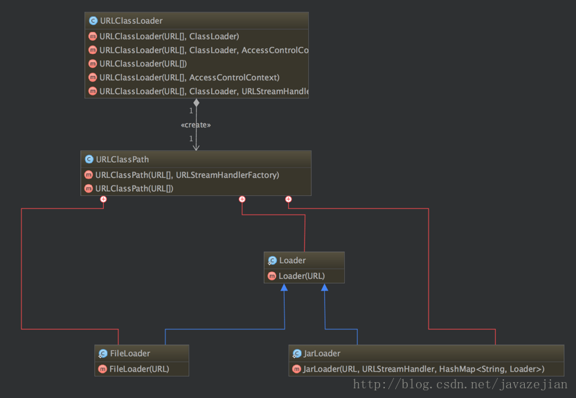

## Java 类加载器

每个 Java 文件都存储着需要执行的程序逻辑，这些 java 文件经过 Java 编译器编译成 class 文件，class 文件中保存着 JVM 虚拟机指令，当需要某个类时，虚拟机将会加载它的 class 文件，并创建对应的 class 对象，将 class 文件加载到虚拟机的内存，这个过程称为类加载。这里我们需要了解一下类加载的过程，如下：


1. 加载：类加载过程的一个阶段：通过一个类的全限定名查找此类字节文件，并利用字节码文件创建一个 Class 对象

2. 验证：目的在于确保 Class 文件的字节流中包含信息符合当前虚拟机要求，不会危害虚拟机自身安全。主要包括四种验证，文件格式验证、元数据验证、字节码验证、符号引用验证。

3. 准备：为类变量(即 static 修饰的字段变量)分配内存并且设置该类变量的初始值(如 static int i ＝ 5;这里只讲 i 初始化为 0，至于 5 的值将在初始化时赋值)，这里不包含使用 final 修饰的 static，因为 final 在编译的时候就会分配了，注意这里不会为视力变量分配初始化值，类变量会分配在方法区中，而实例变量是会随着对象一起分配到 Java 堆中。

4. 解析：主要讲常量池中的符号引用替换为直接引用的过程。符号引用就是一组符号来描述目标，可以是任何字面量，而直接引用就是直接指向目标的指针、相对便移量或者一个间接定位到目标的句柄。有类或者接口的解析，字段解析，类方法解析，接口方法解析(这里设计到字节码变量的引用，如需详细了解，可参考《深入 Java 虚拟机》)

5. 初始化：类加载最后阶段，若该类具有超类，则对其进行初始化，执行静态初始化器和静态初始化成员变量(如前面只初始化了默认值的 static 变量将会在这个阶段赋值，成员变量也将被初始化)

这便是类加载的 5 个过程，而类加载的任务是根据一个类的全限定名来读取此类的二进制字节流到 JVM 中，然后转换为一个与目标类对应的 java.lang.Class 对象实例，在虚拟机中提供了 3 种类加载器，启动类加载器(Bootstrap)、扩展类加载器(Extension)、系统类加载器(System 也称应用类加载器)

通过一段示例代码，我们可以看出来 java 初始化的一些过程

```java

public class Father {
    {
        func();
    }
    public void func(){
        try {
            String name = (String) Son.class.getField("name").get(this);
            System.out.println("name = " + name);
        } catch (IllegalAccessException e) {
            e.printStackTrace();
        } catch (NoSuchFieldException e) {
            e.printStackTrace();
        }
    }

}


public class Son extends Father{

    public String name = "son";

    public static void main(String[] args) {
        Son son = new Son();
        son.func();
    }
}
```

其执行结果如下

> name = null
> name = son

我们通过分析`Son`的字节码中关于构造器的片段

```java
  public com.leaderli.algrohtms.Son();
    descriptor: ()V
    flags: ACC_PUBLIC
    Code:
      stack=2, locals=1, args_size=1
         0: aload_0
         1: invokespecial #1                  // Method com/leaderli/algrohtms/Father."<init>":()V
         4: aload_0
         5: ldc           #2                  // String son
         7: putfield      #3                  // Field name:Ljava/lang/String;
        10: return
      LineNumberTable:
        line 3: 0
        line 5: 4
      LocalVariableTable:
        Start  Length  Slot  Name   Signature
            0      11     0  this   Lcom/leaderli/algrohtms/Son;

```

`Son`类我们没有显示的写构造器，但是 java 会给我生成一个默认的构造器。我们可以得出，`Son`的构造器一开始就会调用`Father`的构造器方法，而此时成员变量`name`还没有完成初始化过程，因此在`Father`类中`name`的值为零值，即`null`。在父类构造器完成后，则会开始对成员变量的值进行赋值。

### 启动类加载器(Bootstrap)

启动类加载器主要加载的是 JVM 自身需要的类，这个类加载使用 C++语言实现的，是虚拟机自身的一部分，它负责讲`<JAVA_HOME>/lib`路径下的核心类库或`-Xbootclasspath`参数指定的路径下的 jar 包加载到内存中，注意由于虚拟机是按照文件名识别加载 jar 包的，如 rt.jar,如果文件名不被虚拟机识别，即使把 jar 包丢到 lib 目录下也是没有作用的。(出于安全考虑,Bootstrap 启动类加载器只加载包名为 java,javax,sun 等开头的类)

### 扩展类加载器(Extension)

扩展类加载器是指 Sun 公司实现的`sun.misc.Launcher$ExtClassLoader`类，由 Java 语言实现的，是 Launcher 的静态内部类，它负责加载`<JAVA_HOME>/lib/ext`目录下或者由系统变量`-Djava.ext.dir`指定路径中的类库，开发者可以直接使用标准扩展类加载器。

```java
//ExtClassLoader类中获取路径的代码
private static File[] getExtDirs() {
     //加载<JAVA_HOME>/lib/ext目录中的类库
     String s = System.getProperty("java.ext.dirs");
     File[] dirs;
     if (s != null) {
         StringTokenizer st =
             new StringTokenizer(s, File.pathSeparator);
         int count = st.countTokens();
         dirs = new File[count];
         for (int i = 0; i < count; i++) {
             dirs[i] = new File(st.nextToken());
         }
     } else {
         dirs = new File[0];
     }
     return dirs;
}
```

###系统(System)类加载器

也称应用程序加载器是指 Sun 公司实现的`sun.misc.Launcher$AppClassLoader`。它负责加载系统类路径`java -classpath`或`-D java.class.path`指定路径下的类库，也就是我们经常用到的 cclasspath 路径，开发者可以直接使用系统类加载器，一般情况下该该类加载是程序中默认的类加载器，通过`ClassLoader#getSystemClassLoader()`方法可以获取到该类加载器。

在 Java 的日常应用程序开发中，类的加载几乎是由上述 3 种类加载器相互配合执行的，在必要时，我们还可以自定义类加载器，需要注意的是，Java 虚拟机对 class 文件采用的是按需加载的方式，也就是说当需要使用该类时才会将它的 class 文件加载到内存生成 class 对象，而且加载某个类的 class 文件时，Java 虚拟机采用的是双亲委派模式即把请求交由父类处理，它是一种任务委派模式，下面我们进一步了解它。

## 理解双亲委派模式

### 双亲委派模式工作原理

双亲委派模式要求除了顶层的启动类加载器外，其余的类加载器都应当由自己的父类加载器，请注意双亲委派模式中的父子关系并非通常所说的类继承关系，而是采用组合关系来复用父类加载器的相关代码，类加载器的关系如下：


双亲委派模式是在 Java 1.2 后引入的，其工作原理是，如果一个类加载器收到了类加载请求，它并不会自己先去加载，而是把这个请求委托给父类的加载器去执行，如果父类加载器还存在其父类加载器，则进一步向上委托，依次递归，请求最终将到达顶层的启动类加载器，如果父类加载器可以完成类加载任务，就成功返回，倘若父类加载器无法完成加载任务，子加载器才会尝试自己去加载，这就是双亲委派模式。

### 双亲委派模式优势

采用双亲委派模式的优势是 Java 类随着它的类加载器一起具备了一种带有优先级的层次关系，通过这种层级关系，可以避免类的重复加载，当父类已经加载了该类时，就没有必要子类加载器再加载一次。其次是考虑到安全因素，Java 核心 api 在定义类型时不会被随意替换，假设通过网络传递一个名为`java.lang.Integer`的类，通过双亲委派模式传递到启动类加载器，而启动类加载器载核心 Java API 发现这个名字的类，发现该类已被加载，就不会重新加载网络传递过来的`java.lang.Integer`，而直接返回已加载过的`Integer.class`，这样便可以防止核心 API 被随意篡改。

下面我们从代码层面了解几个 Java 中定义的类加载器及其双亲委派模式的实现，他们的类图关系如下


从图可以看出顶层的类加载器时 ClassLoader 类，它是一个抽象类，其后所有的类加载器都继承自 ClassLoader(不包括启动类加载器)，这里我们主要介绍 ClassLoader 中几个比较重要的方法。

- `loadClass(String)`

  该方法加载指定名称(包括包名)的二进制类型，该方法载 JDK 1.2 之后不再建议用户重写但用户可以直接调用该方法，`loadClass()`方法是`ClassLoader`类自己实现的，该方法中的逻辑就是双亲委派模式的实现，其源码如下，`loadClass(String name, boolean resolve)`是一个重载方法，resolve 参数代表是否生存 class 对象的同时解析相关操作。

  ```java
  protected Class<?> loadClass(String name, boolean resolve) throws ClassNotFoundException{
    synchronized (getClassLoadingLock(name)){
      //先从缓存查找该class对象，找到就不用重新加载
      Class<?> c = findLoadedClass(name);
      if(c == null){
        long t0 = System.nanoTime();
        try{
          if(parent !=null){
            //如果找不到，则委托给父类加载器加载
            c = parent.loadClass(name,false);
          }else{
            //如果没有父类，则委托给启动加载器去加载
            c = findBootstrapClassOrNull(name);
          }catch(ClassNotFoundException e){
            ...
          }

          if(c == null){
            //如果没有找到，则通过自定义实现的findClass去查找并加载
            c  = findClass(name);
          }
        }

        if(resolve){//是否需要载加载时进行解析
          resolveClass(c);
        }
        return c;
      }
    }
  }
  ```

  正如 `loadClass`方法所展示的，当类加载请求到来时，先从缓存中查找该类对象，如果存在直接返回，如果不存在则交给该类加载器的父类加载器，若没有父类加载器则交给顶层启动类加载器去加载，若最后没有找到，则使用`findClass()`方法去加载。从`loadClass`实现也可以知道如果不想重新定义加载类的规则，也没有复杂的逻辑，只想在运行时加载自定指定的类，那么我们可以直接使用`this.getClass().getClassLoder.loadClass("className")`,这样就可以调用`ClassLoader`的 loadClass 方法获取到 class 对象。

- `findCLass(String)`

  载 JDK1.2 之前，在自定义类加载时，总会去继承 ClassLoader 类并重写 loadClass 方法，从而实现自定义的类加载器，但是在 JDK1.2 之后已不再建议用户去覆盖`loadCLass()`方法，而是建议把自定义的类加载逻辑写在`findClass()`方法中，从前面的分析可知，`findClass()`方法是`loadClass()`方法中被调用的，当`loadClass()`方法中父类加载器加载失败后，则会调用自己的`findClass()`方法来完成类加载，这样就可以保证自定义的类加载器也符合双亲委派模式。需要注意的是`ClassLoader`类中并没有实现`findClass()`方法的具体逻辑，取而代之的是抛出`ClassNotFoundException`一场，同时应该知道的是｀`findClass`方法通常是和`defineClass`方法一起使用的，`ClassLoader`类中`findCLass`方法源码如下

  ```java
  //直接抛出异常
  protected Class<?> findClass(String name) throws ClassNotFoundException {
          throw new ClassNotFoundException(name);
  }
  ```

- `defineClass(byte[] b, int off ,int len)`

  `defineClass()`方法是用来将 byte 字节流解析成 JVM 能够识别的 Class 对象(`CLassLoader`中已实现该方法逻辑)，通过这个 方法不仅能够通过 class 文件实例化 class 对象，也可以通过其他方法实例化 class 对象，如果通过网络接受一个类的字节码，然后转换为 byte 字节流创建对应的 Class 对象，`defineClass()`方法通常与`findClass()`方法一起使用，一般情况下，在自定义类加载器时，会直接覆盖`ClassLoader`的`findClass()`方法并编写加载规则，取得要加载类的字节码后转化为流，然后调用`defineClass()`方法生成类的 Class 对象，简单例子如下：

  ```java
  protected Class<?> findClass(String name) throws ClassNotFoundException {
        // 获取类的字节数组
        byte[] classData = getClassData(name);
        if (classData == null) {
            throw new ClassNotFoundException();
        } else {
            //使用defineClass生成class对象
            return defineClass(name, classData, 0, classData.length);
        }
    }
  ```

  需要注意的是，如果直接调用`defineClass()`方法生成类的 Class 对象，这个类的 Class 对象并没有解析(也可以理解为链接阶段，毕竟解析是链接的最后一步)，其解析操作需要等待初始化阶段进行。

- `resolveClass(Class<?> c)`

  使用该方法可以使类的 Class 对象创建完成也同时被解析。前面我们说的链接阶段主要是对字节码进行验证，为类变量分配内存并设置初始值同时将字节码文件中的符号引用转换为直接引用。

  上述 4 个方法是`ClassLoader`类中的比较重要的方法，也是我们可能会经常用到的方法。接着看`SercureClassLoader`扩展了`ClassLoader`，新增了几个与使用相关的代码源(对代码源的位置及证书的验证)和权限定义类验证(主要是指对 class 源码的访问权限)的方法，一般我们不会直接跟这个类打交道，更多是与它的子类`URLClassLoader`有所关联，前面说过，`ClassLoader`是一个抽象类，很多方法是空的没有实现，并新增了`URLClassPath`类协助取得 Class 字节码流等功能，在编写自定义类加载器时，如果没有太过于复杂的需求，可以直接集成`URLClassLoader`类，这样就可以避免自己去编写`findClass()`方法及获取字节码流的方式，使自定义类加载器编写更加简洁，下面是`URLClassLoader`的类图
  
