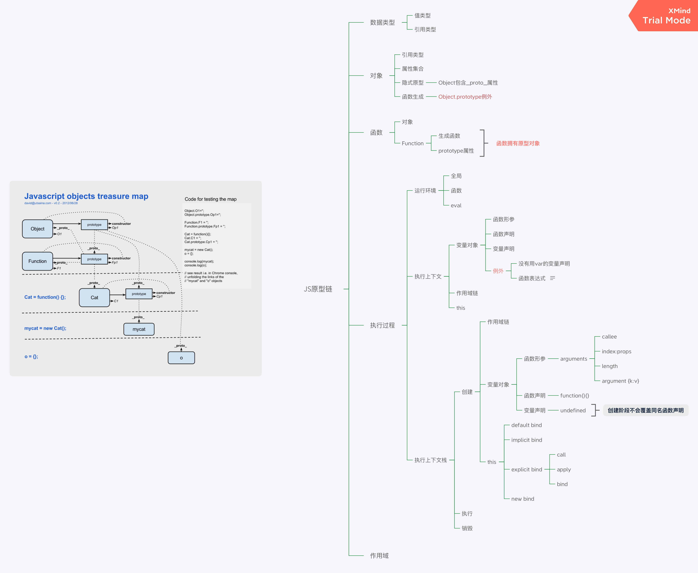

## 格式化输出 json

```javascript
var json = JSON.stringify(jsonObj, null, 4);
consol.log(json);
```

## 名字空间

全局变量会绑定到`window`上，不同的 JavaScript 文件如果使用了相同的全局变量，或者定义了相同名字的顶层函数，都会造成命名冲突，并且很难被发现。

减少冲突的一个方法是把自己的所有变量和函数全部绑定到一个全局变量中。例如：

```javascript
// 唯一的全局变量MYAPP:
var MYAPP = {};

// 其他变量:
MYAPP.name = "myapp";
MYAPP.version = 1.0;

// 其他函数:
MYAPP.foo = function () {
  return "foo";
};
```

把自己的代码全部放入唯一的名字空间`MYAPP`中，会大大减少全局变量冲突的可能。

许多著名的 JavaScript 库都是这么干的：jQuery，YUI，underscore 等等。

## 标准对象

总结一下，有这么几条规则需要遵守：

- 不要使用`new Number()`、`new Boolean()`、`new String()`创建包装对象；
- 用`parseInt()`或`parseFloat()`来转换任意类型到`number`；
- 用`String()`来转换任意类型到`string`，或者直接调用某个对象的`toString()`方法；
- 通常不必把任意类型转换为`boolean`再判断，因为可以直接写`if (myVar) {...}`；
- `typeof`操作符可以判断出`number`、`boolean`、`string`、`function`和`undefined`；
- 判断`Array`要使用`Array.isArray(arr)`；
- 判断`null`请使用`myVar === null`；
- 判断某个全局变量是否存在用`typeof window.myVar === 'undefined'`；
- 函数内部判断某个变量是否存在用`typeof myVar === 'undefined'`。

最后有细心的同学指出，任何对象都有`toString()`方法吗？`null`和`undefined`就没有！确实如此，这两个特殊值要除外，虽然`null`还伪装成了`object`类型。

更细心的同学指出，`number`对象调用`toString()`报 SyntaxError：

```javascript
123.toString(); // SyntaxError
```

遇到这种情况，要特殊处理一下：

```javascript
(123).toString(); // '123', 注意是两个点！
(123).toString(); // '123'
```

不要问为什么，这就是 JavaScript 代码的乐趣！

## JSON

在 JSON 中，一共就这么几种数据类型,并且，JSON 还定死了字符集必须是 UTF-8，表示多语言就没有问题了。为了统一解析，JSON 的字符串规定必须用双引号`""`，Object 的键也必须用双引号`""`。

- `number`：和 JavaScript 的 number 完全一致；

- `boolean`：就是 JavaScript 的 true 或 false；

- `string`：就是 JavaScript 的 string；

- `null`：就是 JavaScript 的 null；

- `array`：就是 JavaScript 的 Array 表示方式——[]；

- `object`：就是 JavaScript 的{ ... }表示方式。

## COOKIE

服务器在设置 Cookie 时可以使用 httpOnly，设定了 httpOnly 的 Cookie 将不能被 JavaScript 读取。这个行为由浏览器实现，主流浏览器均支持 httpOnly 选项，IE 从 IE6 SP1 开始支持。

为了确保安全，服务器端在设置 Cookie 时，应该始终坚持使用 httpOnly。

## 作用域

1. 在 object 内的 function this 指向 object，而属于 function 内部的闭包函数 this 指向 window 对象,纯 function this 也指向 window 对象

2. “自由变量”。在 A 作用域中使用的变量 x，却没有在 A 作用域中声明（即在其他作用域中声明的），对于 A 作用域来说，x 就是一个自由变量。如下

```javascript
var x = 10;
function fn() {
  var b = 20;
  console.log(x + b); //这里的x在这里就是一个自由变量
}
```

如上程序中，在调用 fn()函数时，函数体中第 6 行。取 b 的值就直接可以在 fn 作用域中取，因为 b 就是在这里定义的。而取 x 的值时，就需要到另一个作用域中取。到哪个作用域中取呢？

有人说过要到父作用域中取，其实有时候这种解释会产生歧义。例如：

```javascript
var x = 10;
function fn() {
  console.log(x);
}
function show(f) {
  var x = 20;
  (function () {
    f(); //10 而不是20
  })();
}
show(fn);
```

要到创建这个函数的那个作用域中取值——是“创建”，而不是“调用”，切记切记——其实这就是所谓的“静态作用域”。

## 原型

```javascript
function Fn() {}
Fn.prototype.name = "xiaoming";
Fn.prototype.getYear = function () {
  return 1988;
};

var fn = new Fn();
console.log(fn.name);
console.log(fn.getYear());
```

1. 函数 Fn 也是对象，每个函数都有一个属性`prototype`，`prototype`的值为原型对象
2. fn 为 Fn 函数的一个实例对象，每个对象都有一个隐藏属性 `__proto__`,fn 的`__proto__`指向 Fn 的`prototype`，即原型对象。
3. Object.prototype 是一个特例——它的`__proto__`指向的是 null
4. 访问一个对象的属性时，先在基本属性中查找，如果没有，再沿着`__proto__`这条链向上找，这就是原型链。



## this

this 到底取何值，是在函数真正被调用执行的时候确定的，函数定义的时候确定不了

1. 在全局环境下，this 永远是 window
2. 函数作为构造函数用，那么其中的 this 就代表它即将 new 出来的对象
3. 如果函数作为对象的一个属性时，并且作为对象的一个属性被调用时，函数中的 this 指向该对象
4. 一个函数被 call 和 apply 调用时，this 的值就取传入的对象的值

## 执行上下文

函数表达式”和“函数声明”。虽然两者都很常用，但是这两者在“准备工作”时，却是两种待遇。

```javascript
console.log(f1); // function f1(){};
console.log(f2); //undefined
function f1() {}
var f2 = function () {};
```

在初始化时，对待函数表达式就像对待“ var a = 10 ”这样的变量一样，只是声明。而对待函数声明时，却把函数整个赋值了。

全局代码的上下文环境数据内容为：

好了，总结完了函数的附加内容，我们就此要全面总结一下上下文环境的数据内容。

全局代码的上下文环境数据内容为：

- 普通变量（包括函数表达式），如： var a = 10; `声明（默认赋值为undefined）`
  - 函数声明，如： function fn() { } `赋值`
    - this `赋值`

如果代码段是函数体，那么在此基础上需要附加：

- 参数 `赋值`
  - arguments `赋值`
  - 自由变量的取值作用域 `赋值`

给执行上下文环境下一个通俗的定义——在执行代码之前，把将要用到的所有的变量都事先拿出来，有的直接赋值了，有的先用`undefined`占个空。

## js 可变参数

```javascript
var a = 100;
var b = 100;

function test() {
  var obj = {};

  for (var i = 0; i < arguments.length; i++) {
    var name = arguments[i];
    obj[name] = eval(name);
  }

  return obj;
}
console.log(test("a", "b"));
```

## 根据空行分割字符串

```javascript
console.log(str.trim().split(/\s+/));
```

## js 进制

```javascript
//二进制0b开头
//八进制0开头
//十六进制0x开头
var a = 0b10;
var b = 070;
var c = 0x36;
```

## 属性依赖赋值

js 对象的属性值延迟加载

```javascript
app = {};
Object.defineProperty(app, "config", {
  get: (function () {
    var inner = {};
    inner.get = function () {
      return inner.config || (inner.config = 1234);
    };
    return inner.get;
  })(),
});
```

### console

```javascript
var obj = [
  {
    name: 1,
    age: 1,
  },
  {
    name: 2,
    age: 2,
  },
];

console.table(obj);
```


### object

查看 obj 的所有 key 以及 values

```javascript
Object.keys(obj);
Object.values(obj);
```

### 递归 dom

```javascript
var els = document.getElementsByClassName("myclass");

Array.prototype.forEach.call(els, function(el) {
    // Do stuff here
    console.log(el.tagName);
});

// Or
[].forEach.call(els, function (el) {...});
```

### 递归检测属性是否存在

查看 obj 内的 obj 的属性的值，避免 undefined 异常

```javascript
var object = {
  innerObject: {
    deepObject: {
      value: "Here am I",
    },
  },
};

if (
  object &&
  object.innerObject &&
  object.innerObject.deepObject &&
  object.innerObject.deepObject.value
) {
  console.log("We found it!");
}
```

### replaceALl

js 原生没有 replaceAll 方法，可以通过

```js
str = "Test abc test test abc test...".split("abc").join("");
str.split(search).join(replacement);
```

### 事件冒泡

阻止事件冒泡

1. 给子级加 event.stopPropagation( )

   ```javascript
   $("#div1").mousedown(function (e) {
     var e = event || window.event;
     event.stopPropagation();
   });
   ```

2. 在事件处理函数中返回 false

   ```javascript
   $("#div1").mousedown(function (event) {
     var e = e || window.event;
     return false;
   });
   ```

3. event.target==event.currentTarget，让触发事件的元素等于绑定事件的元素，也可以阻止事件冒泡；

   ```javascript
   $("#div1").mousedown(function (event) {
     if (event.target == event.currentTarget) {
       console.log(event);
     }
   });
   ```
