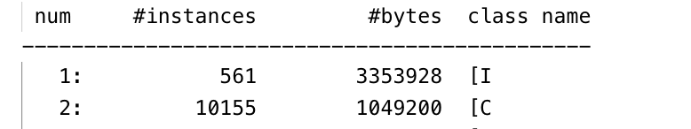
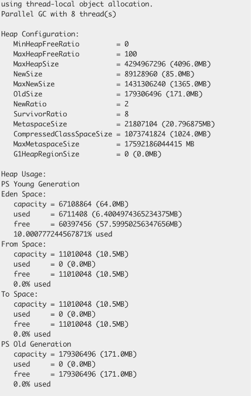
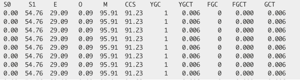
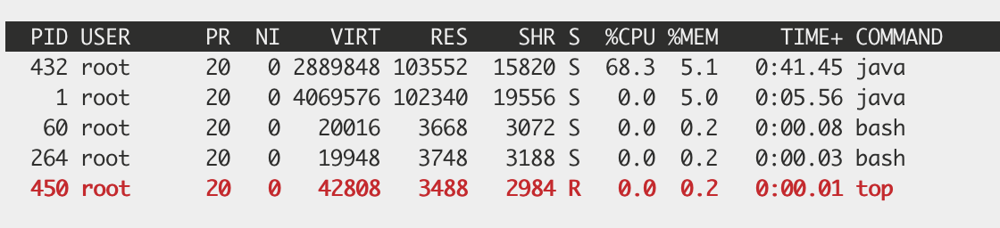
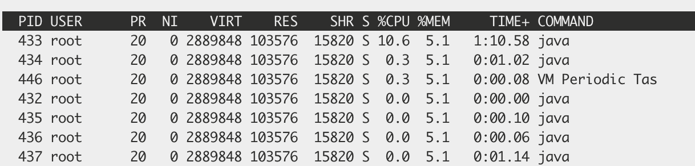
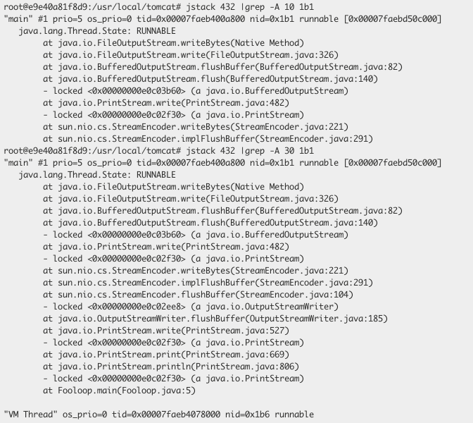

## 查看`java`进程

```shell
jps #列出本机所有的jvm实例
```

部分`jps`参数

> -m:输出主函数传入的参数. 下的 hello 就是在执行程序时从命令行输入的参数
> -l: 输出应用程序主类完整 package 名称或 jar 完整名称.
> -v: 列出 jvm 参数, -Xms20m -Xmx50m 是启动程序指定的 jvm 参数

## 列出运行中的`Java`程序的运行环境参数

```shell
jinfo <pid>
```

## 打印每个`class`的实例数目，内存占用，类全名信息。查看是否有类异常加载

```shell
jmap -histo <pid>
```

示例


可将上述命令的输出重定向到文件中，然后使用`sort -n -k 2`命令，根据示例数目进行排序，已确定占用数量较多的实例的类

## 查看当前内存使用情况

输出`Java`进程的堆内存信息，包括永久代、年轻代、老年代

```shell
jmap -heap <pid>
```

示例


## 实时追踪`GC`情况

`gcutil`是按百分比占比输出`gc`情况的

```java
jstat -gcutil <PID> 5000 # 每5秒输出一次gc
```

> S0:  新生代中 Survivor space 0 区已使用空间的百分比
> S1: 新生代中 Survivor space 1 区已使用空间的百分比
> E: 新生代已使用空间的百分比
> O: 老年代已使用空间的百分比
> P: 永久带已使用空间的百分比
> YGC: 从应用程序启动到当前，发生 Yang GC 的次数
> YGCT: 从应用程序启动到当前，Yang GC 所用的时间【单位秒】
> FGC: 从应用程序启动到当前，发生 Full GC 的次数
> FGCT: 从应用程序启动到当前，Full GC 所用的时间
> GCT: 从应用程序启动到当前，用于垃圾回收的总时间【单位秒】

示例


## `jstack`

我们已一个简单的代码来示范如何使用

```java
public class Fooloop {
    public static void main(String[] args) {
        for (; ; ) {

            System.out.println("args = " + args);
        }
    }
}
```

启动`Fooloop`后，使用`top`命令查看进程使用情况

进程使用，如果信息过多可考虑使用`top|grep java`,需要清楚哪个是`cpu`的占用信息，对于下述示例为`9`


我们可以看到`pid`为 432 的进程`cpu`占用率很高，我们使用`top -Hp <pid>`来查看具体是哪个线程`cpu`占用率高。我们可以看到是`433`


`jstack`命令生成的日志中，关于`nid`是使用`16`进制来表示的，而`top`不是。我们可以使用`printf "%x\n" nid`来讲`10`进制转换为`16`进制。根据此`nid`去`jstack`日志中去找到对应的信息。可使用命令`jstack <pid> |grep -A 30 <nid>`，

我们计算出`433`的十六进制为`1b1`

通过日志，可以看出问题出在`Fooloop.main(Fooloop.java:5)`

`jstack`日志中，可以分析是否某个线程持续的输出日志，说明锁的竞争比较激烈，就有可能造成性能问题。我们也可以通过`jps -v`或者`ps -ef|grep java`等来查看具体 java 进程的`pid`。
