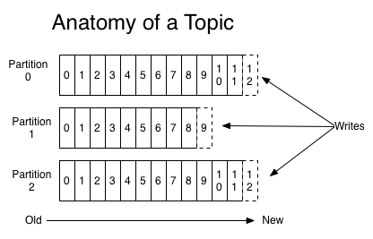
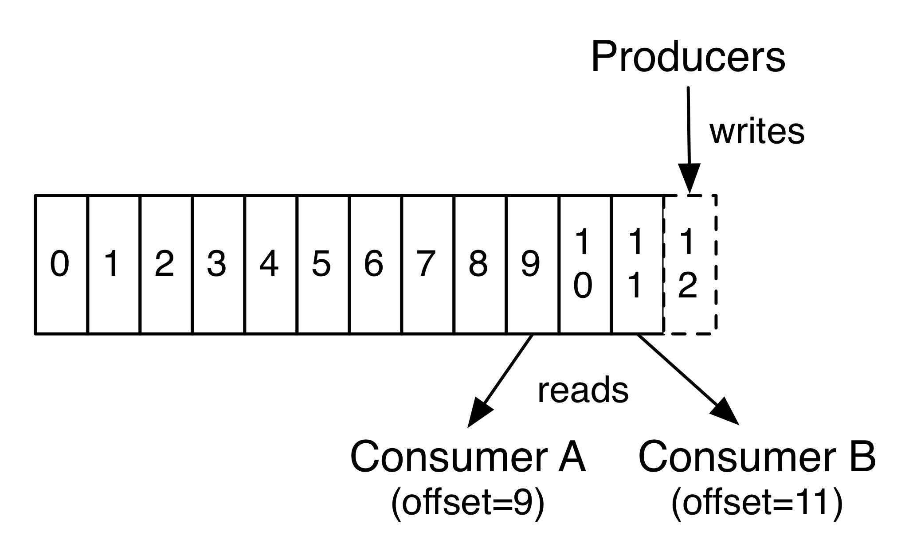
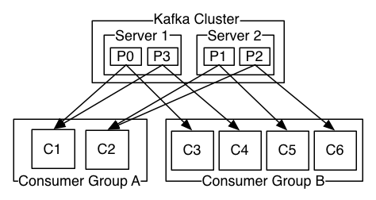

## 安装

```shell
wget https://downloads.apache.org/kafka/2.6.0/kafka_2.13-2.6.0.tgz
tar -xvf kafka_2.13-2.6.0.tgz
```

## 启动

```shell
#启动zookeeper
$ bin/zookeeper-server-start.sh config/zookeeper.properties
#启动kafka
$ bin/kafka-server-start.sh config/server.properties
```

## 相关命令

```shell

#创建topic --partitions 20 使用20个分区 --replication-factor 3 备份服务器
$ bin/kafka-topics.sh --create --topic quickstart-events --partitions 20 --replication-factor 3 --bootstrap-server localhost:9092
Created topic quickstart-events.

#查看topic
$ bin/kafka-topics.sh --describe --topic --bootstrap-server localhost:9092
Topic: quickstart-events    PartitionCount: 1   ReplicationFactor: 1    Configs: segment.bytes=1073741824
    Topic: quickstart-events    Partition: 0    Leader: 0   Replicas: 0 Isr: 0

#可以筛选，quicks既可以看到
$ bin/kafka-topics.sh --describe --topic quicks --bootstrap-server localhost:9092
Topic: quickstart-events    PartitionCount: 1   ReplicationFactor: 1    Configs: segment.bytes=1073741824
    Topic: quickstart-events    Partition: 0    Leader: 0   Replicas: 0 Isr: 0

## 删除topic
$ bin/kafka-topics.sh --delete --topic quickstart-events --bootstrap-server localhost:9092

#进入交行界面发送消息,ctrl+c退出
$ bin/kafka-console-producer.sh --topic quickstart-events --bootstrap-server localhost:9092
> This is my first event
> This is my second event


#进入交行界面读取消息,ctrl+c退出，--from-beginning表示从头开始读取消息
#--consumer-property group.id=group1 表示已组group1进行消费
$ bin/kafka-console-consumer.sh --topic quickstart-events --from-beginning --bootstrap-server localhost:9092 --consumer-property group.id=group1

This is my first event
This is my second event

# 查看消费组
$ bin/kafka-consumer-groups.sh --bootstrap-server localhost:9092 --list

# 查看消费组消费情况
# --members 显示组成员
$ bin/kafka-consumer-groups.sh --bootstrap-server localhost:9092 --describe --group my-group --members

```

## 简介

kafka 是一个分布式数据流处理系统。

- kafka 以集群的方式运行在一台或多台服务器上
- kafka 集群用 topic 来分类存储数据流
- 每个数据都包含 key,value,timestamp

## partition

topic 是发布消息的一个通道，topic 可被多个客户端订阅，topic 可向多个客户端发送订阅信息。对于每一个 topic，可能包含多个 partition


### partition 的规则

- 如果没有指定 key 值并且可用 partition 个数大于 0 时，在就可用 partition 中做轮询决定消息分配到哪个 partition
- 如果没有指定 key 值并且没有可用 partition 时，在所有 partition 中轮询决定小心分配到哪个 partition
- 如果指定 key，对 key 值做 hash 分配到指定的 partion

在 java 中，我们可以指定 partition 规则来确保消息全部发送至一个 partition

```java
public class MyPartion implements Partitioner {

    public int partition(String s, Object o, byte[] bytes, Object o1, byte[] bytes1, Cluster cluster) {
        return 1;
    }

    public void close() {

    }

    public void configure(Map<String, ?> map) {

    }
}
```

```java
public class PartionProducer {

    public static void main(String[] args) {

        Properties properties = new Properties();
        properties.put("bootstrap.servers", "106.15.37.147:9092");
        properties.put("acks", "all");
        properties.put("retries", "3");
        properties.put("batch.size", "16384");
        properties.put("linger.ms", 1);
        properties.put("buffer.memory", 33554432);
        //key和value的序列化
        properties.put("key.serializer", "org.apache.kafka.common.serialization.StringSerializer");
        properties.put("value.serializer", "org.apache.kafka.common.serialization.StringSerializer");

        //添加自定义partition器
        properties.put("partitioner.class", "com.congge.partion.MyPartion");

        //构造生产者对象
        KafkaProducer<String, String> producer = new KafkaProducer<String, String>(properties);
        //发送消息
        for (int i = 0; i < 10; i++) {
            producer.send(new ProducerRecord<String, String>("second", "congge-self ", "val = " + i)
                    , new ProducerCallBackV3());
        }
        //关闭连接资源
        producer.close();

    }
}

/**
 * 生产者回调消息
 */
class ProducerCallBackV3 implements Callback {

    public void onCompletion(RecordMetadata metadata, Exception e) {
        if (e == null) {
            System.out.println("offset : " + metadata.offset());
            System.out.println("partition : " + metadata.partition());
            System.out.println("topic : " + metadata.topic());
            System.out.println("===============================");
        }
    }

}
```

### partition 详情

partition 是一个有序日志，在 partition 上每个 consumer 有唯一 offset 表示当前消费的位置。partition 日志在一段时间内是持久保存在服务器上的，不管 consumer 是否消费，可通过配置数据的保留策略设置消息的过期时间。

通过操作 offset，我们可以读取还未过期的历史数据，也可以跳过当前数据读取已经写入 kafka 的未来数据

## 消费者

在 kafka 中 consumer 隶属于 consumer group.

- topic 中的一个 partition 只能被同一个 group 的一个 consumer 消费。即发布到该 topic 的记录会根据 partition 的分区规则推送到指定的 consumer 去消费，而不是所有 consumer 都会受到消息。若订阅该 topic 的同一个组的 consumer 数量大于 partition 数量时，将会有 consumer 空闲
- topic 中的一个 partition 可以被其他 group 的一个 consumer 消费。即发布到该 topic 的记录会广播给所有订阅该 topic 的 group 中的一个 consumer 去消费

例如

