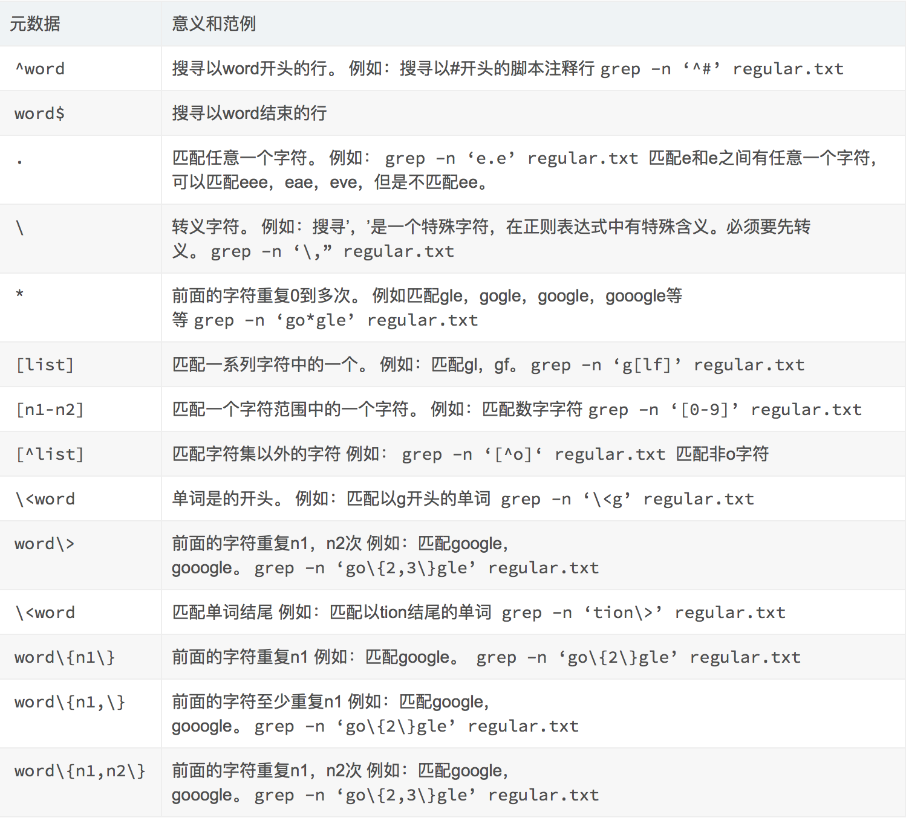

## 搜索命令

- `man -k` 搜索命令，通常用于在只记得部分命令关键词的场合。在 man 的帮助手册中，将帮助文档分为了 9 个类别，对于有的关键字可能存在多个类别，我们就需要指定特定的类别来查看，一般 bash 命令在 1 类别中。如`printf`的三类别，可以使用`man 3 printf`来查看
- `whatis` 命令的简要说明，`whatis -w 'loca*'`可以使用正则表达式来搜索应用
- `info` 命令详细的介绍
- `which` 命令安装目录

## 搜索文件

1. `locate <name>`使用索引去查找文件，如果文件更新，需要定期执行更新命令(`updatedb`)来更新索引库.
2. `find` 实时查找命令
   命令语法`find [path] [expression]`

   - -cmin -n : 在过去 n 分钟内被修改过
     -cmin +n : 在 n 分钟之前被修改过
     例如

     ```shell
     #十分钟之内
     find . -cmin -10
     #十分钟之前
     find . -cmin +10
     ```

   - -ctime 与 -cmin 类似，表示天数
     -ctime 和-mtime 的区别，-mtime 表示文件内容被修改，-ctime 表示文件内部或文件的 metadata（权限，所有者等）被更改

   - -delete 满足条件的文件删除

     ```shell
     # 删除十天前的文件
     find ./my_dir -mtime +10 -type f -delete
     ```

   - 根据文件名搜索，\*是通配符
     `find . -name h*`
     若忽略大小写可以使用`-iname`
     可使用正则表达式来搜索文件名，将搜索条件引号包含
     `find . -name '[regex]'`
     或者使用
     `find . -regex '[regex]'`
     需要注意的是，正则表达式匹配的是搜索的全名，而不是文件名。例如

     > ~\$ find . -regex '.\*\.txt' -maxdepth 1
     > ./1.txt

     若使用`^1.*`是搜索不出这个文件的

   - -maxdepth n ： 搜索指定的深度

   - -not 反向搜索
     例如: `find . -not -name 'he'`

   - -type ：搜索指定类型的文件

     1. d: 目录
     2. c: 字型装置文件
     3. b: 区块装置文件
     4. p: 具名贮列
     5. f: 一般文件
     6. l: 符号连结
     7. s: socket

     查找指定扩展名的文件

     ```shell
     find -type f -regex '.*\.(jpg|png)'
     find -type f|egrep  '.*\.(jpg|png)'
     ```

## grep

grep 支持不同的匹配模式，比如默认的 BRE 模式，增强型的 ERE 模式，还有更强悍的 PRE 模式。普通情况下使用默认的 BRE(basic regular expression) 模式就可以了，这种方式的特点是支持的正则表达式语法有限。如果需要更进一步的正则表达式语法支持，可以使用 ERE(extended regular expression) 模式。如果要使用复杂的正则表达式语法，可以使用 PRE 模式，它支持 Perl 语言的正则表达式语法。

语法格式：
grep [OPTIONS] PATTERN [FILE...]

- -A n 可以输出匹配行后的 n 行
- -B n 可以输出匹配行前的 n 行
- -c 计算找到的符号行的次数
- -C n 可以输出匹配行前后的 n 行
- -e 使用多个规则
- -f FILE 如果正则表达式太长，或者是需要指定多个正则表达式，可以把它们放在文件中。如果指定了多个正则表达式(每行一个)，任何一个匹配到的结果都会被输出：
- -i 忽略大小写
- -l 仅显示文件名
- -n 顺便输出行号
- -o 只输出匹配到的部分(而不是整个行)
- -R, -r, --recursive 会递归指定指定目录(可使用通配符)下的所有文件
- -v 反向选择，即输出没有没有匹配的行
- -w 表示匹配全词
- --binary-files=without-match 不搜索二进制文件
- --colour='auto' 是否高亮显示匹配词，可以为`never`, `always` or `auto`
- --exclude-dir=[PATTERN] 排除一些目录(注意，这里设置的也是正则表达式),还可以同时指定多个表达式,例如`grep -r --exclude-dir={.git,xgit} 'email' .`
- --include 仅搜索某些文件，可使用正则表达式，同时可以指定多个表达式 `grep -rn 'stream' . --include='*.cpp'`
- -P 使用 perl 的正则引擎

grep 支持简单的正则表达式，

  <ul>
  其规则如下



  </ul>
示例

```shell
~$ grep -i he 1.txt
Hello
hello

~$ grep -e a123 -e b123 1.log
a123456bcd
b1234aaeef

 ~$ grep -rn 'include' . --include='*.c' --exclude-dir={backup,temp}
./test/hello.c:1:#include <stdio.h>
./test/hello.c:2:#include <stdlib.h>

~$ grep -P '\d{6}' 1.log
a123456bcd
```
