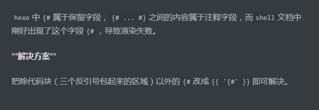

## markdown 语法

- 空白行 `&emsp;`

- 首行缩进，通过两个空白行来实现 `&emsp;&emsp;`
- 换行 两段之间插入一个空白行，或者上一行行尾插入一个空字符串
- 有序列表

  ```markdown
  1. ol
  2. ol
  ```

- 文本引用

  ```markdown
  > 这个是区块引用
  >
  > > 这个也是区块引用
  > >
  > > > 这个还是是区块引用
  ```

- 插入图片
  md 文件同级目录会生成一个同名文件夹，图片放入其中，然后通过如下方式引入
  ``
  该目录在`hexo`项目目录的`source`目录下，将图片放入其中即可，为了避免冲突
- 链接&emsp;`[title](urls)`

- 表格基本模板，其中`:`表示对齐，表格上方需要空一行，否则无法正常显示

  | Table Header 1 | Table Header 2 | Table Header 3 |
  | :------------- | :------------: | -------------: |
  | Division 1     |   Division 2   |     Division 3 |
  | Division 1     |   Division 2   |     Division 3 |
  | Division 1     |   Division 2   |     Division 3 |

- 文本换行可在上一段文本后追加至少两个空格

- 加粗文本

  ```markdown
  **_加粗的文本_**
  ```

- 代码块
  \`\`\`language
  \`\`\`
  支持的语言有
  `c`, `abnf`, `accesslog`, `actionscript`, `ada`, `apache`, `applescript`, `arduino`, `armasm`, `asciidoc`, `aspectj`, `autohotkey`, `autoit`, `avrasm`, `awk`, `axapta`, `bash`, `basic`, `bnf`, `brainfuck`, `cal`, `capnproto`, `ceylon`, `clean`, `clojure`, `clojure`-`repl`, `cmake`, `coffeescript`, `coq`, `cos`, `cpp`, `crmsh`, `crystal`, `cs`, `csp`, `css`, `d`, `dart`, `delphi`, `diff`, `django`, `dns`, `dockerfile`, `dos`, `dsconfig`, `dts`, `dust`, `ebnf`, `elixir`, `elm`, `erb`, `erlang`, `erlang`-`repl`, `excel`, `fix`, `flix`, `fortran`, `fsharp`, `gams`, `gauss`, `gcode`, `gherkin`, `glsl`, `go`, `golo`, `gradle`, `groovy`, `haml`, `handlebars`, `haskell`, `haxe`, `hsp`, `htmlbars`, `http`, `hy`, `inform7`, `ini`, `irpf90`, `java`, `javascript`, `json`, `julia`, `kotlin`, `lasso`, `ldif`, `leaf`, `less`, `lisp`, `livecodeserver`, `livescript`, `llvm`, `lsl`, `lua`, `makefile`, `markdown`, `mathematica`, `matlab`, `maxima`, `mel`, `mercury`, `mipsasm`, `mizar`, `mojolicious`, `monkey`, `moonscript`, `n1ql`, `nginx`, `nimrod`, `nix`, `nsis`, `objectivec`, `ocaml`, `openscad`, `oxygene`, `parser3`, `perl`, `pf`, `php`, `pony`, `powershell`, `processing`, `profile`, `prolog`, `protobuf`, `puppet`, `purebasic`, `python`, `q`, `qml`, `r`, `rib`, `roboconf`, `rsl`, `ruby`, `ruleslanguage`, `rust`, `scala`, `scheme`, `scilab`, `scss`, `smali`, `smalltalk`, `sml`, `sqf`, `sql`, `stan`, `stata`, `step21`, `stylus`, `subunit`, `swift`, `taggerscript`, `tap`, `tcl`, `tex`, `thrift`, `tp`, `twig`, `typescript`, `vala`, `vbnet`, `vbscript`, `vbscript`-`html`, `verilog`, `vhdl`, `vim`, `x86asm`, `xl`, `xml`, `xquery`, `yaml`, `zephir`

- 转义字符\\

## KaTex

[参考文档](https://katex.org/docs/supported.html)

基本 KaTex 首尾需要`$`包含,例如`$X_y$`表示$X_y$

常用
| 表达式 | 示例 |
| :----: | :----: |
| `\{\}` | $\{\}$ |
| `\ge` | $\ge$ |
| `\le` | $\le$ |
| `X_y` | $X_y$ |
| `X^{y}` | $x^{y}$ |
|`\hat{\delta}`|$\hat{\delta}$|

块状使用`$$`包含

不支持中文

## hexo

### 快捷方式

站内引用，引用自己的博客


使用`F8`快速定位`markdown`语法错误的地方。

插入的图片上面需要有一行文字，否则生成的网页图片显示会有瑕疵

### 调试

运行命令时带上参数`--debug`,则会输出`console.log()`所打印的日志

### 本地搜索

安装插件

```shell
npm install hexo-generator-searchdb --save

```

根目录`_config.yml`中开启本地搜索,`xml`对于特殊字符的处理可能存在问题，建议使用`json`

```yml
#本地搜索
search:
  # path: search.xml
  path: search.json
  field: post
  content: true
  format: html
```

同时`theme`下的配置需要开启

```yml
local_search:
  enable: true
  # If auto, trigger search by changing input.
  # If manual, trigger search by pressing enter key or search button.
  trigger: auto
  # Show top n results per article, show all results by setting to -1
  top_n_per_article: 1
  # Unescape html strings to the readable one.
  unescape: false
```

`hexo`开始搜索使用插件`hexo-generator-searchdb`，插件在扫描项目文件后生成`search.json`文件。
该文件按照特定格式存储了博客的所有内容。但该插件记录的中文为`ascii`码，因此在搜索时使用中文搜索不到
博客正文内容，因此我们需要修改生成`search.json`文件的过程。将`ascii`转码。

修改项目根目录下的文件`node_modules/hexo-generator-searchdb/lib/json_generator.js`

```js
"use strict";

module.exports = function (locals) {
  var config = this.config;
  var database = require("./database")(locals, config);

  // ---------------------------------------------新增修改
  function reconvert(str) {
    str = str.replace(/(\\u)(\w{1,4})/gi, function ($0) {
      return String.fromCharCode(
        parseInt(escape($0).replace(/(%5Cu)(\w{1,4})/g, "$2"), 16)
      );
    });
    str = str.replace(/(&#x)(\w{1,4});/gi, function ($0) {
      return String.fromCharCode(
        parseInt(escape($0).replace(/(%26%23x)(\w{1,4})(%3B)/g, "$2"), 16)
      );
    });
    str = str.replace(/(&#)(\d{1,6});/gi, function ($0) {
      return String.fromCharCode(
        parseInt(escape($0).replace(/(%26%23)(\d{1,6})(%3B)/g, "$2"))
      );
    });

    return str;
  }
  database.forEach(function (item) {
    item.content = reconvert(item.content);
  });
  // -----------------------------------------------
  return {
    path: config.search.path,
    data: JSON.stringify(database),
  };
};
```

### vscode 中图片无法预览

vscode 中的 markdown 图片仅能预览当前 md 文件下或其子文件中的图片，但是若是图片在这儿，渲染后的 html 文件中将无法查看图片。我们自定义两个插件来解决这个问题。

根据[hexo api](https://hexo.io/zh-cn/api/)我们编写两个插件

1. 首先我们在`source/_posts`目录下建一个专门用于存放图片的文件夹`images`，在 markdown 中我们使用``来插入图片,这样我们在 vscode 中就可以预览图片了。
2. 编写一个插件`hexo-li-assert-image`，用于将``渲染后的``中的 src 替换为`/images/picture.png`
3. 编写一个插件，用于在渲染完成后，将`source/_posts/images/`的所有图片拷贝到`public/images`下

代码如下

```js
"use strict";
var cheerio = require("cheerio");

hexo.extend.filter.register("after_post_render", function (data) {
  var path = hexo.config.li.path; //_config.yml中新增配置
  if (path.length < 1) {
    return;
  }

  var toprocess = ["excerpt", "more", "content"];
  for (var i = 0; i < toprocess.length; i++) {
    var key = toprocess[i];
    var $ = cheerio.load(data[key], {
      ignoreWhitespace: false,
      xmlMode: false,
      lowerCaseTags: false,
      decodeEntities: false,
    });
    $("img").each(function () {
      if ($(this).attr("src")) {
        var src = $(this).attr("src").replace("\\", "/");
        if (src.startsWith("./images/")) {
          src = src.substring(1);
          $(this).attr("src", src);
        }
      }
    });
    data[key] = $.html();
  }
});
```

```js
"use strict";
var fs = require("fs");

hexo.on("generateAfter", function (post) {
  var path = hexo.config.li.path;
  if (path.length < 1) {
    return;
  }
  var source_img_path = path + "source/_posts/images/";
  var target_img_path = path + "public/images/";

  if (!fs.existsSync(target_img_path)) {
    console.log("mkdir " + target_img_path);
    fs.mkdirSync(target_img_path, { recursive: true });
  }

  let paths = fs.readdirSync(source_img_path);
  paths.forEach(function (path) {
    if (path.startsWith(".")) {
      return;
    }
    var _src = source_img_path + path;
    var _tar = target_img_path + path;
    if (fs.existsSync(_tar)) {
      return;
    }
    fs.copyFileSync(_src, _tar, fs.constants.COPYFILE_EXCL);
  });
});
```

### hexo 错误解决

> Error: expected end of comment, got end of file


