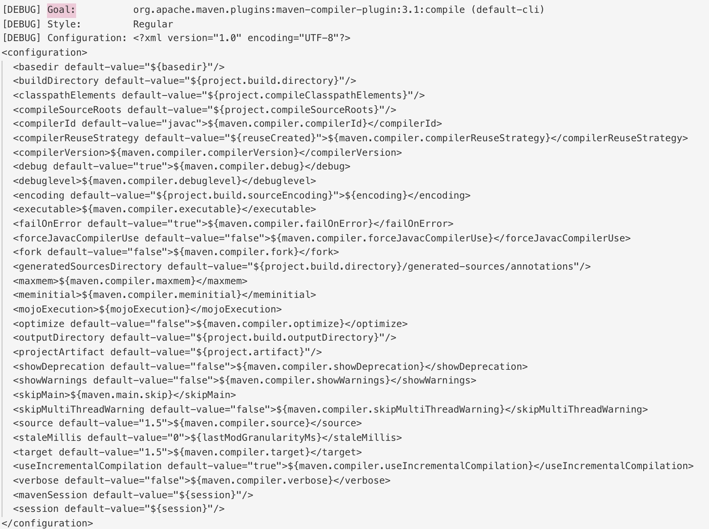

省略下载安装过程

## 配置

maven 默认目录在`${user.home}/.m2/`
`settings.xml`配置文件为 maven 的全局配置

### 镜像

maven 默认中央仓库访问速度较慢，可通过配置阿里云的镜像加速访问。当需要禁止访问中央仓库时，也可通过配置镜像将中央仓库指定为远程仓库

阿里云镜像地址：

> `http://maven.aliyun.com/nexus/content/groups/public/`

在`${user.home}/.m2/settings.xml`中新增如下配置

```xml
<settings>
  ...
  <mirrors>
    <mirror>
      <id>UK</id>
      <name>UK Central</name>
      <url>http://uk.maven.org/maven2</url>
      <mirrorOf>central</mirrorOf>
    </mirror>
  </mirrors>
  ...
</settings>
```

1. `<mirrorOf>central</mirrorOf>`
   里是要替代的仓库的 id。
2. `<mirrorOf>*</mirrorOf>`
   匹配所有仓库
3. `<mirrorOf>external:*</mirrorOf>`
   匹配所有远程仓库，使用`localhost`的除外，使用`file://`协议的除外。也就是说，匹配所有不在本机上的远程仓库。
4. `<mirrorOf>repo1,repo2</mirrorOf>`
   匹配仓库 repo1 和 repo2，使用逗号分隔多个远程仓库。
5. `<mirrorOf>*,!repo1</miiroOf>`
   匹配所有远程仓库，repo1 除外，使用感叹号将仓库从匹配中排除。

## POM

pom 是最基础的组件，是 maven 用来构建项目的基础配置文件，其中包括许多默认属性。

### Super POM

所有的 pom 文件都继承自`Super POM`，除非你设置了不继承。

下面是 Maven 3.5.4 版本的`Super POM`摘要

```xml
<project>
  <modelVersion>4.0.0</modelVersion>
  <repositories>
    <repository>
      <id>central</id>
      <name>Central Repository</name>
      <url>https://repo.maven.apache.org/maven2</url>
      <layout>default</layout>
      <snapshots>
        <enabled>false</enabled>
      </snapshots>
    </repository>
  </repositories>
  <pluginRepositories>
    <pluginRepository>
      <id>central</id>
      <name>Central Repository</name>
      <url>https://repo.maven.apache.org/maven2</url>
      <layout>default</layout>
      <snapshots>
        <enabled>false</enabled>
      </snapshots>
      <releases>
        <updatePolicy>never</updatePolicy>
      </releases>
    </pluginRepository>
  </pluginRepositories>
  <build>
    <directory>${project.basedir}/target</directory>
    <outputDirectory>${project.build.directory}/classes</outputDirectory>
    <finalName>${project.artifactId}-${project.version}</finalName>
    <testOutputDirectory>${project.build.directory}/test-classes</testOutputDirectory>
    <sourceDirectory>${project.basedir}/src/main/java</sourceDirectory>
    <scriptSourceDirectory>${project.basedir}/src/main/scripts</scriptSourceDirectory>
    <testSourceDirectory>${project.basedir}/src/test/java</testSourceDirectory>
    <resources>
      <resource>
        <directory>${project.basedir}/src/main/resources</directory>
      </resource>
    </resources>
    <testResources>
      <testResource>
        <directory>${project.basedir}/src/test/resources</directory>
      </testResource>
    </testResources>
    <pluginManagement>
      <!-- NOTE: These plugins will be removed from future versions of the super POM -->
      <!-- They are kept for the moment as they are very unlikely to conflict with lifecycle mappings (MNG-4453) -->
      <plugins>
        <plugin>
          <artifactId>maven-antrun-plugin</artifactId>
          <version>1.3</version>
        </plugin>
        <plugin>
          <artifactId>maven-assembly-plugin</artifactId>
          <version>2.2-beta-5</version>
        </plugin>
        <plugin>
          <artifactId>maven-dependency-plugin</artifactId>
          <version>2.8</version>
        </plugin>
        <plugin>
          <artifactId>maven-release-plugin</artifactId>
          <version>2.5.3</version>
        </plugin>
      </plugins>
    </pluginManagement>
  </build>
  <reporting>
    <outputDirectory>${project.build.directory}/site</outputDirectory>
  </reporting>
  <profiles>
    <!-- NOTE: The release profile will be removed from future versions of the super POM -->
    <profile>
      <id>release-profile</id>
      <activation>
        <property>
          <name>performRelease</name>
          <value>true</value>
        </property>
      </activation>
      <build>
        <plugins>
          <plugin>
            <inherited>true</inherited>
            <artifactId>maven-source-plugin</artifactId>
            <executions>
              <execution>
                <id>attach-sources</id>
                <goals>
                  <goal>jar-no-fork</goal>
                </goals>
              </execution>
            </executions>
          </plugin>
          <plugin>
            <inherited>true</inherited>
            <artifactId>maven-javadoc-plugin</artifactId>
            <executions>
              <execution>
                <id>attach-javadocs</id>
                <goals>
                  <goal>jar</goal>
                </goals>
              </execution>
            </executions>
          </plugin>
          <plugin>
            <inherited>true</inherited>
            <artifactId>maven-deploy-plugin</artifactId>
            <configuration>
              <updateReleaseInfo>true</updateReleaseInfo>
            </configuration>
          </plugin>
        </plugins>
      </build>
    </profile>
  </profiles>
</project>
```

### 配置 mvn 的 jdk 版本

可统一在`settings.xml`中新增如下配置

```xml
<?xml version="1.0" encoding="UTF-8"?>
<settings
    xmlns="http://maven.apache.org/SETTINGS/1.0.0"
    xmlns:xsi="http://www.w3.org/2001/XMLSchema-instance"
    xsi:schemaLocation="http://maven.apache.org/SETTINGS/1.0.0 http://maven.apache.org/xsd/settings-1.0.0.xsd">
    <localRepository>${user.home}/.m2/repository</localRepository>
    <profiles>
        <profile>
            <id>jdk</id>
            <activation>
                <activeByDefault>true</activeByDefault>
                <jdk>1.8</jdk>
            </activation>
            <properties>
                <maven.compiler.source>1.8</maven.compiler.source>
                <maven.compiler.target>1.8</maven.compiler.target>
                <maven.compiler.compilerVersion>1.8</maven.compiler.compilerVersion>
            </properties>
        </profile>
    </profiles>
</settings>

```

也在项目 pom 中增加配置

```xml
<?xml version="1.0" encoding="UTF-8"?>
<project xmlns="http://maven.apache.org/POM/4.0.0"
         xmlns:xsi="http://www.w3.org/2001/XMLSchema-instance"
         xsi:schemaLocation="http://maven.apache.org/POM/4.0.0 http://maven.apache.org/xsd/maven-4.0.0.xsd">
    <modelVersion>4.0.0</modelVersion>

    <groupId>com.leaderli</groupId>
    <artifactId>vxml-test</artifactId>
    <version>1.0-SNAPSHOT</version>
    <properties>
        <project.build.sourceEncoding>UTF-8</project.build.sourceEncoding>
        <maven.compiler.source>1.8</maven.compiler.source>
        <maven.compiler.target>1.8</maven.compiler.target>
    </properties>
    <dependencies>
    ...
    </dependencies>

</project>
```

## 属性

### 内置属性

- `${basedir}`表示项目根目录，即包含`pom.xml`文件的目录;

- `${version}`表示项目版本。

- `${project.basedir}`同`${basedir}`;

### pom 属性

使用 pom 属性可以引用到 pom.xml 文件对应元素的值,继承自`Super POM`

- `${project.build.sourceDirectory}`:项目的主源码目录，默认为`src/main/java/`
- `${project.build.testSourceDirectory}`:项目的测试源码目录，默认为`/src/test/java/`
- `${project.build.directory}`:项目构建输出目录，默认为`target/`
- `${project.outputDirectory}`:项目主代码编译输出目录，默认为`target/classes/`
- `${project.testOutputDirectory}`:项目测试代码编译输出目录，默认为`target/testclasses/`
- `${project.groupId}`:项目的`groupId`
- `${project.artifactId}`:项目的`artifactId`
- `${project.version}`:项目的`version`,于`${version}`等价
- `${project.build.finalName}`:项目打包输出文件的名称，默认 为`${project.artifactId}${project.version}`

### 自定义属性

在`pom.xml`文件的`<properties>`标签下定义的 Maven 属性,在其他地方使用`${property}`使用该属性值。

### 文件属性

与 pom 属性同理,用户使用以`settings`开头的属性引用`settings.xml`文件中的 XML 元素值`${settings.localRepository}`表示本地仓库的地址;

### Java 系统属性

所有的 Java 系统属性都可以使用 Maven 属性引用,使用`mvn help:system`命令可查看所有的 Java 系统属性;`System.getProperties()`可得到所有的 Java 属性;`${user.home}`表示用户目录;

### 环境变量属性

所有的环境变量都可以用以`env.`开头的 Maven 属性引用使用`mvn help:system`命令可查看所有环境变量;\${env.JAVA_HOME}表示 JAVA_HOME 环境变量的值;

### 手动指定变量

我们可以在打包时使用`-D`指定变量，例如`mvn package -Denv=uat`

## 编译资源文件

```xml
<project xmlns="http://maven.apache.org/POM/4.0.0"
  xmlns:xsi="http://www.w3.org/2001/XMLSchema-instance"
  xsi:schemaLocation="http://maven.apache.org/POM/4.0.0
                      https://maven.apache.org/xsd/maven-4.0.0.xsd">
  <build>
    ...
    <resources>
      <resource>
        <targetPath>META-INF/plexus</targetPath>
        <filtering>false</filtering>
        <directory>${basedir}/src/main/plexus</directory>
        <includes>
          <include>configuration.xml</include>
        </includes>
        <excludes>
          <exclude>**/*.properties</exclude>
        </excludes>
      </resource>
    </resources>
    <testResources>
      ...
    </testResources>
    ...
  </build>
</project>
```

- `targetPath` 编译目录,默认位置为`classes`目录
- `directory` 项目资源目录

## 生命周期和阶段

maven 通过指定的生命周期部署和发布项目。每个生命周期都包含一系列 phase，当执行指定 phase 时，所有前置的 phase 都会被执行。

主要有下述三个生命周期

1. <hi3>Clean Lifecycle</hi3>

   主要用来清理 target

   | Phase      | Description                                                   |
   | :--------- | :------------------------------------------------------------ |
   | pre-clean  | execute processes needed prior to the actual project cleaning |
   | clean      | remove all files generated by the previous build              |
   | post-clean | execute processes needed to finalize the project cleaning     |

2. <hi3>Default Lifecycle</hi3>

   默认的生命周期，用于进行编译，打包，发布等
   | Phase | Description |
   | :-| :--------------------------------------------------------------------------------------------------------------------------------------------------------------- |
   | validate | validate the project is correct and all necessary information is available. |
   | initialize | initialize build state, e.g. set properties or create directories. |
   | generate-sources| generate any source code for inclusion in compilation. |
   | process-sources | process the source code, for example to filter any values. |
   | generate-resources| generate resources for inclusion in the package. |
   | process-resources| copy and process the resources into the destination directory, ready for packaging. |
   | compile | compile the source code of the project. |
   | process-classes| post-process the generated files from compilation, for example to do bytecode enhancement on Java classes. |
   | generate-test-sources| generate any test source code for inclusion in compilation. |
   | process-test-sources| process the test source code, for example to filter any values. |
   | generate-test-resources| create resources for testing. |
   | process-test-resources| copy and process the resources into the test destination directory. |
   | test-compile| compile the test source code into the test destination directory |
   | process-test-classes| post-process the generated files from test compilation, for example to do bytecode enhancement on Java classes. |
   | test | run tests using a suitable unit testing framework. These tests should not require the code be packaged or deployed. |
   | prepare-package| perform any operations necessary to prepare a package before the actual packaging. This often results in an unpacked, processed version of the package. |
   | package | take the compiled code and package it in its distributable format, such as a JAR. |
   | pre-integration-test| perform actions required before integration tests are executed. This may involve things such as setting up the required environment. |
   | integration-test| process and deploy the package if necessary into an environment where integration tests can be run. |
   | post-integration-test| perform actions required after integration tests have been executed. This may including cleaning up the environment. |
   | verify | run any checks to verify the package is valid and meets quality criteria. |
   | install | install the package into the local repository, for use as a dependency in other projects locally. |
   | deploy | done in an integration or release environment, copies the final package to the remote repository for sharing with other developers and projects. |

3. <hi3>Site Lifecycle</hi3>
   用于生成相关的文档
   | Phase | Description |
   | :---------- | :------------------------------------------------------------------------------------------- |
   | pre-site | execute processes needed prior to the actual project site generation |
   | site | generate the project's site documentation |
   | post-site | execute processes needed to finalize the site generation, and to prepare for site deployment |
   | site-deploy | deploy the generated site documentation to the specified web server |

### phase

执行指定阶段及该阶段的所有前置阶段的插件。

### goal

每个 phase 都包含一系列 goal，每个 goal 执行指定的任务，当执行 phase 时，绑定在该 phase 的 goal 都会被执行

我们可以使用命令来查看绑定在 phase 上的 goal

```shell
$ mvn help:describe -Dcmd=compile

# 示例输出
compile' is a phase corresponding to this plugin:
org.apache.maven.plugins:maven-compiler-plugin:3.1:compile
```

maven 插件是一个 goal 的组合，这写 goals 可以指定到不同的 phase 上。

我们可以通过命令查看 plugin 支持的 goal

```xml
<build>
    <plugins>
        <plugin>
            <artifactId>maven-failsafe-plugin</artifactId>
            <version>${maven.failsafe.version}</version>
            <executions>
                <execution>
                    <goals>
                        <goal>integration-test</goal>
                        <goal>verify</goal>
                    </goals>
                </execution>
            </executions>
        </plugin>
    </plugins>
</build>
```

上述表示执行`integration-test`和`verify`这两个 goal，

```shell
# 我们可以通过命令查看插件支持的 goal
# mvn <plugin>:help

$ mvn failsafe:help
This plugin has 3 goals:

failsafe:help
  Display help information on maven-failsafe-plugin.
  Call mvn failsafe:help -Ddetail=true -Dgoal=<goal-name> to display parameter
  details.

failsafe:integration-test
  Run integration tests using Surefire.

failsafe:verify
  Verify integration tests ran using Surefire.

# 运行执行的goal
# mvn <plugin>:<goal>
$ mvn failsafe:verify
```

`goal`可只运行指定`goal`的插件，而不会调用前置

### 调试默认

`mvn compile -X`
可以查看`compile`插件的所有细节，包括默认配置，比如日志如下


## 插件介绍

插件的`pom`会指定默认`phase`，`goal`:[插件的官方文档](https://maven.apache.org/plugins/index.html)

### clean

```xml
<build>
    ...
    <plugin>
      <artifactId>maven-clean-plugin</artifactId>
      <version>3.1.0</version>
    </plugin>
    ...
</build>
```

clean 插件主要清理编译生成的文件，默认的编译目录配置在以下属性中

> `project.build.directory` > `project.build.outputDirectory` > `project.build.testOutputDirectory` > `project.reporting.outputDirectory`

### compiler

```xml
 <plugin>
        <groupId>org.apache.maven.plugins</groupId>
        <artifactId>maven-compiler-plugin</artifactId>
        <version>3.8.1</version>
        <configuration>
          <compilerVersion>1.8</compilerVersion>
          <source>1.8</source>
          <target>1.8</target>
           <compilerArgs>
            <arg>-verbose</arg>
            <arg>-Xlint:all,-options,-path</arg>
          </compilerArgs>
        </configuration>
</plugin>
```

`compilerArgs` javac 参数  
`source` 源码 jdk 版本  
`target` 编译 jdk 版本  
其他详细参数介绍请查看 :[compiler:compile 参数介绍](https://maven.apache.org/plugins/maven-compiler-plugin/compile-mojo.html)

通过 debug 模式运行 compile，可以看到 compile 编译的源目录以及目标目录

```xml
  <buildDirectory default-value="${project.build.directory}"/>
  <classpathElements default-value="${project.compileClasspathElements}"/>
  <compileSourceRoots default-value="${project.compileSourceRoots}"/>
```

`${project.build.directory}` 在`Super POM`中有定义，默认值为`${project.basedir}/target`  
`${project.compileSourceRoots}` 默认值为`${project.basedir}/${project.build.sourceDirectory}`通过查看 maven 源码:

```java
package org.apache.maven.project;
public class MavenProject implements Cloneable {
    ...
    private List<String> compileSourceRoots = new ArrayList<>();
    ...
    public void addCompileSourceRoot( String path )
    {
        addPath( getCompileSourceRoots(), path );
    }
    ...
}
```

```java
package org.apache.maven.project;
@Component( role = ProjectBuilder.class )
public class DefaultProjectBuilder
    implements ProjectBuilder
{
    ...
        if ( project.getFile() != null )
        {
            Build build = project.getBuild();
            project.addScriptSourceRoot( build.getScriptSourceDirectory() );
            project.addCompileSourceRoot( build.getSourceDirectory() );
            project.addTestCompileSourceRoot( build.getTestSourceDirectory() );
        }
    ...
}
```

```java
package org.apache.maven.project;
@Deprecated
@Component( role = PathTranslator.class )
public class DefaultPathTranslator implements PathTranslator {
    ...
    if ( build != null )
      {
          build.setDirectory( alignToBaseDirectory( build.getDirectory(), basedir ) );
          build.setSourceDirectory( alignToBaseDirectory( build.getSourceDirectory(), basedir ) );
    ...
}
```

```java
package org.apache.maven.model.interpolation;

public abstract class AbstractStringBasedModelInterpolator
    implements ModelInterpolator
{
 static
    {
        List<String> translatedPrefixes = new ArrayList<>();

        // MNG-1927, MNG-2124, MNG-3355:
        // If the build section is present and the project directory is non-null, we should make
        // sure interpolation of the directories below uses translated paths.
        // Afterward, we'll double back and translate any paths that weren't covered during interpolation via the
        // code below...
        translatedPrefixes.add( "build.directory" );
        translatedPrefixes.add( "build.outputDirectory" );
        translatedPrefixes.add( "build.testOutputDirectory" );
        translatedPrefixes.add( "build.sourceDirectory" );
        translatedPrefixes.add( "build.testSourceDirectory" );
        translatedPrefixes.add( "build.scriptSourceDirectory" );
        translatedPrefixes.add( "reporting.outputDirectory" );

        TRANSLATED_PATH_EXPRESSIONS = translatedPrefixes;
    }
}
...

protected List<? extends InterpolationPostProcessor> createPostProcessors( final Model model, final File projectDir, final ModelBuildingRequest config )
    {
        List<InterpolationPostProcessor> processors = new ArrayList<>( 2 );
        if ( projectDir != null ){
            processors.add( new PathTranslatingPostProcessor( PROJECT_PREFIXES, TRANSLATED_PATH_EXPRESSIONS,projectDir, pathTranslator ) );
        }
        processors.add( new UrlNormalizingPostProcessor( urlNormalizer ) );
        return processors;
    }
...
```

### resources

编译时拷贝资源文件,不需要显式的调用插件

```xml
<build>
  <finalName>${project.artifactId}</finalName>
  <resources>
    <resource>
      <targetPath>${project.build.directory}/META-INF</targetPath>
      <directory>${basedir}/resources</directory>
    </resource>
  </resources>
</build>
```

`targetPath`编译后目录,默认是以`${project.build.outputDirectory}`为前缀的  
`directory` 源资源目录,默认是以`${basedir}`为前缀的  
`finalName` 打包后的项目名,默认为`${project.artifactId}-${project.version}`

### dependency

解决打包依赖的 jar 包

```xml
  <plugin>
    <groupId>org.apache.maven.plugins</groupId>
    <artifactId>maven-dependency-plugin</artifactId>
    <version>2.10</version>
    <executions>
        <execution>
            <id>copy-dependencies</id>
            <phase>package</phase>
            <goals>
                <goal>copy-dependencies</goal>
            </goals>
            <configuration>
                <outputDirectory>${project.build.directory}/lib</outputDirectory>
            </configuration>
        </execution>
    </executions>
</plugin>
```

`outputDirectory`表示依赖 jar 默认输出目录，默认是`${basedir}`  
`goal`:`copy-dependencies` [相关配置详细](https://maven.apache.org/plugins/maven-dependency-plugin/copy-dependencies-mojo.html)

### antrun

执行脚本

```xml
 <plugin>
        <artifactId>maven-antrun-plugin</artifactId> <!-- 拷贝插件 -->
        <executions>
          <execution>
            <id>copy</id>
            <phase>package</phase> <!-- maven生命周期 -->
            <configuration>
              <tasks> <!-- 其他语法自行百度maven-antrun-plugin插件的相关用法-->
                <echo message="${project.build.directory}"/>
                <echo message="${output.jar.director}"/>
              </tasks>
            </configuration>
            <goals>
              <goal>run</goal>
            </goals>
          </execution>
        </executions>
</plugin>
```

`tasks`具体语法[参考 ant 官方文档](https://ant.apache.org/manual/index.html)

### 依赖冲突

Maven 采用“最近获胜策略（nearest wins strategy）”的方式处理依赖冲突，即如果一个项目最终依赖于相同 artifact 的多个版本，在依赖树中离项目最近的那个版本将被使用

1.当前模块直接引入合适版本的依赖

2.使用 `dependency:tree -Dverbose"`查看是否有冲突的依赖,根据输出的依赖关系图查看是否包含`conflict`，然后根据需要排除不需要引入的版本
通过依赖排除

```xml
<dependency>
      <groupId>jaxen</groupId>
      <artifactId>jaxen</artifactId>
      <version>1.2.0</version>
      <exclusions>
        <exclusion>
          <groupId>xml-apis</groupId>
          <artifactId>xml-apis</artifactId>
        </exclusion>
      </exclusions>
</dependency>
```

### dependencyManagement

示例说明，

在父模块中：

```xml
<dependencyManagement>
        <dependencies>
            <dependency>
                <groupId>mysql</groupId>
                <artifactId>mysql-connector-java</artifactId>
                <version>5.1.44</version>
            </dependency>
        </dependencies>
</dependencyManagement>
```

那么在子模块中只需要`<groupId>`和`<artifactId>`即可，如：

```xml
 <dependencies>
        <dependency>
            <groupId>mysql</groupId>
            <artifactId>mysql-connector-java</artifactId>
        </dependency>
 </dependencies>
```

说明：
使用 dependencyManagement 可以统一管理项目的版本号，确保应用的各个项目的依赖和版本一致，不用每个模块项目都弄一个版本号，不利于管理，当需要变更版本号的时候只需要在父类容器里更新，不需要任何一个子项目的修改；如果某个子项目需要另外一个特殊的版本号时，只需要在自己的模块 dependencies 中声明一个版本号即可。子类就会使用子类声明的版本号，不继承于父类版本号。
**_dependencyManagement 不会引入包，仅控制版本_**

#### 与 dependencies 区别

1. Dependencies 相对于 dependencyManagement，所有生命在 dependencies 里的依赖都会自动引入，并默认被所有的子项目继承。
2. dependencyManagement 里只是声明依赖，并不自动实现引入，因此子项目需要显示的声明需要用的依赖。如果不在子项目中声明依赖，是不会从父项目中继承下来的；只有在子项目中写了该依赖项，并且没有指定具体版本，才会从父项目中继承该项，并且 version 和 scope 都读取自父 pom;另外如果子项目中指定了版本号，那么会使用子项目中指定的 jar 版本。

## 模块

maven 的模块是在父类 pom 中定义聚合关系，其本质仅仅是一次性批量按顺序执行所有子模块的 mvn 命令而已
我们已一个简单的示例来说明

```xml
<?xml version="1.0" encoding="UTF-8"?>
<project
    xmlns="http://maven.apache.org/POM/4.0.0"
    xmlns:xsi="http://www.w3.org/2001/XMLSchema-instance"
         xsi:schemaLocation="http://maven.apache.org/POM/4.0.0 https://maven.apache.org/xsd/maven-4.0.0.xsd">
    <modelVersion>4.0.0</modelVersion>
    <groupId>com.leaderli</groupId>
    <artifactId>maven-parent</artifactId>
    <version>1</version>
    <packaging>pom</packaging>
    <modules>
        <module>maven-child1</module>
        <module>maven-child2</module>
    </modules>
</project>
```

```xml

<?xml version="1.0" encoding="UTF-8"?>
<project
    xmlns="http://maven.apache.org/POM/4.0.0"
    xmlns:xsi="http://www.w3.org/2001/XMLSchema-instance"
         xsi:schemaLocation="http://maven.apache.org/POM/4.0.0 https://maven.apache.org/xsd/maven-4.0.0.xsd">
    <modelVersion>4.0.0</modelVersion>
    <groupId>com.leaderli</groupId>
    <artifactId>maven-child1</artifactId>
    <version>1</version>
    <packaging>pom</packaging>
    <parent>
        <groupId>com.leaderli</groupId>
        <artifactId>maven-parent</artifactId>
        <version>1</version>
    </parent>
</project>
```

```xml
<?xml version="1.0" encoding="UTF-8"?>
<project
    xmlns="http://maven.apache.org/POM/4.0.0"
    xmlns:xsi="http://www.w3.org/2001/XMLSchema-instance"
         xsi:schemaLocation="http://maven.apache.org/POM/4.0.0 https://maven.apache.org/xsd/maven-4.0.0.xsd">
    <modelVersion>4.0.0</modelVersion>
    <groupId>com.leaderli</groupId>
    <artifactId>maven-child2</artifactId>
    <version>1</version>
    <packaging>pom</packaging>
    <parent>
        <groupId>com.leaderli</groupId>
        <artifactId>maven-parent</artifactId>
        <version>1</version>
    </parent>
</project>
```

当我们在父类 pom 中执行打包命令`mvn install`时，其实就是依次在`maven-parent`,`maven-child1`,`maven-child2`上执行`mvn install`的过程

## `SpringBoot`打包

`SpringBoot`打包会生成两个文件

> MyApplication-0.0.1-SNAPSHOT.war (可运行行文件)
> MyApplication-0.0.1-SNAPSHOT.war.original(不可运行文件，用以发布在容器下)

## 强制刷新本地缓存

`mvn dependency:purge-local-repository`

## 打包源码

```xml
<plugin>
<groupId>org.apache.maven.plugins</groupId>
<artifactId>maven-source-plugin</artifactId>
<version>3.0.0</version>
<!-- 绑定source插件到Maven的生命周期,并在生命周期后执行绑定的source的goal -->
<executions>
  <execution>
    <!-- 绑定source插件到Maven的生命周期 -->
    <phase>compile</phase>
    <!--在生命周期后执行绑定的source插件的goals -->
    <goals>
      <goal>jar-no-fork</goal>
    </goals>
  </execution>
</executions>
</plugin>
```

执行 mvn install，maven 会自动将 source install 到 repository 。
执行 mvn deploy，maven 会自动将 source deploy 到 remote-repository 。
执行 mvn source:jar，单独打包源码。

## profiles

```xml
<?xml version="1.0" encoding="UTF-8"?>
<project
    xmlns="http://maven.apache.org/POM/4.0.0"
    xmlns:xsi="http://www.w3.org/2001/XMLSchema-instance"
         xsi:schemaLocation="http://maven.apache.org/POM/4.0.0 http://maven.apache.org/xsd/maven-4.0.0.xsd">
    <modelVersion>4.0.0</modelVersion>
    <groupId>com.leaderli</groupId>
    <artifactId>vxml-test</artifactId>
    <version>1.0-SNAPSHOT</version>
    <properties>
        <config1>uat.properites</config1>
        <config2>pdu.properties</config2>
    </properties>
    <profiles>
        <profile>
            <id>uat</id>
            <activation>
                <activeByDefault>true</activeByDefault>
            </activation>
            <properties>
                <config>${config1}</config>
            </properties>
        </profile>
        <profile>
            <id>pdu</id>
            <properties>
                <config>${config2}</config>
            </properties>
        </profile>
    </profiles>
    <dependencies></dependencies>
    <build>
        <plugins>
            <plugin>
                <artifactId>maven-antrun-plugin</artifactId>
                <!-- 拷贝插件 -->
                <executions>
                    <execution>
                        <id>rename</id>
                        <phase>prepare-package</phase>
                        <!-- 在打包前执行-->
                        <goals>
                            <goal>run</goal>
                        </goals>
                        <configuration>
                            <tasks>
                                <!-- 其他语法自行百度maven-antrun-plugin插件的相关用法-->
                                <copy
                file="${project.build.directory}/${project.artifactId}/WEB-INF/classes/${config}"
                tofile="${project.build.directory}/${project.artifactId}/WEB-INF/classes/config.properties"/>
                            </tasks>
                        </configuration>
                    </execution>
                </executions>
            </plugin>
        </plugins>
    </build>
</project>
```

我们在执行命令时使用

```shell
#默认uat profile
mvn clean package
#指定pdu profile
mvn clean package -P pdu
```

profile 支持激活的方式

```shell
<!--配置默认激活-->
<activeByDefault>true</activeByDefault>
<!--通过jdk版本-->
<jdk>1.5</jdk>
<jdk>[1.5,)</jdk>
<!--根据当前操作系统-->
<os>
    <name>Windows XP</name>
    <family>Windows</family>
    <arch>x86</arch>
    <version>5.1.2600</version>
</os>
<!--通过系统环境变量-->
<property>
    <name>env</name>
    <value>test</value>
</property>
<!--通过文件的存在或缺失-->
<file>
    <missing>target/generated-sources/axistools/wsdl2java/wdl</missing>
    <exists/>
</file>
```
