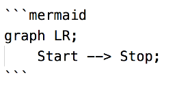
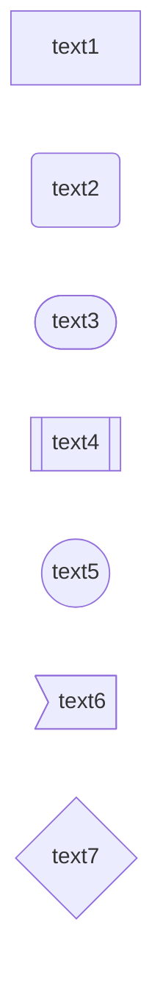
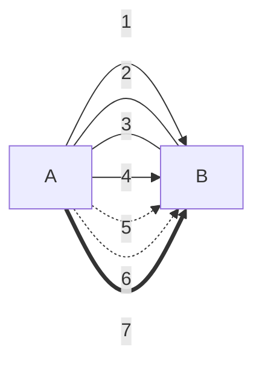
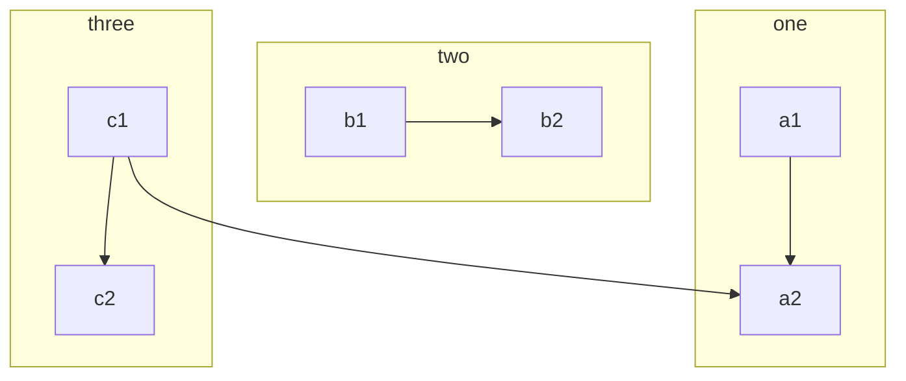
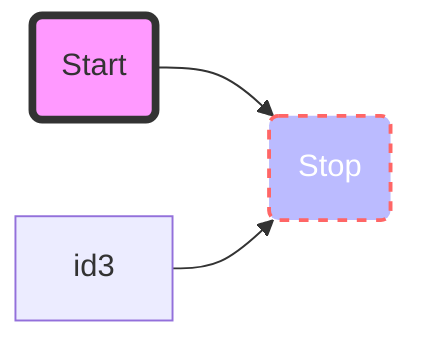
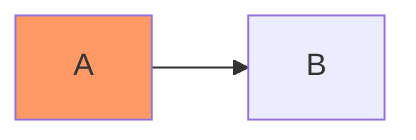

mermaid 是一个流程图插件的语法，可定义多种类型的流程图，详细文档参考[官方文档](https://mermaid-js.github.io/mermaid)

## 流程图

基本的语法

不要使用`;`结尾，否则 hexo 渲染会失败


graph 标明当前为流程图，LR 标明方向

### 方向

－ TB - top to bottom
－ TD - top-down/ same as top to bottom
－ BT - bottom to top
－ RL - right to left
－ LR - left to right

### 节点形状

节点可以设置显示文本用于区分与唯一 id

1. `id1[text1]`
2. `id2(text2)`
3. `id3([text3])`
4. `id4[[text4]]`
5. `id5((text5))`
6. `id6>text6]`
7. `id7{text7}`



### 线条

1. `A-->B;`
2. `A---B;`
3. `A---|text|B`
4. `A-->|text|B`
5. `A-.->B;`
6. `A-.->|text|B`
7. `A ==> B`

文字可以统一在线条语法后使用`|text|`的方式来



### 子图

语法

```text
subgraph title
    graph definition
end
```

例如

```txt
graph TB
    c1-->a2
    subgraph one
    a1-->a2
    end
    subgraph two
    b1-->b2
    end
    subgraph three
    c1-->c2
    end
```



### css 样式

```txt
graph LR
    id1(Start)-->id2(Stop)
    id3:::red-->id2(Stop)
    style id1 fill:#f9f,stroke:#333,stroke-width:4px
    style id2 fill:#bbf,stroke:#f66,stroke-width:2px,color:#fff,stroke-dasharray: 5 5

```



可定义 class

```txt
graph LR
    A:::someclass --> B
    classDef someclass fill:#f96;
```


