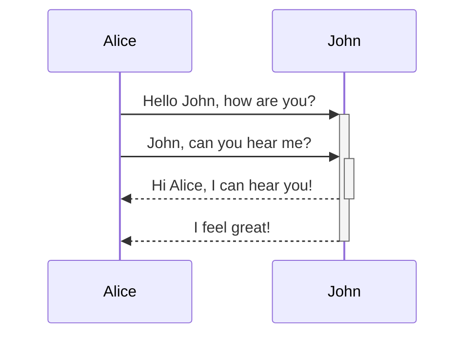

## 概述

MRCP 是一个标准、统一、可扩展的媒体资源控制协议，主要用来语音识别、TTS 合成、录音、 声纹识别（确认是否为某一类群体），声纹认证。MRCP 是一个框架，同时也是一个协议。该框架定义了它的网络基本组件及相互关系。它使用 SIP 协议来控制会话管理，使用 RTP 进行媒体流传输。它的协议定义了它如何控制媒体资源的过程。 MRCP 是基于文本的协议，与 HTTP、SIP 的结构类似

## 结构

MRCP 允许客户端请求和控制网路上指定的媒体服务，使用媒体服务的客户端通常包括：

- IVR 平台
- 高级媒体网关
- 基于 IP 的媒体服务端

客户端一般需要有

1. 定位和发现媒体资源服务端
2. 与媒体资源服务建立消息 channel
3. 远程控制媒体资源

MRCP 通过 SIP URI 来确认媒体资源的 IP 地址，当找到合适的媒体资源服务，SIP 会在客户端和服务端建立两个消息管道，一个用来发送和接收音频流（又称媒体会话），另一个是客户端用来发送控制请求到媒体资源服务端、服务端响应并返回事件给客户端（又称控制会话，MRCP 协议建立在控制会话上）

媒体资源类型

| 类型        | 描述                                 |
| :---------- | :----------------------------------- |
| basicsynth  | 基础 tts，仅支持 SSML 标准的一些子集 |
| speechsynth | tts ，支持完整的 SSML                |
| dtmfrecog   | DTMF 识别                            |
| sppechrecog | 语音识别                             |
| recorder    | 录音                                 |
| speakverify | 语音验证                             |

## 报文

MRCP 消息分为三种类型，request、response、event。服务端接收到从客户端发送的 request 请求后，解析执行后返回一个 response 响应。response 包含一个三位数字的响应码（与 HTTP 的类似），另外还有包含当前 request 的状态（`PENDING`,`IN-PROGRESS`,`COMPLETE`）

- PENDING 表明客户端的 request 请求已经到达服务器，并添加到服务器的 FIFO 的处理队列中。
- IN-PROGRESS 表明客户端的 request 请求处于执行过程中。
- COMPLETE 表明客户端的 request 请求已经完成，没有后续消息

PENDING 和 IN-PROGRESS 都表明请求还未结束，还在等待其他 event 事件。通过 对特定 events 的响应服务端与客户端进行数据交互。

