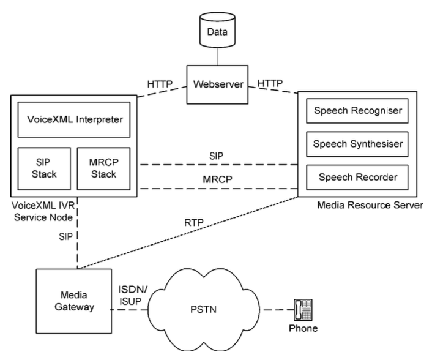
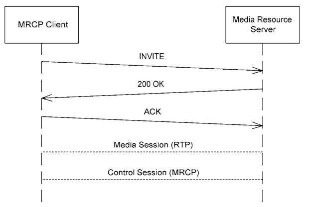
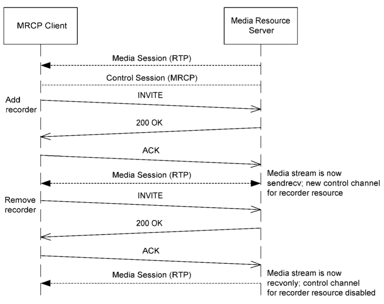
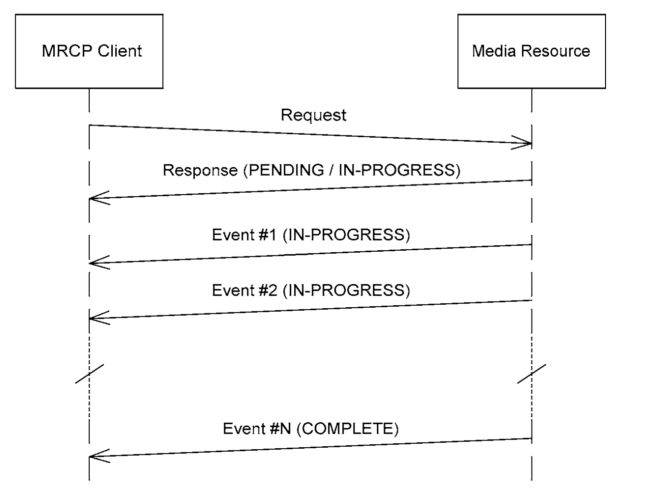

## 概述

MRCP 是一个标准、统一、可扩展的媒体资源控制协议，主要用来语音识别、TTS 合成、录音、 声纹识别（确认是否为某一类群体），声纹认证。MRCP 是一个框架，同时也是一个协议。该框架定义了它的网络基本组件及相互关系。它使用 SIP 协议来控制会话管理，使用 RTP 进行媒体流传输。它的协议定义了它如何控制媒体资源的过程。 MRCP 是基于文本的协议，与 HTTP、SIP 的结构类似

## 结构

MRCP 允许客户端请求和控制网路上指定的媒体服务，使用媒体服务的客户端通常包括：

- IVR 平台
- 高级媒体网关
- 基于 IP 的媒体服务端

客户端一般需要有

1. 定位和发现媒体资源服务端
2. 与媒体资源服务建立消息 channel
3. 远程控制媒体资源

MRCP 通过 SIP URI 来确认媒体资源的 IP 地址，当找到合适的媒体资源服务，SIP 会在客户端和服务端建立两个消息管道，一个用来发送和接收音频流（又称媒体会话），另一个是客户端用来发送控制请求到媒体资源服务端、服务端响应并返回事件给客户端（又称控制会话，MRCP 协议建立在控制会话上）


媒体资源类型

| 类型        | 描述                                 |
| :---------- | :----------------------------------- |
| basicsynth  | 基础 tts，仅支持 SSML 标准的一些子集 |
| speechsynth | tts ，支持完整的 SSML                |
| dtmfrecog   | DTMF 识别                            |
| sppechrecog | 语音识别                             |
| recorder    | 录音                                 |
| speakverify | 语音验证                             |

## 报文

MRCP 消息分为三种类型，request、response、event。服务端接收到从客户端发送的 request 请求后，解析执行后返回一个 response 响应。response 包含一个三位数字的响应码（与 HTTP 的类似），另外还有包含当前 request 的状态（`PENDING`,`IN-PROGRESS`,`COMPLETE`）

- PENDING 表明客户端的 request 请求已经到达服务器，并添加到服务器的 FIFO 的处理队列中。
- IN-PROGRESS 表明客户端的 request 请求处于执行过程中。
- COMPLETE 表明客户端的 request 请求已经完成，没有后续消息

PENDING 和 IN-PROGRESS 都表明请求还未结束，还在等待其他 event 事件。通过 对特定 events 的响应服务端与客户端进行数据交互。

例如一个标准的 tts 播报过程

```txt
 client                    TTS
   |                        |
   |        SPEAK           |
   |----------------------->|
   |                        |
   |    200(IN-PROGRESS)    |
   |<-----------------------|
   |                        |
   |SPEAK-COMPLETE(COMPLETE)|
   |<-----------------------|
   |                        |
   |                        |
```

其请求报文大致如下

```http
MRCP/2.0 380 SPEAK 14321
Channel-Identifier: 43b9ae17@speechsynth
Content-Type: application/ssml+xml
Content-Length: 253

<?xml version="1.0" encoding="UTF-8"?>
<speak version="1.0" xmlns="http://www.w3.org/2001/10/synthesis">
<emphasis>Good afternoon</emphasis> Anne.<break/> You have one voice message, two e-mails, and three faxes waiting for you.
</speak>
```

MRCP 的请求报文大体上可以分为三个部分

1. 请求行，每个字段以空格分隔，以换行（CRLF）结束，每个字段分别表示`MRCP版本`、`请求报文长度`、`请求事件`、`请求id`
2. 请求头 `header-name:header-value CRLF`格式，请求头结尾一定会有一个空行
3. 请求报文

```http
MRCP/2.0 119 14321 200 IN-PROGRESS
Channel-Identifier: 43b9ae17@speechsynth
Speech-Marker: timestamp=857206027059

```

MRCP 的返回报文类似请求报文，返回行每个字段分别代表`MRCP版本`、`返回报文长度`、`请求id`、`返回码`、`当前request状态`。
IN-PROGRESS 状态一般表示 audio 流正在向客户端发送。

```http
MRCP/2.0 157 SPEAK-COMPLETE 14321 COMPLETE
Channel-Identifier: 43b9ae17@speechsynth
Speech-Marker: timestamp=861500994355
Completion-Cause: 000 normal

```

当服务端执行到 COMPLETE 状态时，表明不在接收指定的 request 请求，则会返回一个包含 COMPLETE 的响应报文。此时返回行每个字段分别代表`MRCP版本`、`返回事件`、`返回报文长度`、`请求id`、`当前request状态`。

```http
MRCP/2.0 111 START-OF-INPUT 32121 IN-PROGRESS
Channel-Identifier: 23af1e13@speechrecog
Input-Type: speech
```

其他有返回事件的返回行格式也是这样。

## SIP in MRCP

MRCP 使用 SIP 协议在客户端与服务端进行通信。标准的三步`INVITE-200 OK-ACK`握手用来建立 media session 和 control session 连接。`BYE-200 OK`用来关闭连接。使用`SDP offer/answer`模型来进行协商

以下是 control channel 的一些 SDP 片段

```properties
c=IN IP4 10.0.0.1
m=application 9 TCP/MRCPv2
a=setup:active
a=connection:new
a=resource:speechsynth
a=cmid:1
```

SDP 是客户端请求服务端报文体重的一部分内容，比如包含在 INVITE 消息中。上述的例子，MRCP 向媒体服务器申请一个语音合成服务。

- c 行表示 IP 地址。
- m control session 包含一个或多个 m 行，其第一个字段为 application（对于 media session ，其值应为 audio）。每个 m 行代表一个 media 资源。`TCP/MRCPv2`表示使用 TCP 进行数据传输。端口号仅为`0`或`9`，`0`表示禁用，`9`表示暂未确定，将有服务端来确定。m 行下面的 a 行是对当前 m 行的属性进行设定。
- setup 客户端总是初始化为 active，服务端总是为 passive
- connection 是否新建 TCP 连接（new)，还是使用 已经存在的 TCP 连接（existing）
- resource 请求的媒体资源类型
- cmid control channel 到 media 流的一个标识，多个 contrl channel 可以使用同一个 cmid，这标识同一通会话可以多次使用同一个 media 流。

以下是 SIP 200 Ok 的响应报文的一些片段

```properties
c=IN IP4 10.0.0.22
m=application 43251 TCP/MRCPv2
a=setup:passive
a=connection:new
a=channel:43b9ae17@speechsynth
a=cmid:1
```

- m 这里就指定了将要使用的端口号

示例：

一个标准的单媒体资源请求服务


INVITE

```http
INVITE sip:mrcpv2@example.com SIP/2.0
Via: SIP/2.0/UDP host1.example.com;branch=z9hG4bKabc Max-Forwards: 70
To: <sip:mrcpv2@example.com>
From: <sip:client@example.com>;tag=12425
Call-ID: 43fb8aec@host1.example.com
CSeq: 1 INVITE
Contact: <sip:client@host1.example.com> Content-Type: application/sdp
Content-Length: 264

v=0
o=client 2890844527 2890844527 IN IP4 host1.example.com
s=-
c=IN IP4 host1.example.com
t=0 0
m=audio 5324 RTP/AVP 0
a=rtpmap:0 PCMU/8000
a=recvonly
a=mid:1
m=application 9 TCP/MRCPv2
a=setup:active
a=connection:new
a=resource:speechsynth
a=cmid:1
```

- 第一个 m 行建立 media 流
- 第二个 m 行连接 control session

200 OK

```http
SIP/2.0 200 OK
Via: SIP/2.0/UDP host1.example.com;branch=z9hG4bKabc
;received=192.168.1.11
Max-Forwards: 70
To: <sip:mrcpv2@example.com>;tag=98452
From: <sip:client@example.com>;tag=12425
Call-ID: 43fb8aec@host1.example.com
CSeq: 1 INVITE
Contact: <sip:mrcpv2@host100.example.com>
Content-Type: application/sdp
Content-Length: 274

v=0
o=server 31412312 31412312 IN IP4 host100.example.com
s=-
c=IN IP4 host100.example.com
t=0 0
m=audio 4620 RTP/AVP 0
a=rtpmap:0 PCMU/8000
a=sendonly
a=mid:1
m=application 9001 TCP/MRCPv2
a=setup:passive
a=connection:new
a=channel:153af6@speechsynth
a=cmid:1
```

ACK

```http
ACK sip:mrcpv2@host100.example.com SIP/2.0
Via: SIP/2.0/UDP host1.example.com;branch=z9hG4bK214 Max-Forwards: 70
To: <sip:mrcpv2@example.com>;tag=98452
From: <sip:client@example.com>;tag=12425
Call-ID: 43fb8aec@host1.example.com
CSeq: 1 ACK
Contact: <sip:mrcpv2@host1.example.com>
Content-Length: 0
```

添加和删除 media 资源


INVITE

```http
INVITE sip:mrcpv2@host100.example.com SIP/2.0
Via: SIP/2.0/UDP host1.example.com;branch=z9hG4bK452 Max-Forwards: 70
To: <sip:mrcpv2@example.com>;tag=98452
From: <sip:client@example.com>;tag=12425
Call-ID: 43fb8aec@host1.example.com CSeq: 2 INVITE
Contact: <sip:client@host1.example.com>
Content-Type: application/sdp
Content-Length: 367

v=0
o=client 2890844527 2890844528 IN IP4 host1.example.com
s=-
c=IN IP4 host1.example.com
t=0 0
m=audio 5324 RTP/AVP 0
a=rtpmap:0 PCMU/8000
a=sendrecv
a=mid:1
m=application 9 TCP/MRCPv2
a=setup:active
a=connection:existing
a=resource:speechsynth
a=cmid:1
m=application 9 TCP/MRCPv2
a=setup:active
a=connection:existing
a=resource:recorder
a=cmid:1
```

- 新申请一个 recorder 服务。SDP 全量更新 control session 和 media session 的，所以之前建立的 control session 是需要体现在当前的 SDP 内容中，当我们使用 recorder 服务，media 资源就需要保持双向连接（sendrecv），control session 的 connection 使用了现有的 control session 的 TCP 连接

200 OK

```http
SIP/2.0 200 OK
Via: SIP/2.0/UDP host1.example.com;branch=z9hG4bK452;received=192.168.1.1
To: <sip:mrcpv2@example.com>;tag=98452
From: <sip:client@example.com>;tag=12425
Call-ID: 43fb8aec@host1.example.com CSeq: 2 INVITE
Contact: <sip:client@host1.example.com>
Content-Type: application/sdp
Content-Length: 387

v=0
o=client 31412312 31412313 IN IP4 host100.example.com
s=-
c=IN IP4 host100.example.com
t=0 0
m=audio 4620 RTP/AVP 0
a=rtpmap:0 PCMU/8000
a=sendrecv
a=mid:1
m=application 9001 TCP/MRCPv2
a=setup:passive
a=connection:existing
a=channel:153af6@speechsynth
a=cmid:1
m=application 9001 TCP/MRCPv2
a=setup:passive
a=connection:existing
a=channel: 153af6@recorder
a=cmid:1
```

ACK

```http
ACK sip:mrcpv2@host100.example.com SIP/2.0
Via: SIP/2.0/UDP host1.example.com;branch=z9hG4bK554
Max-Forwards: 70
To: <sip:mrcpv2@example.com>;tag=98452
From: <sip:client@example.com>;tag=12425
Call-ID: 43fb8aec@host1.example.com
CSeq: 2 ACK
Contact: <sip:mrcpv2@host1.example.com> Content-Length: 0

```

INVITE

```http
INVITE sip:mrcpv2@host100.example.com SIP/2.0
Via: SIP/2.0/UDP host1.example.com;branch=z9hG4bK763 Max-Forwards: 70
To: <sip:mrcpv2@example.com>;tag=98452
From: <sip:client@example.com>;tag=12425
Call-ID: 43fb8aec@host1.example.com
CSeq: 3 INVITE
Contact: <sip:client@host1.example.com>
Content-Type: application/sdp
Content-Length: 367

v=0
o=client 2890844527 2890844529 IN IP4 host1.example.com
s=-
c=IN IP4 host1.example.com
t=0 0
m=audio 5324 RTP/AVP 0
a=rtpmap:0 PCMU/8000
a=recvonly
a=mid:1
m=application 9 TCP/MRCPv2
a=setup:active
a=connection:existing
a=resource:speechsynth
a=cmid:1
m=application 0 TCP/MRCPv2
a=setup:active
a=connection:existing
a=resource:recorder
a=cmid:1

```

- application 后的端口被设置 0，表示禁用

200 OK

```http
SIP/2.0 200 OK
Via: SIP/2.0/UDP host1.example.com;branch=z9hG4bK763
;received=192.168.1.1
To: <sip:mrcpv2@example.com>;tag=98452 From: <sip:client@example.com>;tag=12425 Call-ID: 43fb8aec@host1.example.com CSeq: 3 INVITE
Contact: <sip:client@host1.example.com> Content-Type: application/sdp Content-Length: 384

v=0
o=client 31412312 31412314 IN IP4 host100.example.com s=-
c=IN IP4 host100.example.com
t=0 0
m=audio 4620 RTP/AVP 0
a=rtpmap:0 PCMU/8000
a=sendonly
a=mid:1
m=application 9001 TCP/MRCPv2
a=setup:passive
a=connection:existing
a=channel:153af6@speechsynth
a=cmid:1
m=application 0 TCP/MRCPv2
a=setup:passive
a=connection:existing
a=channel: 153af6@recorder
a=cmid:1
```

ACK

```http
ACK sip:mrcpv2@host100.example.com SIP/2.0
Via: SIP/2.0/UDP host1.example.com;branch=z9hG4bK432
Max-Forwards: 70
To: <sip:mrcpv2@example.com>;tag=98452
From: <sip:client@example.com>;tag=12425
Call-ID: 43fb8aec@host1.example.com
CSeq: 3 ACK
Contact: <sip:mrcpv2@host1.example.com> Content-Length: 0
```

查询服务端支持的功能

OPTIONS

```http
OPTIONS sip:mrcpv2@example.com SIP/2.0
Via: SIP/2.0/UDP host1.example.com;branch=z9hG4bKab3
Max-Forwards: 70
To: <sip:mrcpv2@example.com>
From: <sip:client@example.com>;tag=21342
Call-ID: 12fa3421@host1.example.com
CSeq: 21342 OPTIONS
Contact: <sip:client@host1.example.com>
Accept: application/sdp
Content-Length: 0

```

200 OK

```http
SIP/2.0 200 OK
Via: SIP/2.0/UDP host1.example.com;branch=z9hG4bKab3
Max-Forwards: 70
To: <sip:mrcpv2@example.com>;tag=32421
From: <sip:client@example.com>;tag=21342
Call-ID: 12fa3421@host1.example.com
CSeq: 21342 OPTIONS
Contact: <sip:client@host99.example.com>
Allow: INVITE, BYE, OPTIONS, ACK, CANCEL
Content-Type: application/sdp
Content-Length: 288

v=0
o=Server 289123140 289123140 IN IP4 host99.example.com
s=-
t=0 0
m=application 0 TCP/MRCPv2
a=resource:speechsynth
a=resource:speechrecog
a=resource:recorder
m=audio 0 RTP/AVP 0 8 96
a=rtpmap:0 PCMU/8000
a=rtpmap:8 PCMA/8000
a=rtpmap:96 telephone-event/8000
a=fmtp:96 0-15
```

## control session

MRCP 消息有三种：request、response、event。每种消息都含有一个起始行（各种类型的消息起始行有差异），一个或多个消息头，以 CRLF 间隔，格式为`header-name:header-value`，消息体报文一个有消息头定义长度和格式的报文。


### request

起始行格式：`MRCP/2.0 message-length method-name requestid`

- 协议版本
- 整个报文的长度，包括起始行
- 请求的服务
  - SPEACK 语音合成服务
  - RECOGNIZE 语音识别服务
- 32 位自增 int 来区分不同的请求

示例

```http
MRCP/2.0 267 SPEAK 10000
Channel-Identifier: 43b9ae17@speechsynth
Content-Type: application/ssml+xml
Content-Length: 150

<?xml version="1.0" encoding="UTF-8"?> <speak version="1.0"
xmlns="http://www.w3.org/2001/10/synthesis"> Hello world!
</speak>
```

Channel-Identifier 是所有 request 都必须的，与 SDP channel 的值是相同的

### response

起始行格式为：`MRCP/2.0 message-length request-id status-code request-state`

- 协议版本号
- 整体报文长度，包括起始行
- 请求 ID
- 类似 HTTP 状态码
- 请求状态，PENDING、IN-PROGRESS、COMPLETE

示例

```http
MRCP/2.0 79 10000 200 IN-PROGRESS Channel-Identifier: 43b9ae17@speechsynth
```

### event

起始行格式：`MRCP/2.0 message-length event-name request-id request-state`

- 协议版本号
- 整体报文长度，包括起始行
- 事件
- 请求 ID
- 请求状态，PENDING、IN-PROGRESS、COMPLETE

不同的媒体资源支持不同的事件

示例

```http
MRCP/2.0 109 START-OF-INPUT 10000 IN-PROGRESS
Channel-Identifier: 43b9ae17@speechrecog
Input-Type: dtmf
```

## tcpdump

使用wireshark分析抓取的报文时，一般是在sip消息下面一些的tcp报文中就有mrcp报文信息
