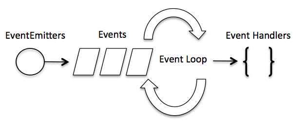
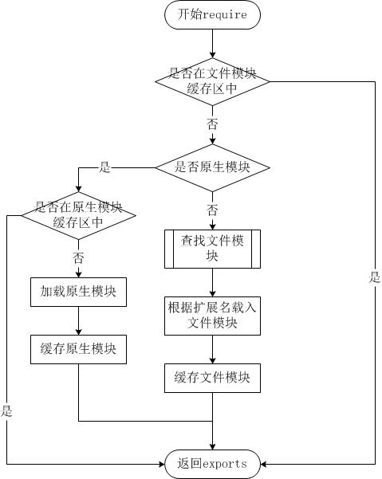

## `npm`

NPM 是随同 NodeJS 一起安装的包管理工具, `nodejs`的包管理器，用于 node 插件管理，包括安装，卸载，管理依赖等

### 用 npm 命令安装模块

npm 安装 Node.js 模块语法格式如下：

```shell
npm install <Module Name>
```

npm 的包安装分为本地安装（local）、全局安装（global）两种，从敲的命令行来看，差别只是有没有-g 而已，比如

```shell
npm install express          # 本地安装
npm install express -g   # 全局安装

```

#### 本地安装

1. 将安装包放在 ./node_modules 下（运行 npm 命令时所在的目录），如果没有 node_modules 目录，会在当前执行 npm 命令的目录下生成 node_modules 目录。
2. 可以通过 require() 来引入本地安装的包。
3. 可通过`npm list`查看项目安装的模块

#### 全局安装

1. 将安装包放在 /usr/local 下或者你 node 的安装目录。
2. 可以直接在命令行里使用。
3. 可通过`npm root -g`查看所有全局安装的模块的目录：
4. 可通过`npm list -g`查看全局安装的模块

### 使用 package.json

package.json 位于模块的目录下，用于定义包的属性

`npm init` 初始化，生成`package.json`

#### Package.json 属性说明

> name - 包名。
> version - 包的版本号。
> description - 包的描述。
> scripts 使用`npm run command`实际执行其配置的值。例如`{"dev": "node build/dev-server.js"}`
> homepage - 包的官网 url 。
> author - 包的作者姓名。
> contributors - 包的其他贡献者姓名。
> dependencies - 依赖包列表。如果依赖包没有安装，npm 会自动将依赖包安装在 node_module 目录下。
> repository - 包代码存放的地方的类型，可以是 git 或 svn，git 可在 Github 上。
> main - main 字段指定了程序的主入口文件，require('moduleName') 就会加载这个文件。这个字段的默认值是模块根目录下面的 index.js。
> keywords - 关键字

安装软件时可以将模块的依赖写入`package.json`的节点下

1. `-S` `-s` `--save` 将安装包信息加入到`dependencies`
2. `-D` `-d` `--save --dev` 将安装包信息加入`devDependencies`

### 配置

```shell
# 显示所有配置
npm config ls -l
```

## 事件驱动

Node.js 基本上所有的事件机制都是用设计模式中观察者模式实现。
Node.js 单线程类似进入一个 while(true)的事件循环，直到没有事件观察者退出，每个异步事件都生成一个事件观察者，如果有事件发生就调用该回调函数.


Node.js 有多个内置的事件，我们可以通过引入 events 模块，并通过实例化 EventEmitter 类来绑定和监听事件，如下实例：

```javascript
// 引入 events 模块
var events = require("events");
// 创建 eventEmitter 对象
var eventEmitter = new events.EventEmitter();
```

以下程序绑定事件处理程序：

```javascript
// 绑定事件及事件的处理程序
eventEmitter.on("eventName", eventHandler);
```

我们可以通过程序触发事件：

```javascript
// 触发事件
eventEmitter.emit("eventName");
```

## Stream(流)

Stream 是一个抽象接口，Node 中有很多对象实现了这个接口。例如，对 http 服务器发起请求的 request 对象就是一个 Stream，还有 stdout（标准输出）。
Node.js，Stream 有四种流类型：

- Readable - 可读操作。
- Writable - 可写操作。
- Duplex - 可读可写操作.
- Transform - 操作被写入数据，然后读出结果。

所有的 Stream 对象都是 EventEmitter 的实例。常用的事件有：

- data - 当有数据可读时触发。
- end - 没有更多的数据可读时触发。
- error - 在接收和写入过程中发生错误时触发。
- finish - 所有数据已被写入到底层系统时触发。

### 从流中读取数据

创建 input.txt 文件，内容如下：

> 菜鸟教程官网地址：www.runoob.com
> 创建 main.js 文件, 代码如下：

```javascript
var fs = require("fs");
var data = "";

// 创建可读流
var readerStream = fs.createReadStream("input.txt");

// 设置编码为 utf8。
readerStream.setEncoding("UTF8");

// 处理流事件 --> data, end, and error
readerStream.on("data", function (chunk) {
  data += chunk;
});

readerStream.on("end", function () {
  console.log(data);
});

readerStream.on("error", function (err) {
  console.log(err.stack);
});

console.log("程序执行完毕");
```

以上代码执行结果如下：

> 程序执行完毕
> 菜鸟教程官网地址：www.runoob.com

### 写入流

创建 main.js 文件, 代码如下：

```javascript
var fs = require("fs");
var data = "菜鸟教程官网地址：www.runoob.com";

// 创建一个可以写入的流，写入到文件 output.txt 中
var writerStream = fs.createWriteStream("output.txt");

// 使用 utf8 编码写入数据
writerStream.write(data, "UTF8");

// 标记文件末尾
writerStream.end();

// 处理流事件 --> data, end, and error
writerStream.on("finish", function () {
  console.log("写入完成。");
});

writerStream.on("error", function (err) {
  console.log(err.stack);
});

console.log("程序执行完毕");
```

以上程序会将 data 变量的数据写入到 output.txt 文件中。代码执行结果如下：

> node main.js
> 程序执行完毕
> 写入完成。

查看 output.txt 文件的内容：

> cat output.txt
> 菜鸟教程官网地址：www.runoob.com

### 管道流

管道提供了一个输出流到输入流的机制。通常我们用于从一个流中获取数据并将数据传递到另外一个流中。

设置 input.txt 文件内容如下：

> 菜鸟教程官网地址：www.runoob.com
> 管道流操作实例

创建 main.js 文件, 代码如下：

```javascript
var fs = require("fs");

// 创建一个可读流
var readerStream = fs.createReadStream("input.txt");

// 创建一个可写流
var writerStream = fs.createWriteStream("output.txt");

// 管道读写操作
// 读取 input.txt 文件内容，并将内容写入到 output.txt 文件中
readerStream.pipe(writerStream);

console.log("程序执行完毕");
```

代码执行结果如下：

> node main.js
> 程序执行完毕

查看 output.txt 文件的内容：

> cat output.txt
> 菜鸟教程官网地址：www.runoob.com

### 管道流操作实例

链式流
链式是通过连接输出流到另外一个流并创建多个流操作链的机制。链式流一般用于管道操作。
接下来我们就是用管道和链式来压缩和解压文件。
创建 compress.js 文件, 代码如下：

```javascript
var fs = require("fs");
var zlib = require('zlib');

// 压缩 input.txt 文件为 input.txt.gz
fs.createReadStream('input.txt')
  .pipe(zlib.createGzip())
  .pipe(fs.createWriteStream('input.txt.gz'));

console.log("文件压缩完成。");
代码执行结果如下：
$ node compress.js
文件压缩完成。
执行完以上操作后，我们可以看到当前目录下生成了 input.txt 的压缩文件 input.txt.gz。
接下来，让我们来解压该文件，创建 decompress.js 文件，代码如下：
var fs = require("fs");
var zlib = require('zlib');

// 解压 input.txt.gz 文件为 input.txt
fs.createReadStream('input.txt.gz')
  .pipe(zlib.createGunzip())
  .pipe(fs.createWriteStream('input.txt'));

console.log("文件解压完成。");
```

代码执行结果如下：

> node decompress.js
> 文件解压完成。

## 模块系统

模块是 Node.js 应用程序的基本组成部分，文件和模块是一一对应的。换言之，一个 Node.js 文件就是一个模块，这个文件可能是 JavaScript 代码、JSON 或者编译过的 C/C++ 扩展。Node.js 提供了 exports 和 require 两个对象，其中 exports 是模块公开的接口，require 用于从外部获取一个模块的接口，即所获取模块的 exports 对象。

### require

引入其他模块

```javascript
var http = require("http");
http
  .createServer(function (request, response) {
    // 发送 HTTP 头部
    // HTTP 状态值: 200 : OK
    // 内容类型: text/plain
    response.writeHead(200, { "Content-Type": "text/plain" });

    // 发送响应数据 "Hello World"
    response.end("Hello World\n");
  })
  .listen(8888);

// 终端打印如下信息
console.log("Server running at http://127.0.0.1:8888/");
```

引入 json 文件

```javascript
var data = require("./data.json");
```

### exports

创建 hello.js 文件，代码如下：

```javascript
exports.world = function () {
  console.log("Hello World");
};
```

则我们可以在代码中引用该模块的方法

```javascript
var hello = require("./hello");
hello.world();
```

在以上示例中，hello.js 通过 exports 对象把 world 作为模块的访问接口，在 main.js 中通过 require('./hello') 加载这个模块，然后就可以直接访问 hello.js 中 exports 对象的成员函数了。
有时候我们只是想把一个对象封装到模块中，格式如下：

```javascript
module.exports = function () {
  // ...
};
```

模块接口的唯一变化是使用 module.exports = Hello 代替了 exports.world = function(){}。 在外部引用该模块时，其接口对象就是要输出的 Hello 对象本身，而不是原先的 exports

### export 和 import

export 与 import 是 JavaScript 用来进行模块化管理的两个关键词

export 可以标记在任何变量、方法、类的声明前
例如

```javascript
// 📁 say.js
export let months = ["Jan", "Feb"];

export const MODULES_BECAME_STANDARD_YEAR = 2015;

export function sayHi(user) {
  alert(`Hello, ${user}!`);
}

export class User {
  constructor(name) {
    this.name = name;
  }
}

function sayHi(user) {
  alert(`Hello, ${user}!`);
}

function sayBye(user) {
  alert(`Bye, ${user}!`);
}
//也可单独export变量
export { sayHi, sayBye };

//export 可重命名
export { sayHi as hi, sayBye as bye };
```

我们可以通过 import 导入其他模块的变量，语法为`import {...}`

```javascript
// 📁 main.js
import { sayHi, sayBye } from "./say.js";

sayHi("John"); // Hello, John!
sayBye("John"); // Bye, John!
```

也可以给 import 的对象命名

```javascript
// 📁 main.js
import * as say from "./say.js";

say.sayHi("John");
say.sayBye("John");

//可以为具体成员变量重新命名
// 📁 main.js
import { sayHi as hi, sayBye as bye } from "./say.js";

hi("John"); // Hello, John!
bye("John"); // Bye, John!
```

当使用`export default`时

```javascript
// 📁 user.js
export default class User {
  // just add "default"
  constructor(name) {
    this.name = name;
  }
}

//export default 可以导出匿名函数或类，一个模块只能有一个default
export default class {
  constructor() { ... }
}
export default function(){
}


// 📁 main.js
import User from "./user.js"; // not {User}, just User

new User("John");

// 也可以使用非default的方式导入，默认将其视为名为default的变量

import {default as User,sayHi} from './user.js'
```

| export                  | default export                  |
| :---------------------- | :------------------------------ |
| export class User {...} | export default class User {...} |
| import {User} from ...  | import User from ...            |

### 模块的加载过程

由于 Node.js 中存在 4 类模块（原生模块和 3 种文件模块），尽管 require 方法极其简单，但是内部的加载却是十分复杂的，其加载优先级也各自不同。如下图所示：


#### 从文件模块缓存中加载

尽管原生模块与文件模块的优先级不同，但是都会优先从文件模块的缓存中加载已经存在的模块。

#### 从原生模块加载

原生模块的优先级仅次于文件模块缓存的优先级。require 方法在解析文件名之后，优先检查模块是否在原生模块列表中。以 http 模块为例，尽管在目录下存在一个 http/http.js/http.node/http.json 文件，require("http") 都不会从这些文件中加载，而是从原生模块中加载。
原生模块也有一个缓存区，同样也是优先从缓存区加载。如果缓存区没有被加载过，则调用原生模块的加载方式进行加载和执行。

#### 从文件加载

当文件模块缓存中不存在，而且不是原生模块的时候，Node.js 会解析 require 方法传入的参数，并从文件系统中加载实际的文件，加载过程中的包装和编译细节在前一节中已经介绍过，这里我们将详细描述查找文件模块的过程，其中，也有一些细节值得知晓。
require 方法接受以下几种参数的传递：

- http、fs、path 等，原生模块。
- ./mod 或../mod，相对路径的文件模块。
- /pathtomodule/mod，绝对路径的文件模块。
- mod，非原生模块的文件模块。
  在路径 Y 下执行 require(X) 语句执行顺序：

```shell
1. 如果 X 是内置模块
   a. 返回内置模块
   b. 停止执行
2. 如果 X 以 '/' 开头
   a. 设置 Y 为文件根路径
3. 如果 X 以 './' 或 '/' or '../' 开头
   a. LOAD_AS_FILE(Y + X)
   b. LOAD_AS_DIRECTORY(Y + X)
4. LOAD_NODE_MODULES(X, dirname(Y))
5. 抛出异常 "not found"

LOAD_AS_FILE(X)
1. 如果 X 是一个文件, 将 X 作为 JavaScript 文本载入并停止执行。
2. 如果 X.js 是一个文件, 将 X.js 作为 JavaScript 文本载入并停止执行。
3. 如果 X.json 是一个文件, 解析 X.json 为 JavaScript 对象并停止执行。
4. 如果 X.node 是一个文件, 将 X.node 作为二进制插件载入并停止执行。

LOAD_INDEX(X)
1. 如果 X/index.js 是一个文件,  将 X/index.js 作为 JavaScript 文本载入并停止执行。
2. 如果 X/index.json 是一个文件, 解析 X/index.json 为 JavaScript 对象并停止执行。
3. 如果 X/index.node 是一个文件,  将 X/index.node 作为二进制插件载入并停止执行。

LOAD_AS_DIRECTORY(X)
1. 如果 X/package.json 是一个文件,
   a. 解析 X/package.json, 并查找 "main" 字段。
   b. let M = X + (json main 字段)
   c. LOAD_AS_FILE(M)
   d. LOAD_INDEX(M)
2. LOAD_INDEX(X)

LOAD_NODE_MODULES(X, START)
1. let DIRS=NODE_MODULES_PATHS(START)
2. for each DIR in DIRS:
   a. LOAD_AS_FILE(DIR/X)
   b. LOAD_AS_DIRECTORY(DIR/X)

NODE_MODULES_PATHS(START)
1. let PARTS = path split(START)
2. let I = count of PARTS - 1
3. let DIRS = []
4. while I >= 0,
   a. if PARTS[I] = "node_modules" CONTINUE
   b. DIR = path join(PARTS[0 .. I] + "node_modules")
   c. DIRS = DIRS + DIR
   d. let I = I - 1
5. return DIRS
```

## 路由

路由简单来说是一个请求的 uri 地址与相对应的 function 的映射表

```javascript
var http = require("http");
var url = require("url");

function start(route) {
  function onRequest(request, response) {
    var pathname = url.parse(request.url).pathname;
    // true 返回dict
    var paramertes = url.parse(request.url, true).query;
    console.log("Request for " + pathname + " received.");

    route(pathname);

    response.writeHead(200, { "Content-Type": "text/plain" });
    response.write("Hello World");
    response.end();
  }

  http.createServer(onRequest).listen(8888);
  console.log("Server has started.");
}

exports.start = start;
```

路由中可以根据`pathname`调用对应的函数去处理

```javascript
function route(pathname) {
  console.log("About to route a request for " + pathname);
}

exports.route = route;
```

```javascript
var server = require("./server");
var router = require("./router");

server.start(router.route);
```

### 错误问题

> npm 安装软件时 报错 reason: getaddrinfo EAI_AGAIN

关闭代理软件即可
