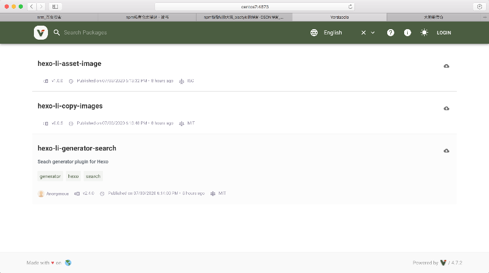

## 后台运行库

pm2 是一个进程管理工具,可以用它来管理你的 node 进程，并查看 node 进程的状态，当然也支持性能监控，进程守护，负载均衡等功能

```shell
# 全局安装
npm install -g pm2
# 启动进程/应用
pm2 start app.js
# 重命名进程/应用
pm2 start app.js --name wb123
# 添加进程/应用 watch
pm2 start bin/www --watch
# 结束进程/应用
pm2 stop www
# 结束所有进程/应用
pm2 stop all
# 删除进程/应用
pm2 delete www
# 删除所有进程/应用
pm2 delete all
# 列出所有进程/应用
pm2 list
# 查看某个进程/应用具体情况
pm2 describe www
#  查看进程/应用的资源消耗情况
pm2 monit
# 查看pm2的日志
pm2 logs
# 若要查看某个进程/应用的日志,使用
pm2 logs www
# 重新启动进程/应用
pm2 restart www
# 重新启动所有进程/应用
pm2 restart all
```

## 镜像源管理工具

```shell
$ npm install -g nrm

# *表示当前正在使用的源
$ nrm ls
* npm -------- https://registry.npmjs.org/
  yarn ------- https://registry.yarnpkg.com/
  cnpm ------- http://r.cnpmjs.org/
  taobao ----- https://registry.npm.taobao.org/
  nj --------- https://registry.nodejitsu.com/
  npmMirror -- https://skimdb.npmjs.com/registry/
  edunpm ----- http://registry.enpmjs.org/

# 新增源
$ nrm add verdaccio http://centos7:4873
# 切换源
$ nrm use verdaccio
```

测试源响应速度

```shell
$ nrm test taobao
  taobao - 407ms
# 测试所有
nrm test
  npm ---- 336ms
  yarn --- 334ms
  cnpm --- 810ms
  taobao - 545ms
  nj ----- Fetch Error
  npmMirror  794ms
  edunpm - Fetch Error
* verdaccio  41ms

```

## 搭建私人仓库

1. 安装 verdaccio，使用 npm 全局安装即可。

   ```shell
   npm install –global verdaccio
   ```

2. 安装完成后，直接输入 verdaccio 命令即可运行

   ```shell
       $ verdaccio
       warn --- config file  - /home/li/.config/verdaccio/config.yaml
       warn --- Verdaccio started
       warn --- Plugin successfully loaded: verdaccio-htpasswd
       warn --- Plugin successfully loaded: verdaccio-audit
       warn --- http address - http://localhost:4873/ - verdaccio/4.7.2
   ```

   `config.yaml`是 verdaccio 的默认配置文件，为了能让外部访问，我们在其中添加

   ```yml
   listen: 0.0.0.0:4873
   ```

   我们使用 pm2 后台启动

   ```shell
   pm2 start verdaccio
   ```

3. 在自定义模块中，发布应用

   ```shell
    # 链接私有仓库
    nrm add verdaccio http://centos7:4873
    # 切换源
    nrm use verdaccio
    # 注册用户
    npm adduser
    # 发布
    npm publish
    # 下载我们发布的应用
    npm install test

   ```

   发布不成功，尝试使用最简格式`package.json`

   例如
   

4. verdaccio 存储 nodejs 包的地址
   `~/.local/share/verdaccio/storage`
