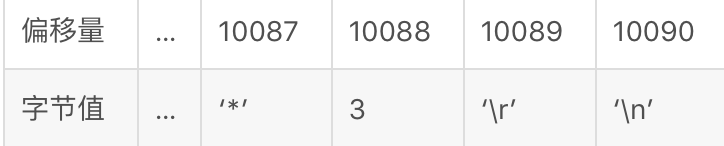

## 基础概念

redis 提供了基础的主从复制功能，它允许一个从节点实例完整拷贝主节点实例。当主从连接断开后，从节点会自动重连主节点

- 主从节点连接后，主节点想从节点发送一连串的流指令，以用来拷贝主节点所有的写命令
- 当从节点因故障断开连接后重连后，从节点尝试执行部分同步，即仅同步执行在断开连接时间内的写命令流
- 当部分同步不可用时，从节点会请求一个全量同步，这需要主从点生成一个数据的快照，并将其发送给从节点，发送后主节点才可继续执行其他命令

redis 默认采用异步方式同步数据，耗费时间少性能高，可以使用`wait`命令，使其使用同步方式同步数据。`wait`仅确认待同步的数据，不保证同步过程的强一致性。

- redis 使用异步方式同步数据
- 主节点可以有多个从节点
- 从节点可以有子从节点，类似瀑布模式
- 主节点采用非阻塞的方式进行传递数据的，可同时支持查询数据
- 从节点采用非阻塞的方式接受数据，可同时支持查询旧数据

当关闭主节点的持久化策略时，当主节点宕机重启丢失所有数据时，会将空的数据库同步到所有从节点，造成所有节点的数据丢失。所以这时，节点的自动重启功能需要被禁止。

**_从节点不具有写权限_**

## 配置从节点

只需要将下述配置放到从节点的配置文件中即可

```conf
# xxx的从节点
slaveof 192.168.1.1 6379
# 是否为只读模式，默认情况下为yes
slave-read-only  yes
```

## 主从复制的细节

每一个主节点都有个一个 replication ID ，和一个用于记录写命令数据的复制缓存区，每个 byte 的缓冲数据都有一个偏移量，偏移量是一直增长的。


1. 当从节点连接到主节点时，他使用 psync 命令来发送它们记录的 replication ID 和迄今为止处理的写命令的偏移量。
2. 若从节点匹配主节点 replication ID ，并且的复制缓存区中，有从节点上送的偏移量记录，那么从节点将同步偏移量之后的所有命令发送到从节点更新数据。
3. 若从节点上送的 replication ID 不匹配，或者主节点的复制缓存区没有相关偏移量的写命令，那么就会进行全量复制
4. 主节点使用 BGSAVE 命令，将当前数据生成 rdb 文件，然后将文件发送给从节点
5. 从节点收到 rdb 数据后，将其加载到内存中，同时丢失旧数据
