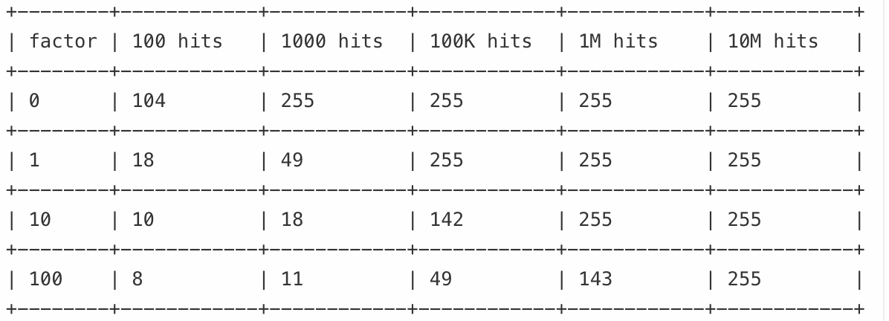

当 redis 内存使用达到最大限制时，当新的数据需要添加时会根据配置的过期策略（maxmemory_policy）表现出不同的行为

- noeviction 直接返回错误
- allkeys-lru 从所有 key 中选择一些最长时间未使用的 key 进行删除
- volatile-lru: 从设置了过期时间的 key 中选择一些最长时间未使用的 key 进行删除
- allkeys-random 从所有 key 中随机删除
- volatile-random 从设置了过期时间的 key 中随机删除
- volatile-ttl 从设置了过期时间的 key 中选择存活时间最短的 key 进行删除
- allkeys-lfu 从所有 key 中选择一个最少使用的 key 进行删除
- volatile-lfu 从设置了过期时间的 key 中选择一个最少使用的 key 进行删除

## LRU

redis 并没有实现理论上的 LRU 算法，而是抽取一小部分的 key，将其中最久未使用的一个 key 进行过期
可以通过配置`maxmemory-samples`指定抽样的个数，默认是 5，抽样个数越大，则收集的越精确，但是占用 cpu 时间越多。当抽样个数达到 10 时，已经非常接近理论上的 LRU。
redis 内部维护一个双向链表，根据最近访问时间来进行排序

## lFU

redis 莫里斯计数法来统计一个 key 的访问量。它的特点是访问量数值小的时候是增长的快，访问量数值大的时候增长的慢。我们可以通过`lfu-log-factor 10`来控制其增长速度。下面是不同参数时，访问量增长的速度增长，根据我们的 key 实际访问量，我们可以定义一个合适的值以方便更好的区分 key 的最近访问频率，以便淘汰最少访问次数的 key

redis 每分钟会计算 key 是否被访问过，若没有则将 key 的最近访问次数减去一个系数，这个系数根据配置`lfu-decay-time 1`来控制
