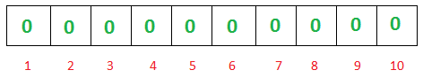
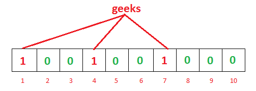

1. 
2. 
3. 
4. 
5. 
6. 
7. 
8. 
9. 
10. 

## 安装

在 centos 上使用 yum 安装

```shell
# 安装源
sudo yum install epel-release yum-utils
sudo yum install http://rpms.remirepo.net/enterprise/remi-release-7.rpm
sudo yum-config-manager --enable remi

sudo yum install redis


```

## 单点启动

```shell
sudo systemctl start redis
sudo systemctl enable redis


# 查看启动状态
sudo systemctl status redis
```

**_可通过查看 redis 日志来查看启动过程或者运行过程中的各种问题_**

日志开启需要在`redis.conf`配置

```conf
logfile /var/log/redis/redis.log
```

## 配置

在 redis 客户端可以使用`config set`设定临时配置，该配置仅临时有效，可通过`config rewrite`将临时配置写入到`redis.conf`中使其永久有效

1. maxmemory 设定最大内存使用

   ```conf
   # 设置为5m
   maxmemory 5m
   ```

2. maxmemory_policy 过期策略

## 使用

redis 的备份文件 dump.db 在启动 redis-server 的目录下直接生成

使用`shell`执行`redis`命令

```shell
echo keys '*'|redis-cli -h '127.0.0.1' -p 6379 -a 'password'

# 逐行批量执行
cat commands.txt|redis-cli -h '127.0.0.1' -p 6379 -a 'password'

```

查询所有`key`，以及过期时间,省略`ip`，端口，密码

```shell
echo keys '*' |redis-cli |awk '{print "echo -n "$1" && echo ttl " $1 " |redis-cli"}'|sh
```

## 布隆过滤器

本质上布隆过滤器是一种数据结构，比较巧妙的概率型数据结构（probabilistic data structure），特点是高效地插入和查询，可以用来告诉你 “某样东西一定不存在或者可能存在”。

相比于传统的 List、Set、Map 等数据结构，它更高效、占用空间更少，但是缺点是其返回的结果是概率性的，而不是确切的。

布隆过滤器是一个 bit 向量或者说 bit 数组，长这样：

如果我们要映射一个值到布隆过滤器中，我们需要使用多个不同的哈希函数生成多个哈希值，并对每个生成的哈希值指向的 bit 位置 1，比如针对值`geeks`进行三个 hash 函数分布生成 hash 值 1,4,7,则上图变成如下

而当我们需要查询 `geeks` 这个值是否存在的话，那么哈希函数必然会返回 1、4、7，然后我们检查发现这三个 bit 位上的值均为 1，那么我们可以说 `geeks` 存在了么？答案是不可以，只能是 `geeks` 这个值可能存在。
传统的布隆过滤器并不支持删除操作。

如何选择哈希函数个数和布隆过滤器长度

很显然，过小的布隆过滤器很快所有的 bit 位均为 1，那么查询任何值都会返回“可能存在”，起不到过滤的目的了。布隆过滤器的长度会直接影响误报率，布隆过滤器越长其误报率越小。

另外，哈希函数的个数也需要权衡，个数越多则布隆过滤器 bit 位置位 1 的速度越快，且布隆过滤器的效率越低；但是如果太少的话，那我们的误报率会变高。

Redis 因其支持 setbit 和 getbit 操作，且纯内存性能高等特点，因此天然就可以作为布隆过滤器来使用。但是布隆过滤器的不当使用极易产生大 Value，增加 Redis 阻塞风险，因此生成环境中建议对体积庞大的布隆过滤器进行拆分。

拆分的形式方法多种多样，但是本质是不要将 Hash(Key) 之后的请求分散在多个节点的多个小 bitmap 上，而是应该拆分成多个小 bitmap 之后，对一个 Key 的所有哈希函数都落在这一个小 bitmap 上。

## 问题集锦

### 访问`redis`集群

访问集群报错

> Connection refused: /127.0.0.1:7000

需要对 redis 集群配置对外访问的 ip 地址，更改每个节点下的`redis.conf`配置，修改或增加配置

```conf
bind  xxx.xxx.xxx.xxx
```

### `del`的相关问题

在使用`redis-cli`连接`redis`集群，进行数据操作时，有报错

> (error) MOVED 5798 192.24.54.2:6379

这种情况一般是因为启动`redis-cli`时没有设置集群模式所导致。启动时使用`-c`参数来启动集群模式，命令如下：

```shell
redis-cli -c
```

### 启动时没有启动成功

> (error) CLUSTERDOWN Hash slot not served

需要重新分配 `hash槽`

### 重启时

> Node 127.0.0.1:7000 is not empty. Either the node already knows other nodes (check with CLUSTER NODES) or contains some key in database 0.

因为`hash槽`已经分配过了，无需重新分配。若要重新分配，将每个节点对应的`node.conf`删除掉再重新执行即可。
