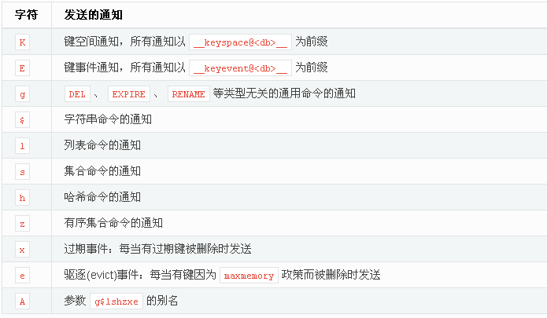

redis 提供发布订阅功能，客户端可订阅一个或多个 channel，也可以取消订阅。使用`redis-cli`进入订阅模式，只能使用`ctrl-c`取消订阅

## 发布订阅

### 订阅

```shell
 subscribe [channel1] [channel2]
```

### 取消订阅

```shell
 unsubscribe [channel1] [channel2]
```

### 发布消息

```shell
publish [channel] [message]
```

发布消息后，发布的客户端返回的是当前订阅 channel 的个数。订阅方会受到包含 channel 和 message

### 模式订阅

psubscribe 和 punsubscribe 基本与 subscribe，unsubscribe 用法一样，只是它支持使用通配符。例如

```shell
psubscribe news.*
punsubscribe news.*
```

## 事件订阅

redis 支持订阅操作数据的事件，事件订阅使用普通的订阅发布机制，不具备可靠性，当发布订阅客户端断开连接时，这段时间的订阅信息会丢失。

事件订阅影响 redis 性能，默认情况下是关闭的，可以通过配置文件打开，一般建议使用`CONFIG SET`临时设置

输入的参数中至少要有一个 K 或者 E，否则的话，不管其余的参数是什么，都不会有任何通知被分发。(大小写不敏感)

| 字符 | 发送的通知                                                      |
| :--- | :-------------------------------------------------------------- |
| K    | 键空间通知，所有通知以  `__keyspace@<db>__`  为前缀，针对 Key   |
| E    | 键事件通知，所有通知以  `__keyevent@<db>__`  为前缀，针对 event |
| g    | DEL 、 EXPIRE 、 RENAME  等类型无关的通用命令的通知             |
| \$   | 字符串命令的通知                                                |
| l    | 列表命令的通知                                                  |
| s    | 集合命令的通知                                                  |
| h    | 哈希命令的通知                                                  |
| z    | 有序集合命令的通知                                              |
| x    | 过期事件：每当有过期键被删除时发送                              |
| e    | 驱逐(evict)事件：每当有键因为  maxmemory  政策而被删除时发送    |
| A    | 参数  g\$lshzxe  的别名，相当于是 All                           |

1. `notify-keyspace-events "Ex"` 表示对过期事件进行通知发送
2. `notify-keyspace-events "Kx"`表示想监控某个 key 的失效事件
3. `notify-keyspace-events "AKx"`将参数设为字符串 AKE 表示发送所有类型的通知。

例如：

```shell
# 临时设置监控事件通知
config set notify-keyspace-events "KEx"

# 模式订阅
PSUBSCRIBE __key*
# 过期事件测试， 10秒后出触发失效事件
setex name 10 tx

# 订阅方收到消息
1) "pmessage"
2) "__key*"
3) "__keyspace@0__:name"
4) "expired"
1) "pmessage"
2) "__key*"
3) "__keyevent@0__:expired"
4) "name"

```

我们可以看到`K`与`E`的区别主要在于触发的`channel`和`message`的不同
**_ 集群模式下，需要在所有节点上都开启事件通知，又因为监听事件主要是基于 key 的事件，因此需要在正确的节点上订阅消息_**
