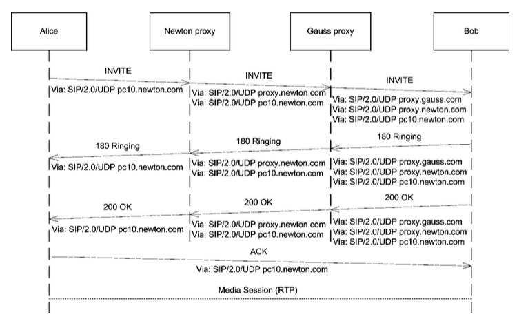

SIP 是一个对等的协议，类似 P2P。它可以在不需要服务器的情况下进行通信，只要通信双方都彼此指导对方的地址（或者只有一方知道另一方的地址）即可，这种情况称为点对点通信。详细标准可查看[RFC3261](https://tools.ietf.org/html/rfc3261#section-7.3)

SIP 协议采用 Client/Server 模型，每一个请求（request），Server 从接受到请求到处理完毕，要回复多个临时响应，和有且仅有一个终结响应（response）。

## 概念

1. Transaction 请求和所有的响应构成一个事务，一个完整的呼叫过程包括多个事件。

2. UA 用户代理，是发起或接受呼叫的逻辑实体

3. UAC 用户代理客户端，用于发起请求

4. UAS 用户代理服务器，用于接受请求

5. UAC 和 UAS 的划分是针对一个事务的，在一个呼叫的多个事务中，UAC 和 UAS 的角色是可以互相转换的

6. B2BUA 是一个 SIP 中逻辑上的网络组件，用于操作不同会话的端点，它将 channel 划分为两路通话，在不同会话的端点直接通信。例如，当建立一通呼叫时，B2BUA 作为一个 UAS 接受所有用户请求，处理后以 UAC 角色转发至目标端。
   

## SIP URI

假设 Bob 在服务器 192.168.1.100，Alice 在 192.168.1.200 上，FreeSwitch 在 192.168.1.9 上，Alice 注册到 FreeSwitch 上，Bob 呼叫 Alice 时，使用 Alice 的服务器地(又称逻辑地址)（Bob 只知道服务器地址），即 sip:Alice@192.168.1.9，FreeSwitch 接受到请求后，查找本地数据库，发现 Alice 的实际地址（Contact 地址，又叫联系地址，亦称物理地址）是 sip:Alice@192.168.1.100，便可以建立呼叫。Bob 作为主叫方，它已经知道服务器地址，可以直接发送 INVITE 请求，是不需要注册的，而 Alice 作为被叫的一方，为了让服务器能找到它，它必须事先通过 REGISTER 消息注册到服务器上。

## 媒体

### 音频编码

从模拟信号变成数字信号的过程称模数转换（Analog Digital Convert ,AD）。AD 转换要经过采样、量化、编码三个过程。编码就是按照一定的规则将采样所得的信号用一组二进制或者其他进制的数来表示。经过编码后的数据便于在网络上传输，到达对端后，在通过解码过程变成原始信号，进而经过数模转换(DA)在恢复为模拟量，即转换为人们能够感知的信号。一般来说，编码与解码都是成对出现的，称为编解码（codec），一般简称编码。

音频编码最基本的两个技术参数就是采样率和打包周期。

- 采样率 采样频率越高，声音就越清晰，保留的细节就越多。对于普通的人声通话来说，8000Hz 就够了。
- 打包周期 打包周期和传输有关，打包周期越短，延迟越小，相对而言传输开销就会越多。大部分编码都支持多种打包周期，常见的打包周期为 20ms。

FreeSwitch 支持的[语音编码](https://freeswitch.org/confluence/display/FREESWITCH/Audio+Codecs)，

```shell
freeswitch@CentOS7> show codec
type,name,ikey
#编码名称 参数  具体实现模块
codec,ADPCM (IMA),mod_spandsp
codec,AMR / Bandwidth Efficient,mod_amr
codec,AMR / Octet Aligned,mod_amr
codec,G.711 alaw,CORE_PCM_MODULE
codec,G.711 ulaw,CORE_PCM_MODULE
codec,G.722,mod_spandsp
codec,G.723.1 6.3k,mod_g723_1
codec,G.726 16k,mod_spandsp
codec,G.726 16k (AAL2),mod_spandsp
codec,G.726 24k,mod_spandsp
codec,G.726 24k (AAL2),mod_spandsp
codec,G.726 32k,mod_spandsp
codec,G.726 32k (AAL2),mod_spandsp
codec,G.726 40k,mod_spandsp
codec,G.726 40k (AAL2),mod_spandsp
codec,G.729,mod_g729
codec,GSM,mod_spandsp
codec,LPC-10,mod_spandsp
codec,PROXY PASS-THROUGH,CORE_PCM_MODULE
codec,PROXY VIDEO PASS-THROUGH,CORE_PCM_MODULE
codec,RAW Signed Linear (16 bit),CORE_PCM_MODULE
codec,Speex,CORE_SPEEX_MODULE
codec,VP8 Video,CORE_VPX_MODULE
codec,VP9 Video,CORE_VPX_MODULE

```

更多编码可参考[wiki](https://en.wikipedia.org/wiki/List_of_codecs)

当我们重新加载模块时，可以看到相关音频编码的加载过程

```shell
freeswitch@CentOS7> reload mod_g723_1
+OK Reloading XML
+OK module unloaded
+OK module loaded

2020-09-07 16:33:34.525691 [ERR] switch_stun.c:900 STUN Failed! [Timeout]
2020-09-07 16:33:34.525691 [ERR] switch_xml.c:175 stun-set failed.
2020-09-07 16:33:44.566137 [ERR] switch_stun.c:900 STUN Failed! [Timeout]
2020-09-07 16:33:44.566137 [ERR] switch_xml.c:175 stun-set failed.
2020-09-07 16:33:44.585289 [ERR] switch_xml.c:1370 Error including /etc/freeswitch/lang/de/*.xml
2020-09-07 16:33:44.585289 [ERR] switch_xml.c:1370 Error including /etc/freeswitch/lang/fr/*.xml
2020-09-07 16:33:44.585289 [ERR] switch_xml.c:1370 Error including /etc/freeswitch/lang/ru/*.xml
2020-09-07 16:33:44.585289 [ERR] switch_xml.c:1370 Error including /etc/freeswitch/lang/he/*.xml
2020-09-07 16:33:44.585289 [INFO] switch_xml.c:1373 No files to include at /etc/freeswitch/lang/es/es_ES.xml
2020-09-07 16:33:44.585289 [INFO] switch_xml.c:1373 No files to include at /etc/freeswitch/lang/pt/pt_BR.xml
2020-09-07 16:33:44.605574 [NOTICE] switch_loadable_module.c:1186 Deleting Codec G723 4 G.723.1 6.3k 8000hz 120ms
2020-09-07 16:33:44.605574 [INFO] mod_enum.c:884 ENUM Reloaded
2020-09-07 16:33:44.605574 [NOTICE] switch_loadable_module.c:1186 Deleting Codec G723 4 G.723.1 6.3k 8000hz 90ms
2020-09-07 16:33:44.605574 [NOTICE] switch_loadable_module.c:1186 Deleting Codec G723 4 G.723.1 6.3k 8000hz 60ms
2020-09-07 16:33:44.605574 [NOTICE] switch_loadable_module.c:1186 Deleting Codec G723 4 G.723.1 6.3k 8000hz 30ms
2020-09-07 16:33:44.605574 [CONSOLE] switch_loadable_module.c:2399 mod_g723_1 has no shutdown routine
2020-09-07 16:33:44.605574 [CONSOLE] switch_loadable_module.c:2416 mod_g723_1 unloaded.
2020-09-07 16:33:44.605574 [CONSOLE] switch_loadable_module.c:1803 Successfully Loaded [mod_g723_1]
2020-09-07 16:33:44.605574 [NOTICE] switch_loadable_module.c:241 Adding Codec G723 4 G.723.1 6.3k 8000hz 120ms 1ch 6300bps
2020-09-07 16:33:44.605574 [NOTICE] switch_loadable_module.c:241 Adding Codec G723 4 G.723.1 6.3k 8000hz 90ms 1ch 6300bps
2020-09-07 16:33:44.605574 [NOTICE] switch_loadable_module.c:241 Adding Codec G723 4 G.723.1 6.3k 8000hz 60ms 1ch 6300bps
2020-09-07 16:33:44.605574 [NOTICE] switch_loadable_module.c:241 Adding Codec G723 4 G.723.1 6.3k 8000hz 30ms 1ch 6300bps
2020-09-07 16:33:44.605574 [INFO] switch_time.c:1430 Timezone reloaded 1750 definitions

```

### 媒体协商

不同的 SIP 终端有不同的特性，支持不同的语音编码。所以不同的 SIP 终端进行通信时需要先与支持的编码进行“协商”，以便双方互相能够理解对方发来的媒体流中的数据。
我们来看一个最简单的编码协商过程。在 FreeSwitch 中我们将日志级别调整为

```shell
# 或者按快捷键F8
freeswitch@CentOS7> /log 7
+OK log level 7 [7]
```

在 log 中我们可以看到如下的协商过程

```shell
Audio Codec Compare [opus:113:48000:20:0:2]/[G722:9:8000:20:64000:1]
Audio Codec Compare [opus:113:48000:20:0:2]/[PCMU:0:8000:20:64000:1]
Audio Codec Compare [opus:113:48000:20:0:2]/[PCMA:8:8000:20:64000:1]
Audio Codec Compare [G722:9:8000:20:64000:1]/[G722:9:8000:20:64000:1]
Audio Codec Compare [G722:9:8000:20:64000:1] ++++ is saved as a match
Audio Codec Compare [G722:9:8000:20:64000:1]/[PCMU:0:8000:20:64000:1]
Audio Codec Compare [G722:9:8000:20:64000:1]/[PCMA:8:8000:20:64000:1]
Audio Codec Compare [PCMU:0:8000:20:64000:1]/[G722:9:8000:20:64000:1]
Audio Codec Compare [PCMU:0:8000:20:64000:1]/[PCMU:0:8000:20:64000:1]
Audio Codec Compare [PCMU:0:8000:20:64000:1] ++++ is saved as a match
Audio Codec Compare [PCMU:0:8000:20:64000:1]/[PCMA:8:8000:20:64000:1]
Audio Codec Compare [PCMA:8:8000:20:64000:1]/[G722:9:8000:20:64000:1]
Audio Codec Compare [PCMA:8:8000:20:64000:1]/[PCMU:0:8000:20:64000:1]
Audio Codec Compare [PCMA:8:8000:20:64000:1]/[PCMA:8:8000:20:64000:1]
Audio Codec Compare [PCMA:8:8000:20:64000:1] ++++ is saved as a match
Set telephone-event payload to 101@8000
Set Codec sofia/internal/1001@10.211.55.6 G722/8000 20 ms 160 samples 64000 bits 1 channels
sofia/internal/1001@10.211.55.6 Original read codec set to G722:9
```

SIP 采用 Off/Anwser（请求／应答）机制来协商。请求发起的一方提供（Offer）自己支持的媒体编码列表，被请求的一方比较自己支持的媒体列表最终选择一种（或几种）编码以应答（Anwser）方式通知请求者，然后他们就可以使用兼容的编码进行通信了。上述 Log，最终可以看到，他也是将客户端与服务器的编码进行逐一比较，最后`Set Codec sofia/internal/1001@10.211.55.6 G722/8000 20 ms 160 samples 64000 bits 1 channels`，表示本次协商成功并把该 Channel 的编码设置为 G722 编码

我们通过拨打一通电话，抓取 tcpdump 报文，详细查看一下相关的 SIP 信令

我们查看一个 INVITE 请求（删减部分信息）

```shell
INVITE sip:5000@10.211.55.6 SIP/2.0
From: "centos7" <sip:1001@10.211.55.6>;tag=8.AL-QAaB3pR6AtISmelTqJqewW4zcKh
To: <sip:5000@10.211.55.6>
User-Agent: Blink Lite 4.6.0 (MacOSX)
Content-Type: application/sdp
Content-Length:   427

v=0
o=- 3808463179 3808463179 IN IP4 10.211.55.2
s=Blink Lite 4.6.0 (MacOSX)
t=0 0
# audio表示音频数据 50008表示端口号，该端口用于收发RTP数据 RTP/AVP表示RTP格式，9 0 8 表示音频编码的IANA的代码 G722 PCMU PCMA
m=audio 50008 RTP/AVP 113 9 0 8 101
# 媒体所在机器的IP地址
c=IN IP4 10.211.55.2
a=rtcp:50009
a=rtpmap:113 opus/48000/2
a=fmtp:113 useinbandfec=1
a=rtpmap:9 G722/8000
a=rtpmap:0 PCMU/8000
a=rtpmap:8 PCMA/8000
a=rtpmap:101 telephone-event/8000
a=fmtp:101 0-16
a=zrtp-hash:1.10 5049b4964ef2ea5a3f01fb61c8c264ec564df6bcdef57d74d26548abf58f19e3
# sendrecv表示双向收发 其他的还有sendonly,recvonly,inactive
a=sendrecv
```

当 Freeswitch 收到请求后，即启动协商过程。根据前面的 Log 所以，服务器提供 OPUS,G722,PCMU,PCMA 等。因此当比较到 G7222 时协商成功，FreeSwitch 返回如下 SIP 消息

```shell
SIP/2.0 200 OK
From: "centos7" <sip:1001@10.211.55.6>;tag=8.AL-QAaB3pR6AtISmelTqJqewW4zcKh
To: <sip:5000@10.211.55.6>;tag=F0mU0rHp6gUHS
Accept: application/sdp
Content-Type: application/sdp
Content-Disposition: session
Content-Length: 251

v=0
o=FreeSWITCH 1599452646 1599452647 IN IP4 10.211.55.6
s=FreeSWITCH
c=IN IP4 10.211.55.6
t=0 0
# FreeSwitch这端的RTP端口号是21734，使用G7222编码
m=audio 21734 RTP/AVP 9 101
a=rtpmap:9 G722/8000
a=rtpmap:101 telephone-event/8000
a=fmtp:101 0-16
a=ptime:20
a=rtcp:21735 IN IP4 10.211.55.6
pidf:time-offset
```

协商过程完毕，双方互相知道了对方的 IP 地址和端口好，就可以互发音频 RTP 包了。

### FreeSwitch 协商策略

- generous 优先采用客户端的编码
- greedy 优先选择服务端即 FreeSwitch 的编码
- scrooge 优先选择服务端即 FreeSwitch 的编码并强制使用自己的采样率

### FreeSwitch 转码

FreeSwitch 作为一个 B2BUA，因而在桥接两条腿时，如果两条腿分别使用不同的编码，则需要经过一个转码过程分别转成对方需要的编码，当需要转码时，FreeSwitch 回将收到的音频数据转换成一种中间格式，称为 L16，即线性 16 位的编码，这种格式可以和其他各种编码进行转换。

### FreeSwitch 其他

- 透传 指在不经过转码的情况下，将从一方收到的媒体流原样转给另一方
- 媒体绕过 媒体绕过技术，即真正的媒体流使用点到点传输，根本不经过 freeswitch
- 媒体代理 即不管 freeswitch 是否支持对该种编码转码，他都对 rtp 数据在不进行任何处理的情况下发送给另一方，与透传的区别是：他只改变 sdp 中的“c=”部分。
- 媒体 Bug，用作监听，检测等
- 使用 uuid_debug_media 拍错，查看日志`Audio Codec Compare`相关行

## SDP

SIP 负责建立和释放会话，一般来说，会话会包含相关的媒体，如视频和音频。媒体数据是由 SDP（Session Description Protocol，会话描述协议）描述的，SDP 一般不单独使用，它与 SIP 配合使用时会放到 SIP 协议的 Boby（正文）中。会话建立时，需要媒体协商，双方才能确定对方的媒体能力以交互媒体数据，比如确认支持的数据格式。
SDP 的特点

- 是一个结构化的文本协议
- 表述 session 的媒体，协议，编码译码格式等
- 通常的 SDP 消息格式为 `type=parameter1 parameter2 ... parameterN`

SDP 参数

```shell
# *表示可选参数


# 协议版本号
v= (protocol version)

#username(用户名) sess-id(会话ID) sess-version(会话版本号) nettype(网络类型) addrtype(地址类型) unicast-address(单播地址)
o= (owner/creator and session identifier)
s= (session name)
i=* (session information)
u=* (URI of description)
e=* (email address)
p=* (phone number)
#  网络类型 网络地址  （RTP数据流发送到该地址）
c=* (connection information - not required if included in all media)
# 带宽类型
b=* (bandwidth information)
z=* (time zone adjustments)
k=* (encryption key)
t=start-time stop-time
# 媒体类型 音频端口号 传输协议 支持的codec类型
m= media port transport format-list
# 描述上面音频的属性，一般m后面跟多个a
a=* (zero or more session attribute lines)

```

支持的 codec 类型，在 SDP 中使用[数字表示](https://en.wikipedia.org/wiki/RTP_payload_formats)，常见的如下

| 数字 | 编码 |
| :--- | :--- |
| 8    | PCMA |

示例

```shell
v = 0
o = mhandley2890844526 2890842807 IN IP4 126.16.64.4
s = SDP Seminar
i = A Seminar on the session description protocol
u = http://www.cs.ucl.ac.uk/staff/M.Handley/sdp.03.ps
e = mjh@isi.edu(Mark Handley)
c = IN IP4 224.2.17.12/127
t = 2873397496 2873404696
a = recvonly
m = audio 49170 RTP/AVP 0
m = video 51372 RTP/AVP 31
m = application 32416udp wb
a = orient:portrait
```

## 一个标准的呼叫过程

```txt
 Alice                     Bob
   |                        |
   |       INVITE F1        |
   |----------------------->|
   |    180 Ringing F2      |
   |<-----------------------|
   |                        |
   |       200 OK F3        |
   |<-----------------------|
   |         ACK F4         |
   |----------------------->|
   |   Both Way RTP Media   |
   |<======================>|
   |                        |
   |         BYE F5         |
   |<-----------------------|
   |       200 OK F6        |
   |----------------------->|
   |                        |
```

其 sip 报文大致如下：

1. F1 INVITE Alice -> Bob

   ```txt
   INVITE sip:bob@biloxi.example.com SIP/2.0
   Via: SIP/2.0/TCP client.atlanta.example.com:5060;branch=z9hG4bK74bf9
   Max-Forwards: 70
   From: Alice <sip:alice@atlanta.example.com>;tag=9fxced76sl
   To: Bob <sip:bob@biloxi.example.com>
   Call-ID: 3848276298220188511@atlanta.example.com
   CSeq: 1 INVITE
   Contact: <sip:alice@client.atlanta.example.com;transport=tcp>
   Content-Type: application/sdp
   Content-Length: 151

   v=0
   o=alice 2890844526 2890844526 IN IP4 client.atlanta.example.com
   s=-
   c=IN IP4 192.0.2.101
   t=0 0
   m=audio 49172 RTP/AVP 0
   a=rtpmap:0 PCMU/8000
   ```

2. F2 180 Ringing Bob -> Alice

   ```txt
   SIP/2.0 180 Ringing
   Via: SIP/2.0/TCP client.atlanta.example.com:5060;branch=z9hG4bK74bf9
      ;received=192.0.2.101
   From: Alice <sip:alice@atlanta.example.com>;tag=9fxced76sl
   To: Bob <sip:bob@biloxi.example.com>;tag=8321234356
   Call-ID: 3848276298220188511@atlanta.example.com
   CSeq: 1 INVITE
   Contact: <sip:bob@client.biloxi.example.com;transport=tcp>
   Content-Length: 0
   ```

3. F3 200 OK Bob -> Alice

   ```txt
   SIP/2.0 200 OK
   Via: SIP/2.0/TCP client.atlanta.example.com:5060;branch=z9hG4bK74bf9
      ;received=192.0.2.101
   From: Alice <sip:alice@atlanta.example.com>;tag=9fxced76sl
   To: Bob <sip:bob@biloxi.example.com>;tag=8321234356
   Call-ID: 3848276298220188511@atlanta.example.com
   CSeq: 1 INVITE
   Contact: <sip:bob@client.biloxi.example.com;transport=tcp>
   Content-Type: application/sdp
   Content-Length: 147

   v=0
   o=bob 2890844527 2890844527 IN IP4 client.biloxi.example.com
   s=-
   c=IN IP4 192.0.2.201
   t=0 0
   m=audio 3456 RTP/AVP 0
   a=rtpmap:0 PCMU/8000
   ```

4. F4 ACK Alice -> Bob

   ```txt
   ACK sip:bob@client.biloxi.example.com SIP/2.0
   Via: SIP/2.0/TCP client.atlanta.example.com:5060;branch=z9hG4bK74bd5
   Max-Forwards: 70
   From: Alice <sip:alice@atlanta.example.com>;tag=9fxced76sl
   To: Bob <sip:bob@biloxi.example.com>;tag=8321234356
   Call-ID: 3848276298220188511@atlanta.example.com
   CSeq: 1 ACK
   Content-Length: 0
   ```

5. 省略通话中的 RTP 媒体信息，通话过程中一般不再有 SIP 消息交互，所有的语音数据都是在 RTP 中传送。

6. F5 BYE Bob -> Alice

   ```txt
   BYE sip:alice@client.atlanta.example.com SIP/2.0
   Via: SIP/2.0/TCP client.biloxi.example.com:5060;branch=z9hG4bKnashds7
   Max-Forwards: 70
   From: Bob <sip:bob@biloxi.example.com>;tag=8321234356
   To: Alice <sip:alice@atlanta.example.com>;tag=9fxced76sl
   Call-ID: 3848276298220188511@atlanta.example.com
   CSeq: 1 BYE
   Content-Length: 0
   ```

7. F6 200 OK Alice -> Bob

   ```txt
   SIP/2.0 200 OK
   Via: SIP/2.0/TCP client.biloxi.example.com:5060;branch=z9hG4bKnashds7
      ;received=192.0.2.201
   From: Bob <sip:bob@biloxi.example.com>;tag=8321234356
   To: Alice <sip:alice@atlanta.example.com>;tag=9fxced76sl
   Call-ID: 3848276298220188511@atlanta.example.com
   CSeq: 1 BYE
   Content-Length: 0
   ```

## 基本方法

### REGISTER

通常的注册流程是 Bob 向 FreeSwitch 发起注册（REGISTER）请求，FreeSwitch 返回 Challenge，Bob 将自己的用户名与密码和 Challenge 进行计算，并将计算结果加密附加到下一次 REGISTER 请求上，重新发起注册。FreeSwitch 收到后对本地数据库中保存的 Alice 信息使用同样的算法进行计算和加密，与 Bob 发送的计算结果进行比对，如果相同，则认证通过。其交互流程如下

```txt
    Bob                          FreeSwitch
     |                               |
     |          REGISTER F1          |
     |------------------------------>|
     |      401 Unauthorized F2      |
     |<------------------------------|
     |          REGISTER F3          |
     |------------------------------>|
     |            200 OK F4          |
     |<------------------------------|
     |                               |

```

使用 tcpdump 抓取报文，可以观察到具体细节

```txt
16:15:09.171545 IP 10.211.55.2.56752 > 10.211.55.6.5060: SIP: REGISTER sip:10.211.55.6 SIP/2.0
E.."+E..@...
.7.
.7........REGISTER sip:10.211.55.6 SIP/2.0
Via: SIP/2.0/UDP 172.20.10.4:56752;rport;branch=z9hG4bKPjinGmFmdA2qA-3UgRFazZJ5pVtLjaVXxy
Max-Forwards: 70
From: "centos7" <sip:1001@10.211.55.6>;tag=in4araCghyxgB69gIFzqY.IPfBSKRrRG
To: "centos7" <sip:1001@10.211.55.6>
Contact: <sip:38201945@10.211.55.2:56752>;+sip.instance="<urn:uuid:ee04c296-3dfe-4cf0-9402-6df75240f128>"
Call-ID: .vPy3ECALSPa-xVP9cB0XYcP.iwHjbV2
CSeq: 1 REGISTER
Expires: 600
Supported: gruu
User-Agent: Blink Lite 4.6.0 (MacOSX)
Content-Length:  0

................
16:15:09.173451 IP 10.211.55.6.5060 > 10.211.55.2.56752: SIP: SIP/2.0 401 Unauthorized
E.......@...
.7.
.7........nSIP/2.0 401 Unauthorized
Via: SIP/2.0/UDP 172.20.10.4:56752;rport=56752;branch=z9hG4bKPjinGmFmdA2qA-3UgRFazZJ5pVtLjaVXxy;received=10.211.55.2
From: "centos7" <sip:1001@10.211.55.6>;tag=in4araCghyxgB69gIFzqY.IPfBSKRrRG
To: "centos7" <sip:1001@10.211.55.6>;tag=XNFFr99m762FQ
Call-ID: .vPy3ECALSPa-xVP9cB0XYcP.iwHjbV2
CSeq: 1 REGISTER
User-Agent: FreeSWITCH-mod_sofia/1.10.3-release.5~64bit
Allow: INVITE, ACK, BYE, CANCEL, OPTIONS, MESSAGE, INFO, UPDATE, REGISTER, REFER, NOTIFY, PUBLISH, SUBSCRIBE
Supported: timer, path, replaces
WWW-Authenticate: Digest realm="10.211.55.6", nonce="93c5a8f6-7fe8-42ba-b54c-c72c610f158d", algorithm=MD5, qop="auth"
Content-Length: 0

................
16:15:09.173748 IP 10.211.55.2.56752 > 10.211.55.6.5060: SIP: REGISTER sip:10.211.55.6 SIP/2.0
E..!....@.jP
.7.
.7.......D.REGISTER sip:10.211.55.6 SIP/2.0
Via: SIP/2.0/UDP 172.20.10.4:56752;rport;branch=z9hG4bKPjBzzTttNMXs3zHzq2034G2LLu4LSJf6iD
Max-Forwards: 70
From: "centos7" <sip:1001@10.211.55.6>;tag=in4araCghyxgB69gIFzqY.IPfBSKRrRG
To: "centos7" <sip:1001@10.211.55.6>
Contact: <sip:38201945@10.211.55.2:56752>;+sip.instance="<urn:uuid:ee04c296-3dfe-4cf0-9402-6df75240f128>"
Call-ID: .vPy3ECALSPa-xVP9cB0XYcP.iwHjbV2
CSeq: 2 REGISTER
Expires: 600
Supported: gruu
User-Agent: Blink Lite 4.6.0 (MacOSX)
Authorization: Digest username="1001", realm="10.211.55.6", nonce="93c5a8f6-7fe8-42ba-b54c-c72c610f158d", uri="sip:10.211.55.6", response="31d6b0f15f495b45f8d0e5abbd55dd65", algorithm=MD5, cnonce="WbsQ8hhdcIr1uEeN2aOlLx6GhabkDdVx", qop=auth, nc=00000001
Content-Length:  0

................
16:15:09.173995 IP 10.211.55.2.56752 > 10.211.55.6.5060: SIP: SUBSCRIBE sip:1001@10.211.55.6 SIP/2.0
E....K..@..C
.7.
.7.......a.SUBSCRIBE sip:1001@10.211.55.6 SIP/2.0
Via: SIP/2.0/UDP 172.20.10.4:56752;rport;branch=z9hG4bKPjCaDuWA9sZj4vsxyWPDY0eYl0Thvuxz4s
Max-Forwards: 70
From: "centos7" <sip:1001@10.211.55.6>;tag=SLN1U96goUyi.DJ6uBNbYf5Diwjuqe2A
To: <sip:1001@10.211.55.6>
Contact: <sip:38201945@10.211.55.2:56752>
Call-ID: emtkXsRqnqqJ4DvYB6G8wxSUyYELlxC6
CSeq: 2381 SUBSCRIBE
Event: message-summary
Expires: 600
Supported: 100rel, replaces, norefersub, gruu
Accept: application/simple-message-summary
Allow-Events: conference, message-summary, dialog, presence, presence.winfo, xcap-diff, dialog.winfo, refer
User-Agent: Blink Lite 4.6.0 (MacOSX)
Content-Length:  0

................
16:15:09.175484 IP 10.211.55.6.5060 > 10.211.55.2.56752: SIP: SIP/2.0 200 OK
E.......@...
.7.
.7........ISIP/2.0 200 OK
Via: SIP/2.0/UDP 172.20.10.4:56752;rport=56752;branch=z9hG4bKPjBzzTttNMXs3zHzq2034G2LLu4LSJf6iD;received=10.211.55.2
From: "centos7" <sip:1001@10.211.55.6>;tag=in4araCghyxgB69gIFzqY.IPfBSKRrRG
To: "centos7" <sip:1001@10.211.55.6>;tag=yy87S4tr4FS2j
Call-ID: .vPy3ECALSPa-xVP9cB0XYcP.iwHjbV2
CSeq: 2 REGISTER
Contact: <sip:38201945@10.211.55.2:56752>;expires=600
Date: Fri, 04 Sep 2020 08:15:09 GMT
User-Agent: FreeSWITCH-mod_sofia/1.10.3-release.5~64bit
Allow: INVITE, ACK, BYE, CANCEL, OPTIONS, MESSAGE, INFO, UPDATE, REGISTER, REFER, NOTIFY, PUBLISH, SUBSCRIBE
Supported: timer, path, replaces
Content-Length: 0
```

当密码输错的时候，会返回 403

```txt
................
16:59:04.793322 IP 10.211.55.6.5060 > 10.211.55.2.56752: SIP: SIP/2.0 403 Forbidden
E..IP$..@...
.7.
.7......5..SIP/2.0 403 Forbidden
Via: SIP/2.0/UDP 172.20.10.4:56752;rport=56752;branch=z9hG4bKPjsNvqOhF5Lbmtb4akKPU1hjvy26NfwF8I;received=10.211.55.2
From: "centos7" <sip:1001@10.211.55.6>;tag=40Anh2eSlQx7V25EWr2j0i.wfCuRCblN
To: "centos7" <sip:1001@10.211.55.6>;tag=7Fc79Qjra01aB
Call-ID: 9LWhk3GzN5WsrbOehtaNzpwMPQdg6dbB
CSeq: 2 REGISTER
User-Agent: FreeSWITCH-mod_sofia/1.10.3-release.5~64bit
Allow: INVITE, ACK, BYE, CANCEL, OPTIONS, MESSAGE, INFO, UPDATE, REGISTER, REFER, NOTIFY, PUBLISH, SUBSCRIBE
Supported: timer, path, replaces
Content-Length: 0

```

### INVITE

初始化一个会话，可以理解为发起一个呼叫

### ACK

对 INVITE 消息的最终响应

### CANCEL

取消一个等待处理或正在处理的请求

### BYE

终止一个会话

### OPTIONS

可以用来查询服务器支持的信令，codes 等，也可以用作 ping 测试。

```http
OPTIONS sip:bob@gauss.com SIP/2.0
Via: SIP/2.0/UDP pc10.newton.com;branch=z9hG4bK1ea Max-Forwards: 70
To: Bob <sip:bob@gauss.com>
From: Alice <sip:alice@newton.com>;tag=14124
Call-ID: a8a931aa@pc10.newton.com
CSeq: 1000 OPTIONS
Contact: <sip:alice@pc10.newton.com>
Content-Length: 0
```

```http
SIP/2.0 200 OK
Via: SIP/2.0/UDP pc10.newton.com;branch=z9hG4bK1ea;received=10.0.0.1
Max-Forwards: 70
To: Bob <sip:bob@gauss.com>;tag=3843
From: Alice <sip:alice@newton.com>;tag=14124
Call-ID: a8a931aa@pc10.newton.com
CSeq: 1000 OPTIONS
Contact: <sip:bob@host2.gauss.com>
Allow: INVITE, ACK, CANCEL, OPTIONS, BYE
Accept: application/sdp
Supported: 100rel
Content-Type: application/sdp
Content-Length: 146
v=0
o=bob 3812844327 3812844327 IN IP4 host2.gauss.com s=-
t=0 0
c=IN IP4 host2.gauss.com
m=audio 0 RTP/AVP 0 8
a=rtpmap:0 PCMU/8000
a=rtpmap:8 PCMA/8000
```

- Allow 表示服务端可处理的 sip 信令
- Accept 表示服务端可处理 SDP
- SDP 消息中的 m 行，数字 0 用来防止媒体流初始化。后面的`0 8`，表示支持的 audio 的 codecs。下面的两个 a 行，是对其具体描述

## SIP 报文头域

所有 SIP 消息都必须包含以下前 6 个头域

1. Call-ID 用于区分不同会话的唯一标志
2. CSeq 序列号，用于在同一会话中区分事务
3. From 说明请求来源
4. To 说明请求接受方
5. Max-Forwars 限制跳跃点数和最大转发次数
6. Via 描述请求消息经过的路径

request 和 response 报文的 From 和 To 是完全一致的，尽管他们的方向是相反的。From 和 To 的值是根据 request 来定义的。
Via 中的 branch 标记腿的 id
当有使用 proxy 代理时，请求转发时用的还是同一个 branch，From 和 To 中的 tag 可以作为 id 标记是否为原始请求。

Via 的一个示例


更多的请参考[SIP 参数](https://www.iana.org/assignments/sip-parameters/sip-parameters.xhtml)

## 状态码

与 HTTP 响应类似，状态码由 3 位数字组成

- 1xx 临时状态，表明呼叫进展的情况
- 2xx 表明请求一杯成功收到，理解和接收
- 3xx 重定向，表明 SIP 请求需要转向到另一个 UAS 处理
- 4xx 表明请求失败，这种失败一般由客户端或网络引起的，如密码错误，空号，客户端应该重新修改请求，然后重发
- 5xx 服务器内部错误
- 6xx 全局性错误，如 600 Busy Everywhere

状态码后面跟着一个原因短语（如 200 OK 中的 OK），它是对前面的状态码的一个简单解释

常用状态码
| 状态码| 说明|
| :---- | :---- |
|180|振铃|
|488|不兼容的媒体类型|

具体状态码见[SIP 状态码 WIKI](https://en.wikipedia.org/wiki/List_of_SIP_response_codes#:~:text=The%20SIP%20response%20codes%20and,to%20provide%20more%20response%20codes.)

## FreeSwitch 中的 SIP 模块

### 基本概念

1. Sofia-SIP FreeSwitch 的 SIP 功能是在 mod_sofia 模块中实现的。FreeSwitch 并没有自己开发新的 SIP 协议栈，而是使用了比较成熟的开源 SIP 协议栈 Sofia-SIP。
2. Endpoint 在 FreeSwitch 中，实现一些互联网协议接口的模块称为 Endpoint。FreeSwitch 支持很多类型的 Endpoint，如 SIP，H232 等。这些不同的 Endpoint 主要是使用不同的控制协议跟其他的 Endpoint 通话。
3. mod_sofia mod_sofia 实现了 SIP 中的注册服务器、重定向服务器、媒体服务器，呈现服务器、SBC 等各种功能。它的定位是一个 B2BUA。
4. SIP Profile 在 mod_sofia 中，SIP Profile 相当于一个 SIPUA，通过各种不同的参数可以配置一个 UA 的行为。一个系统可以有多个 SIP Profile，每个 SIP Profile 都可以监听不同的 IP 地址和端口。
5. Gateway 一个 SIP Profile 中有多个 Gateway（网关），它主要用于定义一个远程的 SIP 服务器，使 Freeswitch 可以与其他服务器通信。
6. 本地 SIP 用户 FreeSwitch 可以作为注册服务器，这时候其他 SIP 客户端就可以向它注册。FreesWitch 将通过用户目录中（conf/Directory)中的配置信息对注册用户进行鉴权。这些 SIP 客户端锁代表的用户就称为本地 SIP 用户，简称本地用户
7. 来电去话，中继来电，中继去话

### 配置文件

Sofia 的配置文件在`autoload_configs/sofia.conf.xml`中。Sofia 支持多个 Profile，而每一个 Profile 相当于一个 SIP UA，在启动后悔监听一个“IP：PORT”对。FreeSwitch 默认的配置带了三个 Profile（也就是三个 UA）。我们不讨论 IPv6，仅讨论 internal 和 external（分别在 internal.xml 和 external.xml 中定义的，分别运行在 5060,5080 端口上）

Profile 的几个重要参数，节选 internal.xml 部分配置

```xml
<profile name="internal">
    <aliases>
        <!-- 别名 呼叫字符串中可以使用别名 例如 sofia/default/10086@127.0.0.1-->
        <alias name="default"/>
    </aliases>
    <!--网关配置，一般在external上定义网关配置，网关配置就是对远程SIP服务器的一些参数配置，具体的参数配置由SIP服务器来决定-->
    <gateways></gateways>
    <domains>
        <domain name="all" alias="true" parse="false"/>
    </domains>
    <settings>
        <!--设置来话将进入Dialplan中的哪个Context进行路由-->
        <param name="context" value="public"/>
        <!-- 设置默认的dialplan类型，即在该Profile上有电话呼入后到哪个Dialplan中进行路由-->
        <param name="dialplan" value="XML"/>
        <!-- 设置支持的来电媒体编码，用于编码协商-->
        <param name="inbound-codec-prefs" value="$${global_codec_prefs}"/>
        <!-- 设置支持的去话媒体编码，用于编码协商-->
        <param name="outbound-codec-prefs" value="$${global_codec_prefs}"/>
        <!-- ip address to use for rtp, DO NOT USE HOSTNAMES ONLY IP ADDRESSES -->
        <param name="rtp-ip" value="$${local_ip_v4}"/>
        <!-- ip address to bind to, DO NOT USE HOSTNAMES ONLY IP ADDRESSES -->
        <param name="hold-music" value="$${hold_music}"/>
        <!--是否开启媒体绕过功能-->
        <!--<param name="inbound-bypass-media" value="true"/>-->
        <!-- 是否对来电进行鉴权-->
        <param name="auth-calls" value="$${internal_auth_calls}"/>
        <!-- external_sip_ip
         Used as the public IP address for SDP.
         Can be an one of:
         ip address            - "12.34.56.78"
         a stun server lookup  - "stun:stun.server.com"
         a DNS name            - "host:host.server.com"
         auto                  - Use guessed ip.
         auto-nat              - Use ip learned from NAT-PMP or UPNP
    -->
        <param name="ext-rtp-ip" value="$${external_rtp_ip}"/>
        <param name="ext-sip-ip" value="$${external_sip_ip}"/>
    </settings>
</profile>
```

external.xml 的配置与 internal.xml 的配置大部分相同，最大的不同是`auth-calls`参数，internal.xml 默认为 true，而 external.xml 默认为 false。也就是说，客户端发往 FreeSwitch 的 5060 端口的 SIP 消息需要鉴权（一般只对 REGISTER 和 INVITE 消息进行鉴权），而发往 5080 端口的消息不需要鉴权。我们一般把本地用户都注册到 5060 上，所以它们打电话时要经过鉴权，保证只有授权用户（本地用户目录中配置的）才能注册和拨打电话。而 5080 则不同，任何人均可以向该端口发送 SIP INVITE 请求。

### Gateway（网关）

在 external.xml 中我们可以看到它使用预处理指令将 external 目录下的所有 XML 配置文件都装入到 external 的 Profile 文件的 gateways 标签中：

```xml
<profile name="external">
  <gateways>
    <X-PRE-PROCESS cmd="include" data="external/*.xml"/>
  </gateways>
</profile>
```

节选部分 Gateway 配置

```xml
<gateway name="唯一网关名称">
    <param name="realm" value="SIP服务器地址：默认端口5060"/>
    <param name="username" value="用户名"/>
    <param name="password" value="密码"/>
    <!-- SIP消息中From字段的值，默认与username相同 -->
    <param name="from-user" value="cluecon"/>
    <!-- From字段的domain值，默认与realm相同 -->
    <param name="from-domain" value="asterlink.com"/>
    <!-- 来话中的分机号，即被叫号码，默认与username相 -->
    <param name="extension" value="cluecon"/>
    <!-- 代理服务器地址，默认与realm相同 -->
    <param name="proxy" value="asterlink.com"/>
    <!-- 代理注册服务器地址，默认与realm相同 -->
    <param name="register-proxy" value="mysbc.com"/>
    <!-- 注册SIP消息的Expires字段的值，单位为minute -->
    <param name="expire-seconds" value="60"/>
    <!-- 是否需要注册，有些网关必须注册才能打电话，有些不需要 -->
    <param name="register" value="false"/>
    <!-- SIP消息是否udp还是tcp -->
    <param name="register-transport" value="udp"/>
    <!-- 注册失败或超时后，等待多少秒后重新注册 -->
    <param name="retry-seconds" value="30"/>
    <!-- 将主叫号码放到SIP的From字段中。 -->
    <param name="caller-id-in-from" value="false"/>
    <!-- 设置SIP协议中的Contact字段中额外的参数 -->
    <param name="contact-params" value=""/>
    <!-- 每隔一段时间发送一个SIP OPTIONS消息，如果失败，则会从该网关注销，并将其设置为down状态。心跳检测服务是否畅通 -->
    <param name="ping" value="25"/>
</gateway>
```

### 呼叫是如何工作的

我们假设用的是默认配置，并从 1000 呼叫 1001。

1. 1000 的 SIP 话机作为 UAC 会发送 INVITE 请求到 FreeSwitch 的 5060 端口，也就是达到 mod_sofia 的 internal 这个 Profile 所配置的 UAS，该 UAS 收到正确的 INVITE 请求后会返回 100 响应码，表示我收到你的请求了。该 UAS 对所有收到的 INVITE 都要进行鉴权（因为 auth-calls=true）。它会检测 ACL（访问控制列表，一般用于 IP 鉴权）。默认的 ACL 检查是不通过的因此就会走到密码鉴权（HTTP 协议中的 Digest Auth）阶段。一般是 UAS 回复 401。
2. UAC 重新发送带鉴权信息的 INVITE，UAS 收到后，便将鉴权信息提交到上层的 FreeSwitch 代码，FreeSwitch 就到会 Directory（用户目录）查找相应的用户。此处，它会找到`conf/directory/default/1000.xml`文件中配置的用户信息，并根据其中配置的密码进行鉴权。如果鉴权不通过，返回 403 Forbidden 等错误信息，通话结束。如果鉴权通过，FreeSwitch 就取到了用户的信息，比较重要的是 user_context，在我们的例子中它的值为 default。接下来电话进入路由（routing）阶段，开始查找 Dialplan。用于该用户的 Context 是 default，因此路由就从 default 这个 Dialplan 查起（即`conf/dialplan/default.xml`）

   ```xml
   <include>
   <user id="1001">
      <params>
         <param name="password" value="$${default_password}"/>
         <param name="vm-password" value="1001"/>
      </params>
      <variables>
         <variable name="toll_allow" value="domestic,international,local"/>
         <variable name="accountcode" value="1001"/>
         <variable name="user_context" value="default"/>
         <variable name="effective_caller_id_name" value="Extension 1001"/>
         <variable name="effective_caller_id_number" value="1001"/>
         <variable name="outbound_caller_id_name" value="$${outbound_caller_name}"/>
         <variable name="outbound_caller_id_number" value="$${outbound_caller_id}"/>
         <variable name="callgroup" value="techsupport"/>
      </variables>
   </user>
   </include>

   ```

3. 查找 Dialplan，找到 1001 这个用户，并执行 bridge user/1001，在这里 user/1001 称为呼叫字符串，它会再次查找 Directory，找到`conf/directory/default/1001.xml`里配置的参数，由于 1001 是被叫，因此他会进一步查找直到查到 1001 实际注册的位置，由于所有用户的规则都是一样，因此该参数被放到`conf/direcotry/default.xml`中，在该文件中可以看到如下配置

   ```xml
   <domain name="$${domain}">
      <params>
         <param name="dial-string" value="{^^:sip_invite_domain=${dialed_domain}:presence_id=${dialed_user}@${dialed_domain}}${sofia_contact(*/${dialed_user}@${dialed_domain})},${verto_contact(${dialed_user}@${dialed_domain})}"/>
         <!-- These are required for Verto to function properly -->
         <param name="jsonrpc-allowed-methods" value="verto"/>
         <!-- <param name="jsonrpc-allowed-event-channels" value="demo,conference,presence"/> -->
      </params>
   ```

   其中，最关键的是 sofia_contact 这个 API 调用，它会查找数据库，找到 1001 实际注册的 Contact 地址，并返回真正的呼叫字符串。

   ```shell
   freeswitch@CentOS7> sofia_contact  1001
   sofia/internal/sip:46598071@10.211.55.2:51032
   ```

4. 找到呼叫字符串后，FreeSwitch 又启动另外一个会话作为一个 UAC 给 1001 发送 INVITE 请求，如果 1001 摘机，则 1001 向 FreeSwitch 回送 200 OK 消息，FreeSwitch 再向 100 返回 200OK，通话开始。

FreeSwitch 是一个 B2BUA，上面的过程建立了一通会话，其中有两个 Channel。我们可以跟踪 SIP 消息试一下`sofia profile internal siptrace on/off`

在 FreeSwitch 的默认配置中，external 对应的 Profile 是不鉴权的，凡是送到 5080 端口的 INVITE 都不需要鉴权。

- SIPUA 直接把 INVITE 送到任意端口，一般用于中继方式对接
- FreeSwitch 作为一个客户端，若要添加一个网关，则该网关会被放到`sip_profiles/external/`的文件中，它就会被包含到`sip_profiles/external.xml`中。它向其他服务器注册时，其中的 Contact 地址就是 IP:5080，如果有来话，对方的服务器就会把 INVITE 送到它的 5080 端口
