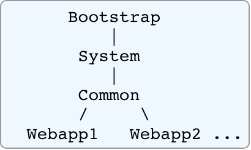
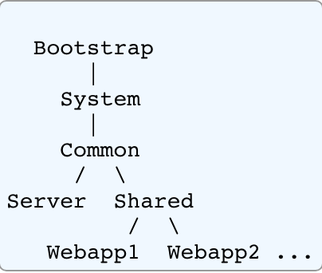

## 类加载机制

### 概述

在 java 中，classloader 以 tree 的形式组织起来。通常情况下，当 classloader 加载一个特定的类或资源时，它会将请求委托给父类加载器去加载，若父类加载器中找不到该类，它才会尝试自己去加载。

- Bootstrap jvm 提供的类加载器，一般是指`($JAVA_HOME/jre/lib/ext)`下的 jar 包
- System tomcat 的核心类加载器，就`$CATALINA_HOME/bin`目录下的`bootstrap.jar`,`tomcat-juli.jar`和`commons-daemon.jar`
- Common tomcat 的共享类加载器 包，在`$CATALINA_BASE/lib`目录下的 jar 包
- WebappX 应用内部的类加载器，它加载应用`/WEB-INF/classes`和`/WEB-INF/lib`目录下的 class

### 类加载顺序

tomcat 的类加载模型违背了 jvm 的双亲委派模式，除了 Bootstrap 类加载器加载的类，它首先会尝试使用`WebappX`来加载类。
通常情况下 tomcat 的类加载顺序如下所述

- Bootstrap classes of your JVM
- /WEB-INF/classes of your web application
- /WEB-INF/lib/\*.jar of your web application
- System class loader classes (described above)
- Common class loader classes (described above)

若 tomcat 或者应用中在 context 中配置了`<Loader delegate="true"/>`,那么他的类加载顺序就会变成如下

- Bootstrap classes of your JVM
- System class loader classes (described above)
- Common class loader classes (described above)
- /WEB-INF/classes of your web application
- /WEB-INF/lib/\*.jar of your web application

### 扩展类加载器

当在 tomcat 目录下的`conf/catalina.properties.`中配置`·server.loader`或`shared.loader`,它就会启用`Server`或`Shared`类加载器

- Server 是供 tomcat 使用的，对于应用是不可见的
- Shared 所有 tomcat 应用共享的 jar 包，类似`Common`的类加载器

## 日志

1. tomcat 内部使用`tomcat-juli.jar`作为日志组件，其使用配置为`$CATALINA_HOME/conf/logging.properties`
2. 应用可以使用自定义日志组件。不同的 web 应用使用的日志组件是独立的，因为其 WebappX 类加载器是独立的，但是若日志组件在 Common 共享类加载器，或者 Share 类类加载器，那么他们使用的日志组件则是共享的
