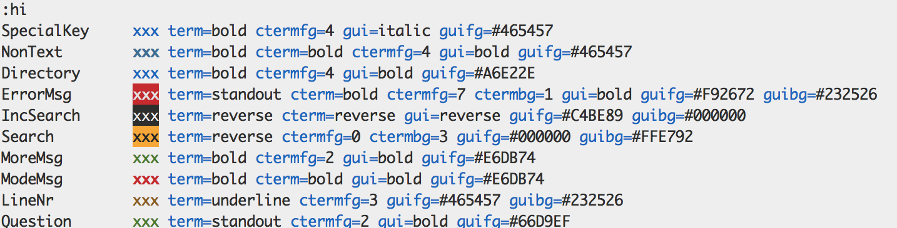

从本质上讲，我们的工作是重复性的 。不论是在几个不同的地方做相同的小改动，还是在文档的相似结构间移动，我们都会重复很多操作，凡是可以简化重复性操作的方式，都会成倍地节省我们的事件

**_减少无关的操作，以最少的命令完成任务_**

### 查找

`f`  
行内查找下一个指定字符，光标位于字符处，`;`查找下一个，`,`查找上一个。`F`反向

`t`  
行内查找下一个指定字符，光标位于字符前`;`查找下一个，`,`查找上一个。`T`反向

`＃`  
普通模式下输入＃寻找游标所在处的单词,＊是反向

`ma`  
标记当前为止为 a

`` `a ``
引用标记的为止 a，跳转到 a

`''`
跳转到光标上次停靠的地方, 是两个', 而不是一个"

`%`  
匹配对应的括号

`(`  
光标移至句首,)反向

`b`  
光标左移一个字至字首,跳过空格，`B`,跳转上一个空格前

### 移动{motion}

`e`  
光标跳转到下一个单词尾，`E`跳转至下一个空格前的一个单词尾，不包含空行

`b`  
光标跳转到上一个单词头，`B`,跳转上一个空格后的一个单词头，包括空行

`w`  
光标跳转到下一个单词头，`W`，跳转下一个空格后的一个单词头

`{`  
转到上一个空行 }反向

### 编辑

`a`
光标之后追加，`A`，行尾追加

`i`
光标处插入，`I`，行首追加

`s`  
删除当前字符并进入插入模式,`S`删除当前行并进入插入模式

`r`
替换当前字符，`R` 进入替换模式，直到按下 esc

### 操作符{operator}

组合命令配合移动或查找命令一起使用，一般操作符命令连续调用两次时，它会作用与当前行

`c`  
删除并进入插入模式，`C`等同于`cc`

`d`  
删除，`D`等同于`dd`

`>`
增加缩进 `<`减少缩进

`v`
选择模式， `V`行选择模式

g 前缀字符，用于更改其后面的按键行为，可将其视为一整个操作符

`gU`  
转换大写，例如：`gUU`操作整行，`gUaw`更高当前单词

`gu`  
转换小写

`g~`
大小写反转

`gc`
切换注释状态

`gD`，`gd`  
跳转到局部变量的定义处

`gv`重选上次的高亮选区

#### `{operator}i{motion}`,`{operator}a{motion}`

以当前位置进行操作，配合可以选择范围的移动命令，`i`和`a`的区别在于是否选中移动命令的关键词如`{`,`(`等。
例如：`di{`,`di(`，`diw`,`da{`,`gUaw`

### 其他

`.`
重复执行上次命令，即每次进入插入模式的那一刻（例如：输入 i），直到返回普通模式为止（输入\<Esc\>），Vim 会记录每一个按键操作。做出这样一个修改后在用`.`命令，它将会重新执行所有这些按键操作。

`ZZ`  
命令模式下保存当前文件所做的修改后退出 vi；

### EX 命令

[range]为可选参数，表示行的范围，

- `.`表示当前行（缺省值）
- `.＋3`表示当前行后三行（缺省值）
- `'m` 包含位置标记 m 的行
- `n` 表示指定行
- `n,m`表示 n 到 m 行
- `$`可表示最后一行
- `%`表示所有行
- `<`高亮选取的起始行
- `>`高亮选取的结束行

[line]可选参数 指定行，默认为当前行
[x]寄存器为一位字符，可通过`:registers`(简称`:reg`)查看寄存器内容
[address]指定行，也可以使用`$`表最后一行

常用的操作缓冲区问的 ex 命令

1. `:[range] delete [x]`  
   删除指定范围的行到寄存器 X，简写`d`
2. `:[range] yank [x]`  
   删除指定范围的行到寄存器 X，简写`y`
3. `:[line] put [x]`  
   删除指定范围的行到寄存器 X，简写`y`
4. `:[range] copy {address}`  
   复制指定范围内的行到某行 简写`co`
5. `:[range] move {address}`  
   移动指定范围内的行到某行,简写`m`
6. `:[range] join`  
   连接指定范围内的行,简写`j`
7. `:[range]/substiture/{pattern}/{string}/{flags}`  
   把指定范围内出现的{pattern}替换为{string}
   例如：
   - `:%s/vivian/sky/g` 替换每一行中所有 vivian 为 sky
   - `:1,$ s/$/WORLD/g` 替换行尾
   - `:1,$ s/^/HELLO/g` 替换行首
   - `:g/^s*$/d` 删除所有空格
   - `:s/vivian/sky/g 替换当前行所有 vivian 为 sky
   - `:%s/ /\r/g`替换空格为换行
8. `:[range]global/{pattern}/[cmd]`  
   对指定范围内匹配{pattern}的行执行 cmd，简称`g`
9. `:[range]normal {commands}`
   对指定范围内的行执行普通命令。例如
   - `:% normal A;` 在每行后面添加;，在做修改时自动进入插入模式，修改后自动返回正常模式
   - `:% normal @q` 在每行执行宏命令
   - `:% normal .` 在每行执行最近修改命令

### 命令

`:E`  
浏览当前目录
`:f`  
在命令模式下，用于显示当前的文件名、光标所在行的行号以及显示比例；
`:find`
通过文件名查找文件，支持 tab 补全

### 翻页

`H`  
光标移至屏幕顶行  
`L`  
光标移至屏幕最后行  
`M`  
光标移至屏幕中间行  
`Ctrl+b`  
向文件首翻一屏；  
`Ctrl+d`  
向文件尾翻半屏；  
`Ctrl+f`  
向文件尾翻一屏；  
`Ctrl+u`  
向文件首翻半屏；

## 配置文件

vim 的配置在`~/.vimrc`中。

- set paste 进入 paste 模式以后，可以在插入模式下粘贴内容，不会有任何变形,解决粘贴乱行问题

## 宏模式

在命令模式下按下`qa`开始记录，指导在命令模式下再次按下`q`结束记录。
可通过`@a`，重复执行命令，`n@a`重复执行`n`次。

## 查看颜色代码

```shell
:hi
```

例如


其中关于搜索高亮的颜色是配置项 `Search`,我们可以临时修改

```shell
:hi Search term=reverse ctermfg=0 ctermbg=3 guifg=#000000 guibg=#FFE792
```

也可在`.vimrc`中配置,使其永久生效

```properties
hi Search term=reverse ctermfg=0 ctermbg=3 guifg=#000000 guibg=#FFE792
```
