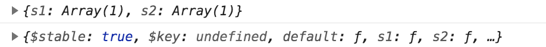

## 双向绑定

通过构造函数 Vue 就可以创建一个 Vue 的根示例，并启动 Vue 应用，Vue 实例需要挂载一个 DOM 元素，它可以是 HTMLElement，也可以是 CSS 选择器

```html
<!DOCTYPE html>
<html>
  <head>
    <meta charset="utf-8" />
    <title>Vue 测试实例 - 菜鸟教程(runoob.com)</title>
    <script src="https://unpkg.com/vue/dist/vue.min.js"></script>
  </head>

  <body>
    <div id="app">
      <p>{{ message }}</p>
    </div>

    <script>
      var app = new Vue({
        el: "#app",
        data: {
          message: "Hello Vue.js!",
        },
      });

      console.log(app);
      console.log(app.message);
    </script>
  </body>
</html>
```

上述 Vue 实例的构造器中的成员变量可以通过`app.$el`，`app.$data`的方式去访问，对于 data 数据，可以直接使用`app.message`去访问。在 dom 上以 <span>{</span><span>{</span><span>}</span><span>}</span> 包含的内容与 app 进行双向绑定。当我们在 console 控制台修改`app.messege`的值时，页面也随着刷新 message 的内容

[双向绑定实现原理](https://www.cnblogs.com/zhuzhenwei918/p/7309604.html)

<red>异步更新队列</red>

Vue 在观察到数据变化时并不是直接更新 DOM，而是开启一个队列，并缓冲同一事件循环中发生的所有数据改变。在缓冲时会去除重复数据，从而避免不必要的计算和 DOM 操作。然后在下一个事件循环 tick 中，Vue 刷新队列并执行实际（已去重的）工作

```html
<div id="app">
  <div id="div" v-if="showDiv">这是一段文本</div>
  <button @click="getText">获取div内容</button>
</div>
<script>
  var app = new Vue({
    el: "#app",
    data: {
      showDiv: false,
    },
    methods: {
      getText: function () {
        this.showDiv = true;
        //在执行this.showDiv = true时，div仍然没有被创建出来，直到下一个Vue事件循环时，才开始创建。$nextTick就是用来直到什么时候DOM更新完成的
        this.$nextTick(function () {
          var text = document.getElementById("div").innerHTML;
          console.log(text);
        });
      },
    },
  });
</script>
```

## 生命周期

每个 Vue 示例创建时，都会经历一系列的初始化过程，同时也会调用相应的生命周期钩子。比较常用的生命周期有

- created 示例创建完成后调用，次阶段完成了数据的观测等，但尚未挂载，\$el 还不可用，需要初始化一些处理数据时会比较有用
- mounted el 挂载到实例上后调用
- beforeDestroy 实例销毁前调用。主要是解绑一些使用 addEventListener 监听的事件等。

这些钩子与 el 和 data 类似，作为选项写入 Vue 实例

```javascript
var app = new Vue({
  el: "#app",
  data: {
    message: "Hello Vue.js!",
  },
  created: function () {
    console.log(this.message);
    console.log(this.$el); //undefined
  },
  mounted: function () {
    console.log(this.$el);
  },
});
```

## 手动挂载实例

Vue 提供了 Vue.extend 和$mount两个方法将 vue 实例挂载到一个 dom 上，即如果 Vue 实例在实例化时它没有收到 el 选项，它就处于“未挂载”状态，没有关联的 DOM 元素。可以使用\$mount()手动挂载一个未挂载的实例。这个方法返回实例自身，因而可以链式调用其他实例方法。

```html
<div id="app">
  <my-component></my-component>
</div>
<div id="app2">
  <my-component></my-component>
</div>
<div id="app3">
  <my-component></my-component>
</div>
<script type="text/x-template" id="my-component">
  <div>
  <h1>h1</h1>
  <h1>h2</h1>
  </div>
</script>

<script>
  var app = Vue.extend({
    components: {
      "my-component": {
        template: "#my-component",
      },
    },
  });
  new app().$mount("#app");
  new app().$mount("#app2");
  new app({
    el: "#app3",
  });
</script>
```

## 插值与表达式

1. <span>{</span><span>{</span><span>}</span><span>}</span> 使用双大括号（Mustache 语法），双向绑定的数据，<span>{</span><span>{</span><span>}</span><span>}</span> 内部可以使用 js 运算

   ```html
   <div id="app">
       {{number/10}}
       {{isOK?'确定':'取消'}}
       {{text.split(',').reverse().join('|')}}
   </div>
   <script>
     new Vue({
       el: "#app",
       data: {
           number:100,
           isOK:false,
           text:'123,456'
       },
     });
   ```

2. <span>{</span><span>{</span><span>}</span><span>}</span> 支持使用管道符`|`来对数据进行过滤，过滤的规则是自定义了，通过选项`filters`来设置，过滤器可以接受参数，过滤器可以串联

   ```html
   <div id="app">
       {{text|split}}
        <!-- 串联-->
       {{text|split|split}}
        <!-- arg1 arg2  分别为过滤器的第二个 第三个参数-->
       {{text|split('arg1','arg2')}}
   </div>
   <script>
   new Vue({
       el: "#app",
       data: {
           text:'123,456'
       },
       filters:{
           split:function(value){
            return value.split(',').join('#');
           }
       }
   });
   ```

3. computed
   通过 Vue 选项 computed 的计算属性获取数据，每一个计算属性都包含一个 getter 和
   setter，默认只使用 getter，当 getter 中所依赖的任何数据变化时，当前 getter 会被自动触发。相对于直接使用 methods，computed 只有在源数据更新后才会被重新调用

   ```html
   <div id="app">
     {{text}}
   </div>
   <script>
   new Vue({
     el: "#app",
     data: {
         number:100
     },
     computed:{
         text:function(){
             return  '$'+this.number
         }
     }
   });
   ```

   当我们对`app.number`进行赋值时，页面上 text 的值也会跟着变化，但是对 text 的值进行改变，`number`的值不会变化，
   当我们指定其 setter 就可以了

   ```javascript
    computed:{
        set: function (value) {
            this.number = parseInt(value.substring(1))
        },
        get: function () {
            return '$' + this.number
         }
    }
   ```

## 指令

1. `v-bind` 动态更新 html 元素上的属性，可以使用语法糖`:`

   ```html
   <a v-bind:href="url"> 链接</a>
   <!--语法糖-->
   <a :href="url"> 链接</a>
   <script>
     new Vue({
       data: {
         url: "http://example.com",
       },
     });
   </script>
   ```

2. `v-for` 迭代的数据也是双向绑定的，对数组或对象进行操作时会触发渲染

   遍历数组，<grey>需要注意的是直接通过索引去设置值是无法被 Vue 检测到的，也不会触发视图更新</grey>

   ```html
   <ul>
     <li v-for="book in books">{{ book.name}}</li>
     <li v-for="(book,index) in books">{{ index}} - {{book.name}}</li>
   </ul>
   <script>
     new Vue({
       data: {
         books: [{ name: "v1" }, { name: "v2" }],
       },
     });
   </script>
   ```

   遍历对象

   ```html
   <ul>
     <li v-for="(value,key,index) in user">{{ index}} - {{key}}:{{value}}</li>
   </ul>
   <script>
     new Vue({
       data: {
         user: {
           name: "hello",
           gender: "man",
           age: 23,
         },
       },
     });
   </script>
   ```

   迭代整数

   ```html
   <li v-for="n in 10">{{ n}}</li>
   ```

   若我们需要操作数组，可使用数组自带的方法区操作，
   例如

   - pop 删除末项
   - push 添加一项
   - shift 删除第一项
   - unshift 添加第一项
   - splice 截取/修改/删除数组元素
   - sort 对数组排序
   - reverse 取反

   也可以通过直接修改数组的引用
   或使用`Vue.set`、`this.$set`

3. `v-html` 输出 HTML

   ```html
   <span v-html="link">}</span>
   <script>
     new Vue({
       el: "#app",
       data: {
         link: '<a href="#">一个链接</a>',
       },
     });
   </script>
   ```

4. `v-if` 、`v-else-if`（必须紧跟 v-if）、 `v-else`(b 必须紧跟 v-if 或 v-else-if)
   表达式为正，当前元素、组件所有子节点将被渲染，否则全部移除

   ```html
   <p v-if="status ===1">当status为1时显示这行</p>
   <p v-else-if="status ===2">当status为2时显示这行</p>
   <p v-else>否则显示这行</p>
   ```

5. `v-model`
   绑定表单数据，也是双向绑定的，对于中文输入法，只有在回车后才会触发更新

   ```html
   <input v-model="input" />
   <p style="color: red;">{{input}}</p>

   <!-- 使用@input可以在输入中文时实时刷新-->
   <input @input="inputHandle" />
   <script>
     //...
     methods:{
         inputHandle:function(e){
             this.input = e.target.value
         }
     }
   </script>
   ```

   v-model 可使用修饰符控制数据同步的机制

   - .lazy v-model 默认在 input 事件中同步输入框的数据，使用`.lazy`会转变在 change 事件中同步
   - .number 将输入转换为 Number 类型
   - .trim 过滤首位空格

   示例

   ```html
   <input v-model.lazy="value" />
   <input v-model.number="value" />
   <input v-model.trim="value" />
   ```

6. `v-on`绑定事件监听器，可以使用语法糖`:`，可以用`.native`修饰符表示监听的是一个原生事件。

   ```html
   <a v-on:click="log"> 链接</a>
   <!--语法糖-->
   <a @click="log"> 链接</a>
   <script>
     new Vue({
       methods: {
         log: function (event) {
           console.log(event); //event为触发的事件
         },
       },
     });
   </script>
   ```

7. `v-once` 值渲染一次，包括元素和组件的所有子节点（包括 v 指令等）。首次渲染后，不再随数据的变化重新渲染

8. `v-pre` 跳过编译

   ```html
   <span v-pre> {{这里面不会被编译}}</span>
   ```

9. `v-show` 进行 CSS 属性切换，是否可见

## 自定义指令

例如注册一个 v-focus 的指令，用于在`<input>`元素初始化时自动获取焦点

```javascript
//全局注册
Vue.directive("focus", {
  //指令选项
});
//局部注册
var app = new Vue({
  el: "#app",
  directives: {
    focus: {
      //指令选项
    },
  },
});
```

自定义指令由几个钩子函数组成的，每个都是可选的

- bind 只调用一次，指令在第一次绑定元素时调用，用这个钩子函数可以定义一个绑定时指定一次的初始化动作
- inserted 被绑定元素插入父节点时调用
- update 被绑定元素所在的模板更新时调用，而不论绑定值是否变化，通过比较更新前后的绑定值，可以忽略不必要的模板更新
- componentUpdated 被绑定元素所在模板完成一次更新周期时调用
- unbind 只调用一次，指令与元素解绑时调用

每个钩子函数都一次有几个参数可用

- el 指定绑定的元素，可以用来直接操作 DOM
- binding 一个对象，包含以下属性

  - name 指令名，不包含 v-前缀
  - value 指令绑定的值，例如`v-my-directive="1+1"`，value 的值就是 2
  - oldValue 指令绑定的前一个值，仅在 update 和 componentUpdated 钩子中可用，无论值是否改变都可用
  - expression 绑定值的字符串形式，例如`v-my-directive="1+1"`，expression 的值就是 `1+1`
  - arg 传给指令的参数，例如`v-my-directive:foo`，arg 的值是 foo
  - modifiers 一个包含修饰符的对象，例如`v-my-directive.foo.bar`，修饰符对象 modifiers 的值是`{foo:true,bar:ture}`

- vnode Vue 编译生成的虚拟节点
- oldVnode 上一个虚拟节点仅在 update 和 componentUpdated 钩子中可用
  根据需求在不同的钩子函数内完成逻辑代码，例如 v-focus，我们希望在元素插入父节点时调用，那用到的最好是 inserted。示例如下

```html
<div id="app">
  <input v-focus:arg.foo.bar="1+1" />
</div>

<script>
  Vue.directive("focus", {
    //指令选项
    inserted: function (el, binding, vnode) {
      el.focus();
      console.log(el);
      //<input>
      console.log(JSON.stringify(binding));
      /**
        {
          "name": "focus",
          "rawName": "v-focus:arg.foo.bar",
          "value": 2,
          "expression": "1+1",
          "arg": "arg",
          "modifiers": { "foo": true, "bar": true },
          "def": {}
        }
      */
       }

    },
  });
  var app = new Vue({
    el: "#app",
  });
</script>
```

自定义指令也可以传入一个 JavaScript 对象字面量

```html
<input v-focus="{msg:'hello',count:100}" />
```

## 自定义插件

注册插件

```javascript
// 在Vue内部实际上会调用`MyPlugin.install(Vue)`
Vue.use(MyPlugin);

new Vue({
  //... options
});

插件也可以带上自定义参数;
Vue.use(MyPlugin, { someOption: true });
```

自定义插件

```javascript
MyPlugin.install = function (Vue, options) {
  // 1. 注册Vue全局函数
  Vue.myGlobalMethod = function () {
  }

  // 2. 添加全局指令
  Vue.directive('my-directive', {
    bind (el, binding, vnode, oldVnode) {
    }
    ...
  })

  // 3. 注入一些组件选项，对所有组件都会有效
  Vue.mixin({
    created: function () {
      // some logic ...
    }
    ...
  })

  // 4. 注册实例函数
  Vue.prototype.$myMethod = function (methodOptions) {
    // some logic ...
  }
}
```

## 绑定 class 的几种方式

v-bind 中的表达式最终会被解析为字符串，Vue 对 v-bind 增强了一些功能，提供了多重语法

1. 对象语法

   ```html
   <div :class="{'class1':isActive1,'class2':isActive2}"></div>
   <script>
     new Vue({
       data: {
         isActive1: true,
         isActive2: false,
       },
     });
   </script>
   ```

   上述渲染后的页面元素为`<div class="class1"></div>`

   也可使用 computed

   ```html
   <div :class="classes"></div>
   <script>
     new Vue({
       computed: {
         classes: function () {
           return {
             class1: this.isActive1,
             class2: this.isActive2,
           };
         },
       },
     });
   </script>
   ```

   也可以指定绑定到一个对象上

2. 数组语法

   ```html
   <div :class="[c1,c2]"></div>
   <script>
     new Vue({
         data: {
             c1: 'class1'
             c2: 'class2'
         }
     });
   </script>
   ```

## 事件

### 修饰符

修饰符

. stop
. prevent
. capture
. self
. once

```html
<!-- 阻止单击事件冒泡-->
<a @click.stop="handle"></a>
<!-- 提交事件不重载页面-->
<form @submit.prevent="handle"></form>
<!-- 修饰符可以串联-->
<a @click.stop.prevent="handle"></a>
<!-- 添加事件侦听器使用事件捕获模式-->
<a @click.capture="handle"></a>
<!-- 仅当事件在元素本身（而不是子元素）触发时触发回调-->
<a @click.self="handle"></a>
<!-- 只触发一次，组件同样使用-->
<a @click.once="handle"></a>
<!-- 只有在keyCode是enter时调用submit-->
<a @keyup.enter="submit"></a>
```

### 按键

keyCode

- .enter
- .tab
- .delete
- .esc
- .space
- .up
- .down
- dblclick 双击

按键可以组合，或和鼠标一起配合使用

```html
<!-- 按下shift时点击-->
<p @click.shift="handle">{{text1}}</p>
<!-- 按下shift和enter，一起时触发-->
<input @keyup.shift.enter="handle" />
```

### `$emit`

使用`$emit`来触发自定义事件，使用`$on`来监听子组件的事件。

例如

```html
<div id="app">
  <p>总数：{{total}}</p>
  <li-div @increase="handleGetTotal" @reduce="handleGetTotal"></li-div>
</div>

<script>
  var app = new Vue({
    el: "#app",
    data: {
      total: 0,
    },
    methods: {
      handleGetTotal: function (total) {
        this.total = total;
      },
    },

    components: {
      "li-div": {
        template: '<div>\
                    <button @click="handleIncrease"> +1</button>\
                    <button @click="handleReduce">   -1</button>\
                  </div>',
        data: function () {
          return {
            counter: 0,
          };
        },
        methods: {
          handleIncrease: function () {
            this.counter++;
            this.$emit("increase", this.counter);
          },
          handleReduce: function () {
            this.counter--;
            if (this.counter <script 0) {
              this.counter = 0;
            }
            this.$emit("reduce", this.counter);
          },
        },
      },
    },
  });
</script>
```

`v-model`语法糖，`v-model`绑定的是一个数据，接收一个 value 属性，，在其有新的 value 时会触发 input 事件。反之亦然。
等价于`<input :value='someVariable' @input='someHandle'>`

所以上述事例也可以写成如下

```html
<div id="app">
  <p>总数：{{total}}</p>
  <li-div v-model="total"></li-div>
</div>

<script>
  var app = new Vue({
    el: "#app",
    data: {
      total: 0,
    },
    methods: {
      handleGetTotal: function (total) {
        this.total = total;
      },
    },

    components: {
      "li-div": {
        template: '<div>\
                    <button @click="handleIncrease"> +1</button>\
                    <button @click="handleReduce">   -1</button>\
                  </div>',
        data: function () {
          return {
            counter: 0,
          };
        },
        methods: {
          handleIncrease: function () {
            this.counter++;
            this.$emit("input", this.counter);
          },
          handleReduce: function () {
            this.counter--;
            if (this.counter <script 0) {
              this.counter = 0;
            }
            this.$emit("input", this.counter);
          },
        },
      },
    },
  });
</script>
```

### 不同组件互相通信

建议通过一个空的 vue 实例作为中央事件总线来实现。

```html
<div id="app">
  <button @click="click">click</button>
  <l1></l1>
  <l2></l2>
</div>

<script>
  var bus = new Vue();
  var template = function (name) {
    return {
      template: "<div>" + name + ":{{message}}</div>",
      data: function () {
        return {
          message: "",
        };
      },
      mounted: function () {
        var _this = this;
        bus.$on("on-message", function (msg) {
          _this.message = msg;
        });
      },
    };
  };
  var l1 = template("l1");
  var l2 = template("l2");
  var app = new Vue({
    el: "#app",
    methods: {
      click: function () {
        bus.$emit("on-message", "来自app的消息");
        // 可以直接使用this.$children查看当前子组件的实例，子组件也可以使用this.$parent访问到父组件
        //当给子标签定义ref时可以使用this.$refs.ref去访问子标签的Vue实例
      },
    },
    components: { l1, l2 },
  });
</script>
```

### slot

当在子组件内使用特殊的`<slot>`元素就可以为这个子组件开启一个`slot`（插槽），在父组件的模板里，插入在子组件模板标签内的所有内容将替代子组件内的`<slot>`标签以及它的内容，`slot`可以指定一个 name，其会加载父组件的子组件模板标签内中属性`slot`值相同的内容。没有指定`slot`值的标签都作为默认匿名 slot

```html
<div id="app">
  <li_slot>
    <div style="color:red">默认slot-1</div>
    <div slot="s1" style="color:green">名为s1的slot</div>
    <div slot="s2" style="color:pink">名为s2的slot</div>
    <div slot="s2" style="color:pink">另一个名为s2的slot</div>
    <div style="color:red">默认slot-2</div>
  </li_slot>
</div>

<script>
  var app = new Vue({
    el: "#app",
    components: {
      li_slot: {
        template: '<div>\
                        <slot></slot>\
                        <slot name="s1"></slot>\
                        <slot name="s2"></slot>\
                        <slot name="s2">若没有s2的slot，则显示这段文本</slot>\
                        <slot name="s3">若没有s3的slot，则显示这段文本</slot>\
                        <slot></slot>\
                     </div>',
      },
    },
  });
</script>
```


<red>作用域插槽(template)</red>是一种特殊的 slot，使用一个可以复用的模板替换已渲染元素，该模板可以定义 scope，定义一个临时变量作用域，模板内部可以使用`scope_name.msg`的语法访问子组件插槽的数据 msg

```html
<div id="app">
  <li-slot>
    <template scope="scope_name">
      <p>来自父组件的内容</p>
      <p>{{scope_name.msg}}</p>
    </template>
  </li-slot>
</div>

<script>
  var app = new Vue({
    el: "#app",
    components: {
      "li-slot": {
        template: '<div>\
                      <slot msg="来自子组件的内容"></slot>\
                  </div>',
      },
    },
  });
</script>
```

作用域插槽更具有代表性的用例是列表组件

```html
<div id="app">
  <list-slot :books="books">
    <template slot="book" scope="scope_name">
      <li>{{scope_name.bookName}}</li>
    </template>
  </list-slot>
</div>

<script>
  var app = new Vue({
    el: "#app",
    data: {
      books: [
        { name: "Vue.js实战" },
        { name: "java实战" },
        { name: "python实战" },
      ],
    },
    components: {
      "list-slot": {
        props: {
          books: {
            type: Array,
            default: function () {
              return [];
            },
          },
        },
        template: '<ul>\
                      <slot name="book" v-for="book in books" :book-name="book.name"></slot>\
                  </ul>',
      },
    },
  });
</script>
```

我们可以使用`$slots`访问默认作用域的 slot 渲染后的标签，`$scopedSlots`访问所有作用域的标签

```html
<div id="app">
  <li_slot>
    <template scope="scope1">
      <div style="color:red" scope="scope_name">默认slot</div>
    </template>
    <div slot="s1" style="color:green">名为s1的slot</div>
    <div slot="s2" style="color:pink">名为s2的slot</div>
  </li_slot>
</div>

<script>
  var app = new Vue({
    el: "#app",
    components: {
      li_slot: {
        template: '<div>\
                        <slot></slot>\
                        <slot name="s1"></slot>\
                        <slot name="s2">若没有s2的slot，则显示这段文本</slot>\
                        <slot name="s3">若没有s3的slot，则显示这段文本</slot>\
                     </div>',
        mounted: function () {
          console.log(this.$slots);
          console.log(this.$scopedSlots);
        },
      },
    },
  });
</script>
```



### watch

监听 prop 或 data 的改变，当他们发生变化时触发 watch 配置的函数，此时对于节点以及渲染完成，

```html
<div id="app">
  <input-number v-model="value"></input-number>
</div>

<script type="text/x-template" id="input-number">
  <div class="input-number">
  </div>
</script>
<script>
  Vue.component("input-number", {
    template: "#input-number",
    props: {
      value: {
        type: Number,
        default: 0,
      },
    },
    watch: {
      value: function (newVal, oldVal) {
        console.log("component newVal", newVal);
        console.log("component oldVal", oldVal);
      },
    },
  });
</script>
<script>
  var app = new Vue({
    el: "#app",
    data: {
      value: 5,
    },
    watch: {
      value: function (newVal, oldVal) {
        console.log("newVal", newVal);
        console.log("oldVal", oldVal);
      },
    },
  });
</script>
```

watch 对第一次赋值是不响应的，可通过设置`immediate`来让其执行。watch 一般仅监听属性的重新赋值，对于对象属性的内部值的操作时不响应的，可通过`deep`来使其生效

```javascript
<script>

watch: {
    value: {
      handler:function (newVal, oldVal) {
      },
      immediate:true, //第一次赋值时即响应
      deep:true //改变obj内的属性时也生效

    }
},
</script>
```

watch 可以监听 vuex 中存储的内容

```javascript
<script>

watch: {
    '$store.state.value': function(newVal){
    }
},
</script>
```

## 表单

### 单选按钮

当那个单选按钮被选中时，picked 即为对应绑定的数据的值，同一个`v-model`单选具有排斥性

```html
<div id="app">
  <input type="radio" v-model="picked" :value="v1" />
  <input type="radio" v-model="picked" :value="v2" />
  <label>单选</label>
  <p>{{picked}}</p>
  <p>{{value}}</p>
</div>

<script>
  var app = new Vue({
    el: "#app",
    data: {
      picked: false,
      v1: "123",
      v2: "456",
    },
  });
</script>
```

## 组件

### 定义组件

组件最外层仅能有一个标签

```html
<div id="app">
  <my-component></my-component>
  <my-component></my-component>
  <my-component></my-component>
</div>
<script>
  //全局组件
  Vue.component("my-component", {
    template: '<div @click="obj.counter++">{{counter}}</div>',
    data: function () {
      return {
        counter: 0,
      };
    },
  });
  //示例组件
  var app = new Vue({
    el: "#app",
    components: {
      "my-component": {
        template: '<div @click="obj.counter++">{{counter}}</div>',
        //es6 语法 等同于 data:function(){}
        data() {
          return {
            counter: 0,
          };
        },
      },
    },
  });
</script>
```

### 异步组件

Vue 允许将组件定义为一个工厂函数，动态解析组件。工厂函数接收一个 resolve(component)回调，也可以使用 reject(reason)指示加载失败

```html
<div id="app">
  <lazy-component></lazy-component>
</div>
<script>
  var app = new Vue({
    el: "#app",
    components: {
      "lazy-component": function (resolve, reject) {
        setTimeout(
          //模拟延迟
          function () {
            resolve({
              template: "<div >异步组件</div>",
            });
          },
          3000
        );
      },
    },
  });
</script>
```

### 嵌套组件

嵌套的组件需要定义在全局组件上,必须设定一个条件来限制递归数量

```html
<div id="app">
  <child :count="1"></child>
</div>

<script>
  Vue.component("child", {
    props: {
      count: {
        type: Number,
        default: 1,
      },
    },
    template: '<div>\
              <div>\
               count:{{count}}\
              </div>\
              <div>\
               <child :count="count+1" v-if= "count < 3" ></child>\
              </div>\
          </div > ',
  });
  var app = new Vue({
    el: "#app",
  });
</script>
```

### 动态组件

Vue 提供了一个特殊的元素`<component>`用来挂载不同的组件，使用`is`特性来选择要挂载的组件。通常`is`特性绑定的是组件的名称，组件也可以直接绑定对象。

```html
<div id="app">
  <component :is="currentView"></component>
  <button @click="handleChangeView('A')">切换到A</button>
  <button @click="handleChangeView('B')">切换到B</button>
  <button @click="handleChangeView('C')">切换到C</button>
  <button @click="handleChangeView('D')">切换到D</button>
</div>

<script>
  var app = new Vue({
    el: "#app",
    data: {
      currentView: "comA",
    },
    methods: {
      handleChangeView: function (component) {
        this.currentView = "com" + component;
        if (!this.$options.components[this.currentView]) {
          // 直接绑定一个组件对象
          this.currentView = {
            template: "<div>备用组件<div>",
          };
        }
      },
    },
    components: {
      comA: {
        template: "<div>组件A<div>",
      },
      comB: {
        template: "<div>组件B<div>",
      },
      comC: {
        template: "<div>组件C<div>",
      },
    },
  });
</script>
```

### `X-templates`

可以使用这种模板更好的属性模板代码

```html
<script src="vue.min.js"></script>
<div id="app">
  <my-component></my-component>
</div>
<script type="text/x-template" id="my-component">
  <div>
  <h1>h1</h1>
  <h1>h2</h1>
  </div>
</script>

<script>
  var app = new Vue({
    el: "#app",
    components: {
      "my-component": {
        template: "#my-component",
      },
    },
  });
</script>
```

### 使用 props 传递数据

在组件内可以通过声明 props 访问在父类标签中的属性

```html
<div id="app">
  <li-div msg="来自父组件的数据"></li-div>
  <li-div :bind-msg="msg"></li-div>
</div>

<script>
  var app = new Vue({
    el: "#app",
    data:{
        msg:'来自组件的动态数据'
    }
    components: {
      "li-div": {
        template: "<div >{{msg}} {{bindMsg}}</div>",
        props: ["msg","bindMsg"],
      },
    },
  });
</script>
```

HTML 特性不区分大小写，当使用 DOM 模板时，驼峰命名的 props 名称要转换为短横分隔命名

```html
<li-div msg-text="来自父组件的数据"></li-div>
<script>
  // ...
  props: ["msgText"];
  template: "<div> {{msgText}}</div>";
</script>
```

父组件数据变化时传递给子组件默认是单向数据流，即父组件的数据更新会传递给子组件，但反过来不行。

示例：当我们输入内容时，子组件内容跟着变动，而父组件不变

```html
<div id="app">
  <p style="color: green;">{{msg}}</p>
  <li-div :msg="msg"></li-div>
</div>

<script>
  var app = new Vue({
    el: "#app",
    data: {
      msg: "fater",
    },
    components: {
      "li-div": {
        template: '<div><input :value="msg" v-model="msg"><p>{{msg}}</p><div>',
        props: ["msg"],
      },
    },
  });
</script>
```

在 JavaScript 中对象和数组式引用类型的，指向同一个内存空间，所以 props 中是对象和数组式，在子组件内改变是会影响符组件的。

示例：当我们输入内容时，子组件内容跟着变动，而父组件也会跟着变动

```html
<div id="app">
  <p style="color: green;">{{obj.msg}}</p>
  <li-div :obj="obj"></li-div>
</div>

<script>
  var app = new Vue({
    el: "#app",
    data: { obj: { msg: "fater" } },
    components: {
      "li-div": {
        template:
          '<div><input :value="obj.msg" v-model="obj.msg" /><p>{{obj.msg}}</p><div>',
        props: ["obj"],
      },
    },
  });
</script>
```

数据验证

对于组件的 props，我们可以对其属性进行数据验证，

```javascript
new Vue({
  el: "#app",
  components: {
    "li-div": {
      props: {
        //必须是数字类型
        propA: Number,
        //必须是数字类型或字符串
        propB: [Number, String],
        //布尔类型，如果没有定义，默认值是true
        propC: {
          type: Boolean,
          default: true,
        },
        //数字 ，必传
        propD: {
          type: Number,
          required: true,
        },
        // 如果是数组或对象，默认值必须由函数返回
        propE: {
          type: Array,
          default: function () {
            return [];
          },
        },
        //自定义一个验证函数
        propF: {
          validator: function (data) {
            return value > 10;
          },
        },
      },
    },
  },
});
```

验证的 type 可以是

- String
- Number
- Boolean
- Object
- Array
- Function

默认情况下含有静态值（非双向绑定的数据）属性的类型为 String，当我们需要自动推断类型时，可以使用`v-bind`

```html
<div id="app">
  <!-- <li-div counter="100"></li-div> -->
  <li-div v-bind:counter="100"></li-div>
</div>

<script>
  var app = new Vue({
    el: "#app",
    data: { obj: { msg: "fater" } },
    components: {
      "li-div": {
        template: "<div>{{counter}}<div>",
        props: {
          counter: {
            type: Number,
          },
        },
      },
    },
  });
</script>
```

type 也可以是一个自定义构造器，使用 instanceof 检测
当 prop 验证失败时，在<red>开发版本</red>下会在控制台抛出一条警告

### mixins

mixins： 是一种分发 Vue 组件中可复用功能的非常灵活的方式。混入对象可以包含任意组件选项。当组件使用 mixins 时，所有 mixins 的选项将被组合到该组件本身的选项，类似预编译过程。

1. 组件的数据不共享，仅拷贝一份，数组和对象采用的是深拷贝，而非拷贝引用。
2. 对于值为对象的选项如 methods,components 等，选项会被合并，键冲突的组件会覆盖混入对象的。
3. 值为函数的选项，如 created,mounted 等，就会被合并调用，混合对象里的钩子函数在组件里的钩子函数之前调用

## webpack 过程

使用`.vue`单文件组件的构建模式，需要 webpack 并使用 vue-loader 对.vue 格式的文件进行处理。一个.vue 文件一般包括 3 部分，即`<template>`,`<script>`,`<style>`

例如：

```html
<template>
  <div>你好：{{name}}</div>
</template>
<script>
  export default {
    props: {
      name: {
        type: String,
        default: "",
      },
    },
  };
</script>
<style scoped>
  div {
    color: #f60;
  }
</style>
```

示例中的 style 标签使用了 scoped 属性，表示当前的 CSS 只在这个组件有效，如果不加，那么 div 的样式会应用到整个项目。`<style>`还可以结合 CSS 预编一起使用，比如使用 Less 处理可以写成`<style lang='less'>`

使用.vue 文件需要安装`vue-loader`、`vue-style-loader`等加载器并做配置。因为要使用 ES6 语法，还需要安装`babel`和`bable-loader`等加载器。使用 npm 逐个安装以下依赖

### 使用`vue-cli`

```shell
# vue2版本对应的cli
npm install -g --save-dev vue-cli


#项目名必须全部小写,安装过程中注意`vue-router`选择`Y`,项目安装失败，尝试重新安装`vue-cli`
vue init webpack vue-demo
```

安装后，package.json 文件内容如下

```json
{
  "name": "vue-demo",
  "version": "1.0.0",
  "description": "A Vue.js project",
  "private": true,
  "scripts": {
    "dev": "webpack-dev-server --inline --progress --config build/webpack.dev.conf.js",
    "start": "npm run dev",
    "test": "npm run unit",
    "lint": "eslint --ext .js,.vue src test/unit",
    "build": "node build/build.js"
  },
  "dependencies": {
    "vue": "^2.5.2",
    "vue-router": "^3.0.1"
  },
  "devDependencies": {
    "autoprefixer": "^7.1.2",
    "babel-core": "^6.22.1",
    "babel-eslint": "^8.2.1",
    "babel-helper-vue-jsx-merge-props": "^2.0.3",
    "babel-loader": "^7.1.1",
    "babel-plugin-syntax-jsx": "^6.18.0",
    "babel-plugin-transform-runtime": "^6.22.0",
    "babel-plugin-transform-vue-jsx": "^3.5.0",
    "babel-preset-env": "^1.3.2",
    "babel-preset-stage-2": "^6.22.0",
    "chalk": "^2.0.1",
    "copy-webpack-plugin": "^4.0.1",
    "css-loader": "^0.28.0",
    "eslint": "^4.15.0",
    "eslint-config-standard": "^10.2.1",
    "eslint-friendly-formatter": "^3.0.0",
    "eslint-loader": "^1.7.1",
    "eslint-plugin-import": "^2.7.0",
    "eslint-plugin-node": "^5.2.0",
    "eslint-plugin-promise": "^3.4.0",
    "eslint-plugin-standard": "^3.0.1",
    "eslint-plugin-vue": "^4.0.0",
    "extract-text-webpack-plugin": "^3.0.0",
    "file-loader": "^1.1.4",
    "friendly-errors-webpack-plugin": "^1.6.1",
    "html-webpack-plugin": "^2.30.1",
    "node-notifier": "^5.1.2",
    "optimize-css-assets-webpack-plugin": "^3.2.0",
    "ora": "^1.2.0",
    "portfinder": "^1.0.13",
    "postcss-import": "^11.0.0",
    "postcss-loader": "^2.0.8",
    "postcss-url": "^7.2.1",
    "rimraf": "^2.6.0",
    "semver": "^5.3.0",
    "shelljs": "^0.7.6",
    "uglifyjs-webpack-plugin": "^1.1.1",
    "url-loader": "^0.5.8",
    "vue-loader": "^13.3.0",
    "vue-style-loader": "^3.0.1",
    "vue-template-compiler": "^2.5.2",
    "webpack": "^3.6.0",
    "webpack-bundle-analyzer": "^2.9.0",
    "webpack-dev-server": "^2.9.1",
    "webpack-merge": "^4.1.0"
  },
  "engines": {
    "node": ">= 6.0.0",
    "npm": ">= 3.0.0"
  },
  "browserslist": ["> 1%", "last 2 versions", "not ie <= 8"]
}
```

使用`npm run dev`即可启动一个 dev 服务

## 路由

### 定义

单页面应用指的是只有一个主页面，通过动态替换 DOM 内容并同步修改 url 地址，来模拟多页面应用的效果。切换页面的功能直接由前台脚本来完成，而不是后端渲染完毕后前端只负责显示。

前端路由就是一个前端不同页面的状态管理器，可以不向后台发送请求而直接通过前端技术实现多个页面效果。vue 中的 vue-router，react 的 react-router 均是对这种功能的实现。

实现原理可参考[这里](http://www.manongjc.com/article/11766.html)

### vue-route

我们通过 vue-cli 初始化项目后，main.js 的内容如下

```javascript
import Vue from "vue";
import App from "./App";
import router from "./router";

Vue.config.productionTip = false;

new Vue({
  el: "#app",
  router,
  components: { App },
  template: "<App/>",
});
```

首先页面会渲染成类似如下

```html
<html>
  <head> </head>
  <body>
    <app></app>
  </body>
</html>
```

这里的`<app>`即是`new Vue()`中可选参数 template 所生产的标签，
然后根据 components 中定义的 App 组件，将 app 渲染成 app.vue 中的内容

```html
<html>
  <head> </head>
  <body>
    <div id="app">
      
      <router-view />
    </div>
  </body>
</html>
```

其中`<router-view>`路由视图以用来挂载路由，默认挂载`/`，那么我们根据`main.js`中引入的 router，找到其对应的 js 文件。

`src/router/index.js`

```javascript
import Vue from "vue";
import Router from "vue-router";
import HelloWorld from "@/components/HelloWorld";

Vue.use(Router);

export default new Router({
  routes: [
    {
      path: "/",
      name: "HelloWorld",
      component: HelloWorld,
    },
  ],
});
```

根据`/`路径配置的组件，我们将`<router-view>`渲染成 HelloWorld 组件的内容

```html
<html>
  <head> </head>
  <body>
    <div id="app">
      
      <div class="hello">
        <h1>{{ msg }}</h1>
        <h2>Essential Links</h2>
        <ul>
          <li>
            <a href="https://vuejs.org" target="_blank"> Core Docs </a>
          </li>
          <li>
            <a href="https://forum.vuejs.org" target="_blank"> Forum </a>
          </li>
          <li>
            <a href="https://chat.vuejs.org" target="_blank">
              Community Chat
            </a>
          </li>
          <li>
            <a href="https://twitter.com/vuejs" target="_blank"> Twitter </a>
          </li>
          <br />
          <li>
            <a href="http://vuejs-templates.github.io/webpack/" target="_blank">
              Docs for This Template
            </a>
          </li>
        </ul>
        <h2>Ecosystem</h2>
        <ul>
          <li>
            <a href="http://router.vuejs.org/" target="_blank"> vue-router </a>
          </li>
          <li>
            <a href="http://vuex.vuejs.org/" target="_blank"> vuex </a>
          </li>
          <li>
            <a href="http://vue-loader.vuejs.org/" target="_blank">
              vue-loader
            </a>
          </li>
          <li>
            <a href="https://github.com/vuejs/awesome-vue" target="_blank">
              awesome-vue
            </a>
          </li>
        </ul>
      </div>
    </div>
  </body>
</html>
```

### 路由跳转

`router-link`是用来动态切换`router-view`显示内容组件。

示例

我们新建一个组件`src/components/link.vue`

```html
<template>
  <div class="hello">
    <h1>{{ msg }}</h1>
  </div>
</template>

<script>
  export default {
    name: "link",
    data() {
      return {
        msg: "测试一下路由链接",
      };
    },
  };
</script>

<style scoped>
  h1 {
    font-weight: normal;
    color: palevioletred;
  }

  a {
    color: red;
  }
</style>
```

在 router 配置中配置 link.vue 的请求路径

```diff
  import Vue from "vue";
  import Router from "vue-router";
  import HelloWorld from "@/components/HelloWorld";
+ import link from "@/components/link";

  Vue.use(Router);

  export default new Router({
    routes: [
      {
        path: "/",
        name: "HelloWorld",
        component: HelloWorld,
      },
+     {
+       path: "/link",
+       name: "link",
+       component: link,
+     },
    ],
  });
```

修改`src/App.vue`

```diff
  <template>
    <div id="app">
-       
+     <div>
+       
+     </div>
+      <div>
+
+       <router-link to="/">主页</router-link>
+       <router-link to="/link">测试router-link</router-link>
+     </div>
      <router-view />
    </div>
  </template>
  <script>
    export default {
      name: 'App'
    }
  </script>

  <style>
    #app {
      font-family: 'Avenir', Helvetica, Arial, sans-serif;
      -webkit-font-smoothing: antialiased;
      -moz-osx-font-smoothing: grayscale;
      text-align: center;
      color: #2c3e50;
      margin-top: 60px;
    }
  </style>
```

当我们点击由`router-link`渲染出来的`<a>`链接，其下面的`router-view`对应的元素将会被切换至对应的在路由中配置的组件

我们也可以使用 js 方法来实现跳转

```diff
  <template>
    <div id="app">
      <div>
        
      </div>
      <div>

        <router-link to="/">主页</router-link>
        <router-link to="/link/123">测试router-link</router-link>
        <router-link to="/404">404</router-link>
+       <button @click="handleRouter">按钮点击跳转</button>
      </div>
      <router-view />
    </div>
  </template>
  <script>
    export default {
      name: 'App',
+     methods: {
+       handleRouter() {
+         this.$router.push('/link/4567')
+       }
+     }
    }
  </script>
```

`$router`还有其他一些方法(`$router`为 main.js 中声明的 router 变量)

- replace 它不会向 history 添加新记录，而是替换掉当前的 history 记录。
- go 类似于 window.history.go()，在 history 记录中向前或后退多少步

### 路由配置相关

配置默认页面，可以在路由列表的最后新加一项，当访问路径不存在时，重定向到首页。<grey>当所有路由都不满足时，就会直接加载最后一项。</grey>

```diff
  export default new Router({
    routes: [
      {
        path: '/',
        name: 'HelloWorld',
        component: HelloWorld
      },
      {
        path: '/link/:id',

        name: 'link',
        component: link
      },
+     {
+       path: '*',
+       redirect: '/'
+     }
    ]
  })
```

动态路由

路由列表的 path 也可以带参数，

```javascript
{
  path:'/link/:id',
  component:link
}
```

当我们访问`/link/1234`时，我们可以通过`this.$route.params.id`的方式取出该参数值

```diff
  <template>
    <div class="hello">
      <h1>{{ msg }}</h1>
+     <h1>{{ $route.params.id}}</h1>
    </div>
  </template>

  <script>
    export default {
      name: 'link',
      data() {
        return {
          msg: '测试一下路由链接'
        }
      },
+     mounted() {
+       console.log(this.$route)
+     }
    }
  </script>
```

### 路由钩子

router 提供了导航钩子 beforeEach 和 afterEach，它们会在路由即将改变前和改变后触发。

钩子函数有三个参数

- to 即将进入的目标的路由对象，在对应的目标页面我们可以用`this.$route`取出当前路由对象，也就是 to
- from 当前导航即将离开的路由对象
- next 调用该方法后，才能进入下一个钩子。next 中还可以设置参数，。设置为 false，可以取消导航，设置为具体的路径可以导航到指定的页面。典型的用法是校验客户是否登录。

例如我们将页面的 title 实时更改为组件的名称

`src/main/js`

```diff
  import Vue from 'vue'
  import App from './App'
  import router from './router'

  Vue.config.productionTip = false

+ router.beforeEach((to, from, next) => {
+   console.log('to', to)
+   console.log('from', from)
+   window.document.title = to.name || "hello"
+   next()
+ })
  new Vue({
    el: '#app',
    router,
    components: { App },
    template: '<App/>'
  })
```

### 命名视图

`<router-view>`可指定 name，来使用指定 name 的组件，路由的路径，可以对应多个组件，默认使用的是 name 为 default 的组件

`src/App.vue`

```html
<template>
  <div id="app">
    <router-view />
    <router-view name="input1" />
    <router-view name="input2" />
  </div>
</template>

<script>
  export default {
    name: "App",
  };
</script>
```

`router/index.js`

```javascript
import Vue from "vue";
import Router from "vue-router";
import input1 from "@/components/input1";
import input2 from "@/components/input2";

Vue.use(Router);

export default new Router({
  routes: [
    {
      path: "/",
      name: "HelloWorld",
      components: {
        default: input1,
        input1,
        input2,
      },
    },
  ],
});
```

`src/components/input1.vue` 和 input2.vue，基本一致

```html
<template>
  <div class="hello">
    input1
    <input v-model="value" />
    <h1>{{ value}}</h1>
  </div>
</template>

<script>
  export default {
    data() {
      return {
        value: "",
      };
    },
  };
</script>
```

当访问`/`时，三个`router-view`分别会被渲染为对应的组件。

### 二级路由

App.vue

```html
<html>
  <body>
    <div id="app">
      <router-view />
    </div>
  </body>
</html>
```

Home.vue

```html
<div>
  <router-link to="/child">
  <router-view />
</div>
```

Child

```html
<div>the child</div>
```

```javascript
import Vue from "vue";
import Router from "vue-router";
import Home from "@/components/Home";
import Child from "@/components/Child";

export default new Router({
  routes: [
    {
      path: "/",
      name: "Home",
      component: Home,
      children: [
        {
          path: "child",
          component: Child,
        },
      ],
    },
  ],
});
```

### 二级路由和命令视图结合

可参考这个[demo](https://github.com/sheyangjuan0703/namedView)

app.vue

```html
<template>
  <!-- 上下布局  -->
  <div id="home">
    <router-view class="view header" name="header"></router-view>
    <!-- 左右布局 -->
    <div class="flex_left_right">
      <router-view class="view menu" name="menu"></router-view>
      <router-view class="view content" name="content"></router-view>
    </div>
  </div>
</template>

<script>
  export default {};
</script>
```

`router/index.js`，省略其他组件的代码

```javascript
import Vue from "vue";
import Router from "vue-router";
import home from "@/pages/home";
import header from "@/components/header";
import menu from "@/components/menu";
import content from "@/components/content";
import list from "@/components/list";
import detail from "@/components/detail";

Vue.use(Router);

export default new Router({
  routes: [
    {
      path: "/",
      redirect: "/home/menu",
    },
    {
      path: "/home",
      name: "home",
      component: home,
      children: [
        {
          path: "menu",
          components: {
            header: header,
            menu: menu,
            content: content,
          },
          children: [
            {
              path: "list/:index",
              name: "list",
              component: list,
            },
            {
              path: "list/:index/detail/:detailIndex",
              name: "detail",
              component: detail,
            },
          ],
        },
      ],
    },
    {
      path: "/detailNoMenu",
      name: "detailNoMenu",
      component: detail,
    },
  ],
});
```

### 其他

在 vue 代码中，我们可以使用

```javascript
export default {
  computed: {
    func() {
      console.log(this.$router); //在main.js注册进入Vue的router
      console.log(this.$router.options); //在route/index.js中export的实例
    },
  },
};
```

使用`router-link`或使用`$router.push`时，可以传递 obj，指定跳转到命令的路由中

```javascript
import Vue from "vue";
import Router from "vue-router";
import Home from "@/components/Home";
import Child from "@/components/Child";

export default new Router({
  routes: [
    {
      path: "/",
      name: "Home",
      component: Home,
      children: [
        {
          path: "child",
          component: Child,
        },
      ],
    },
  ],
});

//App.vue params为路由url参数
this.#router.push({ name: "Home", params: { index: x } });
```

## Vuex

```shell
npm install --save-dev vuex
```

新增文件`src/store/index.js`

```javascript
import Vue from "vue";
import Vuex from "vuex";

Vue.use(Vuex);

export default new Vuex.Store({
  //组件数据，只能读取，不能手动改变
  state: {
    count: 0,
  },
  //改变store中数据的唯一途径就是显式提交mutations，mutations可以接受两个参数，第二个参数可以是数字、字符串或对象等类型
  mutations: {
    increment(state, n = 1) {
      state.count += n;
    },
  },
});

//调用mutations
this.$store.commit("increment");
this.$store.commit("increment", 100);
```

mutations 也可以接受一个包含 type 的对象

```javascript
 mutations: {
    increment(state, params) {
      state.count += params.count;
    },
  },
  //调用mutations
  this.$store.commit({
    type:'increment',
    count:10
  })
```

vuex 还有三个选项可以使用：`getters`，`actions`，`modules`

getters 一般用来对数据进行处理

```javascript
export default new Vuex.Store({
  state: {
    list: [1, 5, 7, 10, 30],
  },
  //getters还可以把getters作为第二个参数
  getters: {
    filteredList: (state) => {
      return state.list.filter((item) => item < 10);
    },
    listCount: (state, getters) => {
      return getters.filteredList.length;
    },
    //getters可以定义函数式方法，外部调用可以传递参数
    filteredListUnderMax(state) {
      return function (max) {
        return state.list.filter((item) => item < max);
      };
    },
  },
});

//则我们在别的组件中就可以使用
export default {
  computed: {
    list() {
      return this.$store.getters.filteredList;
    },
    listCount() {
      return this.$store.getters.listCount;
    },
    filter() {
      return this.$store.getters.filteredListUnderMax(10);
    },
  },
};
```

actions 类似 mutations，但是是异步执行的

modules，它用来将 store 分割到不同的模块中。

```javascript
const moduleA = {
  state: {},
  mutations: {},
  actions: {},
  getters: {
    //module 中的 mutaion 和 getter 还可以接受第三个参数，来访问根节点
    sumCount(state,getters,rootState){
      ...
    }
  },
};
const moduleB = {
  state: {},
  mutations: {},
  actions: {},
  getters: {},
};

const store = new Vue.Store({
  modules: {
    a: moduleA,
    b: moduleB,
  },
});
```
