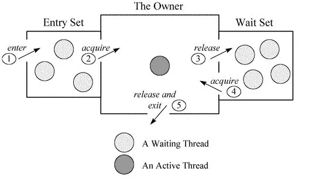
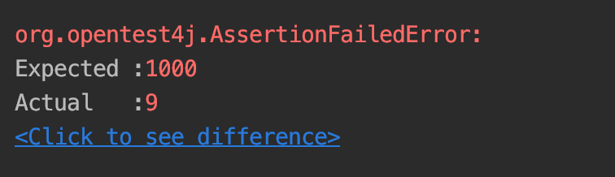

## 临界区

临界区指的是一个访问共用资源（例如：共用设备或是共用存储器）的程序片段，而这些共用资源又无法同时被多个线程访问的特性。当有线程进入临界区段时，其他线程或是进程必须等待（例如：bounded waiting 等待法），有一些同步的机制必须在临界区段的进入点与离开点实现，以确保这些共用资源是被互斥获得使用，例如：semaphore。只能被单一线程访问的设备，例如：打印机。

## 锁

当多个线程访问临界区资源时，可能会引起冲突。那么我们需要实现以下效果

1. 同一时间内，仅有一个线程可以访问临界区
2. 具备可重入性

同时为了防止死锁，我们需要

1. 具备锁失效机制
2. 具备非阻塞锁特性，即没有获取到锁将直接返回获取锁失败。一般情况下在尝试一段时间后返回失败

## java 线程锁

在了解分布式锁之前我们先了解一下`java`的两种锁的实现

### `synchronized`

```java
Object lock = new Object();
synchronized (lock) {
}
```

查看上述代码的字节码

```java
11: monitorenter
12: aload_2
13: monitorexit
```

我们可以观察到在进入`synchronized`代码块时，使用`monitorenter`指定获取锁，在结束代码块的语句时，使用`monitorexit`，释放锁。

等待锁的过程


参考中关于对象头的部分，对象在有锁的情况下，会保存占用锁的线程指针。从而保证在同一个时刻，仅允许一个线程可以占用`monitor`锁，无法获取`monitor`锁的线程被阻塞直到对象释放锁。

### `AbstractQueuedSynchronizer`

以`ReentrantLock`为代表的同步锁框架是基于`AQS`，`AQS`依赖`FIFO`队列实现。线程获取锁通过`tryAcquire`向`FIFO`插入并使用乐观锁`CAS`的方式，判断是否为`HEAD`节点，若是`HEAD`节点则表示获取到锁，释放锁则通过`tryRelease`该队列的`HEAD`节点，并唤醒等待节点。

[JVM 源码分析之 Object.wait/notify 实现](https://www.jianshu.com/p/f4454164c017)

## 分布式锁

### 构建测试程序

在分布式场景下，无法通过`JVM`内存来保持一致性。我们需要一个定义一个临界区。对于锁的实现，和`java`锁没有本质区别，仅在于实现方式不同

首先我们构造测试程序,我们使用`SpringBoot`构建项目

`pom`依赖

```xml
<?xml version="1.0" encoding="UTF-8"?>
<project xmlns="http://maven.apache.org/POM/4.0.0" xmlns:xsi="http://www.w3.org/2001/XMLSchema-instance"
         xsi:schemaLocation="http://maven.apache.org/POM/4.0.0 https://maven.apache.org/xsd/maven-4.0.0.xsd">
  <modelVersion>4.0.0</modelVersion>
  <parent>
    <groupId>org.springframework.boot</groupId>
    <artifactId>spring-boot-starter-parent</artifactId>
    <version>2.2.1.RELEASE</version>
    <relativePath/> <!-- lookup parent from repository -->
  </parent>
  <groupId>com.leaderli</groupId>
  <artifactId>demo</artifactId>
  <version>0.0.1-SNAPSHOT</version>
  <name>demo</name>
  <description>Demo project for Spring Boot</description>

  <properties>
    <java.version>1.8</java.version>
  </properties>

  <dependencies>
    <dependency>
      <groupId>org.springframework.boot</groupId>
      <artifactId>spring-boot-starter</artifactId>
    </dependency>
    <dependency>
      <groupId>org.mybatis.spring.boot</groupId>
      <artifactId>mybatis-spring-boot-starter</artifactId>
      <version>2.1.0</version>
    </dependency>
    <dependency>
      <groupId>mysql</groupId>
      <artifactId>mysql-connector-java</artifactId>
    </dependency>
    <dependency>
      <groupId>org.springframework.boot</groupId>
      <artifactId>spring-boot-starter-test</artifactId>
      <scope>test</scope>
      <exclusions>
        <exclusion>
          <groupId>org.junit.vintage</groupId>
          <artifactId>junit-vintage-engine</artifactId>
        </exclusion>
      </exclusions>
    </dependency>
    <dependency>
      <groupId>junit</groupId>
      <artifactId>junit</artifactId>
      <scope>test</scope>
    </dependency>
  </dependencies>
</project>

```

配置文件

```yaml
spring:
  application:
    name: demo
  datasource:
    url: jdbc:mysql://localhost:3306/li
    username: root
    password: root
    driver-class-name: com.mysql.cj.jdbc.Driver
logging:
  level:
    root: error
lock:
  use: nolock
  bean:
    name: coral
    machine: mymac
```

临界资源

```java
package com.leaderli.demo.lock;

public class CriticalSection {
    public static int ID = 0;
}

```

锁接口

```java
package com.leaderli.demo.lock;

public interface Lock {

    boolean lock();

    void unlock();
}
```

为了使代码清晰，封装一些方法

```java
package com.leaderli.demo.util;

import java.util.Random;

public class SomeUtils {

    public static void sleep(long millis) {
        try {
            Thread.sleep(millis);
        } catch (InterruptedException e) {
            e.printStackTrace();
        }
    }

    static Random random = new Random();

    public static int random(int boundary) {
        return random.nextInt(boundary);
    }

    public static void logWithThread(Object msg) {
        System.out.println(Thread.currentThread() + "\t" + String.valueOf(msg));
    }

    public static void join(Thread thread) {
        try {
            thread.join();
        } catch (InterruptedException e) {
            e.printStackTrace();
        }
    }

}
```

测试程序

```java
package com.leaderli.demo.lock;


import com.leaderli.demo.util.SomeUtils;
import org.junit.jupiter.api.Assertions;
import org.junit.jupiter.api.Test;
import org.springframework.beans.factory.annotation.Autowired;
import org.springframework.boot.test.context.SpringBootTest;
import org.springframework.context.ApplicationContext;

import java.util.ArrayList;
import java.util.List;

@SpringBootTest
class LockTest {
    @Autowired
    ApplicationContext applicationContext;


    int maxThreadCount = 10;
    int endID = 1000;
    //设置合适的值，确保持有锁期间，其他线程企图获取锁
    int randomBoundary = 10;

    @Test
    public void test() {
        Runnable task = () -> {
            //所有Lock实现类都为非单例，保证所有线程的锁不为同一个对象以模拟分布式锁
            Lock lock = applicationContext.getBean(Lock.class);
            while (true) {
                //不断消费序列号，直到测试结束
                if (task(lock)) {
                    return;
                }
            }

        };

        List<Thread> threadPool = new ArrayList<>();
        for (int i = 1; i <= maxThreadCount; i++) {
            Thread cosumer = new Thread(task);
            cosumer.setName((100 - i) + "");
            threadPool.add(cosumer);
        }
        threadPool.forEach(Thread::start);
        threadPool.forEach(SomeUtils::join);
        //断言程序是否正常结束
        Assertions.assertEquals(endID, CriticalSection.ID);
    }

    public boolean task(Lock lock) {
        if (lock.lock()) {
            //模拟重入锁
            if (SomeUtils.random(3) == 1) {
                if (task(lock)) {
                    return true;
                }
            }
            try {
                int a = CriticalSection.ID + 1;
                SomeUtils.sleep(SomeUtils.random(randomBoundary));
                if (CriticalSection.ID >= endID) {
                    //达到最大值，测试结束
                    return true;
                }
                CriticalSection.ID++;
                if (a != CriticalSection.ID) {
                    //断言失败，结束程序
                    return true;
                }
            } finally {
                lock.unlock();
            }
        }
        return false;
    }
}
```

通过使用`SpringBoot`的注解`ConditionalOnProperty`来方便测试
首先我们测试没有锁的情况下

```java
package com.leaderli.demo.lock;

import org.springframework.beans.factory.annotation.Autowired;
import org.springframework.boot.autoconfigure.condition.ConditionalOnProperty;
import org.springframework.stereotype.Component;

@ConditionalOnProperty(prefix = "lock", name = "use", havingValue = "nolock")
@Component
@Scope(BeanDefinition.SCOPE_PROTOTYPE)
public class NoLock implements Lock {

    @Override
    public boolean lock() {
        return true;
    }

    @Override
    public void unlock() {
    }
}
```

配置文件中将`NoLock`类激活，即`lock.use=nolock`  

我们很容易就观察到没有锁时，一个线程在运行期间，临界区资源被修改了

### 数据库锁

根据锁的原则，我们使用数据库锁需要考虑的实现方式:

1. 我们通过数据库唯一约束(主键约束)来确保同一时间内，仅有一个线程可以访问临界区资源。通过唯一`ID`，获取锁时插入锁，释放锁则删除锁记录
2. 为了确保可重入性，我们需要记录占用锁的线程，同时为了保证仅在所有重入锁都释放后再释放锁，我们需要记录重入锁的次数，释放锁时判断重入锁次数是否为`0`，为`0`则删除锁记录

3. 为了具有锁失效机制，当线程占用锁后出现异常情况，没有释放锁，会导致锁一直被占用，其他线程无法获取锁。所以我们需要记录获取锁的时间，以及设定锁的失效时间。则在获取锁时判断是否锁已经失效，失效则删除锁。

4. 为了具有非阻塞锁特性，在线程获取锁时，首先查询数据库锁是否被占用，若被占用，则重新尝试，达到指定次数后，则直接返回获取锁失败。通过`insert`插入锁失败，也直接返回失败

### `redis`锁

--

### `zookeeper`锁

--
