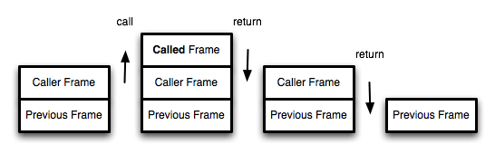
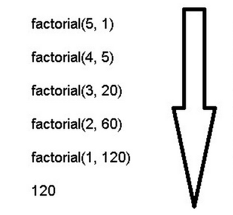

## 尾调用优化

尾调用之所以与其他调用不同，就在于它的特殊的调用位置。

我们知道，函数调用会在内存形成一个"调用记录"，又称"调用帧"（call frame），保存调用位置和内部变量等信息。如果在函数 A 的内部调用函数 B，那么在 A 的调用记录上方，还会形成一个 B 的调用记录。等到 B 运行结束，将结果返回到 A，B 的调用记录才会消失。如果函数 B 内部还调用函数 C，那就还有一个 C 的调用记录栈，以此类推。所有的调用记录，就形成一个["调用栈"](http://zh.wikipedia.org/wiki/%E8%B0%83%E7%94%A8%E6%A0%88)（call stack）。

尾调用由于是函数的最后一步操作，所以不需要保留外层函数的调用记录，因为调用位置、内部变量等信息都不会再用到了，只要直接用内层函数的调用记录，取代外层函数的调用记录就可以了。

```javascript
function f() {
  let m = 1;
  let n = 2;
  return g(m + n);
}
f();

// 等同于
function f() {
  return g(3);
}
f();

// 等同于
g(3);
```

上面代码中，如果函数 g 不是尾调用，函数 f 就需要保存内部变量 m 和 n 的值、g 的调用位置等信息。但由于调用 g 之后，函数 f 就结束了，所以执行到最后一步，完全可以删除 f() 的调用记录，只保留 g(3) 的调用记录。

这就叫做"尾调用优化"（Tail call optimization），即只保留内层函数的调用记录。如果所有函数都是尾调用，那么完全可以做到每次执行时，调用记录只有一项，这将大大节省内存。这就是"尾调用优化"的意义。

## 尾递归

函数调用自身，称为递归。如果尾调用自身，就称为尾递归。

递归非常耗费内存，因为需要同时保存成千上百个调用记录，很容易发生"栈溢出"错误（stack overflow）。但对于尾递归来说，由于只存在一个调用记录，所以永远不会发生"栈溢出"错误。

```javascript
function factorial(n) {
  if (n === 1) return 1;
  return n * factorial(n - 1);
}

factorial(5); // 120
```

上面代码是一个阶乘函数，计算 n 的阶乘，最多需要保存 n 个调用记录，复杂度 O(n) 。
如果改写成尾递归，只保留一个调用记录，复杂度 O(1) 。

```javascript
function factorial(n, total) {
  if (n === 1) return total;
  return factorial(n - 1, n * total);
}

factorial(5, 1); // 120
```

由此可见，"尾调用优化"对递归操作意义重大，所以一些函数式编程语言将其写入了语言规格。ES6 也是如此，第一次明确规定，所有 ECMAScript 的实现，都必须部署"尾调用优化"。这就是说，在 ES6 中，只要使用尾递归，就不会发生栈溢出，相对节省内存。


## 递归函数的改写

尾递归的实现，往往需要改写递归函数，确保最后一步只调用自身。做到这一点的方法，就是把所有用到的内部变量改写成函数的参数。比如上面的例子，阶乘函数 factorial 需要用到一个中间变量 total ，那就把这个中间变量改写成函数的参数。这样做的缺点就是不太直观，第一眼很难看出来，为什么计算 5 的阶乘，需要传入两个参数 5 和 1？

两个方法可以解决这个问题。方法一是在尾递归函数之外，再提供一个正常形式的函数。

```javascript
function tailFactorial(n, total) {
  if (n === 1) return total;
  return tailFactorial(n - 1, n * total);
}

function factorial(n) {
  return tailFactorial(n, 1);
}

factorial(5); // 120
```
