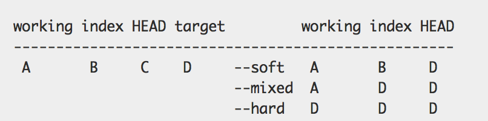

## 文件结构

当使用`git init`创建一个新的仓库时，Git 会创建一个`.git`目录。目录结构如下：

```shell
HEAD
config
description
hooks/
index
info/
objects/
refs/
```

- HEAD 当前被检出分支的指针
- config 项目特有的配置
- description 描述文件
- hooks 钩子脚本
- index 保存暂存区信息，在首次`git add`后才会生成
- info 包含一个全局性排除文件
- objects 存储所有数据内容
- refs 所有分支的提交对象的指针

### `Working Directory`

除.git 目录的其他目录和文件，不包含.gitignore 排除的目录及文件

## 对象结构

Git 是一个内容寻址文件系统。其核心部分时一个简单的键值对数据库。你可以想 Git 仓库插入任意类型的内容，它会返回一个唯一的键，通过该键可以在任意时刻再次取回内容。

Git 有数据对象（blob），树对象（tree），引用(refs)

### blob

每个文件的数据内容以二进制的形式存储在 Git 仓库中，我们可以使用命令`git hash-object -w <file>`的方式，手动向 git 数据库中插入该数据（即在`.git/objects`目录下，写入该对象），而它只会返回存储在 Git 仓库的唯一键。此命令输出一个长度为 40 的 sha1 哈希值，前 2 位字符用于命名子目录，后 38 位则用作文件名
例如：

```shell
$ find .git/objects/ -type f
$ echo 'test content' |git hash-object -w --stdin
d670460b4b4aece5915caf5c68d12f560a9fe3e4
$ find .git/objects/ -type f
.git/objects/d6/70460b4b4aece5915caf5c68d12f560a9fe3e4
$ git cat-file -p d670460b4b4aece5915caf5c68d12f560a9fe3e4
test content
```

> git 使用 sha1 时，在可区分唯一 sha1 时最少可只用前四位就可以

一开始`.git/objects`下没有存储任何数据对象，当我们使用`git hash-object`命令存入一条内容时，可以观察到`.git.objects`目录下，生成了 sha1 相对应的子目录和文件名。通过`git cat-file -p <sha1>`查看数据对象时，我们可以看到之前存入的文本内容

我们使用`git add <file>`时，就是 Git 内部做了`git hash-object`的命令，将`<file>`的内容存入到`.git/objects`中。

```shell
$ echo 'version 1' > 1.txt
$ git add .
$ find .git/objects/ -type f
.git/objects/d6/70460b4b4aece5915caf5c68d12f560a9fe3e4
.git/objects/83/baae61804e65cc73a7201a7252750c76066a30
$ git cat-file -p 83baae
```

使用`git add`后，我们可以看到`index`文件的生成

```shell
$ find .git/ -type f
...
.git/objects/d6/70460b4b4aece5915caf5c68d12f560a9fe3e4
.git/objects/83/baae61804e65cc73a7201a7252750c76066a30
.git/index
# 查看index内容
$ git ls-files --stage
100644 83baae61804e65cc73a7201a7252750c76066a30 0 1.txt
```

我们可以看到 index 保存了工作区 add 的 blob 对象的 sha1

blob 对象是针对数据内容的，不区分文件

例如：

```shell
$ echo 'version 1' > 2.txt
$ git add 2.txt
$ find .git/objects/ -type f
# 可以看到blob对象并没有增加
.git/objects/d6/70460b4b4aece5915caf5c68d12f560a9fe3e4
.git/objects/83/baae61804e65cc73a7201a7252750c76066a
$ git ls-files --stage
100644 83baae61804e65cc73a7201a7252750c76066a30 0 1.txt
100644 83baae61804e65cc73a7201a7252750c76066a30 0 2.txt

```

### tree

Git 以一种类似于 UNIX 文件系统的方式存储内容，但作了些许简化。 所有内容均以树对象和数据对象的形式存储，其中树对象对应了 UNIX 中的目录项，数据对象则大致上对应了 inodes 或文件内容。 一个树对象包含了一条或多条树对象记录（tree entry），每条记录含有一个指向数据对象或者子树对象的 SHA-1 指针，以及相应的模式、类型、文件名信息。

当我们使用`git commit`后，我们可以看到

```shell

$ git commit -m 'commit 1'
[master (root-commit) 9f1224b] commit 1
 2 files changed, 2 insertions(+)
 create mode 100644 1.txt
 create mode 100644 2.txt

# 查看.git目录
$ find .git/ -type
.git/refs/heads/master
...
.git/objects/d6/70460b4b4aece5915caf5c68d12f560a9fe3e4
.git/objects/83/baae61804e65cc73a7201a7252750c76066a30
.git/objects/1d/49be59d2805f145b66c15641a11e945a5d021a
.git/objects/9f/1224bca340fb2e4235adfa3e42297033c26ec9
.git/index
.git/COMMIT_EDITMSG
...

# 我们可以看到生成了两个新的对象
# tree
$ git cat-file -p 1d49be
100644 blob 83baae61804e65cc73a7201a7252750c76066a30 1.txt
100644 blob 83baae61804e65cc73a7201a7252750c76066a30 2.txt

# commit commit中包含了tree对象的sha1
$ git cat-file -p 9f1224
tree 1d49be59d2805f145b66c15641a11e945a5d021a
author leaderli <429243408@qq.com> 1593549136 +0800
committer leaderli <429243408@qq.com> 1593549136 +0800

commit 1

# 查看所有对象
$ git cat-file --batch-check --batch-all-objects
1d49be59d2805f145b66c15641a11e945a5d021a tree 66
83baae61804e65cc73a7201a7252750c76066a30 blob 10
9f1224bca340fb2e4235adfa3e42297033c26ec9 commit 163
d670460b4b4aece5915caf5c68d12f560a9fe3e4 blob 13

```

#### commit 工作原理

commit 对象指向的 tree 对象，遍历 tree 对象查找到的所有 blob 对象，与缓存区中的所有 blob 进行 diff 对比，若有差异，则可以进行下一次 commit。

### refs

如果你对仓库中从一个提交（比如 9f1224）开始往前的历史感兴趣，那么可以运行 git log 9f1224 开始往前的历史感兴趣，那么可以运行这样的命令来显示历史，不过你需要记得 9f1224b 是你查看历史的起点提交。 如果我们有一个文件来保存 SHA-1 值，而该文件有一个简单的名字， 然后用这个名字指针来替代原始的 SHA-1 值的话会更加简单。

在 Git 中，这种简单的名字被称为“引用（references，或简写为 refs）”。 你可以在 .git/refs 目录下找到这类含有 SHA-1 值的文件。 在目前的项目中，这个目录没有包含任何文件，但它包含了一个简单的目录结构：

```shell
$ find .git/refs -type f
.git/refs/heads/master

$ more .git/refs/heads/master
9f1224bca340fb2e4235adfa3e42297033c26ec
```

#### HEAD 引用

HEAD 文件通常是一个符号引用（symbolic reference），指向目前所在的分支。 所谓符号引用，表示它是一个指向其他引用的指针。我们通常使用`git checkout`来更改 HEAD 的内容

```shell
$ more .git/HEAD
ref: refs/heads/master

# 当我们切换分支后
$ git checkout dev
$ more .git/HEAD
ref: refs/heads/dev

# 当我们`git checkout <commit>`时，此时HEAD未指向一个分支，git会提醒我们去创建一个新的分支，否则会在切换分支时丢失掉这个HEAD
$ git checkout 9f1224b
Note: checking out '9f1224b'.

You are in 'detached HEAD' state. You can look around, make experimental
changes and commit them, and you can discard any commits you make in this
state without impacting any branches by performing another checkout.

If you want to create a new branch to retain commits you create, you may
do so (now or later) by using -b with the checkout command again. Example:

  git checkout -b <new-branch-name>

HEAD is now at 9f1224b commit 1

# 我们查看下现在的HEAD内容，其指向的不是分支的引用
$ more .git/HEAD
9f1224bca340fb2e4235adfa3e42297033c26ec9
```

#### 标签引用

标签对象（tag object） 非常类似于一个提交对象——它包含一个标签创建者信息、一个日期、一段注释信息，以及一个指针。 主要的区别在于，标签对象通常指向一个提交对象，而不是一个树对象。 它像是一个永不移动的分支引用——永远指向同一个提交对象，只不过给这个提交对象加上一个更友好的名字罢了。

```shell
$ git tag V1.0 9f1224b -m 'commit 1 tag v1.0'

$ find .git/refs -type f
.git/refs/heads/master
.git/refs/tags/V1.0

$ more .git/refs/tags/V1.0
5dfd1ba5bf0614a54f43269524881d7cc3434d49

$ git cat-file -p 5dfd1ba5bf0614a54f43269524881d7cc3434d49
object 9f1224bca340fb2e4235adfa3e42297033c26ec9
type commit
tag V1.0
tagger leaderli <429243408@qq.com> 1593582664 +0800

commit 1 tag v1.0

```

#### 远程引用

如果你添加了一个远程版本库并对其执行过推送操作，Git 会记录下最近一次推送操作时每一个分支所对应的值，并保存在 refs/remotes 目录下。

### git gc

当使用`git gc`或者`git push`时，git 会自动将`.git/objects/`下文件进行压缩，在`.git/objects/pack/`下生成`.idx`和`.pack`文件。

## 分支

git 的 commit 是一个有向无环图，其只包含父类 commit 的 sha1，分支仅仅是一个指针其值为 commit 的 sha1

查看.git 内的文件可以看到生成了.git/refs/heads/master，可以发现其指向 commit 1

```shell
$ more .git/refs/heads/master
9f1224bca340fb2e4235adfa3e42297033c26ec9
```

我们可以通过查看.git/logs/refs/heads/master，查看分支的历史记录，这也是`git log`命令的原理

```shell
$ more .git/logs/refs/heads/master
0000000000000000000000000000000000000000 9f1224bca340fb2e4235adfa3e42297033c26ec9 leaderli <429243408@qq.com> 1
593549136 +0800	commit (initial): commit 1
9f1224bca340fb2e4235adfa3e42297033c26ec9 014901f4a370ec3d0db58fc7a4cf9950d2111fbe leaderli <429243408@qq.com> 1
593555980 +0800	commit: commit 2
```

我们新增子目录以及子文件，并添加到 stage 区

```shell
$ mkdir dir
$ echo "version 3" > dir/3.txt
$ git status
On branch master
Untracked files:
  (use "git add <file>..." to include in what will be committed)

  dir/

nothing added to commit but untracked files present (use "git add" to track)
# 添加到缓存区

$ git add dir/
$ git status
On branch master
Changes to be committed:
  (use "git reset HEAD <file>..." to unstage)

  new file:   dir/3.txt
```

### git diff

`git diff --cache`是比较 index 和 HEAD 的差异

```shell
# 我们查看HEAD的内容,发现HEAD指向master的commit 1
$ more .git/HEAD
ref: refs/heads/master
$ more .git/refs/heads/master
9f1224bca340fb2e4235adfa3e42297033c26ec9

# commit 1指向的tree对象的内容为
$ git cat-file  -p 9f1224bca340fb2e4235adfa3e42297033c26ec9
tree 1d49be59d2805f145b66c15641a11e945a5d021a
author leaderli <429243408@qq.com> 1593549136 +0800
committer leaderli <429243408@qq.com> 1593549136 +0800

commit 1
$ git cat-file -p 1d49be59d2805f145b66c15641a11e945a5d021a
100644 blob 83baae61804e65cc73a7201a7252750c76066a30 1.txt
100644 blob 83baae61804e65cc73a7201a7252750c76066a30 2.txt

# index
$ git ls-files -s
100644 83baae61804e65cc73a7201a7252750c76066a30 0 1.txt
100644 83baae61804e65cc73a7201a7252750c76066a30 0 2.txt
100644 7170a5278f42ea12d4b6de8ed1305af8c393e756 0 dir/3.txt

# 使用diff查看差异内容
$ git diff --cached
diff --git a/dir/3.txt b/dir/3.txt
new file mode 100644
index 0000000..7170a52
--- /dev/null
+++ b/dir/3.txt
@@ -0,0 +1 @@
+version 3

```

提交 commit 2

```shell
$ git commit -m 'commit 2'
[master 014901f] commit 2
 1 file changed, 1 insertion(+)
 create mode 100644 dir/3.txt

# HEAD当前执行commit 2
$ more .git/HEAD
ref: refs/heads/master
$ more .git/refs/heads/master
014901f4a370ec3d0db58fc7a4cf9950d2111fbe
$ git cat-file -p 014901f4a370ec3d0db58fc7a4cf9950d2111fbe
tree 162488e047cda08c69e932e81722f7ce191057ee
# commit 2的父节点为commit 1
parent 9f1224bca340fb2e4235adfa3e42297033c26ec9
author leaderli <429243408@qq.com> 1593555980 +0800
committer leaderli <429243408@qq.com> 1593555980 +0800

commit 2

# 查看commit 2 指向的tree
$ git cat-file -p 162488e047cda08c69e932e81722f7ce191057ee
100644 blob 83baae61804e65cc73a7201a7252750c76066a30 1.txt
100644 blob 83baae61804e65cc73a7201a7252750c76066a30 2.txt
040000 tree b57d4c5b3c1f31f87d0d5e7343db0b53f8f650c2 dir

$ git cat-file -p b57d4c5b3c1f31f87d0d5e7343db0b53f8f650c2
100644 blob 7170a5278f42ea12d4b6de8ed1305af8c393e756 3.txt

# HEAD执行的tree和index的一致了
$ git diff --cached
```

从概念上讲，此时 Git 内部存储的数据有点像这样：


`git diff <commit1> <commit2>`的原理都是差不多的

### 切换分支

切换分支本质上就是将 HEAD 的引用指向对应的分支

```shell
$ git sw -b dev
Switched to a new branch 'dev'
## 引用中多了dev
$ find .git/ -type f
.git/refs/heads/master
.git/refs/heads/dev
# HEAD 指向了dev分支
$ more .git/HEAD
ref: refs/heads/dev

#dev分支指向commit2
$ more .git/refs/heads/dev
014901f4a370ec3d0db58fc7a4cf9950d2111fbe

```

## 回退

### 回退工作区

```shell
# 修改2.txt
$ echo 'version 4' > 2.txt
# 新增4.txt
$ echo 'version 5' > 4.txt

```

git diff 是用来比较缓存区和工作区的差异的，但仅比较已在 git 版本控制下的文件，即仅比较缓存区已经有的文件

```shell
$ git diff
diff --git a/2.txt b/2.txt
index 83baae6..96ac8f8 100644
--- a/2.txt
+++ b/2.txt
@@ -1 +1 @@
-version 1
+version 4

# 使用status可以看到新增还未添加到缓存区的文件
$ git status
On branch dev
Changes not staged for commit:
  (use "git add <file>..." to update what will be committed)
  (use "git checkout -- <file>..." to discard changes in working directory)

  modified:   2.txt

Untracked files:
  (use "git add <file>..." to include in what will be committed)

  4.txt

no changes added to commit (use "git add" and/or "git commit -a")

# 我们尝试回退工作区改动
$ git  checkout -- 2.txt
# 发现无差异了
$ git diff
# 新增还未增加到缓存区的文件，可以直接rm删除即可
```

### 拉取别的分支或 commit 的文件

`git checkout <branch> <file>`或`git checkout <branch> <file>`，分支的引用最终也指向一个 commit 对象，因此这两种方法都是类似的。

```shell
$ more 1.txt
version 1
$ git checkout dev
$ echo 'dev 1' >> 1.txt
$ git add 1.txt
$ git commit -m 'dev commit 3'

# 查看提交历史记录
$ git log --graph --pretty=oneline --abbrev-commit
* c49b52f (HEAD -> dev) dev commit 3
* 014901f (master) commit 2
* 9f1224b (tag: V1.0) commit 1

# 根据commit3的sha1查找到1.txt的内容
$ git cat-file -p  c49b52f
tree fc533492986c55db20a5c18d39c0fb9eb3412de5
parent 014901f4a370ec3d0db58fc7a4cf9950d2111fbe
author leaderli <429243408@qq.com> 1593605963 +0800
committer leaderli <429243408@qq.com> 1593605963 +0800

dev commit 3

$ it cat-file -p fc5334
100644 blob 258afb705ca6ffa8f0d56818ee9381cce55a2f8b 1.txt
100644 blob 83baae61804e65cc73a7201a7252750c76066a30 2.txt
040000 tree b57d4c5b3c1f31f87d0d5e7343db0b53f8f650c2 dir

$ git cat-file -p 258afb
version 1
dev 1

# 同理，我们也可以看到commit1中1.txt的内容，省略细节
$ git cat-file -p 83baae
version 1

# 新增改动并添加到缓存区
$ echo 'dev 2' >> 1.txt
$ git add 1.txt
# 新增改动不添加到缓存区
$ echo 'dev 3' >> 1.txt

# 查看缓存区内容
$ git ls-files --stage
100644 b5efe718e4230081f57ee53504d377652e3507ce 0 1.txt
100644 83baae61804e65cc73a7201a7252750c76066a30 0 2.txt
100644 7170a5278f42ea12d4b6de8ed1305af8c393e756 0 dir/3.txt
$ git cat-file -p b5efe7
version 1
dev 1
dev 2

# 工作区内容
$ more 1.txt
version 1
dev 1
dev 2
dev 3

# 拉取commit1的1.txt
$ git checkout 9f1224b 1.txt

# 当前工作区内容
$ more 1.txt
version 1

# 当前缓存区内容
$ git ls-files --stage
100644 83baae61804e65cc73a7201a7252750c76066a30 0 1.txt
100644 83baae61804e65cc73a7201a7252750c76066a30 0 2.txt
100644 7170a5278f42ea12d4b6de8ed1305af8c393e756 0 dir/3.txt
$ git cat-file -p 83baae
version 1

# commit3无任何变动，可以看到工作区和缓存区的1.txt文件和commit1保持一致
```

### 撤销（reset）

git reset 首先是将 HEAD 指向的引用的 commit 对象修改为新的 commit 对象，然后根据参数（ `--soft`，`--mixed(default)`，`--hard`）的不同，决定是否同步缓存区和工作区的内容。

大致的方式如下图所示


我们通过实例验证

```shell
$ echo 'D' > state
$ git add state
$ git cm 'D'
[dev 66b4377] D
 2 files changed, 1 insertion(+), 1 deletion(-)
 create mode 100644 state
$ echo 'C' > state
$ git ca 'C'
[dev 995cdd0] C
 1 file changed, 1 insertion(+), 1 deletion(-)
$ echo 'B' > state
$ git add state
$ echo 'A' > state

$ git log --graph --pretty=oneline --abbrev-commit
* 995cdd0 (HEAD -> dev) C
* 66b4377 D
* c49b52f dev commit 3
* 014901f (master) commit 2
* 9f1224b (tag: V1.0) commit 1

# soft
$ git reset --soft  66b4377

# working dir
$ more state
A
# stage
$ git ls-files --stage
100644 83baae61804e65cc73a7201a7252750c76066a30 0 1.txt
100644 83baae61804e65cc73a7201a7252750c76066a30 0 2.txt
100644 7170a5278f42ea12d4b6de8ed1305af8c393e756 0 dir/3.txt
100644 223b7836fb19fdf64ba2d3cd6173c6a283141f78 0 state
$ git cat-file -p 223b78
B
# HEAD 指向的是D的commit
more .git/refs/heads/dev
66b4377d2633dfd8fde71e2d231c5e3843708ad9


# mixed
$ git reset --mixed  66b4377

# working dir
$ more state
A
# stage
$ git ls-files --stage
100644 83baae61804e65cc73a7201a7252750c76066a30 0 1.txt
100644 83baae61804e65cc73a7201a7252750c76066a30 0 2.txt
100644 7170a5278f42ea12d4b6de8ed1305af8c393e756 0 dir/3.txt
100644 178481050188cf00d7d9cd5a11e43ab8fab9294f 0 state
$ git cat-file -p 1784810
D
# HEAD 指向的是D的commit
more .git/refs/heads/dev
66b4377d2633dfd8fde71e2d231c5e3843708ad9


# hard
$ git reset --hard 66b4377

# working dir
$ more state
D
# stage
$ git ls-files --stage
100644 83baae61804e65cc73a7201a7252750c76066a30 0 1.txt
100644 83baae61804e65cc73a7201a7252750c76066a30 0 2.txt
100644 7170a5278f42ea12d4b6de8ed1305af8c393e756 0 dir/3.txt
100644 178481050188cf00d7d9cd5a11e43ab8fab9294f 0 state
$ git cat-file -p 1784810
D
# HEAD 指向的是D的commit
more .git/refs/heads/dev
66b4377d2633dfd8fde71e2d231c5e3843708ad9
```
