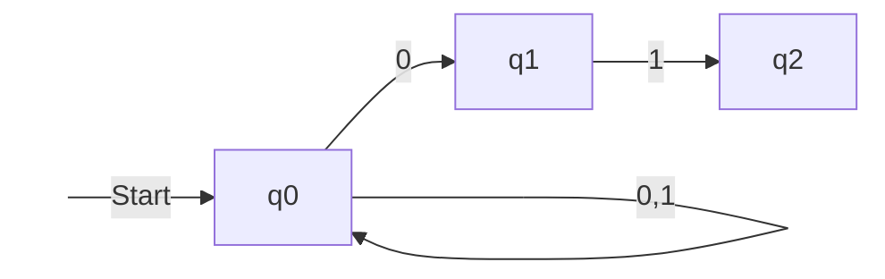
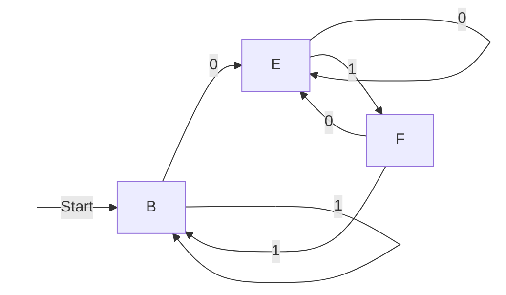

## 定义

- 非确定型有穷自动机（NFA），在某状态下，对于指定的输入，存在多个转移状态。一般情况下，通过某种算法可转换为 DFA

- 上下文无关文法 描述程序设计语言的结构以及相关集合的重要记号，用来构造编译器的语法分析部件。

- 字母表 符号的有穷非空集合。用$\Sigma$表示

- 串（有时候称为单词）是从某个字母表中选择的符号的有穷序列。例如 01101 是从二进制字母表$\Sigma = \lbrace 0,1\rbrace$中选出的串

- 空串 出现 0 次符号的串，记做$\varepsilon$

- 串的长度 这个串中的符号数，记做$\vert \omega \vert$，例如$\vert \varepsilon \vert = 0$

- 字母表的幂 定义$\Sigma^{k}$是长度为 k 的串的集合。串的每个符号都属于$\Sigma$。无论是什么字母表$\Sigma^{0}=\lbrace\varepsilon\rbrace$。字母表上所有的串的集合约定为$\Sigma^{*}$，排除空串的集合约定为$\Sigma^{+}$

- 串的连接 设定 x 和 y 都是串，于是 xy 表示 x 和 y 的连接

- 集合表示法 $\lbrace\omega\vert\omega$的语义描述$\rbrace$。比如$\lbrace\omega\vert\omega$包含相同个数的 0 或 1$\rbrace$，还可以把$\omega$换成某个带参数的表达式$\lbrace0^n1^n\vert n \ge1\rbrace$

- 当两个状态机交互时，当其状态处于$(i,x)$，对于一个合法的输入$Z$，可使$i \rightarrow j$，$x \rightarrow y$，那么我们可以认为$(i,x) \rightarrow (j,y)$是可达的

## 确定型有穷自动机（DFA）

确定型有穷自动机 包含若干个状态的集合，若干个输入符，当有输入时，控制权将由一个状态转移到另一个状态。在任意状态下，对于指定的输入，其转移是唯一的。

1. 一个有穷状态集合，记做$Q$，

2. 初始状态记做$q_0$,

3. 终止状态记做$F$

4. 一个有穷输入集合，记做$\Sigma$

5. 状态转移函数，记做$\delta$，以一个状态$q$和一个输入符号$a$作为参数，返回一个状态$p$。$\delta(q,a) = p;p\in Q$

6. 扩展状态转移函数，记做$\hat{\delta}$，以一个状态$q$和一个输入串$\omega$作为参数，返回一个状态$p$。
   - $\hat{\delta}(q,\varepsilon)=q$
   - 假定$\omega = xa$，a 是最后的输入，$\hat{\delta}(q,\omega)=\delta(\hat{\delta}(q,x),a)$

DFA 的定义:
$$A = (Q,\Sigma,\delta,q_0,F)$$

对于所有 DFA，我们可以定义为
$$L(A) = \lbrace \omega|\hat{\delta}(q_0,\omega)   \in F\rbrace$$

例如$\lbrace\omega|\omega$出现 01 字符串$\rbrace$可能出现三个状态

1. $q_0$ 未遇到 01，且最后一个不为 0，$\delta(q_0,0)=q_1,\delta(q_0,1)=q_0$
2. $q_1$ 未遇到 01，且最后一个为 0，$\delta(q_1,0)=q_1,\delta(q_0,1)=q_2$
3. $q_2$ 已遇到 01，可接受任意 0 或 1，$\delta(q_2,0)=q_2,\delta(q_2,1)=q_2$

其 DFA 表达式：
$$A = (\lbrace q_0,q_1,q_2\rbrace,\lbrace 0,1\rbrace,\delta,q_0,{q_2})$$

对 DFA 的细节描述难以阅读，通常使用两种方式来更好的描述

1. 状态转移图

   ```mermaid
   graph LR;
   begin( )-->|Start|q0
   q0-->|0|q1
   q0-->|1|q0
   q1-->|0|q1
   q1-->|1|q2
   q2-->|0,1|q2
   style begin color:white,fill:white,stroke:white
   ```

2. 状态转移表，一个状态和输入组成的$\delta$的表

   |                   | 0     | 1     |
   | ----------------: | :---- | :---- |
   | $\rightarrow q_0$ | $q_1$ | $q_0$ |
   |             $q_1$ | $q_1$ | $q_2$ |
   |             $q_2$ | $q_2$ | $q_2$ |

使用扩展转移函数，对一个串 0011 进行计算

1. $\hat{\delta}(q_0,\varepsilon)=q_0$

2. $\hat{\delta}(q_0,0)=\delta(\hat{\delta}(q_0,\varepsilon),0) =\delta(q_0,0) = q_1$

3. $\hat{\delta}(q_0,00)=\delta(\hat{\delta}(q_0,0),0) =\delta(q_1,0) = q_1$

4. $\hat{\delta}(q_0,001)=\delta(\hat{\delta}(q_0,00),1) =\delta(q_1,1) = q_2$

5. $\hat{\delta}(q_0,0011)=\delta(\hat{\delta}(q_0,001),1) =\delta(q_2,1) = q_2$

这种方式的处理，非常适合我们用递归函数进行计算。

## 非确定型有穷自动机（NFA）

与确定型有穷自动机类似，包含若干个状态，若干个输入符，状态转移函数，终止状态。唯一不同的是，$\delta$的结果可能是零个、一个、或多个状态的集合。

1. 一个有穷状态集合，记做$Q$，

2. 初始状态记做$q_0$,

3. 终止状态记做$F$

4. 一个有穷输入集合，记做$\Sigma$

5. 状态转移函数，记做$\delta$，以一个状态$q$和一个输入符号$a$作为参数，返回一个状态$p$。$\delta(q,a) = \lbrace p1,p2,\cdots,p_k \rbrace;\lbrace p1,p2,\cdots,p_k \rbrace\in Q$

6. 扩展状态转移函数，记做$\hat{\delta}$，以一个状态$q$和一个输入串$\omega$作为参数，返回一个状态$p$。
   - $\hat{\delta}(q,\varepsilon)=q$
   - 假定$\omega = xa$，$\hat{\delta}(q,x)=\lbrace p_1,p_2,\cdots,p_k \rbrace$，那么$\hat{\delta}(q,\omega)=\displaystyle\bigcup_{i=1}^k\delta(p_i,a)=\lbrace r_1,r_2,\cdots,r_m \rbrace$

对于 NFA，可以定义为
$$L(A) = \lbrace \omega|\hat{\delta}(q_0,\omega)   \cap F\rbrace \ne \emptyset$$

例如，$\lbrace \lbrace0,1\rbrace|$以 01 结尾$\rbrace$

其状态转移图如下



当接受到 0 时，NFA 会猜测最后的 01 已经开始了，一条弧线从$q_0$指向$q_1$，我们可以看到 0 有两条弧线，另一条指向$q_0$。NFA 会同时走这两条线。当在$q_1$状态时，它会检查下一个符号是否为 1，如果是则会进入状态$q_2$。当在$q_2$状态时，如还有其他输入，这条路线就终结掉了。

00101 的处理过程如下


其状态转移表如下

|                   |                        0 |                    1 |
| ----------------: | -----------------------: | -------------------: |
| $\rightarrow q_0$ | $\lbrace q_0,q_1\rbrace$ | $\lbrace q_0\rbrace$ |
|             $q_1$ |              $\emptyset$ | $\lbrace q_2\rbrace$ |
|          \* $q_2$ |              $\emptyset$ |          $\emptyset$ |

使用扩展转移函数的处理过程如下

1. $\hat{\delta}(q_0,\varepsilon)=\lbrace q_0\rbrace$

2. $\hat{\delta}(q_0,0)=\delta(q_0,0) = \lbrace q_0,q_1\rbrace$

3. $\hat{\delta}(q_0,00)=\delta(q_0,0) \cup \delta(q_1,0)= \lbrace q_0\rbrace \cup \lbrace q_2\rbrace=\lbrace q_0,q_1\rbrace$

4. $\hat{\delta}(q_0,001)=\delta(q_0,1) \cup \delta(q_1,1)= \lbrace q_0\rbrace \cup \lbrace q_2\rbrace=\lbrace q_0,q_2\rbrace$

5. $\hat{\delta}(q_0,0010)=\delta(q_0,0) \cup \delta(q_2,0)= \lbrace q_0,q_1\rbrace \cup \emptyset=\lbrace q_0,q_1\rbrace$

6. $\hat{\delta}(q_0,00101)=\delta(q_0,1) \cup \delta(q_1,1)= \lbrace q_0\rbrace \cup \lbrace q_2\rbrace=\lbrace q_0,q_2\rbrace$

## NFA 与 DFA 的转换

通常来说，构造 NFA 比构造 DFA 更容易，每一个用 NFA 描述的语言也能用 DFA 来描述。这个可以用`子集构造`来证明。

子集构造从一个 NFA $N = (Q_n,\Sigma,\delta_n,q_0,F_n)$开始，转换为
$D = (Q_d,\Sigma,\delta_d,\lbrace q_0 \rbrace,F_d)$

1. 两个自动机的输入字母表是相同的
2. D 的起始状态为仅包含 N 的起始状态的长度为 1 的集合
3. $Q_d$是$Q_n$子集的集合，即幂集合。假如$Q_n$有 n 个状态，那么$Q_d$有$2^n$状态，通常不是所有的状态都是从$q_0$可达的，这些状态可以丢弃，所以实际上$Q_d$的状态要远远小于$2^n$
4. $F_D$所有满足$S\cap F_n \neq \emptyset$的$Q_n$的子集的集合 S，也就是说，$F_D$是$Q_N$状态子集中至少包含一个$F_N$的集合。
5. 对于$S \subseteq Q_n$的集合 S 中每个状态来说，其对应的每个属于$\Sigma$的输入符号$a$的转移函数为：
   $$\delta_D(S,a)= \bigcup_{p \in S} \delta(p,a)$$

示例，我们以接受所有 01 结尾的串的 NFA 向 DFA 转换，由于$Q_n = \lbrace q_0,q_1,q_2\rbrace$，所以子集构造产生一个带有$2^3 = 8$种状态的 DFA

|                                  |                        0 |                        1 |
| -------------------------------: | -----------------------: | -----------------------: |
|                      $\emptyset$ |              $\emptyset$ |              $\emptyset$ |
| $\rightarrow \lbrace q_0\rbrace$ | $\lbrace q_0,q_1\rbrace$ |     $\lbrace q_0\rbrace$ |
|             $\lbrace q_1\rbrace$ |              $\emptyset$ |     $\lbrace q_2\rbrace$ |
|            $*\lbrace q_2\rbrace$ |              $\emptyset$ |              $\emptyset$ |
|         $\lbrace q_0,q_1\rbrace$ | $\lbrace q_0,q_1\rbrace$ | $\lbrace q_0,q_2\rbrace$ |
|        $*\lbrace q_0,q_2\rbrace$ | $\lbrace q_0,q_1\rbrace$ |     $\lbrace q_0\rbrace$ |
|        $*\lbrace q_1,q_2\rbrace$ |              $\emptyset$ |     $\lbrace q_2\rbrace$ |
|    $*\lbrace q_0,q_1,q_2\rbrace$ | $\lbrace q_0,q_1\rbrace$ | $\lbrace q_0,q_2\rbrace$ |

我们给这 8 中状态设计新的名字，如$A$表示$\emptyset$，$B$表示$\lbrace q_0 \rbrace$等。

|                 | 0   | 1   |
| --------------: | :-- | :-- |
|               A | A   | A   |
| $\rightarrow B$ | E   | B   |
|               C | A   | D   |
|            $*D$ | A   | A   |
|               E | E   | F   |
|            $*F$ | E   | B   |
|            $*G$ | A   | D   |
|            $*H$ | E   | F   |

从状态 B 开始，只能到达状态 B、E 和 F。其余五种状态都是从初始状态不可达的，也可以不出现在表中。如果向下面这样在子集合中执行`惰性求值`，通常就能避免以指数时间步骤为每个状态子集合构造转移表项目。



我们需要证明这个子集构造是正确的。

在读入输入符号序列$\omega$后，所构造的 DFA 处于这样一个状态，这个状态时 NFA 在读$\omega$后所处的状态的集合。由于 DFA 的接受状态是至少包含一个 NFA 接受状态$F_n$的集合，因为包含 NFA 的可接受状态$F_n$，因此这个集合也是被 NFA 接受的。于是我们可以得出结论，这个 DFA 和 NFA 接受完全相同的语言。
