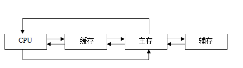
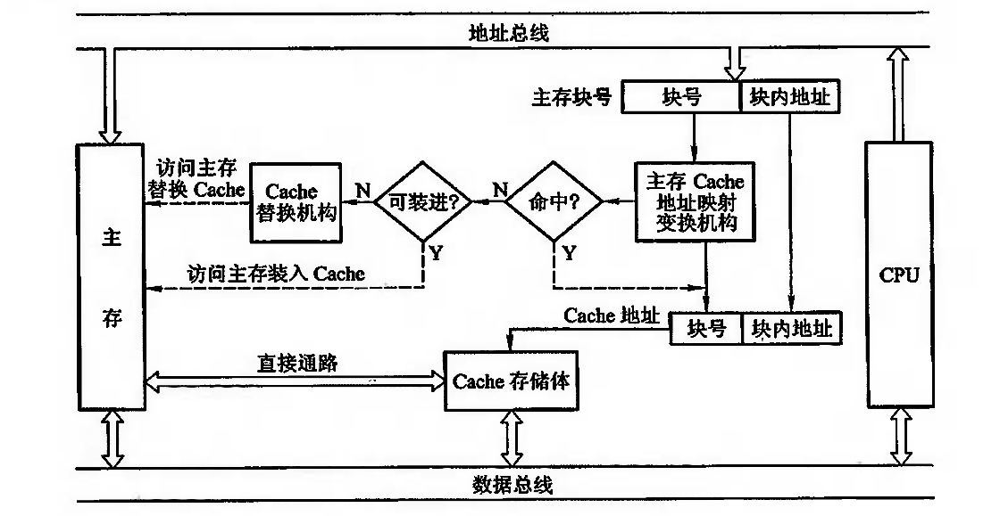
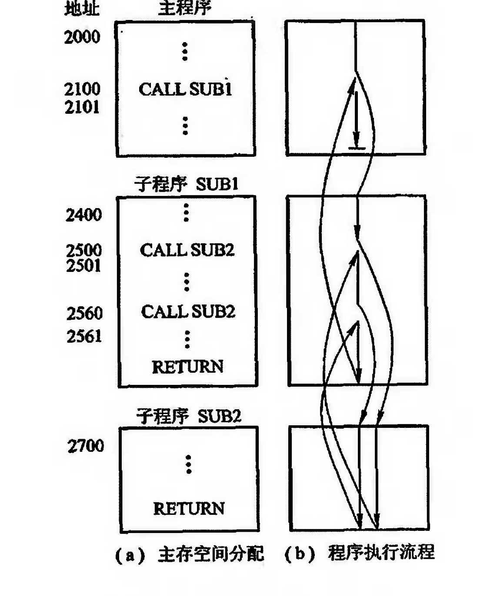
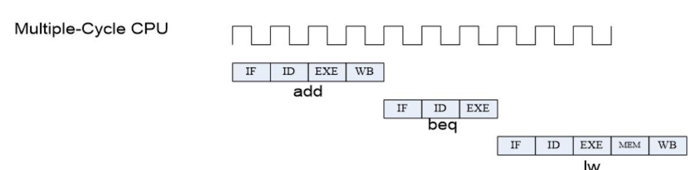
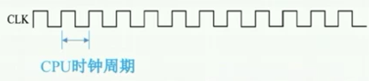
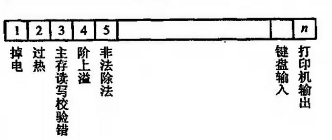

学习计算机组成原理，是为了了解计算机底层解决各种问题的思路，以供模仿这些思路写出更好的代码。重点关注指令执行的整个过程。

## 名词解释

### 位，字节，字

- **_位_**
  在计算机中,数据只用 0 和 1 两种表现形式,(这里只表示一个数据点,不是数字),一个 0 或者 1 占一个“位”。
- **_字节_**
  而系统中规定 8 个“位”为一个“字节”.
- **_字长_**
  而一个字的位数，是由机器字长决定的【系统硬件（总线、cpu 命令字位数等）】
  1. 在 16 位的系统中（比如 8086 微机） 1 字 （word）= 2 字节（byte）= 16（bit）
  2. 在 32 位的系统中（比如 win32） 1 字（word）= 4 字节（byte）=32（bit）
  3. 在 64 位的系统中（比如 win64）1 字（word）= 8 字节（byte）=64（bit）

## 总线

总线是连接计算机多个部件的信息传输线，是各个部件共享数据的传输介质。当多个部件与总线相连时，如果出现两个或两个以上部件同时向总线发送信息，势必导致信号冲突，传输无效。因此，在某一时刻，只允许有一个部件向总线发送信息，而多个部件可以同时从总线上接收相同的信息。

总线实际上是由许多传输线或通路组成，每条线可一位一位的传输二进制码，一串二进制码可在同一段时间内在一条传输线上逐一传输，也可同时在多条传输线同时传输，例如 16 条传输线组成的总线可以同时传输 16 位二进制代码。

根据总线传输信息的不同，可分为三类：

1. **_数据总线_**
   数据总线用来传输各功能部件之间的数据信息，它是双向传输总线，其位数与机器字长，存储字长有关，一般为 8 位，16 位或 32 位。数据总线的位数称为数据总线宽度。如果数据总线的宽度为 8 位，指令字长为 16 位，那么 CPU 在取指阶段必须两次访问主存。
2. **_地址总线_**
   地址总线主要用来指出数据总线上的源数据或目的数据在主存单元的地址或者 I/O 设备的地址。例如，欲从存储器读出一个数据，则 CPU 要将此数据所在存储单元的地址送到地址线上。地址总线上的代码总是用来指明 CPU 欲访问的存储单元或者 I/O 端口的地址，由 CPU 输出，单向传输。地址线的位数与存储单元的个数有关。如地址线为 20 根，则对应的存储单元个数为$2^{20}$
3. **_控制总线_**
   由于数据总线，地址总线都是被挂载总线上的所有部件共享的，如何使各部件能在不同时刻占用总线使用权，需要依靠控制总线来完成。因此控制总线是用来发出各种控制信号的传输线。每根控制线的控制信号时固定的，它的传输是单向的。但对于控制总线整体来说，又可以认为是双向的。
   常见的控制信号如下
   - 时钟：用来同步各种操作
   - 复位：初始化所有部件
   - 总线请求：表示某部件需获得总线控制权
   - 总线允许： 表示需要获得总线控制权的部件已经获得了控制权
   - 中断请求： 表示某个部件提出中断请求
   - 中断响应： 表示中断请求已被接收
   - 存储器写： 将数据总线上的额数据写至存储器的指定单元地址内
   - 存储器读： 将指定存储单元中的数据读到数据总线上
   - I/O 读：从指定 I/O 端口将数据读到数据总线上
   - I/O 写：将数据总线上的数据输出到指定的 I/O 端口内
   - 传输响应： 表示数据已被接收，或已将数据送到数据总线上

众多部件共享总线，在争夺总线使用权时，应按各部件的优先等级来解决。在通信时间上，则应按分时方式来处理，即以获得总线使用权的先后顺序分时占用总线，即哪一个部件获得使用权，此刻就由它传送，下一个部件获得使用权，接着下一时刻传送。这样一个接一个轮流交替传送。

## 存储器

存储器的层级结构

缓存-主存层次主要解决 CPU 和主存速度不匹配的问题

### 主存

计算机为了实现能按地址访问主存，主存中还必须配置两个寄存器 MAR 和 MDR。MAR（Memory Address Register）是存储地址的寄存器，其位数对于存储单元的个数(如 MAR 为 10 位，则有$2^{10}=1024$个存储单元，记做 1K）。MDR（Memory Data Register）是存储数据的寄存器，其位数与存储字长相等。主存的工作方式是根据存储单元的地址号来实现对存储字各位的存(写入),读(取出)。

当要从存储器读出某一个信息字时，首先由 CPU 将该字的地址送到 MAR，经地址总线送至主存，然后发出读命令。主存接到读命令后，得知需将该地址单元的内容读出，变完成读操作，将该单元的内容读至数据总线上，至于该信息由 MDR 送到什么地方，这已经不是主存的任务，而是有 CPU 决定的。若要想主存存入一个信息字时，首先 CPU 将该字所在主存单元的地址经 MARD 送到地址总线，并将该信息送入 MDR，然后向主存发出写命令，主存接到写命令后，便将数据线上的信息写入到对应地址线指出的主存单元中。

主存各存储单元的空间位置是由单元地址号来表示的，而地址总线时用来指出存储单元地址号的，根据该地址号可读出或写入一个存储字，不同的机器存储字长也不同，为了满足字符处理的需要，常用 8 位二进制表示一个字节，因此存储字长都取 8 的倍数。

### 缓存

主存有$2^{n}$个可编制的字组成，每个字有唯一的 n 位地址。为了与 Cache 映射，将主存与缓存都分为若干块，每块内又包含若干个字，并使他们的快大小相同（即块内的自述相同）。这就将主存的地址分为两段：高 m 位表示主存的块地址，低 b 位表示块内地址，则$2^{m}=M$表示主存的块数。同样缓存的地址也分为两段：高 c 位表示主存的块地址，低 b 位表示块内地址，则$2^{c}=C$表示缓存块数，且 C 远小于 M。主存与缓存地址中都用 b 为表示其块内自出，即$B=2{b}$反映了块的大小，称 B 为块长。
任何时刻都有一些主存块处于缓存块中。CPU 欲读取主存某字时，有两种可能：一种是所需要的字已在缓存 zhong ，即可直接访问 cache（CPU 与 Cache 之间通常一次传送一个字）；另外一种是所需要的字不在 cache 内，此时将该字所在准成整个字块一次调用 cache 中（cache 与主存直接时 **_字块_** 传送）。如果主存块已调用缓存块，则成该主存块与缓冲块建立了对应关系。

cache 的基本结构

cache 的模块组成

1. cache 存储体以块为单位与主存交换信息，现代计算机一班提供多级缓存。
2. 地址映射变换机制，将 CPU 送来的主存地址转换为 cache 地址
3. 替换机制，当缓存内容已满时，使用替换算法决定那块缓存需要被替换掉
4. 读写操作，读时优先从 cache 读取。写现在主要有两种方式：
   - 写直达法，即写操作时既写入 cache，也写入主存
   - 写回法，即写操作时只把数据写入 cache，但数据被替换时才写入主存

## 机器指令

机器语言是由一条条语句构成的，每一条语句又能准确表达某种语义。计算机就是连续执行每一机器语句而实现全自动工作的。

### 指令字长

指令字长取决于操作码的长度，操作数地址的长度和操作数地址的个数。通常把常用的指令（如数据传送指令，算逻辑运算指令等）设计成单子长或者短字长格式的指令。

### 指令格式

指令是由操作码和地址码两部分组成的，基本格式如下

1. 操作码
   用来指定指明该指令所要完成的操作，如加法，减法，传送，移位，转移等。通常，其位数反映了机器的操作种类，也即机器允许的指令条数，如操作码占 7 位，则该机器最多包含 $2^{7}=128$条指令。

2. 地址码
   地址码用来指出该指令的源操作数的地址(一个或两个),结果的地址以及下一条指令的地址。这里的地址可以时主存的地址，也可以是寄存器的地址，甚至可以时 I/O 设备的地址。

指令格式集中体现了指令系统的功能，因此在确定指令格式时，必须从以下几个方面综合考虑

1. 操作类型：包括指令数及操作的难以程度
2. 数据类型：确定哪些数据可以参与操作
3. 指令格式：包括指令字长，操作码位数，地址码位数，地址个数，寻址方式类型，以及指令字长和操作码是否可变等
4. 寻址方式： 包括指令和操作数具有哪些寻址方式
5. 寄存器个数：寄存器的多少直接影响指令的执行时间

## 操作数与操作类型

### 数据在存储器中的存放方式

通常计算机的数据存放在存储器或寄存器中，而寄存器的位数便可反映机器字长。一般机器字长可取字节的 1、2、4、8 倍，这样便于字符处理，现代计算机机器字长发展到 32 位和 64 位。为了便于硬件实现，通常对多字节的数据在存储器的存放方式能满足 **_边界对齐_** 的要求，即所存的数据总是整数倍（半字地址是 2 的整数倍，字地址是 4 的整数倍，双字地址是 8 的整数倍），当所存数据不满足此要求时，可填充一个或多个空白字节。

### 操作类型

1. 数据传送：各个存储单元之间进行读写操作
2. 算术逻辑操作：加减乘除，与或非等
3. 移位：算术移位，逻辑移位等
4. 转移：
   - 无条件转移：不受任何条件的约束，可直接将程序转移到下一条需要执行指令的地址
   - 条件转移：根据当前指令的执行结果来决定是否需要转移，若条件满足，则翻译，若条件不满足，则继续按顺序执行
   - 调用与返回：在编写程序时，有些具有特定功能的程序段会被反复使用。为避免重复编写，可将这些程序段设定为独立子程序，当需要执行子程序时，只需要用子程序调用指令即可。
5. 输入输出：对于 I/O 单独编制的计算机而言，通常舍友输入输出指令，它完成从外设中的寄存器读入一个数据到 CPU 的寄存器内，或将数据从 CPU 的寄存器输出到某外设的寄存器中。
   - 陷阱指令
6. 其他包括等待指令，停机指令，空操作指令，开中断指令，关中断指令等。

### 调用子程序细节

调用指令（CALL）一般与返回指令（RETURN）配合使用。CALL 用于从当前的程序位置转至子程序的入口，RETURN 用于子程序执行完成后重新返回到源程序的断点。下图示意了调用（CALL）与返回（RETURN）指令在程序执行中的流程

需要注意以下几点

1. 子程序可在多处被调用
2. 每个 CALL 指令都对应一条 RETURN 指令
3. CPU 必须记住返回地址，返回地址可存放在以下三处
   - 专用寄存器内
   - 子程序的入口地址内
   - 栈顶内。现代计算机都设有堆栈，执行 RETURN 指令后，变可自动从栈顶取出相应的返回地址

### 操作数类型

指令中常用的操作数类型有

1. 地址：地址实际上也是一种数据，在许多情况下需要计算操作数的地址。这时地址可以被认为是一个无符号的整数。
2. 数字：计算机常见的数字有定点数，浮点数和十进制数。
3. 字符：文本或字符串是一种常见的数据类型，计算机在处理信息过程中普遍才有 ASCII 码存储字符
4. 逻辑数据： 用于进行逻辑运算的布尔类型的数据。

## 寻址方式

寻址方式是指在确定本条指令的数据地址以及下一条将要执行的指令地址的方法，它与硬件结构紧密相关，寻址方式分为指令寻址和数据寻址两大类。

### 指令寻址

1. 顺序寻址：通过程序计数器 PC（指令的在内存中的地址） 加 1，自动形成下一条指令的地址
2. 跳跃寻址：将程序计算器 PC 跳跃到指定的指令地址

### 数据寻址

种类较多，在指令字中必须设一字段来表面当前属于哪一种寻址方式。指令的地址码字段通常都不代表操作数的真实地址，把他称作为形式地址记作 A，操作数的真实地址称为有效地址记作 EA，它是由寻址方式和寻址形式地址共同来确定的

1. 立即寻址：特点是操作数本身设在指令字内，即形式地址 A 不是操作数的地址，而是操作数本身，又称之为立即数
2. 直接寻址：特点是指令字中的形式地址 A 就是操作数的真实地址 EA
3. 隐含地址：是指指令字中不明显给出操作数的地址，其操作数的地址隐含在操作码或某个寄存器中。隐含地址有利于缩短指令字长
4. 间接寻址：是指指令的 **_形式地址_**不直接指出操作数的地址，而是指出操作数的有效地址所在的存储单元地址，也就是说有效地址是由形式地址间接提供的。间接寻址可很方便的完成子程序返回。
5. 寄存器寻址
6. 寄存器间接寻址
7. 基址寻址：设有基址寄存器 BR，其操作的有效地址 EA 等于指令字中的形式地址和基址寄存器的内容相加，即 $EA = A + (BR)$。操作系统控制基址寄存器的值，在执行过程中基址寄存器的值不变，基址寻址主要用于多道程序，程序无需关注实际物理地址，只需指定使用哪一个寄存器作为基址寄存器即可。
8. 变址寻址：其有效地址等于 EA 等于形式地址 A 与变址寄存器 IX 相加，$EA = A + (IX)$，指令在的 A 不可变，变址寄存器的内容由用户设定，在执行过程中其值可变，主要用于为程序或数据分配连续存储空间，特别适合数组等循环程序.基址寻址和变址寻址本质上是一样的，只是表现形式不同。
9. 相对寻址：相对寻址的有效地址是将程序计数器 PC 的值（即当前指令的地址）与形式地址 A 相加而成。$ EA = (PC) +A $,相对寻址的最大特点是转移地址不固定，它可随 PC 值的变化而变。
10. 堆栈寻址：堆栈寻址要求计算机中设有堆栈，堆栈即可用寄存器组（硬堆栈）来实现，也可利用主存的一部分空间作为堆栈(软堆栈)。以软堆栈为例，可用堆栈指针 SP（stack point）指出栈顶地址，操作数只能从栈顶地址指示的存储单元存或取。堆栈寻址也可视为一种隐含寻址。

## CPU 结构

根据 CPU 的功能不难设想

1. 要取指令，必须有一个寄存器专用于存放当前指令的地址。
2. 要分析指令，必须有存放当前指令和对指令操作码进行转译的部件
3. 要执行指令，必须有一个能发出各种操作命令序列的控制部件 CU
4. 要完成算术运算和逻辑运算，必须有存放操作数的寄存器和实现逻辑运算的部件 ALU
5. 为了处理异常情况和特殊请求还必须有中断系统。

CPU 中有一类寄存器用于控制 CPU 的操作或运算。

1. MAR：存储器地址寄存器，用于存放将要被访问的存储单元的地址
2. MDR：存储器数据寄存器，用于存放欲存入存储器的数据或最近从存储器中读出的数据。
3. PC：程序计数器，存放现行指令的地址，通常具有计数功能。当遇到转移类指令时，PC 的值可被修改。
4. IR：指令寄存器，存放当前欲执行的指令。

## 指令周期

CPU 每取出并执行一条指令所需要的全部时间成为指令周期，也即 CPU 完成一条指令的时间。指令周期包括

1. 取指周期：完成取指令和分析指令的操作。PC 中存放当前指令的地址，将该地址送到 MAR 并送至地址总线，然后由控制部件 CU 向存储器发读命令，使对于 MAR 所指单元的内容（指令）经数据总线送至 MDR，再送至 IR，并且 CU 控制 PC 内容加 1，形成下一条指令的地址。
2. 间址周期：取操作数有效地址。一旦取指周期结束，CU 便检查 IR 中的内容，以确定是否有间址操作，如果需要间址操作，则 MDR 中指示形式地址的右 N 位（记做 Ad（MDR））将被送至 MAR，又送至地址总线，此后 CU 向存储器发出读命令，以获取有效地址并存至 MDR
3. 执行周期：完成执行指令的操作
4. 中断周期：执行周期结束时刻，CPU 要查询是否有请求中断的事件发生，如有则进入中断周期。

一个指令周期通常用若干个机器周期表示，一个机器周期又包含若干个时钟周期

### 时钟周期

同步 CPU，使用时钟发生器不断产生稳定间隔的电压脉冲，CPU 中所有的组件将随着这个时钟来同步进行运算动作。

如图，时钟发生器发出的脉冲信号做出周期变化的最短时间称之为震荡周期，也称为 CPU 时钟周期。它是计算机中最基本的、最小的时间单位。每一次脉冲（即一个震荡周期）到来，芯片内的晶体管就改变一次状态，让整个芯片完成一定任务。一个震荡周期内，晶体管只会改变一次状态。由此，更小的时钟周期就意味着更高的工作频率。
一秒内，震荡周期的个数称为时钟频率，俗称主频。

### 时钟周期数

指运行单个程序所包含的所有的指令总共所需要的时钟周期数

## 中断系统

在实时处理系统中，必须及时处理某个事件或现象。此时计算机暂时中断现行程序，转而去处理中断服务程序，以解决各种情况。在多道程序运行时，可以通过分配给每道程序一个固定的时间片，利用时钟定时发中断进行程序切换。在多处理器系统中，各处理器之间的信息交流和任务切换也可以通过中断来实现。

### 引起中断的各种因素

1. 人为设置的中断，一般称作自愿中断
2. 程序性事故，如定点溢出，浮点溢出，操作码不能识别等。
3. 硬件故障
4. I/O 设备请求
5. 外部事件

将引起中断的各个因素称为中断源，中断分为量大类：一类为不可屏蔽中断，这类中断不能禁止响应，如电源掉电；另一类为可屏蔽中断，对可屏蔽中断源的请求，CPU 可根据该中断源是否被屏蔽来确定是否给与响应。

### 中断请求标记

为了判断哪个中断源发出请求，在中断系统中必须设置中断请求标记触发器，简称，记做 INTR，当其状态为 1 时，表示中断请求触发器。

### 中断判优逻辑

任何一个中断系统，在任一时刻，只能响应一个中断源的请求。但许多中断源提出请求都是随机的，当某一个时刻有多个中断源提出请求时，中断系统必须按照优先顺序予以响应。

### 中断服务程序入口地址的寻找

一般情况下使用无条件转移指令，将 PC 指向当前中断服务对应的中断服务程序入口地址

### 响应中断的条件

中断触发器的状态为 1，且允许中断触发器状态为 1

### 响应中断的时间

指令周期的执行周期后进入中断周期，统一向所有中断源发出中断信号，只有此时，CPU 才能获知哪个中断源有请求。

### 中断隐指令

CPU 响应中断后，即进入中断周期。在中断周期内，CPU 要自动完成一系列操作，具体如下

1. 保护程序断点：将当前程序计数器 PC 的内容（程序断点）保存到存储器中。
2. 寻找中断服务程序的入口地址
3. CPU 进入中断周期，意味着 CPU 响应了某个中断源的请求，为了确保 CPU 响应后所需要做的一系列操作不至于受到新的中断请求干扰，在中断周期内必须自动关中断，以禁止 CPU 再次响应新的中断请求。
